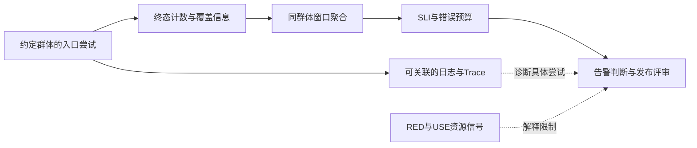

# 06 SLI-SLO与可观测性

> 知识成熟度：L2。本文负责把服务质量定义成可复核的 SLI、SLO、错误预算与告警判断；核对官方资料并给纸面算例，没有运行服务、Prometheus、OTel、压测或生产告警，verified 保持为空。
> 知识基线：Google《The Site Reliability Workbook》2018 版相关章节；Prometheus 文档 tag v3.5.0；OTel Specification v1.50.0；W3C Trace Context 2021-11-23 Recommendation。它们是本次选读边界，不是项目已安装版本或跨版本兼容承诺。
> 最后更新：2026-10-10。
> 迁移来源：原《01-鉴权限流幂等灾备与可观测性》“七、OpenTelemetry、SLO/SLI、RED/USE 与容量模型”。本篇已在迁移稿上修订，不再把现行全文描述为逐字迁移。

## 1. 先回答“谁的什么体验，要好到什么程度”

玩家报登录失败，进程仍存活、CPU 正常、Trace 中多数依赖也成功，这些事实可以同时成立。进程存活说明基础组件尚在；玩家路径成功还要求请求在约定时间内得到符合业务协议的结果。**SLO 的分母和成功定义，决定我们究竟在保护哪种体验。**

SLI（Service Level Indicator）是测量，例如“这个群体的有效尝试中，按约定得到成功的比例”；SLO（Service Level Objective）给这项测量规定窗口与目标。先描述用户结果，再选择测量点：客户端、入口、应用内部和合成探测各有覆盖边界。服务端入口计数看不到根本没到达它的请求，后端提交成功也不证明客户端收到答复。[S1]

本篇用一个可手算的登录会话创建例子说明：定义群体 → 记一次终态 → 按窗口聚合 → 计算预算 → 组合长短窗口 → 决定通知与发布评审。读者只需理解请求、计数和百分比。文中的毫秒、请求数、阈值和群体名称都是 **PAPER_EXPECTED 教学题设**，不是测得的性能或推荐生产常量。

采集器、PromQL 接线和发布观察由[部署运维与监控](05-部署运维与监控.md)负责；DS 单次异常、日志、Trace 与符号定位由[DS 日志崩溃与可观测性实战](04-DS日志崩溃与可观测性实战.md)负责。本篇保留三类信号、RED/USE 和容量的用途，不复制它们的部署与排障全文。



实线是本例SLI的计量路径；虚线提供诊断上下文。日志可以被设计成可靠的计数来源，但不能把同一次工作的多条日志、抽样Trace和入口计数无去重地合进分子/分母。图中的“告警判断”也不表示已送达通知或执行恢复。

## 2. 三类信号各自提供什么证据

### 2.1 指标算群体，日志和 Trace 解释具体请求

| 信号 | 适合回答 | 关联方式与限制 |
| --- | --- | --- |
| Metrics | 有多少请求、多少失败、延迟分布与资源趋势 | 用有界的环境、大区、服务、路由、结果类别等维度聚合；覆盖不全时比例仍可能看似正常 |
| Logs | 某次尝试在哪个阶段报告什么结果 | 有真实上下文时记录 request_id、trace_id、span_id 与制品身份；日志缺失不等于请求没发生 |
| Traces | 一次工作经过哪些边界、各段等待多久 | 同一 Trace 的多个 Span 共享 trace_id，各 Span 有自己的 span_id；采样、导出或传播都可能留下缺口 |

统一的是服务、版本、环境和请求类别的**语义与可追溯映射**，不要求所有信号带齐相同字段，更不能把每个 trace_id、account_id、订单号都变成指标标签。哈希仍然可能有同样多的不同取值，不是解决高基数的办法。精确版本可以从发布记录关联；若使用 baseline/candidate 等有界指标维度，其到制品的映射必须在观察窗内稳定。OTel exemplar 可以把部分指标观测关联到 Trace，但不是每次观测都有 exemplar，也不证明对应 Trace 已交付。[S6]

普通日志和 Trace 不记录 token、密码、完整密钥、支付凭据或未经批准的请求体。需要关联时使用最小的不透明引用，并约定访问与保留；“可检索”不等于“适合向所有人开放”。

### 2.2 上下文传播与采样不改变 SLI 的分母

HTTP、RPC、消息和异步任务都要明确如何提取、传递或关联上下文，不能依赖线程局部变量碰巧跨过线程/协程边界。入口按协议校验外来 Trace Context；无效上下文不能原样污染日志。W3C 对无效 traceparent 规定重新建立上下文等处理，不意味着仅因跟踪头无效就必须拒绝正常业务请求。[S8]

下面只是项目流程伪代码，不是某语言 SDK 或可直接运行的服务。Span 的成功/错误映射与 SLI 的业务成功条件也不能仅靠 HTTP 状态码互相替代。

```text
收到请求:
    提取并校验上下文；需要时建立新上下文
    开始当前工作 Span，记录有界路由和制品信息
    try:
        将上下文显式交给下游与异步工作
        执行业务，按业务合同分类当前观察点的结果
        记录可关联的结果事件；按接口策略返回不透明 request_id
    finally:
        结束本工作 Span
```

消息消费可以使用合适的父子关系或 Link 关联生产与消费，具体模型取决于异步/批处理边界；不要仅保存两个任意 ID 就声称已形成完整链路，也不把长期会话无限延长成一个 Span。request_id 是诊断关联，不是鉴权、幂等或提交凭证。

“优先保留错误、慢请求和高风险写入”是采样设计目标，不是错误永不丢的保证。头部决策不能预知之后的所有结果；即使已标记采样，后续处理仍可能失败。记录采样与丢弃边界，SLI 使用满足覆盖要求的计数来源，不能直接拿有偏的保留 Trace 比例当全量错误率。[S7]

### 2.3 RED 与 USE 帮助解释结果

RED 看请求的 Rate、Errors、Duration；USE 看资源的 Utilization、Saturation、Errors。它们互补：SLO 表示用户路径是否达标，队列、锁等待和资源饱和解释可能的限制；CPU 高低本身不能替代业务成功。

| 对象 | 请求侧 RED | 资源侧 USE | 业务补充 |
| --- | --- | --- | --- |
| 网关 | QPS、失败比例、延迟 | 连接利用率、接入队列 | 合格请求的限流拒绝量 |
| 业务 API | 请求率、错误、p50/p95/p99 | 工作线程/协程及队列饱和 | 成功状态迁移率 |
| 数据库 | 查询率、错误、查询延迟 | CPU、连接池、锁等待 | 提交/回滚与账本差异 |
| Redis | 命令率、错误、响应时间 | 内存、连接、阻塞 | 命中率、失效与回源 |
| 消息系统 | 发布/消费率、错误、端到端耗时 | 分区积压、消费者容量 | 重复、死信和未履约年龄 |
| 匹配服务 | 入队/出队率、失败、匹配延迟 | 队列占用、线程饱和 | ticket 过期率 |

## 3. 把一个 SLO 写成可以对账的合同

### 3.1 固定对象、窗口和观察点

本例保护的是**鉴权之后、网关所见的登录会话创建尝试**，不是整个玩家登录旅程。假定网关在容量准入之前能识别下列群体；前置鉴权、DNS、连接建立和响应离开网关后是否到达客户端，须另有相应观察，不能由此 SLO 证明正常。

| 合同项 | 本例明确选择 |
| --- | --- |
| 名称与群体 | login_session_availability；教学环境 demo、大区 r1、gateway 的 login_session 路由；已通过前置鉴权的正式尝试，覆盖该群体全部服务实例 |
| 纳入/排除 | 纳入通过上述入口的所有尝试，包含服务过载/429、依赖失败与超时；仅排除事先可识别的内部探针、压测及非本接口流量，单独记录排除量 |
| 观察开始 | 进入该网关边界、尚未进行容量准入时；因此被本服务限流的合格请求仍在范围内 |
| 一次终态 | 成功响应完成、明确失败，或到达网关本地 2 秒截止点；同一次尝试只结算一次，迟到答复不能追加第二个 success |
| good | 在本地截止点之前完成符合协议的成功响应；本例不把“后端已经提交但网关超时”计为 good |
| bad | 纳入群体中所有不满足 good 的终态，含主动过载拒绝、本地截止超时、协议失败与依赖错误 |
| 重试 | 客户端再次尝试另计一次；内部调用重试仍属于当前入口尝试，耗时包含在同一截止点内 |
| 计时 | 网关同一单调时钟，从入口到终态，包含本边界内排队、内部重试和依赖等待；不跨主机相减墙钟 |
| 窗口 | 每次评估时刻 t 的 UTC 滚动区间 (t−28d, t]；按终态时间归窗，28d=672h |
| 目标 | 该窗口 good / total ≥ 0.999；本例只给请求型可用性目标 |
| 完整性 | 终态计数来源覆盖所有期望实例和结果分类；丢数、重复、分类不明和新鲜度另报，不默认算成功 |

一个合法请求在 2 秒时到达截止点，本例即为 bad；随后后端完成不修改这个网关观察结果。它仍可能产生业务效果，是否可重试要看业务协议，这里只做测量。同一尝试的多个内部 Span、日志重传和下游调用不增加入口分母。

评估时尚未终结的尝试尚未进入“按终态归窗”的分母；正常情况下 2 秒内应到截止终态。若进程崩溃导致终态遗失，或仍有超龄未决尝试，就不能继续声称计数完整，需报告覆盖缺口并用独立观察补查。不要把从指标中消失的请求悄悄变成排除项。

前置鉴权口径也是限制：若真实目标是“玩家从点击登录开始最终进入游戏”，就需要更外侧的测点和另外的 SLI，不能只重命名本指标。计划维护也要在事先约定的范围内如实计入或明确排除，不能在故障后临时改变分母。

### 3.2 一小组尝试如何归类

下表为独立的分类练习，数量不与第 4 节窗口汇总相加；所有时间均为上述网关的本地历时。

| 输入 | 对本例 total / good / bad 的增量 | 原因 |
| --- | --- | --- |
| 合格尝试，250 ms 完成成功响应 | 1 / 1 / 0 | 在截止点前满足协议成功 |
| 合格尝试，350 ms 完成成功响应 | 1 / 1 / 0 | 仍满足本可用性定义；不自动满足另设的 300 ms 延迟目标 |
| 合格尝试，20 ms 返回过载429 | 1 / 0 / 1 | 不能因拒绝得快就把用户失败排除 |
| 合格尝试，2秒本地超时，2.2秒收到迟到成功 | 1 / 0 / 1 | 超时已结算，后续不再加计 |
| 上次失败后，客户端新尝试200 ms成功 | 新尝试加 1 / 1 / 0 | 不抹掉旧尝试的失败；这不是“用户最终成功率” |
| 事先标识的内部探针成功 | 0 / 0 / 0 | 属于另一观察群体，另报探测结果 |

如果还关心“300 ms 内成功”，可另定义 good_fast 为 total 中在 ≤300 ms 完成协议成功的尝试，fast_SLI=good_fast/total。350 ms 成功只计入可用性 good；20 ms 的快速失败不能计入 good_fast；超时也在该分母内。两个目标应各有阈值与预算，不能把它们的剩余额度相互抵扣。

延迟也可用分位数表达，但必须固定群体、统计范围与实现误差。只统计成功请求的 p99 是成功子集的 p99，不能代替“全部尝试中快速且成功的比例”；不要平均各实例 p99 来得到整体 p99。Histogram 桶与查询的实现落点见部署篇。[S4]

## 4. 错误预算：比例、请求数和剩余份额分开

对于同一窗口 W 和同一群体，设 N 为有效终态数、G 为 good 数、E=N−G 为 bad 数、目标 S=0.999。完整且 N>0 时：

```text
SLI                  = G / N
allowed_bad_ratio    = 1 - S                     = 0.001
observed_bad_ratio   = E / N
allowed_bad_count    = N * (1 - S)
consumed_fraction    = E / allowed_bad_count
remaining_fraction   = 1 - consumed_fraction
remaining_count      = allowed_bad_count - E
remaining_ratio      = (1 - S) - observed_bad_ratio
```

allowed_bad_ratio 是总请求中允许失败的比例，consumed_fraction 是**允许额度已用掉多少份**。remaining_ratio 与 remaining_fraction 都无量纲，但分母不同，不能直接互换。N=0 时不作除法；S=1 时没有可用于 burn-rate 除法的错误比例额度。请求计数预算可能是小数，判定时保留精度，不能随意四舍五入允许的失败数。[S1]

### 4.1 一个正常窗口，逐项算通

题设：W 内完整记录 N=1,000,000 次尝试，G=999,400，E=600。于是：

| 量 | 代入 | 结论 |
| --- | --- | --- |
| SLI | 999,400 / 1,000,000 | 99.94%，高于99.9%目标 |
| 允许错误数 | 1,000,000 × 0.001 | 1,000 |
| 已用预算份额 | 600 / 1,000 | 60% |
| 剩余预算份额 | 1 − 0.6 | 40%，即0.4 |
| 剩余请求数额度 | 1,000 − 600 | 400，限于这个已观察窗口的计算 |
| 剩余错误比例 | 0.001 − 0.0006 | 0.0004，即0.04个百分点 |

若项目约定“剩余份额低于20%进入发布风险评审”，应比较 remaining_fraction < 0.2，本例不满足。若错拿 remaining_ratio=0.0004 去比0.2，会把正常的40%剩余误判为耗尽。

另一个独立窗口若 N 同为1,000,000、E=1,200，则 SLI=99.88%、已用120%、剩余−20%。负值表达超出预算，不能把它截成0后丢失超额量。剩余低于20%也不等于耗尽：后者是剩余≤0；是否在恰好0时暂停变更，应由项目政策明确。

滚动窗口会同时移出旧请求并纳入新请求，N和额度都在变化。“剩余400次”不是保证未来还能失败400次的固定钱包；缺数时也不能沿用上一次的绿色数值而不显示它已过期。

### 4.2 请求预算不自动等于停机分钟

28天×0.1%=40.32分钟，只能直接解释**按时间计量**的可用性预算，不能直接解释本例按请求数计量的额度。高峰1分钟与低谷1分钟影响的请求数可能不同；若想用时间近似请求预算，必须额外假设流量近似均匀并写明近似范围。

账本差异、重复发奖、不可解释订单仍应有独立正确性观察与业务约束。零差异可以是必须维护的不变量，不能因为整体登录预算还剩40%就容忍一次资产重复发放；S=1 的业务不变量也不应生搬本节的 burn-rate 除法。

## 5. 从预算到告警：长窗看规模，短窗看是否仍在发生

### 5.1 Burn rate 的单位与阈值从哪里来

对某个观察窗 w，burn(w)=(E_w/N_w)/(1−S)。它表示当前错误比例是允许错误比例的几倍；burn=1 表示按这个比例持续服务时，错误比例正好用满目标允许值。它不是“已经用掉1%预算”，也不能仅凭一个短窗准确预言未来耗尽时刻。[S2]

为了把响应速度与风险大小联系起来，题设先选“在长窗w内按均匀流量近似消耗整个W额度的比例p”，得到阈值 B=p×W/w。沿用本文 W=672h：

| 题设通知用途 | 长窗 / 短窗 | p | B 的推导 | 对应错误比例阈值 |
| --- | --- | --- | --- | --- |
| 快速风险通知 | 1h / 5m | 2% | 0.02×672/1=13.44 | 13.44×0.001=1.344% |
| 较慢持续风险通知 | 6h / 30m | 5% | 0.05×672/6=5.6 | 5.6×0.001=0.56% |

这里的13.44和5.6是**本题由28天推导的参数**，不是运行结果；原常见14.4和6来自30天的相应算式，换窗口应重新解释阈值。1h和5m并用的目的，是让长窗积累的影响与近期仍在发生的失败同时成立；不是两个窗口各消耗2%，也不把两窗失败数相加。[S2]

这个时间换算是近似。对于请求型预算，某个子窗的实际贡献为：

```text
子窗贡献份额 = E_w / (N_W * (1 - S))
             = burn(w) * N_w / N_W
```

只有 N_w/N_W 近似 w/W 时，才能近似成 burn(w)×w/W。例如另一独立题设中，W有1,000,000次请求，最近1h有60,000次且900次失败，burn=15；该小时已贡献900/1000=90%的窗口额度，而15/672≈2.23%只是均匀流量的时间近似。两者差异来自最近1h流量占比6%，远高于1/672；不能把快速 burn 告警描述成“精确到2%时触发”。

### 5.2 正常、触发与恢复后的完整纸面判断

下列各行是独立评估题，长短窗结束于同一t，短窗属于长窗，使用同一群体与分类。除明确标明缺数者外，输入为完整的精确终态数，不是 Prometheus rate/increase 的执行输出。先只判断快速分支：burn(1h)>13.44 且 burn(5m)>13.44。

| 情况 | 1h：N / E → burn | 5m：N / E → burn | 快速分支判断 |
| --- | --- | --- | --- |
| 正常服务 | 60,000 / 6 → 0.1 | 5,000 / 0 → 0 | 不触发；完整覆盖及请求量仍需同时报告 |
| 当前持续劣化 | 60,000 / 900 → 15 | 5,000 / 75 → 15 | 两窗均超过13.44，快速分支成立 |
| 旧失败仍在长窗，近期改善 | 60,000 / 900 → 15 | 5,000 / 1 → 0.2 | AND不成立；只能说快速分支已不满足，不能断言长期SLO恢复 |
| 小群体的少量失败 | 100 / 2 → 20 | 10 / 1 → 100 | 数学条件成立，但低样本影响判断见第6节 |
| 没有有效请求 | 0 / 0 → 无定义 | 0 / 0 → 无定义 | 无法据此判定健康 |
| 一个期望实例整段丢数 | 其余实例60,000 / 6 | 其余实例5,000 / 0 | 覆盖不完整；不能把算得的低比率当群体SLI |

例如“当前持续劣化”这一行先算900/60,000=1.5%，再除以0.1%=15；短窗75/5,000也是1.5%，因此成立。正常行即便有6个失败，也只有0.01%错误比例，不是“见一条Error就呼叫全部值班”。

若同时采用上表的两档风险通知，总条件为：

```text
fast = burn(1h) > 13.44 AND burn(5m) > 13.44
slow = burn(6h) > 5.6  AND burn(30m) > 5.6
风险通知条件 = fast OR slow
```

这是逻辑示意，不是 PromQL/YAML 配置；完整性、样本政策与业务影响需另列状态。没有6h与30m输入时，上面的练习只能判断fast，不能声称总体告警已解除。即使两分支都不成立，既有预算超额或正确性事故仍然需要处理。

实际 Prometheus 的聚合窗、抓取周期、规则评估周期及 for 持续时间是四个不同概念。for 会要求同一个告警结果持续成立，不能代替第二个滑动窗口；过长for还会增加检测延迟。规则满足、通知路由送达和人员已接手也是不同事件。[S5] 部署篇负责其可执行规则接线，本篇没有配置或发送通知。

## 6. 缺数、低样本与群体变化是判断的前提

### 6.1 没有数据不是0错误

必须区分：完整计数且N>0/E=0、完整计数但N=0、系列缺失、部分实例丢数、样本过旧、分类未知。最后四种不能靠填0得到健康结果。若采集失败与业务失败同源，留下的成功实例反而可能让总体比率变好。

Prometheus rate 会处理观测到的计数器重置并对窗口边界外推；increase也可能返回非整数。先对每条计数器求rate再聚合，仍不能补回未被任何抓取观察到的全部请求。不要把这类估计结果说成本例精确终态账本，也不要把请求速率门槛写成精确整数样本数。[S4]

核覆盖需要“期望服务实例与业务系列”对照实际采集；一个大区仍有某条系列，不代表所有实例与outcome齐全。整组absent检测只能发现指定选择器完全没有样本的情况，不能识别其中少了一台实例。补缺、去重、重放和late data的处理政策必须保持分子/分母一致；未知时显示未知，交给负责观测链的人查证。

### 6.2 最小样本门槛是一种取舍

本例低样本行2/100的错误比例确实是2%，不是算错了。问题在于它是否足以推断持续的大范围退化，以及单次失败本身的业务价值。硬加“至少30个请求”并不能证明统计可靠；同时，它可能使低流量真实全失败永远没有通知。[S2]

项目可以按业务影响选择更长窗口、单失败事件响应、独立合成探测或合理的共同群体；每种选择都有代价。合成长时间的成功流量不能悄悄混进真实玩家分母来稀释错误；合并小服务可能掩盖其中一个服务的全失败。门槛未达到应保留“低样本/待判”，不是“通过”。

例如项目仅为值班策略试设“fast两窗各至少1000次完整终态”，则第5.2节低样本行转入低样本处理，不能从原通知队列消失后无人负责。1000只是这个假设政策的输入，不是本文验证出的充分样本量；高价值写操作仍可因单次错误触发独立升级。

### 6.3 多窗口也有盲点

AND改善近期恢复后的退出速度，但也可能漏掉间歇尖峰：错误刚好离开短窗时，长窗仍在持续积累预算损失。长短窗并非独立样本，不能把“两窗都满足”叫作统计置信度翻倍。低强度持续错误可能低于两档阈值，仍需要较长窗口的预算趋势/工单观察。

短窗恢复不重置28天预算；窗口滑动导致旧故障移出，也不证明根因已修复。实例集合、路由、版本、限流或排除政策变化时，重新核对群体和观测覆盖；不能拿全区平均掩盖单区或高价值路径受损，也不能在相同candidate标签下混入两次不同发布而继续解释为同一版本表现。

## 7. 告警分级与错误预算怎样进入决策

P0–P3 是团队响应合同，名称不自动赋予操作权限，也没有通用的固定分钟数。保留原分工，但先依据实际影响、数据风险、范围与持续情况定级。

| 等级示例 | 情况 | 通知与动作责任 |
| --- | --- | --- |
| P0 | 账本不可解释差异、双写导致资产风险 | 事件指挥与业务负责人接手；按该业务已批准的止损手册保护数据和证据 |
| P1 | 核心登录群体持续快速消耗预算、大范围失败 | 值班与服务owner核覆盖和影响，依据具体手册决定限流/降级/摘流等措施 |
| P2 | 局部退化且有可用绕行，或需工作时段处理的趋势 | 模块owner核瓶颈、评估容量/参数或安排修复 |
| P3 | 证书将到期、容量增长或维护提醒 | 提前排期、落实负责人和复核时间 |

沿用5.2节的持续劣化题设，一条有用的通知会给出：login_session/r1，评估时刻t，1h有60,000次/900坏、5m有5,000次/75坏，burn均15，目标99.9%/28d，覆盖完整，当前制品映射，预算窗口数值是否可用，日志/Trace查询入口、负责人及适用手册。没有真实链接和负责人时就尚未完成通知接入；示例没有发送告警。

预算政策负责回答“什么变更需要暂停、什么修复可继续、谁有权例外、如何恢复正常评审”，不能只写一个0.2开关。公开的错误预算政策本身也是特定组织的示例，不是所有项目必须一字照用的制度。[S3] 本篇示例的剩余20%进入评审、0时耗尽，都要由服务owner与业务方事先确认，不能用纸面阈值直接授权自动回滚或冻结业务。

两个原有示意事故仍能说明用途，但不作为真实复盘证据：

- **告警风暴掩盖核心失败**：一次依赖抖动引出多层告警。若按实例各自呼叫，响应者可能被重复信息分散；按影响域和可能根因分组合并通知，保留原事件与不同故障的区分，并复核是否减少噪声和漏报
- **预算风险未进入放量决定**：灰度已消耗大部分预算却继续扩大。改进是让同一群体/窗口的预算、覆盖和业务风险进入发布评审；后续账本异常属于独立正确性风险，不能声称一定由登录SLO失守导致

恢复后同时核实际玩家路径、原故障信号和观测覆盖；看板变绿可能是无请求或采集断了。本文不提供通用“重启→重试→恢复”的模板，具体恢复责任留给相应业务与运维主责。

## 8. 容量模型与压测为什么需要同一份 SLO

### 8.1 容量是满足质量目标时能承受多少输入

safe_rps_per_instance 应来自代表性条件下满足错误与延迟目标的验证，不是进程尚未退出时的最大吞吐。至少考虑流量、并发、每次请求成本、峰值、增长、故障余量和重试放大。

```text
peak_rps = average_rps * peak_factor
effective_rps = peak_rps * (1 + extra_attempts_per_original_request)
required_instances = ceil(effective_rps / safe_rps_per_instance)
headroom = available_capacity - required_capacity
```

这里extra_attempts是每个原请求增加的尝试数，避免把已为“总倍数”的重试放大系数再加1。公式仅在分配近似均衡、实例容量可加且没有共享瓶颈等前提下作初估；故障后重新计算可用容量，不能把正常需要的实例数直接声称能容忍一台故障。

例如纯纸面给average=100/s、peak_factor=3、额外重试=0.2，得到effective=360/s。若另有可信条件支持每实例safe=100/s，则正常至少ceil(3.6)=4台；同条件下要容忍失去1台，至少需要5台，让剩余4台仍覆盖360/s。这只演示算式；本文没有测得每台100/s，也没有证明数据库能承受这些请求。

Little定律L=λW联系稳定系统中同一边界的长期平均在途量、吞吐率与平均停留时间，不能把W换成p99就称为定律。数据库业务写入率可由命令率×每命令逻辑写数初估；索引、复制、重试分别增加其资源工作量，不一定能压成一个等效“写QPS”。缓存还要考虑热键、过期抖动、峰值装载和故障回源，跨区失效要核剩余区域的真实瓶颈与余量。

### 8.2 压测验证模型，不以模型冒充压测

| 方法 | 要回答的问题 |
| --- | --- |
| 基准 | 固定输入与环境时，什么吞吐仍满足该群体的延迟/错误目标 |
| 阶梯 | 随输入上升，哪个资源先饱和、排队如何增长 |
| 尖峰 | 登录/开服突发时，拒绝、队列、重试与最终结果如何变化 |
| 耐久 | 长时间运行有无泄漏、积压和资源衰退 |
| 故障恢复 | 依赖或实例失效时，是否按业务合同降级并恢复 |
| 容量边界 | 故障转移、活动结算、回放等峰值的限制在哪里 |

负载要包含代表性的读、写、超时、重试、消息与玩家路径，而非只打健康检查。结果保留输入版本、成功定义、p50/p95/p99、最大值、错误分类、队列/锁等待、CPU/内存/网络及采集缺口；同时核负载发生器自身是否先饱和。测试账号、订单和资产使用可隔离、可清理的方案，不能污染生产经济。

上述是未来验证的问题与方法，不是本轮运行记录。实际压测、故障注入、扩容、配置修改和外发数据都需另有明确对象、环境、范围及停止条件。

## 9. 最小验收与常见误区

下面可直接用正文题设手算；它检验读者是否掌握定义与推导，不证明平台已落地。

| 题 | 预期结论 |
| --- | --- |
| 1,000,000次中600坏，S=99.9% | SLI99.94%；已用60%；剩余40%，不是剩余0.04%预算份额 |
| 429来自本例合格正式请求 | 计入total与bad，不能只因状态码429排除 |
| 超时后同一次尝试迟到成功 | 仍只计一次bad；新客户端重试另计 |
| W=28d，希望1h按时间近似消耗2%额度时告警 | B=13.44；不是无解释地套30d的14.4 |
| 长窗burn15、短窗burn0.2 | fast不成立；无法据此推断slow或28天达标 |
| 全部样本缺失或N=0 | SLI无定义/不可判；不填0宣布恢复 |
| 仅保留较多错误Trace | 样本构成不等于全量错误比例 |
| 极低流量单次失败 | 先看业务影响及样本政策；门槛抑制不能等同正常 |

上线验收再检查真实接线：分母与排除量可对账；实例/outcome覆盖可见；正常、失败、重试和迟到只计一次；窗口与标签映射一致；预算单位与负值正确；告警规则、通知路由和负责人真实可用；采样与敏感数据边界落实。任何未完成项要写出缺口及负责者，不能用纸面题通过替代真实验收。

定义期由服务owner和业务方评审口径与政策；变更期对照误报、漏报及群体变化；定期评审检查目标仍符合体验与成本；事故后把发现落实成具体修复及复验条件。面板回答的是“这项测量当前怎样”，是否可以发布还要考虑数据正确性、版本兼容和其他已约定门禁。

**Q：CPU不高但接口很慢，先扩容可以吗？** 先看连接池、锁、队列、下游、尾延迟和重试放大。线程在等待时CPU可能低，盲目扩容会增加下游连接与负载。

**Q：错误预算过半，是不是立即回滚？** 不是。先确认窗口、分母、覆盖与影响；预算政策决定进入何种评审，实际回滚还需兼容性和具体手册支持。

**Q：能不能把用户最终成功率也叫这个SLI？** 不能无说明地换分母。按用户任务去重、合并重试与规定完成时限后，是另一种可用的SLI；它需要自己的身份、截止与完整性合同。

**Q：错误标签为空就当没有错误？** 只有能证明对应实例确实上报完整的零值及足够新鲜的数据时，才可解释为零错误；空集合不提供这项证明。

## 10. 来源、边界与关联阅读

### 10.1 本次一手选读

核对日期为2026-10-10。下表说明实际选读的段落；没有声称全文源码审计。书的在线章节URL不是不可变网页快照，固定的是书版与章节；软件规范采用明示tag，W3C采用日期版。

| 编号 | 来源 | 支持范围与限制 |
| --- | --- | --- |
| S1 | [2018 Workbook 第2章](https://sre.google/workbook/implementing-slos/)，What to Measure、SLI specification/implementation、Choosing an Appropriate Time Window | 好事件/总事件、测点覆盖、窗口；本篇登录分类与数字是自设题目，不是书中项目结果 |
| S2 | [2018 Workbook 第5章](https://sre.google/workbook/alerting-on-slos/)，Burn Rate、Multiwindow/Multi-Burn-Rate、Low-Traffic、Extreme Availability Goals | 燃烧速率与长短窗设计取舍；28天阈值与流量权重差异由本文算式推导，没有照搬为生产参数 |
| S3 | [Example Error Budget Policy](https://sre.google/workbook/error-budget-policy/)，页内日期2018-02-19，SLO Miss/Outage/Escalation Policy | 政策需约定行动和升级；不是本项目已批准制度 |
| S4 | [Prometheus v3.5.0 functions](https://github.com/prometheus/prometheus/blob/v3.5.0/docs/querying/functions.md)，rate、increase、absent_over_time、histogram_quantile | 重置、外推、缺数及桶估计；只读文档，没有求值PromQL |
| S5 | [v3.5.0 alerting rules](https://github.com/prometheus/prometheus/blob/v3.5.0/docs/configuration/alerting_rules.md)，Defining alerting rules | for/pending/firing与标签、annotations；没有验证通知送达 |
| S6 | [OTel v1.50.0 Metrics Data Model](https://github.com/open-telemetry/opentelemetry-specification/blob/v1.50.0/specification/metrics/data-model.md#exemplars)，Exemplars、No recorded value、Single-Writer | 指标关联与缺失/来源身份；不要求每个指标label带原始Trace ID |
| S7 | [OTel v1.50.0 Trace SDK](https://github.com/open-telemetry/opentelemetry-specification/blob/v1.50.0/specification/trace/sdk.md#sampling)，Sampling、SDK Span creation、ShouldSample | 记录/采样决策边界；不是项目Collector或后端完整交付证明 |
| S8 | [W3C Trace Context日期版](https://www.w3.org/TR/2021/REC-trace-context-1-20211123/)，3.2、4.3、6与7节 | 格式、无效上下文处理、隐私和安全；没有把上下文当业务授权 |

本轮未运行目标服务、Prometheus、OTel SDK/Collector、网络请求负载、故障注入、性能测试或生产变更。所有分类表、告警表和容量值都是合成输入与预期推导；文档的静态检查不能证明请求覆盖、数据可靠性或业务恢复。

### 10.2 关联阅读

- [平台可靠性总览与迁移说明](../../07-网络与游戏服务端/服务架构与消息通信/00-平台可靠性总览与迁移说明.md)：历史拆分来源与责任边界
- [网络与游戏服务端学习路线](../../../00_Index/学习路线/网络与游戏服务端.md)：领域学习入口
- [部署运维与监控](05-部署运维与监控.md)：计数器与Histogram查询、缺数检查、采集器、发布观察和容量落地
- [DS日志崩溃与可观测性实战](04-DS日志崩溃与可观测性实战.md)：DS日志、Trace与崩溃诊断的主题入口
- [AOI与视野计算](../../02-数学与游戏算法/空间查询与碰撞/03-AOI与视野计算.md)：热点、分片和广播如何改变容量输入
- [OpenTelemetry Documentation](https://opentelemetry.io/docs/)：继续选读的官方导航；当前入口不扩大上表固定版本核对范围

### 10.3 更新记录

- 2026-08-13：由平台可靠性原篇拆分，后补术语、清单、反模式及示意案例；这是历史迁移记录
- 2026-10-10：以登录会话创建的明确合同补齐正常分类、预算单位和双窗告警推导，纠正无数据/低样本、指标ID与采样保证等表述；保留RED/USE、容量、压测、分级及原案例的正确用途，成熟度仍为L2
