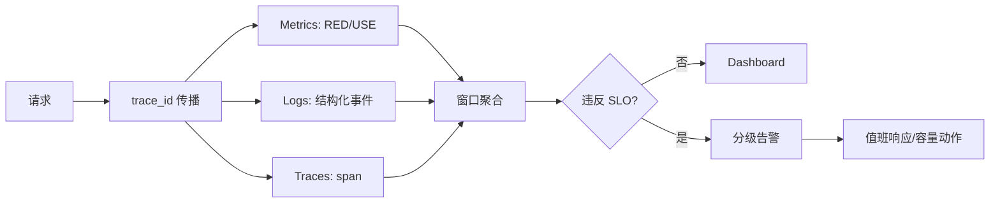

# 06 SLI-SLO与可观测性

> 知识成熟度：L2
> 适用范围：平台可靠性-SLI-SLO与可观测性
> 本文由《01-鉴权限流幂等灾备与可观测性》"七、OpenTelemetry、SLO/SLI、RED/USE 与容量模型"拆分而来，正文逐字迁移。

## 元数据
- 最后更新：2026-08-13。
- 知识成熟度：L2。
- 适用范围：平台可靠性-SLI-SLO与可观测性。
- 知识基线：平台可靠性工程方案（非 UE 内置能力）；事实边界以原《01-鉴权限流幂等灾备与可观测性》对应章节为准。
- 拆分来源：原《01-鉴权限流幂等灾备与可观测性》"七、OpenTelemetry、SLO/SLI、RED/USE 与容量模型"。

## 概述
可观测性用 traces、metrics、logs 三类信号把一次请求从入口连接到依赖，SLO/SLI 把"服务是否可靠"变成可度量的语言。
本文覆盖 trace_id 传播、RED 与 USE、SLO 与错误预算、告警分级、容量模型与压测方法。
观测数据应在每个边界带上相同的 trace_id、请求名、版本和结果分类。

### 1.1 三类遥测信号

OpenTelemetry（OTel）提供 traces、metrics、logs 的统一采集与关联模型；实现方式和后端产品仍需按当前项目选择。
Trace（链路）回答一次请求经过哪些服务和依赖；Metric（指标）回答总体趋势和分位数；Log（日志）回答某个事件的详细上下文。
三类信号应共享 trace_id、span_id、service.name、service.version、deployment.environment 和 region 等字段。
日志要避免把 token、密码、支付密文、完整设备密钥和大段请求体写入可检索平台。
高基数字段如完整 account_id 不应无审查地作为指标标签，否则可能耗尽时序数据库。
OTel 的采集和语义约定可参考 [OpenTelemetry Documentation](https://opentelemetry.io/docs/)。

### 1.2 trace_id 传播

入口生成或提取 trace_id 时，必须校验格式和长度，避免用户输入污染日志。
HTTP、RPC、消息头和异步任务都要定义传播方式。
异步消息可以保存 producer_trace_id 和 consumer_span_id，但不能把一条长生命周期 trace 无限延伸。
跨线程、协程和队列切换时要显式传递上下文，不能依赖线程局部变量的偶然行为。
采样策略应保证错误、慢请求和高风险写操作优先保留。
响应给客户端的 request_id 可以由 trace_id 派生或单独生成，但不能泄露内部账号或拓扑信息。

```text
function handle_request(request):
    ctx = telemetry.extract(request.headers)
    span = tracer.start_span("game.request", parent=ctx)
    span.set_attribute("rpc.method", request.method)
    span.set_attribute("service.version", BUILD_VERSION)
    response = dispatch(request.with_context(span.context))
    span.set_attribute("http.status_code", response.code)
    if response.code >= 500:
        span.record_exception(response.error)
        span.set_status(ERROR)
    span.end()
    return response.with_header("x-request-id", span.trace_id)
```

### 1.3 RED 与 USE

RED 适合请求型服务：Rate 是速率，Errors 是错误，Duration 是延迟。
USE 适合资源型组件：Utilization 是利用率，Saturation 是饱和度，Errors 是错误数。
游戏业务还需要补充业务正确性指标，例如扣款成功率、幂等冲突率、订单对账差异和匹配成功时延。

| 对象 | RED 指标 | USE 指标 | 业务补充 |
| --- | --- | --- | --- |
| 网关 | QPS、5xx、p99 | 连接利用率、队列长度 | 限流拒绝率 |
| 业务 API | 请求率、错误、p50/p95/p99 | 工作线程/协程饱和 | 成功状态迁移率 |
| 数据库 | 查询率、错误、查询延迟 | CPU、连接池、锁等待 | 提交回滚、账本差异 |
| Redis | 命令率、错误、响应延迟 | 内存、连接、阻塞 | 缓存命中与失效 |
| 消息系统 | 发布/消费率、错误、端到端延迟 | 分区积压、消费者槽位 | 重复和死信率 |
| 匹配服务 | 入队/出队率、失败、匹配延迟 | 队列占用、线程饱和 | ticket 过期率 |

### 1.4 SLI 与 SLO

服务水平指标（SLI）是可测量的服务表现；服务水平目标（SLO）是时间窗口内的目标阈值。
可用性不能只用进程存活率，应使用“符合业务成功定义的请求数 / 有效请求数”。
延迟 SLO 要写清分位数、请求范围、超时是否计入、排队时间是否计入。
数据正确性 SLO 可以用账本对账差异为零、重复发奖率为零、不可解释订单比例低于阈值表达。
错误预算（Error Budget）让发布、压测和功能开发共享同一风险语言。
SLO 的数值只是方案起点，需结合真实基线、用户体验和成本评审。

```text
availability = good_requests / valid_requests
error_budget = 1 - availability_slo
budget_consumed = bad_requests / valid_requests
remaining_budget = error_budget - budget_consumed
```

例如一个 SLO 是 99.9%，不意味着每个请求都能失败 0.1%，还要明确统计窗口和业务分层。
订单、货币和背包可以比装饰性推荐使用更严格的正确性目标。

### 1.5 告警分级

告警应指向动作，不应只报告“CPU 高”。
P0 表示大范围、持续或数据安全/经济安全风险，需要立即全员响应和止损。
P1 表示核心登录、订单、货币、背包、匹配或大区不可用，需要值班快速介入。
P2 表示局部退化或有明确绕行方案，可在工作时段处理。
P3 表示趋势、容量或维护提醒，不应制造夜间噪声。

| 等级 | 例子 | 首要动作 | 通知范围 |
| --- | --- | --- | --- |
| P0 | 货币账本出现不可解释差异、双主写入 | 立即冻结高风险写入并保护证据 | 事件指挥组、业务负责人 |
| P1 | 核心 API 5xx 超 SLO、登录大面积失败 | 限流/降级/摘流，定位版本和依赖 | 值班、服务 owner |
| P2 | 单区服 p99 上升、队列积压可控 | 扩容、调参、创建工单 | 值班与模块 owner |
| P3 | 证书 30 天内到期、容量趋势 | 排期处理并复核 | 模块 owner |

告警必须包含影响范围、开始时间、当前版本、trace/日志查询链接、runbook、负责人和升级路径。
同一根因的多个告警应聚合，避免告警风暴掩盖 P1。

### 1.6 容量模型

容量估算至少包含流量、并发、资源成本、峰值系数、故障余量和增长率。
Little 定律可以用来校验排队关系：并发数约等于到达率乘以平均停留时间。
数据库写入容量应按业务事件数、重试放大、索引写放大和复制开销计算。
缓存容量应包含热键、过期抖动、峰值装载和故障回源，不只看平均命中率。
跨区灾备要预留单区失效后的容量，不能两区都按 50% 满载运行却没有故障余量。

```text
peak_rps = average_rps * peak_factor
effective_rps = peak_rps * (1 + retry_amplification)
required_instances = ceil(effective_rps / safe_rps_per_instance)
db_write_rps = command_rps * writes_per_command * index_write_factor
headroom = available_capacity - required_capacity
```

容量模型中的 safe_rps 应取压测中满足延迟和错误 SLO 的值，而不是进程刚开始排队时的最大吞吐。
模型应按登录峰值、开服峰值、活动结算峰值、故障转移峰值和回放峰值分别计算。

### 1.7 压测方法

压测数据应区分基准、阶梯、尖峰、耐久、故障恢复和容量边界六类。
基准压测建立单实例安全吞吐；阶梯压测寻找饱和点；尖峰压测观察突发和限流；耐久压测发现泄漏和积压。
故障恢复压测加入数据库、消息、缓存或服务发现故障，验证降级和回切。
测试账号、设备、订单和资产必须可清理，不能让压测污染生产经济。
压测请求要包含真实比例的读、写、重试、超时和消息消费，而不是只发健康检查。
结果至少保留 p50、p95、p99、最大值、错误分类、队列长度、数据库等待和 CPU/内存/网络。

### 1.8 术语速查

下面把本文常用术语固定为团队统一口径；口径调整时需同步修订 SLI 定义、告警规则与 runbook。

| 术语 | 含义 | 使用要点 |
| --- | --- | --- |
| SLI | 可测量的服务质量指标，如"有效请求中业务成功的比例" | 先定请求口径与成功定义，再谈阈值 |
| SLO | 时间窗口内 SLI 的目标阈值 | 写清窗口、分位数、请求范围与超时口径 |
| Error Budget | 1 减去 SLO 后允许失败的比例 | 消耗进入发布与实验门禁 |
| RED | Rate、Errors、Duration 三类指标 | 用于请求型服务 |
| USE | Utilization、Saturation、Errors 三类指标 | 用于资源型组件 |
| trace_id | 一次请求跨服务共享的链路标识 | 入口校验格式与长度，避免用户输入污染 |
| span | 链路中的一个工作单元 | 跨线程、跨依赖边界显式新建或传递 |
| 采样 | 按规则保留 trace 样本的策略 | 错误、慢请求和高风险写优先保留 |
| 高基数标签 | 取值空间极大的指标标签 | 完整 account_id 不直接作为标签 |
| 告警聚合 | 同根因告警合并为一条通知 | 避免风暴掩盖高等级告警 |
| runbook | 告警对应的处置手册 | 每条告警都能定位到对应 runbook |
| 单机安全吞吐 | 满足延迟与错误 SLO 的单实例请求率 | 由压测得出，用于容量模型 |

易混术语对照：

| 易混对 | 区别 |
| --- | --- |
| SLI 与 SLO | SLI 是测量本身，SLO 是给测量定的目标阈值 |
| RED 与 USE | RED 面向请求视角，USE 面向资源视角，两者互补 |
| 采样与全量 | 采样牺牲部分样本换取成本，关键样本必须保留 |
| 告警聚合与静默 | 聚合保留信息合并通知，静默可能掩盖根因 |

"有效请求"是否剔除限流拒绝、内部探针与爬虫，"业务成功"如何判定，都要在 SLI 定义中逐项写明，否则同一指标在不同团队间无法对账。

常见口径问题：把重试后的成功当作成功却不标注、把超时请求从分母剔除、把计划内维护与计划外故障混在同一窗口，都会让 SLO 失去可比性；口径示例应随 SLO 定义一起评审归档。

口径示例：若把限流拒绝计入分母，错误预算会被攻击流量快速消耗；若剔除，则需要同步监控被剔除的请求量，防止口径掩盖真实失败。

此示例仅为口径设计说明，具体规则由项目评审确定。

### 1.9 落地检查清单

SLO 与可观测性方案上线、季度评审或事故复盘跟进时逐项核对；通过标准全部满足才视为闭环。

| 检查项 | 通过标准 |
| --- | --- |
| trace_id 入口校验 | 非法或超长输入被拒绝，不写入日志与指标 |
| 三类信号字段统一 | 关键 span 与日志均携带 service.version 与 deployment.environment |
| 采样策略 | 错误与慢请求样本可按 trace_id 查询，不被采样丢弃 |
| RED 覆盖 | 入口与核心业务 API 均具备 Rate/Errors/Duration |
| USE 覆盖 | 数据库、缓存、消息、匹配组件均具备 Utilization/Saturation/Errors |
| 业务正确性指标 | 扣款成功率、幂等冲突率、账本差异、重复发奖率已上报 |
| SLO 口径完整 | 含窗口、分位数、请求范围、超时与排队是否计入 |
| 错误预算可见 | 预算消耗按窗口滚动展示，并进入发布评审 |
| 告警分级 | P0-P3 均有示例、首要动作与通知范围 |
| 告警可执行 | 告警携带影响范围、开始时间、版本、trace/日志入口与 runbook |
| 告警聚合 | 同根因告警已配置聚合或风暴抑制 |
| 容量模型 | 覆盖登录、开服、活动结算、故障转移与回放峰值 |
| 压测覆盖 | 六类压测均有记录，保留分位数与错误分类 |
| 压测数据可清理 | 测试账号、订单、资产可回收，不污染生产经济 |
| 演练或复盘验证 | 至少一次告警分级演练或事故复盘验证告警指向动作 |

执行节奏建议：

- 定义期：SLO 口径与告警分级经服务 owner 与业务负责人评审后固化。
- 变更期：告警规则、采样策略、容量参数改动后做误报与漏报对照。
- 评审期：季度核对本清单，未通过项转成带负责人与截止日期的行动项。
- 事故后：复盘结论必须能映射到本清单的某一项，否则说明防线缺失未被记录。

未通过项的处置：先确认是口径问题还是实现问题；口径问题回定义期修订，实现问题进入行动项排期；同一项连续两个评审期未通过，应升级给负责人确认优先级。

使用提示：清单不应在评审当天临时填写，建议日常发布中随时记录偏差，评审时汇总讨论。

通过标准有歧义时，以最新评审结论为准，并回写本文与 SLO 定义。

### 1.10 常见反模式

反模式适合在评审与培训中逐条对照，避免落地时重复踩坑。

| 反模式 | 典型表现 | 修正方向 |
| --- | --- | --- |
| 进程存活即可用 | 只监控进程 up 与 CPU，不看业务成功 | 改用业务成功定义的 SLI |
| 有指标无 SLO | 面板齐全但没有目标阈值 | 关键路径定义 SLO 与错误预算 |
| SLO 口径含糊 | 只写"延迟小于某值" | 写清分位数、范围、超时与排队 |
| 告警即状态 | 告警只报"CPU 高"无动作 | 告警指向动作并带 runbook |
| 单请求即告警 | 一个异常请求就触发 | 最小样本数与连续窗口 |
| 高基数标签 | 订单号、account_id 直接进标签 | 哈希、摘要或降维度 |
| 压测只打健康检查 | 压测流量不含真实业务 | 按真实读写、重试、超时比例构造 |
| 错误预算无人消费 | 定义了预算但发布不看 | 预算消耗进发布门禁与周报 |

自我检查：如果面板只剩一张图，能否回答"现在是否可以发布"？一条告警到达时，值班者能否不看文档就知道下一步？预算消耗过半时，是否有人会注意到？任一为否，说明落地还没闭环。

反模式清单应与"失败路径"表对照使用：失败路径回答出了问题怎么办，反模式回答哪些做法会招来问题；两张表都应纳入评审与新人培训。

评审中可把反模式作为代码评审与配置评审的检查项：新告警必须回答指向什么动作，新面板必须关联到某条 SLO。

培训中用反模式做案例分析，比直接宣讲规范更容易暴露理解偏差。

### 1.11 补充示例与典型故障案例

示例为示意配置，数值与窗口需按项目压测与历史基线校准，不得直接复制上线。

**SLO 与告警规则示例（YAML）**

```yaml
# 示意值，需项目压测验证
slo:
  name: login_availability
  sli_expression: good_requests / valid_requests
  valid_requests: request_kind == "login" and status_code != 429
  good_requests: status_code < 500 and login_migration_success == true
  window: 28d
  target: 0.999
  pause_release_when_budget_remaining_below: 0.2

alert_rules:
  - name: login_slo_burn
    expression: burn_rate(login_availability, 1h) > 14.4
    min_samples: 30
    severity: P1
    runbook: login_slo_runbook
  - name: login_error_budget_exhausted
    expression: remaining_budget(login_availability) < 0.2
    min_samples: 1
    severity: P1
    runbook: login_slo_runbook
```

示例要点：valid_requests 与 good_requests 的判定条件必须和 SLI 定义同源；burn 告警用短窗口快速感知，预算剩余告警用长窗口确认整体风险；min_samples 防止单请求误报；runbook 字段指向实际处置手册编号。

落地方式：先按示例在测试环境跑通数据流，再把 burn 规则接入值班渠道试运行一个观察周期，确认无误报后正式启用。

示例中的窗口与阈值均为起点，正式值需在压测与历史基线校准后回写。

**案例一：告警风暴掩盖 P1（示意场景）**

某区服数据库连接池出现抖动，同一根因同时触发网关、业务服务与依赖侧多条告警，慢查询又单独计数，几分钟内通知数量超过百条；值班按不同 runbook 分别处置，却始终找不到同一根因，真正的大面积登录失败 P1 被淹没，直到玩家反馈才升级。
时间线要点：告警在约 5 分钟内达到峰值，定位耗时约 40 分钟，恢复后梳理告警来源又花费半天（示意值）。
复盘发现：告警未做同根因聚合，触发没有最小样本数与连续窗口，等级未按业务影响校准。
改进：按根因分组聚合，最小样本数加连续窗口触发，启用风暴抑制，并把"告警必须指向动作"纳入评审门禁。
通知数量与时间均为示意值，需按项目实际验证。

**案例二：错误预算耗尽仍继续放量（示意场景）**

某版本灰度期间，登录链路错误预算在发布周内已消耗约八成，团队仍按原计划扩大新版本比例，理由是"告警等级不高"；次日账本差异类告警升级，预算消耗超过窗口额度，被迫回滚。
时间线要点：放量后第 2 天预算耗尽，账本差异告警升级，回滚耗时约 1 小时（示意值）。
复盘发现：预算消耗没有进入发布门禁，面板与发布评审脱节，SLO 窗口口径也没有人复核。
改进：剩余预算低于阈值时自动暂停放量，发布前检查预算消耗，预算趋势进入周报与发布评审。
预算比例与窗口为示意值，需按项目压测与历史基线校准。

两个案例的共同要点：检测与定位延迟往往大于修复本身，告警聚合、最小样本数和预算门禁都是在压缩检测与定位时间；复盘产出应能直接对应到本文清单中的某一项，若对应不上，说明防线缺失未被记录。

## 失败路径

| 失败路径 | 快速判断 | 默认动作 |
| --- | --- | --- |
| trace 上下文丢失 | 跨线程/协程/队列切换后无 span | 显式传递上下文，不依赖线程局部变量的偶然行为 |
| 采样丢弃关键请求 | 错误/慢请求无样本 | 错误、慢请求和高风险写操作优先保留 |
| 高基数标签 | 指标基数爆炸 | 完整 account_id 不无审查作为指标标签 |
| 告警风暴 | 同根因多条告警 | 同一根因的多个告警聚合，避免掩盖 P1 |
| 容量无故障余量 | 单区失效即过载 | 跨区灾备预留单区失效后的容量 |

## FAQ

### Q8：CPU 不高但接口很慢，先扩容可以吗？

先看连接池等待、锁等待、队列积压、下游延迟、尾延迟和重试放大。CPU 低可能意味着线程在等待依赖，盲目扩容会把连接和下游压得更满。

## 验收清单

- traces、metrics、logs 共享 trace_id、span_id、service.name、service.version、deployment.environment 和 region 等字段。
- 入口生成或提取 trace_id 时校验格式和长度，避免用户输入污染日志。
- 采样策略保证错误、慢请求和高风险写操作优先保留。
- RED 用于请求型服务，USE 用于资源型组件，并补充业务正确性指标。
- SLO 写清分位数、请求范围、超时与排队时间是否计入。
- 错误预算让发布、压测和功能开发共享同一风险语言。
- 告警按 P0-P3 分级并指向动作，同一根因的多个告警聚合。
- 压测覆盖基准、阶梯、尖峰、耐久、故障恢复和容量边界六类，结果保留分位数与错误分类。

## 关联阅读

- [00-平台可靠性总览与迁移说明.md](../../07-网络与游戏服务端/服务架构与消息通信/00-平台可靠性总览与迁移说明.md)：本目录总览与迁移说明，含责任边界、最佳实践清单与 FAQ。
- [04-平台与可靠性/README.md](../../../00_Index/学习路线/网络与游戏服务端.md)：本目录导航与学习路径。
- [02-数据与业务/05-部署运维与监控.md](05-部署运维与监控.md)：监控、告警与运维专题细节。
- [游戏算法/03-工程与实用技巧/03-AOI与视野计算.md](../../02-数学与游戏算法/空间查询与碰撞/03-AOI与视野计算.md)：AOI 与视野计算涉及热点、分片、广播和容量模型。
- [OpenTelemetry Documentation](https://opentelemetry.io/docs/)：traces、metrics、logs 与上下文传播的官方文档入口。

## 更新日志

- 2026-08-13：从《01-鉴权限流幂等灾备与可观测性》"七、OpenTelemetry、SLO/SLI、RED/USE 与容量模型"（7.1-7.7）拆出独立成篇；正文逐字迁移，标题按本文重编号。
- 2026-08-13：扩写术语速查、落地检查清单、常见反模式与补充示例及典型故障案例（1.8-1.11），正文补充至 300+ 行。
## 数据流：请求遥测到 SLO 告警



统一 `trace_id` 将三类信号关联到同一请求；窗口聚合计算错误率、延迟和饱和度，再按 SLO 预算触发分级告警。
