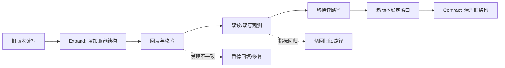

# 07 故障恢复容灾与多活

> 知识成熟度：L2
> 适用范围：平台可靠性-故障恢复容灾与多活
> 本文由《01-鉴权限流幂等灾备与可观测性》"五、数据迁移、备份、RPO/RTO 与跨区灾备"拆分而来，正文逐字迁移。

## 元数据
- 最后更新：2026-08-13。
- 知识成熟度：L2。
- 适用范围：平台可靠性-故障恢复容灾与多活。
- 知识基线：平台可靠性工程方案（非 UE 内置能力）；事实边界以原《01-鉴权限流幂等灾备与可观测性》对应章节为准。
- 拆分来源：原《01-鉴权限流幂等灾备与可观测性》"五、数据迁移、备份、RPO/RTO 与跨区灾备"。

## 概述
数据迁移与灾备的目标是把故障时的数据损失和恢复时间限制在可接受范围。
本文覆盖 Expand/Contract、版本兼容矩阵、不可逆回滚、快照与增量备份、RPO/RTO、跨区灾备、演练与审计。
恢复后要核对订单、货币、背包、匹配和登录的业务不变量，而不是只看进程为绿色。

### 1.1 Expand/Contract

Expand/Contract 是在线迁移的基本节奏：先扩展兼容结构，再切换读写，最后收缩旧结构。
Expand 阶段只增加可选列、兼容表、双写或新索引，旧版本必须仍能工作。
迁移脚本应可观测、可暂停、可分批、可限速，并记录批次游标。
回填任务要按主键范围或稳定游标推进，避免 OFFSET 在数据变化时跳过或重复。
切换阶段先确保新字段已回填、双读一致、读写开关可回退。
Contract 阶段只能在所有旧客户端、旧服务和回放工具退出兼容窗口后执行。
删除列、重命名、改变枚举语义和压缩历史数据可能不可逆，必须单独审批和备份。



### 1.2 版本兼容矩阵

| 生产者 | 消费者 | 兼容要求 | 门禁 |
| --- | --- | --- | --- |
| 旧客户端 | 新服务端 | 服务端接受旧字段和旧枚举 | 协议回放 |
| 新客户端 | 旧服务端 | 仅在声明的向后兼容窗口允许 | 版本矩阵 |
| 旧服务 | 新数据库 | 新列可选，旧 SQL 不报错 | 集成测试 |
| 新服务 | 旧数据库 | 不读不存在的列，不发送新枚举 | 迁移前测试 |
| 新生产者 | 旧消费者 | 事件新增字段可忽略 | schema 检查 |
| 旧生产者 | 新消费者 | 默认值和旧事件版本处理 | 回放旧事件 |

协议兼容不只是字段“能解析”，还包括语义、错误码、默认值、时间单位、枚举未知值和状态转换。
兼容窗口应写入服务端版本矩阵，并在发布门禁中自动验证。

### 1.3 回滚不可逆性

代码回滚不等于数据回滚。
新增可选列通常可与旧代码共存；删除列、改写数据、消耗随机序列、发放货币和外部支付通常不可安全反向恢复。
对不可逆操作，应采用前向修复、补偿事务、快照恢复到新表或人工对账，而不是要求数据库“回到昨天”。
每个迁移计划都应列出可逆、部分可逆、不可逆三类动作。
回滚按钮若只能回滚服务二进制，界面应明确禁止把它描述为完整回滚。
生产迁移前必须在同版本快照和代表性数据集上演练恢复与前向修复。

### 1.4 快照与增量备份

快照备份（Full/Snapshot）便于恢复某个时间点，但可能成本高、恢复窗口大。
增量或连续归档（Incremental/WAL Archive）降低备份窗口，并支持更细的恢复点，但依赖完整链条和校验。
备份必须与主数据隔离，至少使用不同故障域和不同访问凭证。
备份成功不等于可恢复，必须定期做自动校验、抽样恢复和完整灾备演练。
加密备份的密钥轮换不能让历史备份失去解密能力，密钥托管和恢复权限要有双人或分权策略。
备份保留期应根据合规、运营回溯、赛季周期和成本确定。
PostgreSQL 的事务、备份与恢复能力可参考 [PostgreSQL Documentation](https://www.postgresql.org/docs/)，目标数据库不同则要替换为对应官方文档和演练证据。

### 1.5 RPO/RTO

恢复点目标（RPO，Recovery Point Objective）表示故障时最多允许丢失多长时间的数据。
恢复时间目标（RTO，Recovery Time Objective）表示从故障确认到服务恢复到目标状态允许经过多长时间。
RPO 是数据损失预算，不是备份频率的同义词；RTO 是业务恢复预算，不是容器启动时间的同义词。
每个业务域应单独写 RPO/RTO，因为登录、货币、聊天和排行榜的容忍度不同。

| 业务域 | 示例目标（需压测确认） | 可接受降级 | 关键证据 |
| --- | --- | --- | --- |
| 登录与会话 | RPO 分钟级，RTO 分钟级 | 已有会话有限续期、禁止新高风险登录 | 会话存储恢复演练 |
| 货币与订单 | RPO 接近零，RTO 分钟级 | 写入暂停、查询和对账优先 | 账本/订单对账 |
| 背包 | RPO 秒到分钟级 | 只读背包、延迟发奖 | 快照与流水恢复 |
| 匹配队列 | RPO 可丢弃，RTO 分钟级 | 清空并重建队列 | ticket 重建脚本 |
| 排行榜 | RPO 小时级可讨论 | 返回旧快照 | 重算任务 |
| 聊天 | RPO 分钟级 | 降级为区域或频道只读 | 消息重放 |

### 1.6 跨区灾备

跨区复制可采用主备、温备、双写或按域拆分，具体模式依赖一致性、成本和运维能力。
主备切换必须有唯一主权或租约，避免双主同时发放货币。
异步复制意味着 RPO 不为零，切换时应记录复制位点并处理未复制事务。
双写不是自动高可用；任何一侧失败都需要重试、对账、冲突策略和降级。
跨区流量切换应验证 DNS、证书、服务发现、密钥、配置、队列和第三方回调地址。
只切网关不切数据权威会制造更难修复的双写分叉。
灾备区要有最小可运行的观测、审计和管理权限，不能等主区故障时临时安装工具。

### 1.7 演练与审计

演练分为桌面推演、组件恢复、单区故障、数据恢复、全链路切换和回切演练。
每次演练都记录开始时间、故障注入、检测时间、决策时间、恢复时间、数据差异和未完成项。
演练脚本必须包含停止条件，避免为了追求恢复而扩大数据破坏范围。
审计日志需要与业务日志分离保存，至少记录谁在何时以什么版本执行了什么恢复或切换动作。
恢复后要核对订单、货币、背包、匹配和登录的业务不变量，而不是只看进程为绿色。
演练结果要转成可追踪的行动项、负责人、截止日期和复验记录。

### 1.8 灾备示意 YAML

```yaml
disaster_recovery:
  primary_region: region-a
  standby_region: region-b
  objectives:
    account_session:
      rpo: 5m
      rto: 10m
    economy:
      rpo: 0m
      rto: 15m
  failover:
    require_fencing: true
    require_operator_confirmation: true
    health_checks:
      - replication_lag
      - ledger_consistency
      - certificate_validity
      - dependency_reachability
  restore:
    require_point_in_time_selection: true
    verify_checksums: true
    run_reconciliation: true
  audit:
    retention_days: 365
```

## 失败路径

| 失败路径 | 快速判断 | 默认动作 |
| --- | --- | --- |
| 回填不一致 | 双读校验失败 | 暂停回填/修复，指标回归后切回旧读路径 |
| 迁移不可逆动作已执行 | 删除列/改写数据 | 前向修复、补偿事务、快照恢复或人工对账，不要求数据库回退 |
| 备份不可恢复 | 抽样恢复失败 | 自动校验、抽样恢复和完整灾备演练 |
| 双主写入 | 主权/租约丢失 | 唯一主权或租约，避免双主同时发放货币 |
| 复制位点丢失 | 异步复制 RPO 不为零 | 切换时记录复制位点并处理未复制事务 |
| 演练无停止条件 | 恢复动作扩大破坏 | 停止条件写入演练脚本 |

## FAQ

### Q6：数据库迁移失败后直接回滚代码是否安全？

不一定。代码可以回滚，数据结构和已写入数据可能不可逆。应先检查迁移阶段、兼容矩阵、备份和前向修复方案，再决定回滚或暂停。

### Q10：灾备切换成功，为什么还不能宣布恢复？

进程和路由健康不代表业务正确。还要核对复制位点、订单/货币/背包不变量、消息积压、证书密钥、审计链和回切计划。

## 验收清单

- Expand/Contract 分阶段执行，切换前新字段已回填、双读一致、读写开关可回退。
- 版本兼容矩阵覆盖客户端/服务端/数据库/事件生产消费者的兼容要求，兼容窗口进发布门禁。
- 每个迁移计划列出可逆、部分可逆、不可逆三类动作。
- 备份与主数据隔离，使用不同故障域和不同访问凭证。
- 备份定期自动校验、抽样恢复和完整灾备演练，加密密钥轮换不使历史备份失去解密能力。
- RPO/RTO 按业务域单独写，登录、货币、背包、匹配、排行榜和聊天的容忍度不同。
- 跨区切换验证 DNS、证书、服务发现、密钥、配置、队列和第三方回调地址。
- 恢复后核对订单、货币、背包、匹配和登录的业务不变量，演练结果转成可追踪行动项。

## 术语速查

以下速查表只做术语口径对齐，详细定义与工程约束见上文各小节；数值目标一律以各业务域自行确定并经演练实测校准为准。

| 术语 | 含义 | 工程要点 |
| --- | --- | --- |
| 容灾（DR，Disaster Recovery） | 通过备份、复制与切换机制，在灾难发生后恢复业务可用 | 同时覆盖数据恢复与流程恢复，二者缺一不可 |
| 多活（Multi-Active） | 多个区域同时承担读写，对外表现为持续可用 | 多活不是多主乱写，每个写入域仍必须只有唯一权威 |
| 主备（Active-Standby） | 主区承担读写，备区持续复制并等待接管 | 备区要定期承担只读流量或切换演练，避免"从未跑过的切换" |
| 温备 / 冷备 | 温备有可快速启动的实例与数据；冷备只有备份介质 | 选择取决于 RTO 预算与恢复复杂度 |
| 快照（Snapshot） | 某个时间点的完整数据副本 | 快照链的连续性与校验状态要持续可查 |
| 增量备份 / WAL 归档 | 记录变化并支持更细恢复点 | 归档链条断点会让其后所有恢复点失效 |
| 复制位点（Replication Position / Lag） | 备区追到主区日志的位置及差距 | 切换前先看 lag，超过业务预算时应暂停切换而不是硬切 |
| 脑裂（Split-Brain） | 网络分区后两侧都认为自己是主 | 需要仲裁、租约与自动降级，任何情况下禁止双写 |
| 租约 / 栅栏（Lease / Fencing） | 唯一主权的持有凭证与停写约束 | 新主升位前必须确认旧主已停写，否则恢复后会回写分叉 |
| 回切（Failback） | 从灾备区把流量与权威切回主区 | 回切按切换同等流程演练，并保留观测窗口 |
| 恢复点（Recovery Point / PITR） | 恢复到指定时间点的能力 | 选择恢复点时要确认该点业务状态合法（如结算窗口、赛季结算） |
| 演练（Drill） | 通过故障注入验证检测、决策与恢复链路 | 记录检测时间、决策时间、恢复时间与数据差异，并转行动项 |
| 故障域 | 共享同一故障风险的资源边界 | 备份、归档与访问凭证要落在不同故障域 |
| 对账（Reconciliation） | 用主键、流水号与业务不变量核对两侧数据差异 | 对账工具平时就要运行并留基线，不能只在大故障时临时启用 |

速查表用于评审与值班对齐口径；具体数值与策略仍以上文各小节和项目实测为准。

## 落地检查清单

以下清单把目标转成发布前与演练中可逐项验证的动作；每项给出检查方法与通过标准，频率、样本量与阈值由项目按风险与成本实测校准，本表不给定默认值。

| 检查项 | 检查方法 | 通过标准 |
| --- | --- | --- |
| 迁移脚本可暂停可限速 | 演练中人为中断迁移任务 | 中断后可从批次边界续跑，无重复无遗漏 |
| 回填游标稳定 | 对比两次运行的游标与行数 | 游标单调推进，数据量一致 |
| 兼容矩阵进门禁 | 发布流水线执行矩阵校验 | 不满足矩阵的版本组合在 CI 被拦截 |
| 不可逆动作受控 | 逐迁移核对动作分类 | 每个不可逆动作有审批、备份与前向修复或对账方案 |
| 备份隔离 | 核对备份存储位置与访问凭证 | 主库故障或凭证泄露时备份仍可读 |
| 备份可恢复性 | 自动校验加抽样恢复 | 最近 N 次抽样恢复全部成功，N 与频率由项目定义 |
| RTO 实测 | 全链路故障注入演练计时 | 连续两次演练恢复耗时低于目标并留出余量（示意口径，需项目实测验证） |
| 切换与回切脚本化 | 演练中只执行脚本与复核 | 全程无手工漏步，回退预案可用 |
| 脑裂防护 | 断网分区演练 | 分区期间旧主停写、新主唯一，恢复后无双写 |
| 依赖与回调验证 | 切换后探测 DNS、证书、密钥、队列与第三方回调 | 全部探测通过，回调地址指向新主 |
| 审计留痕 | 恢复与切换后查审计日志 | 能回答谁在何时以什么版本做了什么 |
| 行动项闭环 | 对照上次演练记录 | 上次行动项在下次演练前关闭并复验 |
| 复制位点告警 | 检查监控面板与告警规则 | lag 超阈值与备份失败按项目定义的周期触发告警 |
| 备份保留期 | 核对保留策略与执行记录 | 按合规、赛季与成本确定的保留期有负责人且可审计 |
| 灾备区可运维 | 主区不可用时尝试在灾备区执行恢复操作 | 灾备区可独立完成观测、审计与管理，不依赖主区工具 |
| 回切窗口 | 切换完成时检查回切计划 | 回切窗口、触发条件与演练安排已写入工单 |

清单建议随发布门禁与演练周期执行，并把每次结果与上次基线对比，退化时先恢复基线再继续发布。

## 常见反模式

以下反模式按现象、后果与正确做法对照，适合在方案评审与演练复盘时逐条核对。

| 反模式 | 现象 | 后果 | 正确做法 |
| --- | --- | --- | --- |
| 把备份当唯一救生索 | 备份任务全绿，但从没恢复过 | 恢复时才发现备份损坏或链条缺失 | 定期抽样恢复，恢复演练纳入发布节奏 |
| 演练走查化 | 演练只对流程念稿，不注入故障 | 真实故障时检测与决策环节失灵 | 注入断网、杀进程、停副本等真实故障并记录观测 |
| 手工切换 | 切换靠个人记忆与散落文档 | 漏步骤、误操作、回退无据 | 脚本化执行加双人复核，回退预案一并演练 |
| 无仲裁自动抢主 | 网络分区后两侧自动升主 | 双写分叉，数据无法简单合并 | 仲裁多数派加租约，自动降级优先于自动抢主 |
| 备份与主库同故障域 | 备份与主库同机房同账号 | 主库故障或凭证泄露时备份同时失效 | 跨故障域存储、独立凭证、定期验证可读 |
| 以"备份成功"日志为证 | 只看到 backup ok，无校验与恢复证据 | 文件损坏与断档长期未被发现 | 校验和、抽样恢复与恢复报告作为证据 |
| 只盯进程存活 | 进程和端口全绿，复制位点落后数小时 | 切换时数据损失远超 RPO | 同时监控复制位点、备份状态与对账差异 |
| 切完不计划回切 | 灾备区长期运行，角色与方向模糊 | 下次故障时主备不清，回切风险放大 | 切换完成即定回切窗口、条件与演练 |

对照时先看自己的监控与演练记录里有没有对应现象，再按影响面排整改优先级。

## 典型故障案例

以下三个案例按工程中反复出现的失败形态整理为示意复盘，用于对照自身方案，不代表任何具体项目的事故记录。

### 案例一：切换流程缺位导致恢复超时

背景：主备异步复制，RTO 目标 15 分钟（示意值，需项目实测验证）；切换步骤散落在三份文档里，证书与回调地址只在主区预置。

经过：
- 主区网络故障，值班按文档逐条执行。
- DNS 修改需要跨团队审批，等待期间服务持续不可用。
- 备区证书缺失，TLS 握手失败；第三方支付回调仍指向主区。
- 恢复耗时远超目标（示意时长，需项目实测验证）。

根因：
- 切换路径从未整体演练，依赖项未预置。
- 流程依赖人工串行协调，没有可执行脚本。

对策：
- 切换与回切写成可执行脚本，含回退分支。
- 备区预置证书、密钥、回调与最小观测工具。
- 定期全链路演练，逐次记录检测、决策、恢复三段耗时并对比目标。

### 案例二：无仲裁自动抢主引发脑裂

背景：跨区复制未部署仲裁节点，配置了"主区不可达即自动升主"的规则。

经过：
- 网络分区使两侧互相不可达，备区自动升主并开始接受写入。
- 分区恢复后主区进程恢复可写，未执行停写确认，出现双主。
- 对账发现订单与货币两侧分叉，部分流水无法自动合并。

根因：
- 自动升主缺少仲裁与租约确认。
- 没有实现旧主 fencing，恢复后旧主直接回写。

对策：
- 升主必须经过仲裁多数派，并确认旧主已停写。
- 脑裂场景进入常规演练，演练中检查双主检测告警。
- 对账工具按主键与流水号检测双写分叉并告警。

### 案例三：备份"成功"但恢复失败

背景：每日全量快照加 WAL 归档；备份任务日志长期全绿，从未做过恢复演练。

经过：
- 误删核心表后执行恢复，发现最近快照校验失败。
- 归档在备份介质迁移时断档两天，只能恢复到更早时间点。
- 数据损失超过业务预算；首次恢复尝试又因目标磁盘不足失败。
- 恢复过程依赖人工回忆步骤，耗时进一步拉长。

根因：
- 备份成功只证明任务跑完，没有证明可恢复。
- 归档断点未被检测，恢复资源与权限未提前验证。

对策：
- 备份后自动校验并抽样恢复，归档连续性做断点检测。
- 恢复演练使用与生产一致的资源、权限与工具。
- 恢复结果（校验、耗时、数据差异）写入审计并转行动项。

复盘要点：
- 复盘先按时间线还原检测、决策、恢复与数据差异四段，再讨论责任。
- 自动化升主或恢复动作必须先过停写（fencing）确认，速度不能优先于一致性。
- 备份介质迁移、密钥轮换、证书到期等日常变更，完成后触发一次恢复验证再关闭工单。
- 演练中发现的每条偏差都要转成行动项，带负责人与复验日期。

## 关联阅读

- [00-平台可靠性总览与迁移说明.md](../../07-网络与游戏服务端/服务架构与消息通信/00-平台可靠性总览与迁移说明.md)：本目录总览与迁移说明，含责任边界、最佳实践清单与 FAQ。
- [04-平台与可靠性/README.md](../../../游戏服务端/04-平台与可靠性/README.md)：本目录导航与学习路径。
- [02-数据与业务/03-分布式与高可用.md](../../07-网络与游戏服务端/持久化与分布式一致性/03-分布式与高可用.md)：高可用、复制与故障切换专题细节。
- [02-数据与业务/01-数据库选型与存储设计.md](../../07-网络与游戏服务端/持久化与分布式一致性/01-数据库选型与存储设计.md)：备份、恢复与存储设计细节。
- [游戏AI/03-评测与安全/01-AI评测回放.md](../../06-游戏AI/评测安全与运行预算/01-AI评测回放.md)：回放、评测、安全边界和审计思路可迁移到恢复演练与审计。
- [PostgreSQL Documentation](https://www.postgresql.org/docs/)：事务、索引、备份与恢复的官方文档入口。
- [08-灰度发布回滚与事故复盘](../持续交付与发布治理/08-灰度发布回滚与事故复盘.md)：版本兼容矩阵与回滚的发布侧视角（分工：本文=数据迁移/灾备恢复）。

## 更新日志

- 2026-08-13：从《01-鉴权限流幂等灾备与可观测性》"五、数据迁移、备份、RPO/RTO 与跨区灾备"（5.1-5.8）拆出独立成篇；正文逐字迁移，标题按本文重编号。
- 2026-08-13：扩写术语速查、落地检查清单、常见反模式与典型故障案例，正文补充至 300+ 行。
