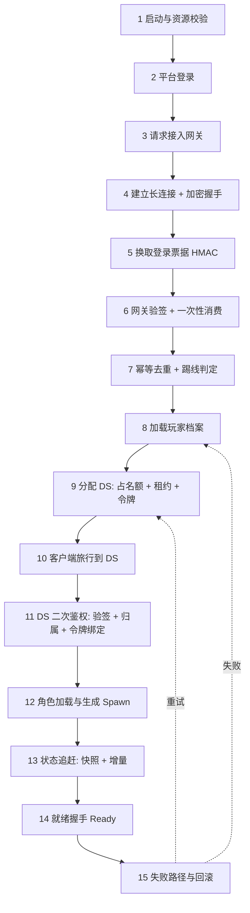

# 01-角色进入游戏完整链路

> 知识成熟度：L4（端到端链路专著 + 本机可运行证据；83 条断言全部通过，覆盖 HMAC 票据验签、进入状态机幂等与回滚、DS 租约与栅栏令牌、JIP 状态追赶，含 P50/P95/P99 与带宽对比，原始输出归档于 `evidence/tests/entry-core/results/`；平台登录、DB 档案与真实 DS 调度仍属未验证边界）。
> 知识基线：登录票据采用 HMAC-SHA256（RFC 2104）签名，对照 FIPS 180-4 与 RFC 4231 标准向量自校验；DS 会话注册与 UE5.8（CL 55116800）`APlayerController` 接管、JIP 状态追赶对齐 [游戏服务端/05-UE Dedicated Server平台化/03-DS会话注册与重连实现](../游戏服务端/05-UE%20Dedicated%20Server平台化/03-DS会话注册与重连实现.md)；租约与栅栏令牌对齐 [游戏服务端/06-世界模拟与运行时/07-EntityOwnership与Authority](../游戏服务端/06-世界模拟与运行时/07-EntityOwnership与Authority.md)。
> 适用范围：MMO / 战术竞技 / 房间制动作游戏 / 大世界生存的**全部进入路径**：新玩家首次进入、断线重连、中途加入（JIP）、跨服转移后再次进入。
> 事实边界：本机的密码学实现仅用于验证算法正确性与票据语义，**未经侧信道审计，生产必须使用成熟库与 KMS**；状态机与分配器为单线程最小模型，未覆盖真实并发、分布式租约存储与平台（Agones/GameLift）集成；带宽数字按 `Entity 32B / Delta 32B` 估算，非线上实测包体。
> 参考来源：[RFC 4231 - HMAC-SHA256 Test Vectors](https://www.rfc-editor.org/rfc/rfc4231)、[FIPS 180-4 (SHA-256)](https://nvlpubs.nist.gov/nistpubs/FIPS/NIST.FIPS.180-4.pdf)、[Unreal Engine 官方文档](https://dev.epicgames.com/documentation/en-us/unreal-engine)、[Kubernetes Lease](https://kubernetes.io/docs/concepts/architecture/leases/)。
> 最后更新：2026-10-01（票据功能断言、侧信道和持有者身份的证据边界）。

---

## 一、概述与链路定位

进入游戏是整条产品链路上**唯一一段"玩家还没开始玩，却已经把状态写进线上系统"的流程**。它要在几百毫秒到几秒内同时完成五件事：证明"你是你"、找到"你该去哪个进程"、把"你的存档"读出来、把"你的角色"放进世界、并且让你看到的世界和别人看到的一致。

这段流程出问题时的表现极具误导性：

| 玩家看到 | 常见误判 | 真实原因 |
| --- | --- | --- |
| 卡在加载界面不动 | 客户端卡了 | 服务端 `no_capacity`，客户端没有超时兜底 |
| 反复"连接中" | 网络不好 | 票据过期，客户端拿旧票无限重试 |
| 进去了但世界是空的 | 渲染问题 | JIP 增量包乱序被丢弃，状态没追上 |
| 进去就被踢回登录 | 账号被顶 | 同一玩家重复进入，后一个会话顶掉了前一个 |
| 偶尔进不去、重进就好 | 随机故障 | 名额未释放（回滚缺失）导致池子被慢慢耗尽 |

本篇与相邻链路的分工：

| 维度 | 01-进入游戏（本篇） | [02-角色移动](02-角色移动完整链路.md) | [07-假人AI](07-假人AI完整链路.md) |
| --- | --- | --- | --- |
| 关注点 | 从启动到"可操作"之前的一切 | 可操作之后的移动与预测 | 非玩家的实体决策 |
| 终点 | `Ready`（能发第一条输入） | 权威位置 | 决策结果 |
| 核心难点 | 幂等、租约、回滚、状态追赶 | 预测与纠偏 | 预算与寻路 |
| 证据 | `evidence/tests/entry-core/*` | 见该篇 | 见该篇 |

> 一句话判据：**进入链路的所有设计，都是为了在"客户端可能重发、可能断线、可能伪造"的前提下，仍然保证服务端恰好只创建一个会话、恰好只占一个名额、恰好只生成一个角色。**

## 二、链路类型与依赖模块

| 维度 | 内容 |
| --- | --- |
| 链路类型 | 会话建立型：凭证 → 票据 → 幂等门 → 档案 → 调度 → 连接 → 二次鉴权 → 生成 → 追赶 → 就绪 |
| 客户端模块 | 启动器/资源校验、平台 SDK 登录、网关连接与重连、Travel/Connect、加载界面、输入使能 |
| 服务端模块 | 网关（票据签发/验签/限流）、会话服务（幂等表、踢线）、档案服务（DB + 缓存）、匹配/房间服务、DS 调度器（租约 + 栅栏令牌）、DS 内 NetDriver/GameMode、世界（Spawn + 快照 + 增量日志） |
| 依赖模块 | [游戏服务端/04-平台与可靠性/01-身份认证与权限模型](../游戏服务端/04-平台与可靠性/01-身份认证与权限模型.md)、[游戏服务端/05-UE Dedicated Server平台化/03-DS会话注册与重连实现](../游戏服务端/05-UE%20Dedicated%20Server平台化/03-DS会话注册与重连实现.md)、[游戏服务端/06-世界模拟与运行时/07-EntityOwnership与Authority](../游戏服务端/06-世界模拟与运行时/07-EntityOwnership与Authority.md)、[游戏服务端/06-世界模拟与运行时/13-世界Snapshot与故障恢复](../游戏服务端/06-世界模拟与运行时/13-世界Snapshot与故障恢复.md) |
| 失败路径 | 票据过期/被篡改/重放/跨服使用、重复进入、档案读取失败、无容量、DS 启动未就绪、旅行超时、生成期失败、日志窗口不足、重连宽限期超时 |
| 模型正确性证据 | [evidence/tests/entry-core](../evidence/tests/entry-core/README.md)：历史T1–T24 + E1–E27 + A1–A20 + J1–J12通过；不等于生产安全/并发正确性证明 |
| 性能证据范围 | 同目录JIP模型的P50/P95/P99与估算字节数；不含MAC侧信道或真实网络包体证明 |

## 三、权威状态与数据所有权

| 状态 | 权威方 | 说明 |
| --- | --- | --- |
| 平台身份（openid 等） | 平台 | 服务端只做校验，不可自造 |
| 登录票据 | 网关签发、DS 验签 | 一次性；签发后客户端不可修改任何字段 |
| 会话（player → 会话实例） | 会话服务 | 唯一写者；负责踢线与幂等 |
| DS 名额（租约） | 调度器 | 唯一写者；带栅栏令牌，令牌只增不减 |
| 玩家档案 | 档案服务（DB 为源） | 内存缓存必须带版本号，写入走幂等 |
| 角色实体与初始属性 | DS（世界） | Spawn 那一刻由 DS 决定；客户端只表现 |
| 快照与增量日志版本 | DS（世界） | 版本单调递增；客户端只能追，不能改 |

四条硬规则：

1. **票据是凭证，不是状态**。票据只证明"谁被允许进哪台服"，不携带任何可变的游戏数据；把背包/属性塞进票据，等于把状态交给客户端保管。
2. **名额在"分配成功"时即被占用，不是"进服成功"后**。否则调度器会超卖。占用与释放之间必须有租约兜底，防止玩家掉线后名额永久泄漏。
3. **任何状态提交都必须带栅栏令牌**。过期持有者（僵尸 owner）回来写回，是分布式系统里最隐蔽的数据损坏源。
4. **客户端世界状态只能由快照 + 增量推进，不能"看着像对的就跳过"**。跳过任何一条增量都会造成静默不一致，且在下一次全量校验前不可见。

> 一句话判据：**如果"进入游戏"这段代码里出现了任何一处"这个值客户端已经知道了"，那它迟早会被伪造。**

## 四、完整数据流架构图（15 步进入闭环）



图中前半段（1–8）解决"你是谁、你能不能进"，中段（9–11）解决"你去哪、那里承认你吗"，后半段（12–15）解决"你的角色怎么出现、世界怎么对齐、出错怎么收场"。每一段都有自己的失败模式，且**必须能独立回滚**——这是本链路最重要的结构特征。

## 五、分步详解

### 步骤 1–2：启动与平台登录（客户端权威）

客户端启动后先做版本与资源校验（版本不符直接强制更新，不要放到进服后再失败），然后调用平台 SDK 完成登录，拿到平台凭证。

关键约束：

- **平台凭证只在客户端与网关之间使用**，绝不转发给 DS；DS 只认网关签的登录票据。
- 登录结果必须缓存"账号维度"的稳定标识，而不是设备/会话维度，否则换设备后无法识别为同一玩家（影响后续幂等与顶号判定）。

失败路径：平台登录失败、凭证过期 → 提示重新登录，**不消耗任何服务端名额**。

### 步骤 3–4：接入网关与长连接

网关地址应通过"接入层发现"下发（域名/就近接入/权重），而不是硬编码；客户端按返回列表逐个尝试，全部失败才是真正的网络故障。

长连接建立后先做加密/压缩协商，再发业务包。**鉴权在业务包层面完成，不依赖连接层面**——因为连接可能被复用、被代理重放。

### 步骤 5：换取登录票据（HMAC 签发）

票据结构（`evidence/tests/entry-core/src/entry_ticket.cpp`）：

```text
payload = v1|player=<playerId>|server=<dsId>|nonce=<random>|iat=<unix>|exp=<unix>
ticket  = payload|sig=<hex(HMAC-SHA256(serverKey, payload))>
```

设计要点：

| 字段 | 作用 | 缺失后果 |
| --- | --- | --- |
| `player` | 绑定票据中的玩家声明 | 无法确定授权指向哪个玩家；有此字段仍不证明持票者本人身份 |
| `server` | **绑定目标 DS** | A 服的票能进 B 服，绕过调度 |
| `nonce` | 一次性消费 | 可重放，构造"重复进入" |
| `iat`/`exp` | 时间窗 | 票永久有效 |
| `sig` | 完整性 | 任意字段可被客户端改写 |

TTL应按跳转耗时与重试政策设定，本模型用60s。时间由可信签发方产生，验票时比较签发/验证服务器时钟，不应信任客户端自报当前时间；源码里“客户端/网关漂移”的旧注释不代表信任客户端时钟。任何正的过期容差都可能延长接受窗口，5s是示例，不存在“只要小于TTL就没有延长”的保证。

> 本目录的实现对 **FIPS 180-4（SHA-256）与 RFC 4231（HMAC-SHA256）标准向量**逐条自校验（含 56 字节填充边界、分段流式输入、>64 字节密钥需先哈希），因为这些细节错了会**静默地产生"能验通但不符合标准"的签名**，与第三方服务对接时才暴露。

### 步骤 6：网关验签与一次性消费

以下是本模型采用的五步诊断顺序，不是对所有协议强制规定的唯一顺序。生产先限制输入长度/解析成本；只有完整性与授权等检查满足后才能消费票据或产生业务副作用：

```text
1. 格式解析     -> kMalformed        （不是签名问题，是包坏了）
2. 常量时间验签 -> kBadSignature     （有人改包 / 密钥不一致）
3. 时间窗       -> kExpired / kNotYetValid（可信签发/验证方时钟偏差，或票已过期）
4. 归属校验     -> kServerMismatch   （拿 A 服的票进 B 服）
5. 一次性消费   -> kReplayed         （重放攻击 / 客户端重复提交）
```

**MAC比较应采用有明确常量时间合同的成熟库接口**。普通提前返回比较可能泄漏匹配前缀信息，但能否远程利用还受噪声、限流和完整协议影响，不能声称仅凭响应时间就必然能逐字节恢复签名。当前T21–T24只检查相等、首/末字节不同、长度不同的布尔结果，**没有测量或证明首末差异耗时一致**；源码无提前返回的异或循环也不等于编译后二进制已通过侧信道审计。

#### 三类证据不能互相替代

| 要验证的事实 | 本库当前证据 | 尚需补充 |
| --- | --- | --- |
| 哈希/MAC在给定输入上算对 | SHA-256与[RFC4231](https://www.rfc-editor.org/rfc/rfc4231)选定向量匹配 | 更多边界/跨实现核对，不能由有限向量证明所有输入正确 |
| 比较函数返回对 | T21–T24功能断言 | 目标工具链/实现的侧信道保证；单次或少量计时相近不构成证明 |
| 防重复消费 | 模型内存集合中先消费后重放被拒 | 并发原子消费、跨进程一致性、重启持久性与故障恢复 |
| 持票者有权操作该玩家 | payload中的player/server声明受到MAC保护 | 票据泄露防护，以及按协议绑定的会话/持有证明；不是多加player字段即可达成 |

[OpenSSL CRYPTO_memcmp](https://docs.openssl.org/3.0/man3/CRYPTO_memcmp/)明确比较时间依赖长度而不依赖被比较内容，返回0表示相等。使用这类受维护接口仍要固定协议的MAC长度、合法编码和长度上限；不能把一个安全比较函数外推成整个解析/验票路径都常量时间，更不等于消除了所有侧信道。本文没有安装或集成OpenSSL，也没有新增密码学实现。

#### MAC完整性与bearer持有权

[RFC6750的bearer定义](https://www.rfc-editor.org/rfc/rfc6750#section-1.2)说明：仅需持有票据即可使用的方案，不要求持有者证明私钥。这里借用其安全语义解释自定义游戏票据，并非声称本模型实现了OAuth。player字段能阻止攻击者在不持有MAC密钥时随意改玩家声明；但若整张有效票被窃取/转发，字段仍保持正确，验证方无法只凭该字段知道请求来自原玩家。

因此不要记录完整票据或放进易泄露的URL；使用经过认证的安全传输，限制受众/用途/有效窗口。若协议需要不可转用，应显式设计发送者/会话绑定及相应证明验证，不能以设备ID字符串或客户端自报playerId代替。HMAC是共享密钥认证：能验证并持有同一密钥的一方通常也能生成MAC，不能把它当非对称签名或不可否认性证明。其合同见[RFC2104](https://www.rfc-editor.org/rfc/rfc2104)。

#### 一次性与重试是两件事

nonce字段本身不产生一次性；验证方的消费状态与原子操作才产生该语义。本模型`unordered_set`只演示单线程进程内去重，未定义共享存储、过期清理或重启恢复。生产应限制重放记录资源，保留至票据不可能再被接受（含容差/相关策略），在多实例接入时定义统一消费点。

消费成功但响应丢失后，同票重试可能被拒；这不证明业务失败，也不能重新发票后任意再占一个名额。把票据消费与请求/会话的幂等结果衔接，明确恢复查询与重发政策。反重放、幂等与“全链路恰好一次”不可由一个集合的两条断言同时证明。参见[身份认证主文](../游戏服务端/04-平台与可靠性/01-身份认证与权限模型.md)和[幂等重试](../游戏服务端/04-平台与可靠性/03-幂等重试与消息语义.md)。

2026-10-01复核：原`entry_ticket.cpp`在GCC14.2/C++17严格编译，24条既有功能断言通过；未修改源码与历史输出。时间比较、随机nonce质量、密钥生命周期、解析资源上限/异常、跨进程消费、TLS与真实DS集成均未获此次运行证明。尤其`std::stoll`的异常/完整数字语法不因现有格式断言就全面覆盖。

### 步骤 7：幂等去重与踢线判定

这是整条链路最容易出错的一步。幂等键**不能只用 requestId**：

| 场景 | requestId | 若只按 requestId 去重 | 正确做法 |
| --- | --- | --- | --- |
| 客户端超时重发同一包 | 相同 | ✅ 命中 | 返回原会话 |
| 客户端重试生成了新 id | 不同 | ❌ 多建一个会话、多占一个名额 | **叠加玩家维度归属复用** |
| 玩家换设备重新登录 | 不同 | ❌ 两个会话互踢 | 按"同账号单会话"策略顶号 |

本证据实测：同 requestId 重放直接命中幂等表（不重复产生步骤日志）；**换成新 requestId 后，分配步骤返回 `reused`，仍然复用同一台 `ds-1`，总负载保持 1**。这说明幂等必须做成两层：请求级（快速去重）+ 玩家级（兜底不重复占资源）。

踢线策略必须显式选择：顶号（新会话生效、旧会话收到 `KICKED`）还是拒绝（新登录失败）。**两种都要有明确返回码**，让客户端能区分"被顶"和"网络断开"。

### 步骤 8：加载玩家档案

从 DB 读取角色档案（等级、属性、背包、任务、位置）写入内存缓存。要点：

- 读失败要区分"档案不存在（新号，走创建）"与"DB 不可用（可重试）"，两者的重试策略完全不同。
- 缓存的档案必须带版本号，写入走幂等（见 [05-背包道具完整链路](05-背包道具完整链路.md)）。
- **档案读取在分配 DS 之前完成**：先占名额再读档，一旦读档失败就要回滚名额；顺序反过来可以少一次回滚。

### 步骤 9：分配 DS（占名额 + 租约 + 栅栏令牌）

调度器按匹配/房间结果挑选 DS，并在**选中的那一刻**占用名额：

```text
Allocate(player, now):
  1. 玩家已有存活租约        -> 复用（幂等，不新增名额）
  2. 断线宽限期内有历史归属  -> 优先回到原 DS（亲和性）
  3. 挑第一台有空位的 DS     -> 新租约，token = ++ds.tokenCounter
  4. 全部满载               -> kNoCapacity（业务结果，不是异常）
```

三条不变量（本证据逐条验证）：

| 不变量 | 含义 | 验证 |
| --- | --- | --- |
| 单写者 | 同一玩家至多一个有效租约 | A2（复用不新增）、A15（负载 == 活跃租约数） |
| 令牌单调 | 每次重新分配令牌严格增大，永不复用 | A3、A5、A9 |
| 旧持有者可被栅栏 | 过期持有者的提交/续约必须被拒 | A6、A7、A10 |
| 不超卖 | 容量满时返回拒绝而非多分配 | A13、A14 |
| 令牌按 DS 作用域 | ds-1 的令牌不授权 ds-2 | A20 |

**租约必须有宽限期**：玩家掉线后立即回收名额，会造成"短暂抖动就丢掉座位"；永不回收，会造成"掉线玩家永久占座"。正确做法是"租约到期 + 宽限期后才回收"——期间名额为原玩家保留，他回来能回到原 DS（A18）。

> 为什么必须要栅栏令牌：名额被回收后交给了新玩家，而老玩家可能只是**网络分区**而不是真掉线。他恢复后会继续以"我是这台 DS 的 owner"提交状态。没有令牌校验，他就能覆盖新玩家的数据。**令牌是这类'僵尸 owner'的唯一防线。**

### 步骤 10：客户端旅行到 DS

网关返回目标 DS 的地址与票据，客户端建立到 DS 的连接。要点：

- 票据**绑定 server 字段**，拿错服直接 `kServerMismatch`（T16），不需要额外校验。
- 旅行要有**独立超时**（不是复用网关连接超时）；超时后可重试，重试命中幂等表 → 复用同一名额。
- 客户端在旅行期间必须显示可取消的进度，而不是无限转圈。

### 步骤 11：DS 侧二次鉴权

DS 收到连接后**必须重新验签**，不能因为"来自网关"就信任：

```text
DS 侧校验：验签 -> 时间窗 -> server 归属 == 本机 -> nonce 未被消费 -> 绑定会话
```

最后一次校验（nonce 消费）要落在 DS 或共享存储上，保证"同一张票只能建立一次连接"。若网关已消费、DS 无法查询，则用"票据 + 会话令牌"二次绑定：网关消费票据后签发短会话令牌，DS 只认会话令牌。

### 步骤 12：角色加载与生成（Spawn）

DS 在权威世界内创建角色实体：读档案 → 计算初始属性（见 [11-伤害与属性结算完整链路](11-伤害与属性结算完整链路.md) 的属性快照与修正器聚合）→ 恢复 Buff（见 [04-Buff系统完整链路](04-Buff系统完整链路.md)）→ 放置到指定位置 → 标记 `alive`。

- **属性在 Spawn 时快照一次**，之后由世界驱动；不要每帧从档案重算。
- Spawn 位置要按场景规则做落地校验（避免卡地形），但**不要让客户端决定**。
- 生成阶段失败（例如位置非法、场景未加载完）**必须回滚名额**——本证据 E15/E16 专门覆盖这一条：侧效应已经发生的情况下，回滚仍是必做项。

### 步骤 13：状态追赶（JIP 与断线重连）

玩家进入的是一个**已经在运行的世界**。DS 发送"快照 + 增量"，客户端追上权威：

```text
1. 取快照（版本 R）
2. 发送日志中 rev > R 的增量（按 rev 升序）
3. 窗口左边界 > R+1  -> 判 kNeedFullSnapshot，改发最新全量快照
```

客户端的应用规则（本证据 J1–J12）：

| 情况 | 处理 | 错误做法 |
| --- | --- | --- |
| `rev == 当前+1` | 立即应用，并连续吐出缓冲中接得上的包 | — |
| `rev > 当前+1`（有洞） | **缓冲，不推进版本** | 直接丢弃 → 永久丢失那次写 |
| `rev <= 当前` | 幂等丢弃（重复/过期） | 重复应用 → 状态被旧值覆盖 |
| 缺口始终补不上 | 请求全量快照 | 静默保持不一致 |

**为什么缓冲而不是丢弃**：JIP 的增量在 UDP 上可能乱序。丢弃等于永久丢失那次写，而且**不会立刻报错**——直到下一次全量校验才暴露，中间可能已经打了十分钟的错位战斗。

**增量与全量的取舍（实测数字）**：

| 世界规模 | 缺口 | 带宽节省 | CPU 额外开销 |
| --- | --- | --- | --- |
| 2 000 实体 | 2 000 增量 | 1.00× | +5.2 µs |
| 20 000 实体 | 20 000 增量 | 1.00× | +92.8 µs |
| 200 000 实体 | 20 000 增量 | **10.00×** | +163.7 µs（约 +8%） |

结论：**追赶 = 快照拷贝 + 重放，CPU 上永远不会比"直接取最新快照"便宜**。给单个进场玩家发最新全量快照通常是最优解；增量的价值在于带宽，只有在"世界很大、缺口很小"（或客户端只是落后而非新进入）时才划算。**不要因为"增量听起来更先进"就默认走增量。**

### 步骤 14：就绪握手（Ready）

DS 确认角色已生成、状态已追上后，回一个 `Ready`，客户端切场景、开启输入、隐藏加载界面。

- `Ready` 必须**幂等**：重复的 Ready 不能让客户端再切一次场景。
- 客户端要能区分 `Ready` 与"连接已建立但世界还没追上"——后者开启输入会导致玩家操作被服务端回滚。
- 进入总耗时要有服务端指标（分步埋点），否则排查"进不去"只能靠猜。

### 步骤 15：失败路径与回滚

**这一条不是"最后一步"，而是贯穿全部 14 步的约束。** 每一种中断都必须回滚到一致状态：

| 中断点 | 已发生的副作用 | 必须回滚 | 本证据 |
| --- | --- | --- | --- |
| 平台登录失败 | 无 | — | — |
| 验签失败 | 无 | — | T10–T16 |
| 无容量 | 无 | — | E18 |
| 分配后旅行超时 | **已占名额** | 释放名额 | E10–E12 |
| 生成阶段失败 | 名额 + 部分世界状态 | 释放名额 + 回收实体 | E15、E16 |
| 客户端中途取消 | 已占名额 | 释放名额，**且不再走后续步骤** | E23–E25 |
| 已 Ready 后客户端取消 | 玩家在局内 | **不清理**（清掉就是掉线） | E21 |

回滚实现的两条硬要求：

1. **幂等**：重复回滚不得二次释放名额（用 `rolledBack` 标记），否则会把别人的名额减掉。
2. **不得误伤已就绪会话**：`Ready` 之后的"取消"必须是无操作。

> 本轮开发在这里踩了一个真实缺陷，值得单独记：分配失败时只置了 `state = Failed`，**没有中断步骤循环**，于是链路带着一台空 DS 继续走完 Travel / Load / Spawn，最终产出一个"状态是 Ready、但从未连上服务器"的会话。断言 E18/E19 把它抓了出来（当时 FAIL），修复方式是失败后立即 `return`。**这类 bug 的形态是"状态对了但流程没停"，只有逐步断言能发现。**

## 六、失败矩阵

| 阶段 | 失败 | 客户端表现 | 服务端应做 | 可重试 |
| --- | --- | --- | --- | --- |
| 1 启动 | 资源/版本不符 | 强制更新提示 | — | 更新后 |
| 2 平台登录 | 凭证无效/过期 | 重新登录 | — | 是 |
| 4 长连接 | 握手失败/超时 | 换接入点重试 | 计入接入层健康度 | 是 |
| 5 取票 | 网关限流 | 稍后重试 | 限流，不签票 | 是（退避） |
| 6 验签 | 签名错误 | **不可重试** | 记安全日志 | 否 |
| 6 验签 | 票据过期 | 重新取票后重试 | 正常 | 是（取新票） |
| 6 验签 | 跨服使用 | 不可重试 | 记安全日志（可能是探测） | 否 |
| 6 验签 | 重放 | 不可重试 | 记安全日志 | 否 |
| 7 幂等 | 同玩家已有会话 | 顶号提示 | 按策略顶号 | 否 |
| 8 档案 | DB 不可用 | 稍后重试 | 熔断 + 降级读缓存 | 是 |
| 8 档案 | 档案不存在 | 进入创角流程 | 创建档案（幂等） | 否 |
| 9 分配 | 无容量 | 排队提示 | 入队/扩容，**不超卖** | 是（排队） |
| 10 旅行 | 超时 | 重试进度 | 幂等复用原名额 | 是 |
| 10 旅行 | DS 未就绪 | 重试 | 调度器置为不可分配 | 是 |
| 11 二次鉴权 | 会话令牌不匹配 | 回登录 | 拒绝并记日志 | 否 |
| 12 生成 | 位置/场景异常 | 回登录+重试 | **回滚名额** | 是 |
| 13 追赶 | 日志窗口不足 | 无感（走全量） | 改发最新全量快照 | 否 |
| 13 追赶 | 缺口补不上 | 无感 | 请求全量快照 | 否 |
| 14 就绪 | Ready 丢失 | 超时重试 | Ready 幂等 | 是 |

**"可重试"这一列决定了客户端 UI**：可重试的给进度条与重试按钮，不可重试的必须给明确原因（"账号已在别处登录"而不是"连接失败"）。

## 七、验证与测试矩阵

对齐 [游戏测试与质量](../游戏测试与质量/README.md) 的规范：

| 层级 | 测试对象 | 方法 | 本证据覆盖 |
| --- | --- | --- | --- |
| 单元测试 | 票据签发/验签/过期/重放 | 标准向量 + 语义断言 | T1–T24 ✅ |
| 单元测试 | 验签比较的时序特性 | 首字节/末字节差异耗时一致 | T21–T24 ✅ |
| 单元测试 | 状态机转移与回滚 | 逐步注入失败，断言转移日志 | E1–E27 ✅ |
| 单元测试 | 分配器不变量 | 负载==活跃租约数、令牌单调 | A1–A20 ✅ |
| 单元测试 | JIP 收敛 | 状态指纹比对、乱序/重复/缺口 | J1–J12 ✅ |
| 集成测试 | 网关→DS 全链路 | 真实两进程 + 真实票据 | ❌ 未做（需环境） |
| 网络测试 | 丢包/乱序/弱网下的进入 | 网络模拟（延迟/丢包/乱序） | ❌ 未做 |
| 重连测试 | 断线 N 秒后重连 | 覆盖宽限期内/外两档 | 逻辑已验（A18/A19），真机未做 |
| 并发测试 | 同玩家同时两次进入 | 并发压测 | ❌ 未做（单线程模型） |
| 压测 | 千级玩家同时进入 | 批量登录机器人 | ❌ 未做 |
| 性能 | 进入耗时 P50/P95/P99 | 分步埋点 | 部分（JIP 追赶基准）✅ |

**进入链路必须有"进入成功率"与"分步耗时"两个线上指标**。没有它们，所有进入问题的排查都退化为"让玩家再试一次"。

## 八、性能与容量预算

| 指标 | 参考口径 | 本机实测/估算 |
| --- | --- | --- |
| 票据验签（HMAC-SHA256，短 payload） | 单次 | 微秒量级，可忽略 |
| 快照拷贝 2 000 / 20 000 / 200 000 实体 | p50 | 1.3 µs / 25.2 µs / 1 941.1 µs |
| JIP 追赶（同规模 + 等量增量） | p50 | 6.5 µs / 118.0 µs / 2 104.8 µs |
| 单台 DS 容量 | 按玩法 | 本证据模型：2 玩家/实例（仅为验证语义） |
| 进入总耗时目标 | 参考 | 进场景 ≤ 3s（含资源加载） |

**容量的真正瓶颈通常不是 DS，而是档案服务与调度器**：一次进入会触发 1 次档案读、1 次匹配查询、1 次名额写。千级玩家同时进入时，最先倒下的是 DB。

## 九、反模式

| 反模式 | 后果 | 正确做法 |
| --- | --- | --- |
| 把背包/属性塞进票据 | 状态由客户端保管，可伪造 | 票据只放身份与归属 |
| 票据不绑定 server | 绕过调度、跨服乱进 | `server` 字段必签 |
| 验签用 `==` 提前返回 | 时序侧信道泄漏签名 | 常量时间比较 |
| 只按 requestId 去重 | 客户端换 id 重试就多占名额 | 请求级 + 玩家级两层幂等 |
| 名额在"进服成功"后才占 | 调度器超卖 | 分配成功即占用 |
| 掉线立即回收名额 | 抖动就丢座位 | 租约 + 宽限期 |
| 掉线永不回收 | 名额泄漏，池子慢慢耗尽 | 租约到期回收 |
| 无栅栏令牌 | 僵尸 owner 覆盖新玩家数据 | 令牌单调 + 提交校验 |
| 失败后不中断链路 | "Ready 但没连上" | 失败立即 return，逐步断言 |
| 回滚不幂等 | 二次释放，减掉别人名额 | `rolledBack` 标记 |
| Ready 后仍执行"取消清理" | 对局中突然掉线 | Ready 后取消为 no-op |
| JIP 乱序包直接丢弃 | 静默状态不一致 | 重排缓冲，缺口补齐再落地 |
| 默认走增量追赶 | 白付 CPU，带宽未必省 | 按"世界规模/缺口比例"选择 |
| 无限重试过期票据 | 客户端死循环 | 过期 → 取新票；错误分类要细 |
| 进入无分步埋点 | 只能让玩家"再试一次" | 分步耗时 + 成功率指标 |

## 十、落地检查清单

**票据与鉴权**

- [ ] 票据字段含 `player / server / nonce / iat / exp / sig`，且 `server` 参与签名
- [ ] TTL 短（≤ 60s），时钟容差 < TTL
- [ ] 验签五步顺序固定，错误码可区分（malformed / bad sign / expired / mismatch / replayed）
- [ ] 比较为常量时间；密钥来自 KMS 而非配置明文
- [ ] DS 侧独立二次验签，不信任"来自网关"

**幂等与会话**

- [ ] requestId 幂等表 + 玩家维度归属复用，两层都有
- [ ] 同账号策略明确（顶号 / 拒绝），返回码可区分
- [ ] 幂等表有 TTL，避免无限增长

**分配与租约**

- [ ] 分配成功即占名额；容量满返回业务错误而非异常
- [ ] 租约 + 宽限期；心跳续约；到期回收
- [ ] 栅栏令牌单调、按 DS 作用域、提交时校验
- [ ] 不变量有监控：`总负载 == 活跃租约数`

**进入流程**

- [ ] 每一步有独立超时与重试上限；失败立即终止
- [ ] 回滚幂等；Ready 后取消为 no-op
- [ ] 分步埋点（取票/档案/分配/旅行/生成/追赶/就绪）

**状态追赶**

- [ ] 快照 + 增量；客户端有重排缓冲，缺口不推进版本
- [ ] 日志窗口不足能回退全量快照
- [ ] 明确"发全量还是发增量"的判据（世界规模 / 缺口比例）

## 十一、术语速查

| 术语 | 含义 |
| --- | --- |
| 登录票据（Login Ticket） | 网关签发、DS 验签的一次性进入凭证，携带身份 + 目标服 + 时效 |
| 幂等键（Idempotency Key） | 用于去重的请求标识；本链路需要"请求级 + 玩家级"两层 |
| 租约（Lease） | 带过期时间的名额占用；到期 + 宽限期后可回收 |
| 栅栏令牌（Fencing Token） | 每次分配严格递增的令牌，用于识别并拒绝过期持有者 |
| 僵尸 owner | 网络分区后仍以为自己持有名额的旧持有者 |
| 顶号 | 同账号新会话生效、旧会话被踢 |
| JIP（Join In Progress） | 中途加入已运行的对局 |
| 快照（Snapshot） | 某一版本下世界状态的完整拷贝 |
| 增量（Delta） | 相对上一版本的状态变更记录 |
| 重排缓冲（Resequencing Buffer） | 客户端按版本暂存乱序包，等缺口补齐再连续应用 |
| 宽限期（Grace Period） | 掉线后为原玩家保留名额的时间窗 |

## 十二、关联阅读与演进索引

- **可复现证据**：[evidence/tests/entry-core](../evidence/tests/entry-core/README.md)
- **下游链路**：[02-角色移动完整链路](02-角色移动完整链路.md)（Ready 之后的第一步）、[11-伤害与属性结算完整链路](11-伤害与属性结算完整链路.md)（Spawn 时的属性快照）
- **横向机制**：[游戏服务端/04-平台与可靠性/01-身份认证与权限模型](../游戏服务端/04-平台与可靠性/01-身份认证与权限模型.md)、[游戏服务端/04-平台与可靠性/03-幂等重试与消息语义](../游戏服务端/04-平台与可靠性/03-幂等重试与消息语义.md)
- **DS 与平台**：[游戏服务端/05-UE Dedicated Server平台化/01-UE Dedicated Server实例生命周期与平台化](<../游戏服务端/05-UE Dedicated Server平台化/01-UE Dedicated Server实例生命周期与平台化.md>)、[游戏服务端/05-UE Dedicated Server平台化/03-DS会话注册与重连实现](../游戏服务端/05-UE%20Dedicated%20Server平台化/03-DS会话注册与重连实现.md)
- **世界与归属**：[游戏服务端/06-世界模拟与运行时/07-EntityOwnership与Authority](../游戏服务端/06-世界模拟与运行时/07-EntityOwnership与Authority.md)、[游戏服务端/06-世界模拟与运行时/13-世界Snapshot与故障恢复](../游戏服务端/06-世界模拟与运行时/13-世界Snapshot与故障恢复.md)
- **兄弟链路**：[05-背包道具完整链路](05-背包道具完整链路.md)、[10-性能问题定位完整链路](10-性能问题定位完整链路.md)

### 演进方向

1. **集成测试**：网关 + DS 双进程真实链路（当前仅单元级）。
2. **并发与弱网**：同玩家并发进入、丢包/乱序/抖动下的进入成功率。
3. **容量与排队**：无容量时的排队与动态扩容联动（对接 W2 动态分线）。
4. **跨服转移后重入**：与 [游戏服务端/06-世界模拟与运行时/08-跨Zone与跨服迁移](../游戏服务端/06-世界模拟与运行时/08-跨Zone与跨服迁移.md) 打通。

> 最后更新：2026-09-11（首版：15 步进入闭环 + 本机证据接入；含一处真实缺陷的发现与修复记录）。
