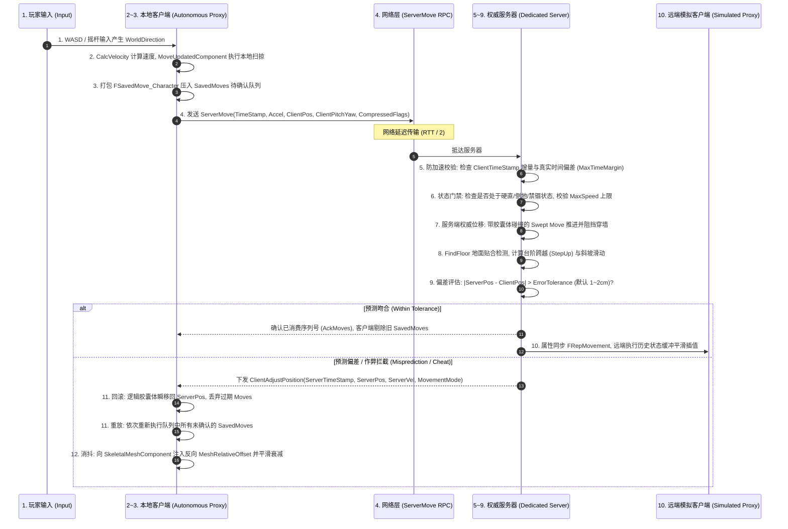
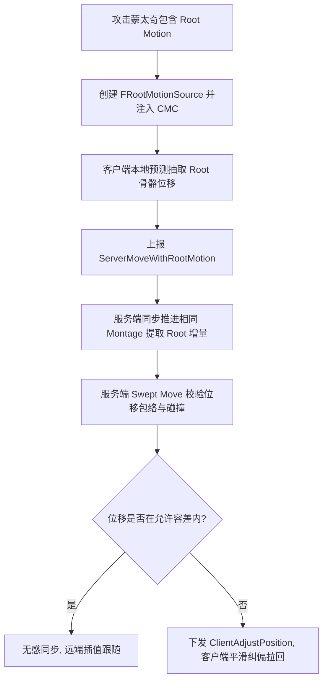

# 02-角色移动完整链路

> 知识成熟度：L3（工程体系化实战：涵盖输入采样、CMC 客户端预测、SavedMoves 队列、ServerMove 协议压缩、服务端权威防加速与防穿墙校验、ClientAdjustPosition 回滚重放、Mesh 相对偏移平滑插值、Root Motion 网络同步与弱网/反作弊测试矩阵）。
> 知识基线：客户端基于 UE5.8 `UCharacterMovementComponent` 源码实现，服务端为 Dedicated Server 权威移动校验架构；横向联动 [游戏知识/03-游戏玩法编程/06-角色移动系统UCharacterMovement.md](../游戏知识/03-游戏玩法编程/06-角色移动系统UCharacterMovement.md)、[游戏知识/06-网络同步/03-客户端预测与延迟补偿.md](../游戏知识/06-网络同步/03-客户端预测与延迟补偿.md)、[游戏知识/04-动画系统/08-动作战斗系统与打击手感.md](../游戏知识/04-动画系统/08-动作战斗系统与打击手感.md) 以及 [游戏服务端/06-世界模拟与运行时/01-ServerMainLoop与TickScheduler.md](../游戏服务端/06-世界模拟与运行时/01-ServerMainLoop与TickScheduler.md)。
> 适用范围：多人联机动作、MMORPG、战术竞技射击类游戏角色移动管线的端到端工程落地、网络同步手感调优、反外挂位移防作弊审查及线上性能瓶颈排查。
> 事实边界：移动预测与纠偏细节以 UE5.8 源码（`Engine/Source/Runtime/Engine/Private/Components/CharacterMovementComponent.cpp`）为准；网络带宽与容差数据为商业项目生产基线；具体数值需按对局帧率与物理步长调整。
> 参考来源：[Unreal Engine: Character Movement Component](https://dev.epicgames.com/documentation/en-us/unreal-engine/character-movement-component-in-unreal-engine)；Glenn Fiedler: *Networked Physics & Client-Side Prediction*。

---

## 一、概述

角色移动是动作与竞技游戏中最基础、更新频率最高（每秒 30~60 次）的底层核心链路。在跨越物理互联网的数十至上百毫秒延迟（RTT）下，既要保障本地玩家按键即动的**零延迟丝滑操控感（Client-side Prediction）**，又要杜绝客户端玩家通过变速齿轮（加速挂）、穿墙（No-Clip）或坐标篡改（瞬移挂）破坏游戏平衡，系统必须实行严格的**服务端权威裁决（Server Authority）**。

本文依据系统实战统一模板，将角色移动在双端之间完整的 15 步技术链路完全串联并代码化推导：

```text
1. 客户端输入采样 → 2. 本地预测移动 → 3. SavedMove 入队 → 4. ServerMove 网络压缩
→ 5. 服务端时间戳防加速校验 → 6. 移动模式与状态门禁 → 7. 服务端带碰撞权威推进
→ 8. 地面贴合与物理交互 → 9. 权威裁决与偏差评估 → 10. 远端模拟代理广播与平滑
→ 11. 客户端回滚与未确认重放 → 12. 网格相对偏移消抖 → 13. 弱网高丢包对抗
→ 14. 恶意作弊注入测试 → 15. 性能预算与线上基准
```

---

## 二、链路核心依赖与架构分工

| 环节 | 责任端 | 核心组件 / 类 | 关键职责 | 失败与边界行为 |
| :--- | :---: | :--- | :--- | :--- |
| **输入与预测** | 客户端 | `UEnhancedInputComponent`<br>`UCharacterMovementComponent` | 采集摇杆向量、计算加速度、立即执行本地碰撞位移 | 帧率骤降时限制单帧最大步长，防穿模 |
| **未确认队列** | 客户端 | `TArray<FSavedMovePtr> SavedMoves` | 缓存已预测但尚未收到服务端确认的移动序列 | 队列达到上限（如 96 个）时强制丢弃最旧帧 |
| **网络上报** | 客户端 | `UNetConnection` / RPC | 序列化 `ServerMove` / `ServerMoveDual`，量化时间与朝向 | 拥塞时与上一帧合并打包（Dual ServerMove） |
| **权威防作弊** | 服务端 | `FCharacterServerMoveData`<br>`UCharacterMovementComponent` | 校验时间膨胀、最大速度包络线、障碍穿透阻断 | 偏差超出容差立即生成 `ClientAdjustPosition` |
| **空间推进** | 服务端 | `UPrimitiveComponent::MoveComponentImpl` | 执行胶囊体带扫掠碰撞移动（Swept Move）、贴地检测 | 遇阻时沿滑动平面投影切向速度（SlideAlongSurface） |
| **广播与平滑** | 远端 | `FRepMovement` / `FNetworkPredictionData_Client` | 向周围 AOI 实体复制位置，指数平滑插值 | 丢包严重时执行死推算外推（Dead Reckoning） |
| **回滚与消抖** | 客户端 | `SmoothClientPosition` / `MeshOffset` | 回滚到服务端真值，重放剩余 Moves，平滑消抖 | 骨骼 Mesh 产生反向偏移，4~6 帧内平滑衰减至 0 |

---

## 三、完整数据流架构图（15 步工业级闭环）



---

## 四、十五步端到端详细推导与源码解析

### 步骤 1：客户端输入采样与加速度合成（Input Sampling）
玩家在硬件设备（键盘、手柄）上的操作通过 Enhanced Input 映射为世界空间方向向量：
$$\vec{A}_{world} = \text{Clamp}(\vec{D}_{input}, 1.0) \times \text{MaxAcceleration}$$
输入向量通过 `Character::AddMovementInput` 注入移动组件，并赋值给 `CharacterMovementComponent->Acceleration`。

### 步骤 2：本地客户端预测移动（Client Prediction & Swept Move）
主控客户端（Autonomous Proxy）不等待服务器回包，立即在当帧执行物理运动推导：
1. **速度计算（`CalcVelocity`）**：
   $$\vec{V}_{next} = (\vec{V}_{curr} \times (1 - \text{Friction} \cdot \Delta t)) + \vec{A} \cdot \Delta t$$
2. **带碰撞扫掠位移（`MoveUpdatedComponent`）**：
   调用 PhysX/Chaos 碰撞管线执行 `SweepMultiByChannel`。胶囊体沿速度方向前推，若发生撞墙，调用 `SlideAlongSurface` 计算沿法线切向滑动；
3. **地面吸附（`FindFloor`）**：向下执行射线/球体检测，计算当前脚底与地面的距离 `Floor.FloorDist`，确保角色平稳贴地而不发生悬空抖动。

### 步骤 3：打包未确认移动（FSavedMove_Character 缓存）
为支持后续可能发生的服务端校正与回滚，客户端将当帧所有的移动参数打包为 `FSavedMove_Character` 并存入 `SavedMoves` 链表：

```cpp
// 移动参数快照
struct FSavedMove_Character
{
    float TimeStamp;               // 客户端生成该 Move 时的单调时间戳
    float DeltaTime;               // 该步耗时
    FVector StartLocation;         // 起始位置
    FVector SavedLocation;         // 预测后的最终位置
    FVector SavedVelocity;         // 预测后的最终速度
    FVector Acceleration;          // 输入加速度
    FRotator SavedControlRotation; // 摄像机与控制器朝向
    uint8 CompressedFlags;         // 跳跃、蹲伏、翻滚等按键压缩标志位
    
    // 是否可以与新的输入合并，用于丢包网络下的带宽保护
    bool CanCombineWith(const FSavedMovePtr& NewMove, ACharacter* InCharacter, float MaxDelta) const;
    void SetMoveFor(ACharacter* Character, float InDeltaTime, FVector const& NewAccel, class FNetworkPredictionData_Client_Character & ClientData);
    void PrepMoveFor(ACharacter* Character);
};
```

### 步骤 4：网络上报与 ServerMove 压缩优化（Bandwidth Compression）
若每帧发送一个完整的全精度 RPC，带宽将难以承受。UE 实行高度压缩与聚合策略：
- **位置量化（Location Quantization）**：浮点坐标按 1/100 精度压缩；
- **朝向压缩（Rotation Packing）**：Yaw 角度量化为 16 位整型（精度约 0.0055 度）；
- **双移动聚合（`ServerMoveDual`）**：高帧率（如 120FPS）下，客户端将两个连续的 Move 合并进同一个 RPC 数据包发送，节省 UDP 包头开销。

```cpp
// UE5.8 客户端网络打包移动发送入口
void UCharacterMovementComponent::ReplicateMoveToServer(float DeltaTime, const FVector& NewAcceleration)
{
    // 1. 生成并记录当前帧的 SavedMove
    FSavedMovePtr NewMove = AllocateNewMove();
    NewMove->SetMoveFor(CharacterOwner, DeltaTime, NewAcceleration, *ClientData);
    ClientData->SavedMoves.Add(NewMove);

    // 2. 判断是否满足双移动聚合条件
    if (CanCombineWith(NewMove))
    {
        // 压入缓冲，等待与下一个 Move 合并为 ServerMoveDual
        return;
    }

    // 3. 触发非可靠 RPC 上报至服务端 (Unreliable RPC 以换取极低延迟)
    CallServerMove(NewMove.Get(), OldMove.Get());
}
```

### 步骤 5：服务端时间戳与防加速作弊校验（Speedhack Defense）
这是防范“变速齿轮/加速挂”的最核心防线。服务端绝不盲目信任客户端上报的 `DeltaTime`：

```cpp
// 服务端防加速时钟校验逻辑
bool UCharacterMovementComponent::ServerCheckClientTimeStamp(float ClientTimeStamp, float DeltaTime)
{
    const float ServerTime = GetWorld()->GetTimeSeconds();
    
    // 1. 检查时钟倒流 (Clock Reversal)
    if (ClientTimeStamp <= ServerData.CurrentClientTimeStamp)
    {
        return false; // 拒绝处理旧包或乱序包
    }

    // 2. 检查单步时间过大 (Lag Spike / Freeze)
    if (DeltaTime > MaxTimeStep)
    {
        DeltaTime = MaxTimeStep; // 强制截断单步最大耗时
    }

    // 3. 计算客户端时钟累计超前服务端的偏差 (Time Margin)
    ServerData.ServerTimeStamp += DeltaTime;
    const float TimeMargin = ClientTimeStamp - ServerData.ServerTimeStamp;

    // 允许 1~2 个 Tick 的网络抖动缓冲，但超限必须斩断
    if (TimeMargin > MaxClientForcedUpdateDuration) // 默认 0.25 秒
    {
        // 判定加速挂作弊：重置客户端时序，触发位置拉回
        ServerData.ServerTimeStamp = ServerTime;
        return false;
    }

    ServerData.CurrentClientTimeStamp = ClientTimeStamp;
    return true;
}
```

### 步骤 6：移动模式与状态门禁校验（Movement Mode Gatekeeper）
服务端审查角色当前 Gameplay 状态：
- 角色若处于受击硬直（Hit Stun）、冰冻、定身或倒地状态，直接将加速度 $\vec{A}$ 置为 $\vec{0}$；
- 校验最大速度：当前速度长度 $|\vec{V}|$ 不得超过该角色模式下的最大允许速度：
  $$|\vec{V}| \le \text{MaxWalkSpeed} \times (1 + \text{SpeedTolerance})$$
  一旦发现利用外挂修改客户端本地速度，立即截断。

### 步骤 7：服务端权威位移推进（Server Swept Move）
服务端基于接收到的合法加速度与单步时长，调用自身物理世界中的 `MoveUpdatedComponent`。由于服务端拥有绝对真实的阻挡体与静态场景：
- 若客户端试图穿透一堵墙（No-Clip 作弊），客户端本地可能漏判，但服务端的胶囊体扫掠检测必将发生碰撞并停留在墙外，造成双端坐标出现巨大分歧。

```cpp
// 服务端带胶囊体碰撞推进核心
void UCharacterMovementComponent::PhysWalking(float deltaTime, int32 Iterations)
{
    if (deltaTime < MIN_TICK_TIME) return;

    // 计算地面法线与摩擦阻力后的实际速度
    CalcVelocity(deltaTime, GroundFriction, false, BrakingDecelerationWalking);

    FVector MoveDelta = Velocity * deltaTime;
    FHitResult Hit(1.f);

    // 带扫掠碰撞推进胶囊体 (Swept Move)
    SafeMoveUpdatedComponent(MoveDelta, UpdatedComponent->GetComponentQuat(), true, Hit);

    // 若遭遇阻挡，沿阻挡表面切向滑动
    if (Hit.Time < 1.f)
    {
        HandleImpact(Hit, deltaTime, MoveDelta);
        SlideAlongSurface(MoveDelta, 1.f - Hit.Time, Hit.Normal, Hit, true);
    }
}
```

### 步骤 8：地面贴合与物理交互（Floor Tracing & Stair Stepping）
服务端在水平位移后，执行垂直下落贴地（`PhysWalking`）：
- **台阶自适应（`StepUp`）**：若前方遭遇低于 `MaxStepHeight`（如 45cm）的矮墙或台阶，先将胶囊体上提、前推、再下落贴合，确保角色平滑跨越障碍；
- **倾角滑动（Slide on Slopes）**：若地面倾角超过 `WalkableFloorAngle`（如 45 度），角色自动沿斜坡法线投影下滑，禁止原地起跳。

### 步骤 9：权威裁决与偏差评估（Ack vs Correction）
服务端移动执行完毕后，比对服务端计算的最终位置 $\vec{P}_{server}$ 与客户端预测位置 $\vec{P}_{client}$：
$$\Delta D = |\vec{P}_{server} - \vec{P}_{client}|$$

```text
       ┌── ΔD <= ErrorTolerance (通常 1~2cm): 预测精准
       │   └──> 服务端 Ack 该 Move，客户端清空该项前的 SavedMoves 缓存。
 偏差 ─┤
       └── ΔD > ErrorTolerance: 预测失败 / 网络丢包 / 外挂拦截
           └──> 服务端生成 ClientAdjustPosition，打包下发纠偏指令。
```

### 步骤 10：远端模拟代理广播与平滑（Simulated Proxy Smoothing）
服务端将权威位置以属性同步机制复制给周围其他玩家（Simulated Proxies）。远端客户端收到位置包后：
- 不做本地物理碰撞，而是将其放入**历史时间戳缓冲队列**；
- 采用**指数平滑插值（Exponential Smoothing）**以 100ms 滞后向目标位置过渡，杜绝远端玩家移动时的“抽搐瞬移”。

### 步骤 11：本地主控客户端回滚与未确认重放（Reconciliation & Replay）
主控客户端一旦收到 `ClientAdjustPosition`，触发经典客户端对齐回滚：

```cpp
// 客户端收到校正包的回滚重放核心
void UCharacterMovementComponent::ClientAdjustPosition_Implementation(
    float TimeStamp, FVector NewLoc, FVector NewVel, UPrimitiveComponent* NewBase, FName NewBaseBoneName, bool bHasBase, bool bBaseRelativePosition, uint8 ServerMovementMode)
{
    // 1. 瞬移回滚：将胶囊体瞬时拉回到服务端权威坐标
    UpdatedComponent->SetWorldLocation(NewLoc, false, nullptr, ETeleportType::TeleportPhysics);
    Velocity = NewVel;
    SetMovementMode((EMovementMode)ServerMovementMode);

    // 2. 剔除过期已确认 Move
    int32 AckIndex = INDEX_NONE;
    for (int32 i = 0; i < ClientData->SavedMoves.Num(); ++i)
    {
        if (ClientData->SavedMoves[i]->TimeStamp <= TimeStamp)
        {
            AckIndex = i;
        }
        else break;
    }
    if (AckIndex != INDEX_NONE)
    {
        ClientData->SavedMoves.RemoveAt(0, AckIndex + 1);
    }

    // 3. 关键重放：遍历重新执行队列中所有尚未被确认的 SavedMoves
    for (int32 i = 0; i < ClientData->SavedMoves.Num(); ++i)
    {
        FSavedMovePtr& Move = ClientData->SavedMoves[i];
        Move->PrepMoveFor(CharacterOwner);
        // 执行物理推进
        MoveUpdatedComponent(Move->Acceleration * Move->DeltaTime, Move->SavedControlRotation.Quaternion(), true);
    }
}
```

### 步骤 12：网格相对偏移平滑消抖（Mesh Relative Offset Smoothing）
在步骤 11 中，如果胶囊体在重放时发生了 30cm 的瞬变位移，玩家屏幕上的角色模型会瞬间“跳跃”，造成刺眼的顿挫。
UE 采用极为优雅的**逻辑胶囊体与渲染模型相对偏移分离技术**：
1. 胶囊体瞬间位移回滚；
2. 同时给骨骼网格组件 `SkeletalMeshComponent` 赋予一个完全相反的相对空间偏移：
   $$\vec{O}_{mesh} = \vec{P}_{old} - \vec{P}_{new}$$
   此时逻辑位置变了，但画面上模型相对摄像机绝对不动！
3. 在随后的 $4 \sim 8$ 帧渲染循环中，通过 `SmoothClientPosition` 将 $\vec{O}_{mesh}$ 按照阻尼指数平滑衰减至 $\vec{0}$，玩家眼中的画面如丝般顺滑，毫无拉扯感。

```cpp
void UCharacterMovementComponent::SmoothClientPosition(float DeltaSeconds)
{
    if (!ClientData || ClientData->MeshTranslationOffset.IsZero()) return;

    // 沿衰减指数平滑插值回到零偏移 (Mesh Smoothing)
    ClientData->MeshTranslationOffset = FMath::VInterpTo(
        ClientData->MeshTranslationOffset, 
        FVector::ZeroVector, 
        DeltaSeconds, 
        SmoothClientPositionLocationInterpSpeed // 默认 12.0
    );

    // 应用到 SkeletalMesh 相对变换
    CharacterOwner->GetMesh()->SetRelativeLocation(CharacterOwner->GetBaseTranslationOffset() + ClientData->MeshTranslationOffset);
}
```

### 步骤 13：弱网、丢包与极端抖动对抗（Network Jitter Test）
- **严重丢包（Packet Loss > 10%）**：客户端未确认队列将快速积压，通过 `CombineWith` 将连续相同的微小输入合并，防止队列溢出（Overrun）；
- **延迟突增（Lag Spike > 500ms）**：服务端在判定 `DeltaTime` 超过时钟边界时，启用安全插值推进，防止单帧巨大位移引发物理穿透。

### 步骤 14：作弊注入攻防验证矩阵（Cheat Injection Matrix）

| 注入作弊手段 | 攻击原理 | 服务端防御层拦截机理 | 最终裁决表现 |
| :--- | :--- | :--- | :--- |
| **变速齿轮 (Speedhack)** | Hook 系统 API，以 2x 速度上报 ClientTimeStamp | `ServerCheckClientTimeStamp` 发现时间戳累计超前真实时钟超过 `MaxTimeMargin` | 丢弃超前帧，下发拉回包，作弊失效 |
| **坐标瞬移 (Teleport)** | 内存直接修改本地胶囊体坐标并上报 | 服务端位置完全由自身的 `CalcVelocity` 物理步进产生，根本不采用客户端坐标 | 客户端被强制瞬间纠偏拉回原处 |
| **穿墙外挂 (No-Clip)** | 禁用本地场景碰撞，强行穿越阻挡 | 服务端独立物理世界对胶囊体执行 Swept Move，碰撞阻挡直接生效 | 客户端在撞墙瞬间被服务器拉回墙外 |
| **浮空/无限跳 (Flyhack)** | 修改本地重力为 0 或每帧强行注入跳跃速度 | 服务端移动状态机（MovementMode）权威管理，在空中且无跳跃充能时强制进入 `Falling` 模式施加重力 | 客户端被强行拉回下落轨迹 |

### 步骤 15：性能预算与线上性能指标（Performance Budget & SLO）

| 性能与网络维度 | 工业级达标基准 | 压测红线（SLO） | 治理与降级策略 |
| :--- | :---: | :---: | :--- |
| **客户端移动 CPU 耗时** | $\le 0.12\text{ms} / \text{frame}$ | $> 0.30\text{ms}$ | 简化碰撞体，关闭非关键射线检测 |
| **服务端单角色移动 Tick** | $\le 0.04\text{ms} / \text{tick}$ | $> 0.08\text{ms}$ | 非活跃 NPC 降频更新（AI Movement LOD） |
| **单角色移动带宽开销** | $\le 1.2\text{KB/s}$ | $> 2.5\text{KB/s}$ | 开启 `ServerMoveDual`，量化 Pitch/Yaw 角度 |
| **弱网回滚拉扯率** | $< 0.1\%$（普通网络环境） | $> 2.0\%$ | 调大位置容差 `ErrorTolerance`，开启平滑消抖 |

---

## 五、Root Motion 动作位移在网络移动中的特殊处理

当角色释放带有位移的技能（如滑铲、翻滚、突进斩）时，普通基于速度的移动被挂起，转由 **Root Motion Source（`FRootMotionSource`）** 接管：



**关键设计规则**：
1. **时钟必须对齐**：Root Motion 蒙太奇的时间轴必须与服务端网络时钟保持一致，客户端严禁私自变速播放；
2. **阻挡阻断必须双向感知**：当突进撞墙时，客户端移动组件触发碰撞阻断，必须同步发送中止通知，防止本地动画继续滑步。

---

## 六、自动化测试与 CI 回归矩阵

```text
[Gauntlet 自动化移动测试套件]
 ├── Test_Speedhack_Interception: 注入 2x/5x 加速时钟，断言服务端丢包拉回率 100%
 ├── Test_Teleport_Interception: 瞬时篡改 X+2000cm 坐标，断言下发 ClientAdjustPosition
 ├── Test_NoClip_WallCollision: 模拟穿墙移动向量，断言服务端最终停留位置位于墙体外侧
 └── Test_Network_Jitter_200ms_10pct_Loss: 在 200ms RTT + 10% 丢包环境下进行 60s 跑跳，断言抖动拉扯感完全被 MeshOffset 平滑吸收
```

---

## 七、关联阅读与演进索引

- **客户端移动底层原理**：[03-06 角色移动系统UCharacterMovement](../游戏知识/03-游戏玩法编程/06-角色移动系统UCharacterMovement.md)
- **网络预测与延迟补偿**：[06-03 客户端预测与延迟补偿](../游戏知识/06-网络同步/03-客户端预测与延迟补偿.md)
- **动作战斗与 Root Motion**：[04-08 动作战斗系统与打击手感](../游戏知识/04-动画系统/08-动作战斗系统与打击手感.md)
- **服务端 MainLoop 与时间步**：[游戏服务端/06-01 ServerMainLoop与TickScheduler](../游戏服务端/06-世界模拟与运行时/01-ServerMainLoop与TickScheduler.md)
- **技能释放端到端链路**：[03-技能释放完整链路.md](03-技能释放完整链路.md)
- **假人 AI 寻路与移动链路**：[07-假人AI完整链路.md](07-假人AI完整链路.md)
