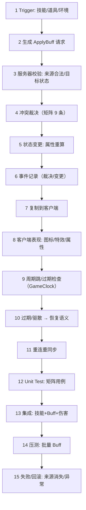

# 04-Buff系统完整链路

> 知识基线：Buff 从应用、叠加、冲突到驱散、过期的完整生命周期；冲突矩阵是正确性核心；服务端材料：[08-技能与战斗框架 §3.5 Buff 系统](../游戏服务端/03-业务系统设计/08-技能与战斗框架.md)；客户端材料：GAS（[游戏知识/03-游戏玩法编程/01-GameplayAbilitySystem能力系统](../游戏知识/03-游戏玩法编程/01-GameplayAbilitySystem能力系统.md)）。
> 版本基准：UE5.8（客户端 GAS）；服务端通用设计。
> 适用范围：Buff/状态效果的端到端设计、冲突语义评审与测试。
> 官方参考：[UE5.8 GAS 文档（GameplayEffects）](https://dev.epicgames.com/documentation/en-us/unreal-engine/gameplay-effects-in-unreal-engine)。
> 最后更新：2026-08-13（首版）。
> 知识成熟度：L3（冲突矩阵 + 验证规范已定义；**矩阵用例执行与原始数据待回填**——证据边界见 6.2，回填后再升 L4）。

## 1. 概述

Buff 是"看起来简单、错起来隐蔽"的系统：伤害加成、减速、眩晕、持续治疗、护盾叠加……每个 Buff 都要回答**叠加还是刷新、冲突怎么裁决、过期怎么恢复**。语义错误不报错，只在数值上"差一点"——所以必须用**冲突矩阵**把它变成可测试的规格。

本文把 Buff 从应用到失效的完整链路串起来，并给出 9 条核心冲突语义：

```text
same buff refresh（同 Buff 刷新） | stack（叠加） | replace（替换）
| exclusive group（互斥组） | high-level covers low-level（高级覆盖低级）
| high-level expires → low-level resumes（高级过期后低级恢复）
| remove/dispel（移除/驱散） | source changes（来源变化）
| periodic re-apply（周期性重挂）
```

链路回答五个问题：

1. 谁拥有权威状态？——服务器（Buff 实例、时长、层数、来源）；
2. 数据从哪里来？——技能/道具/环境 → ApplyBuff → 状态变更 → 复制 → 表现；
3. 失败时怎么办？——冲突裁决、来源消失、驱散、过期恢复；
4. 如何证明正确？——冲突矩阵用例 + 时长确定性测试；
5. 如何证明够用？——Buff 结算 P99、批量 Buff 压测。

## 2. 链路类型与依赖模块

链路类型：**Gameplay Transaction（Template A）**——状态效果的事务型生命周期（应用/变更/移除）。

| 环节 | 依赖模块 | 仓库支撑 |
| --- | --- | --- |
| Buff 定义 | 数据驱动配置 | [08-技能与战斗框架 §3.5](../游戏服务端/03-业务系统设计/08-技能与战斗框架.md) |
| 应用入口 | 技能/道具/环境 | [03-技能释放完整链路](03-技能释放完整链路.md) |
| 冲突裁决 | Buff 管理器 | 本文第 3 节（矩阵） |
| 属性影响 | 属性系统 | [08-技能与战斗框架 §3.6.1](../游戏服务端/03-业务系统设计/08-技能与战斗框架.md) |
| 时长/周期 | GameClock | [12-世界时间确定性与GameClock](../游戏服务端/06-世界模拟与运行时/12-世界时间确定性与GameClock.md) |
| 同步/表现 | Replication/GAS | [02-RPC与属性同步](../游戏知识/06-网络同步/02-RPC与属性同步.md)、[01-GameplayAbilitySystem能力系统](../游戏知识/03-游戏玩法编程/01-GameplayAbilitySystem能力系统.md) |
| 测试 | 冲突矩阵用例 | [游戏测试与质量](../游戏测试与质量/README.md)（03 确定性测试） |
## 3. 冲突矩阵（正确性核心）

### 3.1 九条冲突语义

| # | 场景 | 语义 | 示例 |
| --- | --- | --- | --- |
| 1 | 同 Buff 刷新 | 同来源同 Buff 重挂 → 刷新剩余时长（层数不变） | 持续治疗重挂 |
| 2 | 叠加 | 同 Buff 可叠层 → 层数 +1（上限封顶） | 增伤叠层 |
| 3 | 替换 | 同槽新 Buff 替换旧 Buff | 减速 50% 替换减速 30% |
| 4 | 互斥组 | 同一互斥组内互斥 → 新挂驱散旧挂 | 加速 vs 减速 |
| 5 | 高级覆盖低级 | 高级 Buff 生效期间低级不生效（但保留） | 霸体覆盖眩晕 |
| 6 | 高级过期 → 低级恢复 | 高级结束时低级剩余时长 >0 → 恢复生效 | 霸体结束，眩晕继续 |
| 7 | 移除/驱散 | 显式移除 → 按优先级/顺序裁决（驱散数限制） | 净化驱散 1 个负面 |
| 8 | 来源变化 | 施法者死亡/下线 → 持续性 Buff 语义（保留/终止/转换） | 牧师死亡，治疗链中断 |
| 9 | 周期性重挂 | 周期 Buff 每跳重新结算 → 与冲突矩阵一致 | 中毒每 2 秒一跳 |

### 3.2 裁决执行顺序（确定性）

```text
新 Buff 到达
→ 1. 查同源同 ID（刷新 or 叠层？）
→ 2. 查互斥组（新挂驱散旧挂？）
→ 3. 查优先级（高级覆盖低级？低级保留待恢复？）
→ 4. 执行状态变更（属性重算）
→ 5. 记录裁决事件（供回放/测试断言）
```

**裁决顺序必须确定**（同输入同结果），否则回放与对账失败；裁决事件进日志供测试断言。

### 3.3 时长与过期恢复

- **时长用 GameClock**（tickIndex 差），暂停/减速时 Buff 语义一致（关联 [12](../游戏服务端/06-世界模拟与运行时/12-世界时间确定性与GameClock.md)）；
- **过期恢复**：被高级覆盖的低级 Buff 在"剩余时长"内保持待恢复状态，高级结束时若剩余 >0 则恢复生效；
- **跨服迁移**：Buff 剩余时长按"世界时间差"换算迁移（见 [12](../游戏服务端/06-世界模拟与运行时/12-世界时间确定性与GameClock.md) 的 4.2）。

### 3.4 Buff 实例模型

```cpp
struct BuffInstance {
    BuffId       id;          // 定义 ID
    EntityId     source;      // 施法者（矩阵 #8 用）
    EntityId     target;      // 目标
    int32        stacks;      // 层数
    WorldTime    endTime;     // 结束时间（GameClock）
    WorldTime    nextTick;    // 周期跳时间
    int32        dispelPriority;   // 驱散优先级
    BuffState    state;       // Active / Suppressed（被高级覆盖）/ PendingRemove
};
```

设计要点：

- **state 区分 Active/Suppressed**：被高级覆盖的低级 Buff 不销毁，状态置 Suppressed（矩阵 #5/#6 的物理基础）；
- **endTime 用世界时间**：暂停/减速/迁移语义统一；
- **source 必须记录**：来源死亡/下线裁决（矩阵 #8）依赖它；
- 实例由 BuffManager 持有（按目标索引），批量操作有预算上限。

### 3.5 周期 Buff 的结算细节

```text
每 Tick：遍历活跃周期 Buff（按 nextTick 排序）
  → 到期：结算一跳（伤害/治疗/属性）→ 更新 nextTick
  → 期间状态变化（被抑制/驱散）：暂停跳数或终止
```

- **遍历预算**：周期 Buff 数量上限（如每 Tick 1000 跳），超限分帧（关联 [11-AI与寻路时间预算](../游戏服务端/06-世界模拟与运行时/11-AI与寻路时间预算.md)）；
- **结算确定性**：跳数与时刻由 GameClock 决定，回放一致；
- **每跳事件**：伤害/治疗走事件日志（可审计、可测试）。

## 4. 完整数据流（15 步）



各步要点：

- **3 校验**：来源（施法者仍存活？）、目标（是否可被施加）、次数限制；
- **5 状态变更**：属性增量（伤害/移速）统一走属性系统，重算顺序固定；
- **6 事件记录**：Buff 实例 ID + 裁决结果，回放与测试断言的数据源；
- **10 恢复语义**：覆盖解除后低级恢复（矩阵 #6）、来源死亡后终止（#8）；
- **11 重连**：服务器下发 Buff 列表（ID/类型/剩余时长/层数），客户端重建表现。

### 4.1 重连与跨服恢复细节

```text
重连：服务器下发 Buff 快照（实例列表）→ 客户端重建图标/特效
跨服：剩余时长按世界时间差换算（迁移 Ticket 携带）
恢复（崩溃）：Buff 属于"可重建状态"还是"必须恢复"？
  - 玩家长时 Buff（增益/惩罚）→ 随玩家快照恢复
  - 战斗临时 Buff → 不恢复（世界重建后重新施加）
```

判定原则：**影响资产/数值平衡的 Buff 恢复，纯战斗表现的 Buff 丢弃**——与 [13-世界Snapshot与故障恢复](../游戏服务端/06-世界模拟与运行时/13-世界Snapshot与故障恢复.md) 的"必须恢复 vs 可重建"分类一致。

### 4.2 结算事件示例

```text
事件：buff.apply    (buffId, target, source, stacks=1, remainMs, tickIndex)
事件：buff.stack    (buffId, target, stacks=2, remainMs, tickIndex)
事件：buff.suppress (buffId, target, by=highBuffId, remainMs, tickIndex)
事件：buff.resume   (buffId, target, remainMs, tickIndex)
事件：buff.expire   (buffId, target, totalStacks, tickIndex)
事件：buff.dispel   (buffId, target, source, dispelPriority, tickIndex)
```

每个事件可独立断言（矩阵用例的输入/输出），也是审计与回放的依据。

## 5. 验证矩阵

| 验证项 | 方法 | 断言 |
| --- | --- | --- |
| 冲突矩阵 9 条 | 每条一个用例组（确定性单测） | 语义符合 3.1 表 |
| 时长正确性 | 暂停/减速注入 | Buff 时长按世界时间计算 |
| 过期恢复 | 高级覆盖 → 过期 → 低级恢复 | 剩余时长正确续期 |
| 驱散顺序 | 多 Buff 场景 | 按优先级/顺序裁决 |
| 来源死亡 | 施法者死亡注入 | 持续性 Buff 按语义终止/保留 |
| 周期重挂 | 每跳断言 | 每跳与冲突矩阵一致 |
| 网络同步 | 丢包/重连 | 重连后 Buff 列表一致 |
| 性能 | 批量 Buff 压测 | 1000 个活跃 Buff 的结算 P99 < 预算 |
| 数据一致性 | 实例字段断言 | stacks/endTime/source 与定义一致 |
| 抑制恢复 | 高级覆盖→过期 | Suppressed 状态正确恢复 |
| 迁移 | 跨服迁移注入 | 剩余时长换算正确（±1 Tick） |
| 重连 | 断线重连 | 服务器下发 Buff 列表一致 |
| 崩溃恢复 | 快照恢复注入 | 长时 Buff 恢复、临时 Buff 丢弃 |

### 5.1 矩阵用例生成规范

每条冲突语义（3.1 的 #1~#9）生成一组用例：

```text
用例 = (前置状态, 新事件, 期望结果)
例：#5 高级覆盖低级
  前置：低级减速 30% 剩余 10s（Active）
  事件：高级减速 50% 施加
  期望：高级 Active，低级 Suppressed（剩余 10s 冻结）
```

矩阵用例挂在 CI；语义变更 = 先改矩阵表 + 用例，再改实现——测试即规格。

用例数量参考：9 条语义 × 每条 3~5 个变体（正常/边界/异常）≈ 30~45 个用例，运行时间应在秒级（确定性单测）。

## 6. Benchmark 与 Evidence

### 6.1 现有证据映射

- 属性重算的原子/并发语义：复用 [Evidence · atomic-memory-order](../evidence/labs/atomic-memory-order/README.md)；
- 批量 Buff 的 Tick 预算语义：复用 [Evidence · tick-scheduler](../evidence/server/tick-scheduler/README.md)；
- 持续时间（GameClock）语义：见 [12-世界时间确定性与GameClock](../游戏服务端/06-世界模拟与运行时/12-世界时间确定性与GameClock.md)。

### 6.2 证据边界（诚实声明）

冲突矩阵（3.1）与验证矩阵（第 5 节）已定义，但**矩阵用例的测试执行与原始数据待回填**（目标：`evidence/tests/buff/`）。升级路径：按 3.1 九条语义生成用例 → 接入确定性测试框架执行 → 结果与压测数据入库。

## 7. 最佳实践

1. **冲突语义进矩阵，不进代码注释**：每条语义有编号、有用例。
2. **裁决确定性**：顺序固定 + 事件日志，回放与对账可依赖。
3. **时长一律 GameClock**：暂停/减速/迁移语义一致。
4. **来源与所有权**：Buff 记录施法者 ID，来源死亡/下线按语义处理（矩阵 #8）。
5. **属性重算统一入口**：所有 Buff 的数值影响走属性系统，禁止直接改数值。
6. **批量操作有上限**：单 Tick 可施加/移除的 Buff 数有预算（关联 [11-AI与寻路时间预算](../游戏服务端/06-世界模拟与运行时/11-AI与寻路时间预算.md) 的预算方法论）。
7. **客户端只表现**：Buff 图标/时长/层数以服务器复制为准，客户端不自行裁决。
8. **测试即规格**：冲突矩阵用例挂在 CI，任何语义变更先改用例。
9. **实例模型显式**：Active/Suppressed/PendingRemove 三态进代码与用例。
10. **周期结算预算化**：每 Tick 跳数上限 + 分帧，防战斗密集区尖峰。
11. **迁移换算统一**：剩余时长按世界时间差换算，单一实现（复用 GameClock）。
12. **重连快照化**：Buff 列表作为玩家快照的一部分，重连/迁移统一出口。
13. **恢复分类明确**：长时 Buff 恢复、战斗 Buff 重建——分类写进定义配置。
14. **用例即规格**：矩阵用例挂 CI，语义变更先改用例（见 5.1）。
15. **事件全量记录**：apply/stack/suppress/resume/expire/dispel 六类事件进日志（见 4.3）。

## 8. 常见问题

**Q1：刷新和叠加怎么区分？**
配置字段：Buff 定义里 `stackPolicy`（None/Stack）+ `refreshPolicy`（Refresh/Extend/None）；同来源同 ID 时按策略执行，禁止代码里散落判断。

**Q2：高级覆盖低级时低级 Buff 还在计时吗？**
两种模型：暂停计时（冻结剩余时长）或继续计时（恢复时可能已过期）；必须选一并进矩阵——推荐"暂停计时"（玩家可理解）。

**Q3：驱散按什么顺序移除？**
先负面后正面？还是先新后旧？按配置的 dispelPriority 排序，同优先级按施加顺序；顺序进矩阵用例。

**Q4：施法者死亡后持续性 Buff（中毒）怎么办？**
按矩阵 #8 的语义：中毒等"来源无关"的保留；治疗链等"来源依赖"的终止；规则在 Buff 定义里声明。

**Q5：重连后 Buff 表现怎么重建？**
服务器下发 Buff 列表（类型/剩余时长/层数），客户端按表现模板重建图标与特效；不依赖断线期间的事件流。

**Q6：Buff 结算 P99 超标怎么查？**
插桩拆环节：冲突裁决、属性重算、事件记录各占多少（关联 [笔记/插桩测试](../笔记/插桩测试.md)）；批量场景重点查属性重算。

**Q7：GAS 的 GameplayEffect 和自研 Buff 怎么对应？**
GAS 的 GE（GameplayEffect）就是 Buff 的引擎实现（Duration/Stack/Modifier）；自研逻辑服按本文矩阵实现；两者语义可互相映射，客户端用 GAS、服务端用自研时以服务器矩阵为权威。

**Q8：层数上限的数值谁定？**
策划配置（Buff 定义里 `maxStacks`）；服务器只执行上限，不解释数值。叠层到上限时"刷新剩余时长"还是"拒绝新层"由 `stackPolicy` 配置决定。

**Q9：驱散是"随机驱散 1 个"还是"按优先级"？**
必须按优先级（dispelPriority）+ 同优先级按施加顺序；"随机"不可测试、不可回放，禁止。

**Q10：Buff 属性加成怎么叠加（加法/乘法）？**
属性系统定义加成类型（flat/percent/独立乘区），Buff 只提供数值与类型；叠加规则在属性系统统一实现，不在 Buff 里散落判断（关联 [08-技能与战斗框架 §3.6.1](../游戏服务端/03-业务系统设计/08-技能与战斗框架.md)）。

**Q11：大量同类型 Buff（如 50 个玩家互相上减速）性能会怎样？**
属性重算按"变更批次"合并（同一 Tick 多次变更合并重算一次）；周期跳分帧；同时用"实例上限 + 每 Tick 结算预算"兜底（关联 [11](../游戏服务端/06-世界模拟与运行时/11-AI与寻路时间预算.md) 的预算方法论）。

**Q12：Buff 事件日志要记录什么？**
（BuffId, 目标, 来源, 操作类型, 层数, 剩余时长, tickIndex）——重连、恢复、审计、回放都依赖它；操作类型含 apply/stack/refresh/suppress/resume/expire/dispel。

**Q13：Buff 和 Debuff 的驱散优先级谁高？**
按配置的 dispelPriority 字段排序（常见：负面高优先被驱散）；"先驱散哪个负面"也按此排序 + 施加顺序——排序规则进矩阵用例，不靠直觉。

**Q14：Buff 实例数量有上限吗？**
有：单实体 Buff 上限（如 32 个）与全局周期跳预算；超限按"最早施加的非关键 Buff"挤出（配置策略），防单实体状态爆炸。

## 9. 术语速查

| 术语 | 含义 |
| --- | --- |
| BuffInstance | 运行期 Buff 实例（state / endTime / source / nextTick） |
| Suppressed | 被高级覆盖但未销毁的抑制状态 |
| 冲突矩阵 | 九条刷新/叠加/替换/驱散语义的确定性裁决表 |
| nextTick | 周期 Buff 下一跳时刻（由 GameClock 决定） |
| 结算事件 | 每跳伤害/治疗的审计事件（可重放） |

## 10. 关联阅读

- [03-技能释放完整链路](03-技能释放完整链路.md)：Buff 的应用入口。
- [游戏服务端/03-业务系统设计/08-技能与战斗框架](../游戏服务端/03-业务系统设计/08-技能与战斗框架.md)（§3.5）：服务端 Buff 实现。
- [游戏知识/03-游戏玩法编程/01-GameplayAbilitySystem能力系统](../游戏知识/03-游戏玩法编程/01-GameplayAbilitySystem能力系统.md)：GAS 客户端侧。
- [12-世界时间确定性与GameClock](../游戏服务端/06-世界模拟与运行时/12-世界时间确定性与GameClock.md)：时长语义。
- [游戏测试与质量/03-服务端测试与机器人压测](../游戏测试与质量/03-服务端测试与机器人压测.md)：确定性测试方法。
- [07-假人AI完整链路](07-假人AI完整链路.md)：同为系统实战链路模板。
- [游戏服务端/06-世界模拟与运行时/13-世界Snapshot与故障恢复](../游戏服务端/06-世界模拟与运行时/13-世界Snapshot与故障恢复.md)：Buff 状态的恢复分类。
- [游戏测试与质量/01-测试金字塔与测试策略](../游戏测试与质量/01-测试金字塔与测试策略.md)：矩阵用例的分层归属。
- [游戏服务端/03-业务系统设计/06-战斗结算与验证](../游戏服务端/03-业务系统设计/06-战斗结算与验证.md)：属性结算的最终出口。
- [游戏知识/06-网络同步/02-RPC与属性同步](../游戏知识/06-网络同步/02-RPC与属性同步.md)：Buff 复制通道。
- [游戏服务端/06-世界模拟与运行时/14-运行时背压与过载保护](../游戏服务端/06-世界模拟与运行时/14-运行时背压与过载保护.md)：批量 Buff 的过载兜底。
- [游戏知识/03-游戏玩法编程/03-GameplayTag与数据资产](../游戏知识/03-游戏玩法编程/03-GameplayTag与数据资产.md)：Buff 标签体系。
- [游戏服务端/06-世界模拟与运行时/03-Entity生命周期与组件模型](../游戏服务端/06-世界模拟与运行时/03-Entity生命周期与组件模型.md)：Buff 实例的实体归属。
- [游戏知识/06-网络同步/05-ReplicationGraph兴趣管理](../游戏知识/06-网络同步/05-ReplicationGraph兴趣管理.md)：Buff 复制的兴趣裁剪。
- [游戏知识/06-网络同步/03-客户端预测与延迟补偿](../游戏知识/06-网络同步/03-客户端预测与延迟补偿.md)：Buff 预测边界。
