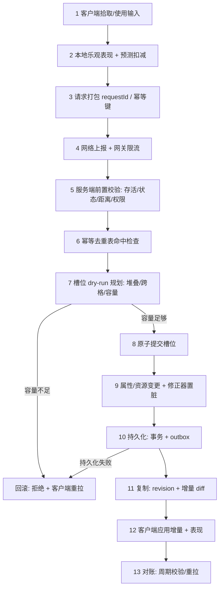

# 05-背包道具完整链路

> 知识成熟度：L4（端到端链路专著 + 本机可运行测试与基准；原始输出归档于 `evidence/tests/gameplay-core/results/`，性能指标含 P50/P95/P99；线上容量结论仍待真实 DS 环境复测）。
> 知识基线：客户端以 UE5.8（CL 55116800）的 Lyra Inventory/Equipment 结构为参照，服务端为自研权威背包事务模型；横向联动 [游戏服务端/03-业务系统设计/01-背包与道具系统](../游戏服务端/03-业务系统设计/01-背包与道具系统.md)、[游戏知识/03-游戏玩法编程/13-背包与装备系统](../游戏知识/03-游戏玩法编程/13-背包与装备系统.md) 与 [游戏服务端/02-数据与业务/01-数据库选型与存储设计](../游戏服务端/02-数据与业务/01-数据库选型与存储设计.md)。
> 适用范围：MMO / 动作 RPG / 战术竞技等有持久化道具系统的多人游戏；奖励发放、邮件领取、交易、掉落拾取、装备穿戴拆除等所有"写物品"的链路。
> 事实边界：本文的语义断言与性能数字来自本机单线程最小实现（MinGW g++ 16.1.0，`-O2`），**不是**线上服务器实测；线上容量、数据库吞吐与网络带宽需按各自环境重新标定。商业项目生产基线（容量阈值、批量上限、限流参数）以各项目配置为准。
> 参考来源：[Unreal Engine: Lyra Inventory and Equipment](https://dev.epicgames.com/documentation/en-us/unreal-engine/lyra-inventory-and-equipment-in-unreal-engine)、[Unreal Engine 官方文档](https://dev.epicgames.com/documentation/en-us/unreal-engine)。
> 最后更新：2026-09-11（首版：15 步链路 + 本机证据接入）。

---

## 一、概述与链路定位

背包是 Gameplay 里最"不起眼但最致命"的系统：它不产生战斗表现，却承载玩家全部资产。一次失败的物品写入可以是**多发一件**（经济崩坏、可复制）、**少发一件**（客服工单、退款）或**半发一件**（背包出现幽灵槽位、堆叠计数与数据库不一致）。

背包链路的工程本质是三个约束的同时满足：

1. **原子性**：一次"获得物品"的请求要么完整生效，要么完全不生效，不能出现"扣了奖励没给物品"或"物品加了一半"；
2. **幂等性**：客户端重传、网关重试、消息队列重复投递，都必须只结算一次；
3. **可对账**：服务端内存态、数据库持久态、客户端表现态三者在任意时刻都能收敛到同一状态。

与 [03-技能释放完整链路](03-技能释放完整链路.md) 的区别：技能链路的核心是"低延迟 + 服务端权威裁决"，背包链路的核心是"**绝不重复、绝不半成品**"。技能可以丢一帧，背包不能丢一件。

## 二、链路类型与依赖模块

| 维度 | 内容 |
| --- | --- |
| 链路类型 | Gameplay Transaction（Template A：输入 → 预测 → 请求 → 校验 → 领域执行 → 状态变更 → 持久化 → 复制 → 表现 → 恢复 → 测试） |
| 客户端模块 | 拾取/使用输入、本地背包视图、乐观表现层、增量同步应用、对账重拉 |
| 服务端模块 | 请求网关（限流/鉴权）、幂等去重表、背包事务执行器、容量守卫、属性修正器、持久化队列（事务 + outbox）、复制与通知 |
| 依赖模块 | [数据库选型与存储设计](../游戏服务端/02-数据与业务/01-数据库选型与存储设计.md)（事务与隔离级别）、[04-平台与可靠性/03-幂等重试与消息语义](../游戏服务端/04-平台与可靠性/03-幂等重试与消息语义.md)（幂等语义）、[04-平台与可靠性/04-分布式事务与最终一致性](../游戏服务端/04-平台与可靠性/04-分布式事务与最终一致性.md)（跨服转账） |
| 失败路径 | 参数非法、容量不足、物品不存在、状态门禁（死亡/交易中/读条中）、并发竞争、持久化失败、复制失败 |
| 正确性证明 | [evidence/tests/gameplay-core](../evidence/tests/gameplay-core/README.md) 的 `inventory_txn`（T1–T7 全通过） |
| 性能证明 | 同目录 `inventory_txn` 微基准（P50/P95/P99）+ `attr_modifier_bench`（属性聚合） |

## 三、权威状态与数据所有权

背包链路的权威链是单向的：

```text
数据库（最终事实源）
   ↑ 事务提交 / outbox
服务端内存（唯一权威裁决者，单一写者）
   ↓ 增量复制（版本号 + 增量 diff）
客户端视图（只读投影，可预测但不可信）
```

- **唯一权威**：服务端内存中的背包状态。客户端任何"我明明有 5 个"的主张都必须能被服务端版本号否决。
- **版本号是收敛的关键**：每个背包带一个单调递增的 `revision`。客户端应用增量时若发现 `revision` 跳号，必须丢弃本地预测并整包重拉，而不是"猜"中间发生了什么。
- **禁止双写**：客户端预测态与权威态必须分离存放（预测层可丢弃），不允许把预测结果直接写进"本地权威副本"。
- **持久化不是权威的一部分，但决定了崩溃后的恢复边界**：背包在内存中先提交、再异步持久化（写前日志 + outbox），崩溃后以数据库为准重建。

> 一句话判据：**任何"客户端说有什么就用什么"的背包实现，最终都会变成可复制物品的漏洞。**

## 四、完整数据流架构图（15 步工业级闭环）



图下解释：**步骤 7 是整条链路的正确性支点**。它必须在任何写入之前完成"要写哪些槽、每槽写多少"的完整规划；只有规划成功才进入步骤 8 的提交。把这两步顺序颠倒（边写边判断容量）就是"半成品背包"的根因。

## 五、十五步端到端推导

### 步骤 1：客户端拾取/使用输入

- 触发源：地面拾取、邮件领取、任务奖励、商店购买、合成消耗、装备穿戴。
- 输入层只做**意图采集**，不做任何物品增减；物品数量是奖励配置的结果，不是客户端输入的一部分。
- 边界：连点/宏点击必须在客户端就做节流，否则会在网关层制造无意义的幂等冲突。

### 步骤 2：本地乐观表现（客户端预测）

- 允许对**表现**乐观（播放拾取动画、临时在背包 UI 顶出占位格），但物品计数以服务端确认为准。
- 需要预测扣减的场景（例如消耗类使用）必须把预测值放在独立字段（如 `pendingDelta`），可整体丢弃。
- 反模式：把预测结果写进本地权威副本 → 一旦服务端拒绝，UI 出现"物品跳变"，且无法判断是显示错误还是真实回滚。

### 步骤 3：请求打包（requestId / 幂等键）

- 每个请求携带全局唯一 `requestId`（客户端生成，雪崩式 UUID 或 `(accountId, sequence)` 组合）。
- `requestId` 的作用域必须是**账号级或更长**，不能是"本次连接内唯一"——断线重连后重传是幂等语义最常见的测试缺口。
- 同一条链路上，`requestId` 一旦生成就不再变化（重传时复用），否则幂等表无法命中。

### 步骤 4：网络上报与网关限流

- 网关侧做：鉴权、频率限制、包体上限、非法字段拒绝。
- 限流的目标不是"防刷"本身，而是保证背包事务执行器不会因为重复请求堆积而放大写放大。
- 边界：限流命中应当是可重试错误（带退避），而不是静默丢弃；静默丢弃会让客户端永远等不到确认。

### 步骤 5：服务端前置校验

按固定顺序短路，任一步失败即返回拒绝且**不做任何状态变更**：

```text
存活 → 未在读条/交易中 → 距离与目标合法 → 权限与归属 → 参数范围
```

- 顺序固定是为了可测试：拒绝原因必须唯一确定，便于写断言与统计。
- "参数范围"包含物品数量上界与批量上界；**没有批量上界是物品复制漏洞的经典入口**。

### 步骤 6：幂等去重表命中检查

- 内存哈希表（`requestId → 结果`）+ 定期落库；命中则直接返回**上次的结果**，而不是"再执行一次然后说成功"。
- 表需要 TTL（短于业务可重试窗口），并支持崩溃后从持久层重建。
- 边界：幂等键与业务键必须区分——同一个 `requestId` 只能对应同一次业务意图；若客户端复用 `requestId` 提交了不同内容，必须按冲突拒绝，而不是按幂等放行。

### 步骤 7：槽位 dry-run 规划（链路正确性支点）

规划顺序固定为"**先补满已有堆叠，再占用空槽**"：

```text
remaining = 请求数量
1) 遍历同 itemId 的已有槽位，能补多少补多少（受单堆叠上限约束）
2) 遍历空槽位，每槽最多写一个堆叠上限
3) remaining > 0 → 容量不足，返回失败（此时尚未写入任何槽位）
```

这一顺序有两个直接收益：玩家观感（不会出现"明明有半堆却不先补"的新格占用），以及测试可断言（跨格分摊结果唯一）。

### 步骤 8：原子提交与容量守卫

- 提交阶段只执行步骤 7 已经算好的写入计划，**不再做任何条件判断**（判断已在规划阶段完成）。
- 提交必须是不可分割的：要么整份计划落盘，要么一个字节也不写。
- 本机证据：`inventory_txn` 的 T3 断言在容量耗尽时背包逐槽不变（`unchanged=1`），T2 断言先补满再开新格（`slot0=99 slot1=41`）。

### 步骤 9：属性/资源变更与修正器置脏

- 背包变更常连带属性变更（装备重量、套装加成、容量上限）。属性不要在此刻全表重算，而是**把受影响实体的修正器置脏**，由 Tick 末统一刷新。
- 本机证据：`attr_modifier_bench` 在 20 000 实体 × 16 修正器下，10% 变脏时增量重算的 p50 是全量重算的约 1/7.5，说明"变更即置脏"比"每 Tick 全量"更符合服务端预算。
- 边界：置脏必须可传播（修改容量上限要传播到"是否超重"的派生属性），否则会出现"属性正确但派生状态过期"的隐性 bug。

### 步骤 10：持久化（事务 + outbox）

- 内存提交成功后写入写前日志/outbox，再由异步 worker 落库；落库失败不回滚内存（内存是权威），但必须进入重试队列并暴露指标。
- 需要"内存与数据库强一致"的场景（例如跨服转移、玩家间交易）必须走事务 + 幂等重试，不能依赖"稍后补偿"。
- 边界：outbox 积压是**必须监控**的背包健康指标——它积压意味着崩溃后可能丢失的时间窗口在扩大。

### 步骤 11：复制与通知（revision + 增量 diff）

- 复制内容：变更槽位的最小 diff + 新的 `revision`；不是整包背包。
- `revision` 单调递增，客户端用它检测丢包与乱序；出现跳号即触发重拉，不做"合并猜测"。
- 边界：批量变更（一次奖励发 20 种物品）应合并为一次复制，而不是 20 次，否则会放大带宽与客户端重绘成本。

### 步骤 12：客户端应用增量与表现

- 应用增量时若本地存在针对同一槽位的未确认预测，需要按"权威覆盖预测"的规则处理，并把被覆盖的预测从 pending 队列移除。
- 表现层（图标、堆叠数字、红点、获得飘字）由统一的状态事件驱动，不直接读取预测字段。

### 步骤 13：异常与失败路径

| 失败点 | 现象 | 正确处理 | 反模式 |
| --- | --- | --- | --- |
| 参数非法（数量 0/负/超批量） | 请求被拒 | 拒绝且不产生任何变更（T5） | 夹取为合法值后继续执行 |
| 容量不足 | 需要新格但背包已满 | 整单回滚（T3） | 部分写入 + 返回"部分成功" |
| 并发竞争同一槽位 | 计数错乱 | 背包事务串行化（单写者） | 多线程直接改同一槽位 |
| 同一 requestId 重传 | 可能重复发放 | 幂等表命中返回上次结果（T4） | "再执行一次，反正是加物品" |
| 超量移除 | 物品数量为负 | 先校验总量再执行（T7） | 减到 0 后继续减 |
| 持久化失败 | 数据库与内存不一致 | 重试 + 告警 + outbox 积压指标 | 静默忽略，等待下次全量落盘 |
| 复制丢失 | 客户端与权威不一致 | revision 跳号触发整包重拉 | 客户端本地"自行修正" |

### 步骤 14：测试（单测 / 集成 / 重放）

- **单元测试**：堆叠、跨格、容量回滚、幂等、非法参数、部分移除、超量移除守卫 —— 本机证据 7/7 通过。
- **集成测试**：网关限流 → 幂等表 → 事务执行器 → 持久化队列 的串联拒绝路径。
- **重放测试**：同一请求序列重放两次，背包快照与 revision 必须逐槽一致（参照技能链路的确定性哈希做法）。
- **并发测试**：同一账号并发两笔写请求，断言最终计数等于串行结果且无超发。
- 测试策略口径见 [游戏测试与质量/01-测试金字塔与测试策略](../知识/08-工程实践与质量/测试策略与自动化/01-测试金字塔与测试策略.md)。

### 步骤 15：性能预算与压测口径

- 背包事务是**低频重写**，单次成本应远小于一次技能结算；真正的成本在"批量发放"与"持久化落库"。
- 本机微基准（单线程、40 槽、400 000 次增删）给出的是**纯逻辑上限**：P50 = 100 ns、P95 = 200 ns、P99 = 200 ns、吞吐约 9.76 × 10⁶ ops/s。真实服务端必须叠加持久化、复制与锁竞争后的数字。
- 压测口径：批量发放（如一次 50 种物品）、满背包边界、幂等表高冲突、outbox 积压下的事务延迟，四项分别记录 P50/P95/P99。
- 预算建议：单账号背包事务在服务端 Tick 预算中的占比应可忽略；一旦看到背包出现在耗时榜前列，优先怀疑**锁粒度**与**序列化/落库**，而不是逻辑本身。

## 六、本地可运行证据与原始结果

证据目录：[evidence/tests/gameplay-core](../evidence/tests/gameplay-core/README.md)（源码、脚本与未修改的原始输出）。

| 程序 | 断言 | 结果 | 原始输出 |
| --- | --- | --- | --- |
| `inventory_txn` | T1 堆叠分格 / T2 先补满再开格 / T3 容量不足原子回滚 / T4 requestId 幂等 / T5 非法参数 / T6 部分移除释放槽位 / T7 超量移除守卫 | pass=7 fail=0 | [results/inventory_txn.txt](../evidence/tests/gameplay-core/results/inventory_txn.txt) |
| `attr_modifier_bench` | 增量重算 == 全量重算（400 抽样） | mismatch=0 | [results/attr_modifier_bench.txt](../evidence/tests/gameplay-core/results/attr_modifier_bench.txt) |

关键指标（单次运行，`-std=c++17 -O2`，MinGW g++ 16.1.0，x86_64，16 逻辑核）：

```text
[inventory_txn]       slots=40 ops=400000
                      latency_ns p50=100 p95=200 p99=200 mean=102 (max=185600 为首分配离群值)
                      throughput_ops_per_sec ≈ 9.76e6

[attr_modifier_bench] entities=20000 mods_per_entity=16 rounds=200 dirty_percent=10
                      full_recompute    p50=1756.0us p95=2060.6us p99=2238.3us
                      dirty_incremental p50=234.9us  p95=316.5us  p99=422.7us
                      p50_speedup=7.47x
```

**已验证事实**：上文所有 PASS 断言与表中数字。

**未验证边界**：多线程竞争下的槽位一致性、持久化与网络复制耗时、多机环境吞吐、UE GAS 运行时集成、真实 DS 容量结论。

## 七、常见反模式与失败边界

1. **边写边判容量**：规划与提交混在一起，容量不足时留下半成品。
2. **requestId 只在连接内唯一**：断线重连后的重传变成新请求，直接导致重复发放。
3. **把幂等实现成"再执行一次"**：对"加物品"这类非幂等操作，等于把重传变成复制漏洞。
4. **批量无上界**：恶意客户端一次请求 10 万件，瞬间打满背包并放大落库压力。
5. **客户端预测直写权威副本**：拒绝后无法区分"显示错误"与"真实回滚"。
6. **持久化失败静默吞掉**：内存与数据库长期分叉，等到全量落盘时才发现已经错过恢复窗口。
7. **复制整包而非增量**：一次奖励发放触发整包同步，带宽随背包扩容线性上升。

## 八、验证矩阵

| 被测能力 | 用例 | 断言 | 证据 |
| --- | --- | --- | --- |
| 堆叠与分格 | 满堆 + 溢出进新格 | 槽数与计数唯一确定 | `inventory_txn` T1/T2 |
| 事务原子性 | 容量不足 | 背包逐槽不变 | `inventory_txn` T3 |
| 幂等 | 同 requestId 重传 | 只结算一次 | `inventory_txn` T4 |
| 参数守卫 | 0 / 负 / 超批量 | 拒绝且无变更 | `inventory_txn` T5 |
| 移除语义 | 部分移除 / 超量移除 | 释放空槽 / 拒绝 | `inventory_txn` T6/T7 |
| 属性联动 | 修正器置脏后刷新 | 增量结果等于全量 | `attr_modifier_bench` |
| 网关限流 | 高频重复请求 | 可重试拒绝，无写放大 | 待集成环境 |
| 持久化 | outbox 落库失败 | 重试 + 积压指标 | 待集成环境 |
| 并发 | 同账号并发写 | 无超发，结果等于串行 | 待集成环境 |
| 端到端 | 拾取 → 装备 → 交易 | 三端状态收敛 | 待线上环境 |

## 十、跨服转移、交易与批量发放

这三类场景是背包链路里唯一真正需要**跨事务边界**的部分，单独处理。

### 10.1 玩家间交易

```text
A 锁定物品 → 双方确认 → 事务内 A 扣 / B 加 → 双写日志 → 任一步失败则整单回滚
```

- 必须先"锁定"再"交换"：锁定期物品不可被其他系统消耗（装备、分解、出售），否则会出现"同一件物品卖两次"。
- 交换必须在同一事务内完成扣与加；分两步提交（先扣后加）在崩溃时会直接产生物品湮灭。
- 交易超时/掉线必须自动解锁，且**解锁本身要幂等**（重复收到"取消"不能把已完成的交易反向撤销）。

### 10.2 跨服转移（角色带着背包换服）

- 采用"**先冻结、再传输、后确认**"三段式：源服冻结背包并生成带 `revision` 的快照 → 目标服导入并分配新 `revision` → 源服在收到确认后才允许删除。
- 传输期间玩家不可登录任一侧（或登录到"只读旁观"状态），避免双端同时改写。
- 失败恢复：源服未收到确认则保留快照（回滚），目标服若已导入但源服超时，需要按 `requestId` 去重，避免"导入两次"。
- 细节与幂等语义见 [游戏服务端/04-平台与可靠性/04-分布式事务与最终一致性](../游戏服务端/04-平台与可靠性/04-分布式事务与最终一致性.md)。

### 10.3 批量发放与补偿

- 一次活动奖励常涉及数十种物品：必须**整单原子**（要么全发，要么不发），并带单次批量上界。
- 补偿发放（客服补发）必须携带独立的补偿单号作为 `requestId`，绝不能复用原请求号——否则会被幂等表判定为"已发放"。
- 邮件附件过期回收走同一套事务路径，不允许"先发后查"。

## 十一、落地检查清单

| 检查项 | 期望 | 典型失败信号 |
| --- | --- | --- |
| 事务顺序 | 先 dry-run 规划，后提交 | 容量不足时出现半成品槽位 |
| 幂等键作用域 | 账号级且重传复用 | 断线重连后重复发放 |
| 幂等实现 | 命中返回上次结果 | "再执行一次"式伪幂等 |
| 批量上界 | 有明确上限并拒绝超限 | 单请求打满背包 |
| 客户端预测 | 与权威副本分离，可整体丢弃 | 拒绝后 UI 出现无法解释的跳变 |
| revision | 单调、可检测跳号、跳号即重拉 | 客户端"自行修正"导致三端分叉 |
| 持久化失败 | 重试 + 告警 + outbox 积压指标 | 静默吞掉，恢复窗口悄然扩大 |
| 属性联动 | 变更即置脏，Tick 末统一刷新 | 每 Tick 全量重算拖垮预算 |
| 并发 | 单写者串行化 | 多线程直改同一槽位 |
| 监控 | 事务拒绝原因分布、outbox 积压、revision 重拉率 | 只有"成功数"没有拒绝原因 |

## 十二、术语速查

| 术语 | 说明 |
| --- | --- |
| dry-run 规划 | 只计算写入计划、不落地，用于把"容量判断"与"实际写入"分离 |
| 幂等键 `requestId` | 全局唯一的请求标识；重传时必须复用，作用域需覆盖断线重连 |
| `revision` | 背包版本号，单调递增；客户端据此检测丢包与乱序并决定是否整包重拉 |
| outbox | 内存提交后待落库的持久化队列；其积压量代表崩溃后可能丢失的时间窗口 |
| 堆叠上限 | 单个槽位可容纳的最大同类物品数量 |
| 置脏（dirty flag） | 标记属性需要重算，由统一时机批量刷新，避免逐次全量重算 |
| 压制的 Buff | 被更高优先级实例压制但未删除的实例，保留自身剩余时长 |
| 锁定 | 交易/转移前对物品的临时占用，使其他系统无法消耗 |

## 十三、关联阅读与演进索引

- **横向知识（服务端）**：[游戏服务端/03-业务系统设计/01-背包与道具系统](../游戏服务端/03-业务系统设计/01-背包与道具系统.md)（事务、锁、幂等、存储设计）
- **横向知识（客户端）**：[游戏知识/03-游戏玩法编程/13-背包与装备系统](../游戏知识/03-游戏玩法编程/13-背包与装备系统.md)（Lyra Inventory、UI、同步）
- **存档与版本迁移**：[游戏知识/03-游戏玩法编程/12-SaveGame存档系统与序列化](../游戏知识/03-游戏玩法编程/12-SaveGame存档系统与序列化.md)
- **存储与事务**：[游戏服务端/02-数据与业务/01-数据库选型与存储设计](../游戏服务端/02-数据与业务/01-数据库选型与存储设计.md)
- **幂等与消息语义**：[游戏服务端/04-平台与可靠性/03-幂等重试与消息语义](../游戏服务端/04-平台与可靠性/03-幂等重试与消息语义.md)
- **战斗结算中的物品产出**：[游戏服务端/03-业务系统设计/06-战斗结算与验证](../游戏服务端/03-业务系统设计/06-战斗结算与验证.md)
- **可复现证据**：[evidence/tests/gameplay-core](../evidence/tests/gameplay-core/README.md)
- **度量口径与预算方法**：[10-性能问题定位完整链路](../知识/08-工程实践与质量/调试与性能分析/10-性能问题定位完整链路.md)
- **兄弟链路**：[03-技能释放完整链路](03-技能释放完整链路.md)、[04-Buff系统完整链路](04-Buff系统完整链路.md)、[07-假人AI完整链路](07-假人AI完整链路.md)
