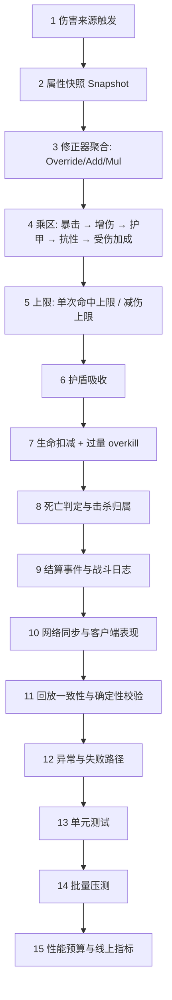

# 11-伤害与属性结算完整链路

> 知识成熟度：L4（端到端链路专著 + 本机可运行测试与基准；15 条公式/边界断言全部通过，含 P50/P95/P99 结算耗时与确定性重放哈希，原始输出归档于 `evidence/tests/damage-core/results/`；线上容量与 UE GAS 集成仍属未验证边界）。
> 知识基线：属性以 UE5.8（CL 55116800）`AttributeSet` / `GameplayEffect` 修正器模型为参照，结算公式为可辩护的工程参考实现；横向联动 [游戏服务端/03-业务系统设计/06-战斗结算与验证](../游戏服务端/03-业务系统设计/06-战斗结算与验证.md)、[游戏知识/03-游戏玩法编程/01-GameplayAbilitySystem能力系统](../游戏知识/03-游戏玩法编程/01-GameplayAbilitySystem能力系统.md)。
> 适用范围：ACT / ARPG / MMO / 战术竞技的所有伤害结算：普攻、技能、持续伤害（DOT）、反伤、环境伤害、护盾与减伤体系。
> 事实边界：本文的数值与断言来自本机单线程最小实现（MinGW g++ 16.1.0，`-O2`），**不是**线上实测；`armor/(armor+K)` 与乘区顺序是工程选择，接入项目时须按策划公式重新标定。属性快照时机、GAS PredictionKey 与网络复制的具体实现不在本文范围。
> 参考来源：[Unreal Engine: Gameplay Ability System](https://dev.epicgames.com/documentation/en-us/unreal-engine/gameplay-ability-system-for-unreal-engine)、[Unreal Engine 官方文档](https://dev.epicgames.com/documentation/en-us/unreal-engine)。
> 最后更新：2026-09-11（首版：15 步结算链路 + 本机证据接入）。

---

## 一、概述与链路定位

伤害结算是 Gameplay 里**唯一一处四方对数字**的地方：策划配的表、客户端播的表现、服务端算的结果、战斗日志记的账，任意两方差一点，玩家就会看到"打出的数字和掉的血不一样"。这类"差一点"的 bug 极难排查，因为它往往不是逻辑错误，而是**顺序问题**。

本篇与 [03-技能释放完整链路](03-技能释放完整链路.md) 的分工：

| 维度 | 03-技能释放完整链路 | 11-伤害与属性结算完整链路（本篇） |
| --- | --- | --- |
| 关注点 | 技能能否被触发、何时进入执行态、如何结束 | 一旦开始结算，数字按什么顺序算出来 |
| 核心问题 | 冷却/资源/状态/打断/预测 | 乘区顺序、护盾、过量、上限、DOT 取整 |
| 典型 bug | 技能能"卡"出来、能重复触发 | 数字对不上、护盾穿透、过量统计虚高 |
| 证据 | `evidence/tests/gameplay-core/skill_pipeline` | `evidence/tests/damage-core/damage_pipeline` |

## 二、链路类型与依赖模块

| 维度 | 内容 |
| --- | --- |
| 链路类型 | Gameplay Transaction 变体（伤害结算版）：来源触发 → 属性快照 → 修正器聚合 → 乘区计算 → 上限 → 护盾 → 生命 → 事件 → 同步 → 回放 → 测试 → 预算 |
| 客户端模块 | 本地预测结算（表现）、伤害数字与飘字、命中特效、被击表现 |
| 服务端模块 | 伤害结算器、属性快照、修正器容器、抗性/减伤表、护盾容器、死亡与击杀归属、战斗日志、批量 AOE 调度 |
| 依赖模块 | [04-Buff系统完整链路](04-Buff系统完整链路.md)（修正器来源）、[05-背包道具完整链路](05-背包道具完整链路.md)（装备属性）、[03-技能释放完整链路](03-技能释放完整链路.md)（触发条件） |
| 失败路径 | 零/负伤害、目标已死亡或免疫、属性快照过期、护盾为负、上限与减伤上限冲突、DOT 跳数取整错误、跨服重放不一致 |
| 正确性证明 | [evidence/tests/damage-core](../evidence/tests/damage-core/README.md)：A1–A2 + D1–D13 全通过 |
| 性能证明 | 同目录基准：单次结算 P50/P95/P99 + 吞吐 |

## 三、权威状态与数据所有权

| 状态 | 权威方 | 说明 |
| --- | --- | --- |
| 属性最终值 | 服务端 | 由 base + 修正器聚合而来；客户端只做表现 |
| 属性快照 | 服务端 | 一次结算内使用的属性副本，**结算期间不得被后续 Buff 改写** |
| 护盾余量 | 服务端 | 唯一写者；客户端只显示 |
| 生命值 | 服务端 | 客户端不准自行扣血 |
| 伤害数字 | 服务端计算 + 客户端表现 | 客户端预测的数字仅用于即时手感，最终以服务端广播为准 |

三条硬规则：

1. **一次伤害只做一次属性快照**。快照后才允许乘区计算；若中途重新读属性，同一发伤害会因子弹飞行期间的 Buff 变化而"边算边变"。
2. **结算过程必须无副作用泄漏**：护盾扣除、生命扣减、死亡标记是仅有的三处写入，其余全是只读计算。
3. **客户端预测的数字不回流**：预测只影响飘字时机，不参与伤害统计与击杀判定。

> 一句话判据：**如果伤害数字在客户端算完直接显示、服务端只是"补一个结果"，那这套结算迟早出现"看到的伤害与掉的血不一致"。**

## 四、完整数据流架构图（15 步结算闭环）



图下解释：**步骤 2 与步骤 5 是两处最容易被省略的环节**。省略快照会导致"边算边变"，省略上限会让后期数值膨胀失控；两者都是"上线半年后才暴露"的典型问题。

## 五、十五步端到端推导

### 步骤 1：伤害来源触发

- 来源类型：普攻命中、技能命中、DOT 跳伤、反弹/反伤、环境伤害（坠落、火焰地带）、脚本伤害。
- 每种来源必须显式携带：伤害数值、伤害类型（物理/魔法/真实）、来源实体、目标实体、是否可暴击、是否参与统计。
- 边界：环境伤害通常**不参与暴击与击杀归属**，但应参与减伤；这条必须在触发时就确定，而不是在结算中间判断。

### 步骤 2：属性快照（Snapshot）

- 在结算开始时一次性抓取攻守双方的属性最终值，形成不可变快照。
- 快照内容是**最终值**而非修正器列表：避免结算过程中因列表变动导致重复聚合。
- 边界：子弹飞行期间来源方死亡、Buff 到期、装备卸下——按快照值结算还是按命中时刻重算，必须在项目内统一并写进战斗日志。

### 步骤 3：修正器聚合（属性求值）

- 语义固定为：**最后一个 Override 覆盖 base → Add 求和 → Mul 连乘**。
- Add/Mul 对插入顺序不敏感（本机 A2 断言 `(10+5)×3` 与 `(10×3)+5` 在代码语义下同为 45）。
- 边界：Override 若允许多个并存，必须定义"谁赢"（后写入者赢）；否则同一属性在不同计算路径上会得到不同值。

### 步骤 4：乘区顺序

固定顺序（本机 D1–D5 断言）：

```text
基础伤害 × 攻击属性
  → × (暴击? 暴击倍率 : 1)
  → × (1 + 增伤)
  → × (1 - 护甲减伤)      // 真实伤害跳过
  → × (1 - 按类型抗性)
  → × (1 + 受伤加成)
```

- 乘法可交换，**但每一步的输入输出必须固定**，否则"抗性是否作用于暴击伤害"会变成口头约定。
- 护甲减伤使用 `armor / (armor + K)`：D2 显示护甲取到 10⁹ 时剩余系数仍有约 1e-7，即数学上永远到不了 0 伤害；加法式减伤则会在堆叠后出现 0 伤害事故。

### 步骤 5：上限（单次命中上限 / 减伤上限）

- **单次命中上限放在减伤之后、护盾之前**（D10 断言：1000 基础经上限 150 后为 150）。
  - 放在减伤之前：高减伤目标会吃到超过上限的伤害；
  - 放在护盾之后：等于上限失效（护盾先吃掉，剩余仍可能超限）。
- 减伤上限（如"任何减伤叠加后不超过 80%"）应作为**独立于护甲曲线的钳制**，两者不是一回事。
- 边界：上限与减伤上限同时存在时，顺序必须写死并写进战斗日志。

### 步骤 6：护盾吸收

- 护盾按伤害类型分池；先扣护盾再扣血（D6：护盾 30 / 伤害 100 → 吸收 30、扣血 70、护盾归零）。
- 护盾大于一次伤害时保留余额（D7：护盾 500 / 伤害 80 → 吸收 80、余额 420）。
- 边界：护盾不得为负；多护盾并存需定义消耗顺序（通常"先到期先消耗"或"按来源优先级"）。

### 步骤 7：生命扣减与过量（overkill）

- 生命向下钳制到 0，**过量单独返回**（D8：血量 40 / 伤害 100 → 扣血 40、过量 60）。
- 过量必须独立字段：战斗日志、伤害统计、击杀归属（最后一击）、成就（"一发击杀"）都依赖它；混进实际扣血会让 DPS 统计虚高。
- 边界：护盾吸收的部分不属于过量，也不计入"实际造成伤害"的统计口径——统计口径必须一次性定义清楚。

### 步骤 8：死亡判定与击杀归属

- 死亡必须是**一次且仅一次**的状态迁移；同一 Tick 内多个来源致死时，按结算顺序确定击杀者。
- 击杀归属要与过量/实际扣血口径一致；DOT 致死与反弹致死的归属需单独定义（常见约定：归 DOT 施加者 / 归反弹承受者）。
- 边界：已死亡目标再次被结算必须整段拦截（D9），不消耗护盾、不改血量——否则会出现"打尸体掉护盾"。

### 步骤 9：结算事件与战斗日志

- 每次结算产出一条结构化事件：来源、目标、技能/来源 ID、原始值、各乘区系数、上限后值、护盾吸收、实际扣血、过量、暴击标记、随机种子偏移。
- 这条事件是**排查"数字对不上"的唯一依据**：没有分项系数的日志，等于只能看到结果看不到过程。
- 边界：日志要能承受压测量级（见步骤 14），不能因为日志把结算拖慢一个数量级。

### 步骤 10：网络同步与客户端表现

- 服务端广播的是**结算结果**（含暴击标记与关键分项），客户端据此播飘字、命中特效与被击表现。
- 客户端预测飘字必须可被服务端结果覆盖（撤销/改写），不允许出现"客户端显示暴击、服务端判非暴击"的双份数字。
- 边界：AOE 命中多目标时，广播应合并为一条批量事件，而不是 N 条单播。

### 步骤 11：回放一致性与确定性

- 结算使用的随机数必须来自**可复现的种子流**（本机 D13：同种子两次重放哈希一致，换种子则不同）。
- 帧同步/回放项目里，随机数消耗顺序必须与结算顺序一致——多一次或少一次随机数调用，都会让后续所有暴击判定整体错位。
- 边界：不要在结算中调用系统时间、容器迭代顺序不确定的遍历或哈希表遍历来取随机源。

### 步骤 12：异常与失败路径

| 失败点 | 现象 | 正确处理 | 反模式 |
| --- | --- | --- | --- |
| 伤害为 0 或负数 | 日志出现负伤害 | 直接拦截，不改血量（D11） | 负伤害变治疗 |
| 目标已死亡 | 尸体掉护盾 | 整段拦截（D9） | 只判断 `hp<=0` 但仍扣护盾 |
| 目标免疫 | 免疫仍掉护盾 | 整段拦截 | 只把伤害乘 0 |
| 属性快照过期 | 数字与 Buff 状态矛盾 | 明确快照语义并记录快照时间 | 结算中间重新读属性 |
| 护盾为负 | 护盾穿透到下一发 | 写侧钳制到 0 | 允许负余额"补偿" |
| 上限与减伤上限冲突 | 上限失效或过度限制 | 顺序写死 + 日志分项 | 靠注释约定 |
| DOT 跳数取整 | 最后一跳丢失/多打 | `floor(有效时长/间隔)`，余量保留（D12） | 四舍五入或按累加浮点比较 |
| 跨服重放不一致 | 两边伤害不同 | 统一种子源与结算顺序 | 各自实现一套结算 |

### 步骤 13：单元测试

必须覆盖的最小集合（本机全部通过）：

1. 聚合语义与顺序无关性（A1/A2）；
2. 五个乘区各一条单因子断言 + 一条组合断言（D1–D5）；
3. 护甲曲线渐进性（D2）、真伤跳过护甲（D3）；
4. 护盾先于血量、余额保留、不为负（D6/D7）；
5. 过量与死亡（D8）、死亡/免疫拦截（D9）；
6. 单次上限位置（D10）、零负伤害（D11）；
7. DOT 取整（D12）；
8. 同种子重放一致（D13）。

测试策略口径见 [游戏测试与质量/01-测试金字塔与测试策略](../知识/08-工程实践与质量/测试策略与自动化/01-测试金字塔与测试策略.md)。

### 步骤 14：批量压测

- 压测口径：AOE 一次命中 20/100 目标、每秒 1 000 次结算、DOT 同时 500 条、护盾频繁破裂。
- 必须分别记录：结算耗时分布、事件生成与日志写入耗时占比、广播耗时。
- 边界：**结算本身通常不是瓶颈**（见步骤 15），压测要盯住的是日志与广播；把两者混在一个数字里会误导优化方向。

### 步骤 15：性能预算与线上指标

- 本机基准：500 轮 × 1 000 次完整结算 = 500 000 次，单次 **P50 = 14.2 ns / P95 = 16.3 ns / P99 = 16.8 ns**，吞吐约 **7.7 × 10⁷ 次/秒**。
- 换算：20 Hz Tick 下单 Tick 处理 1 万次结算约耗 **0.14 ms**，远低于常见 33 ms 帧预算。
- 结论：**优化重点不在公式，而在属性快照获取、范围查询、事件日志与网络广播**。若伤害出现在耗时榜前列，先查快照是否每次重建、日志是否逐条同步写。
- 线上指标建议：结算耗时 P99、每 Tick 结算次数、日志写入占比、AOE 目标数分布、暴击率与预期偏差（可用于发现随机数错位）。

## 六、本地可运行证据与原始结果

证据目录：[evidence/tests/damage-core](../evidence/tests/damage-core/README.md)。

| 程序 | 断言 | 结果 | 原始输出 |
| --- | --- | --- | --- |
| `damage_pipeline` | A1 聚合顺序 / A2 顺序无关 / D1 暴击在护甲前 / D2 护甲渐近 / D3 真伤跳护甲 / D4 抗性乘算 / D5 受伤加成 / D6–D7 护盾语义 / D8 过量与死亡 / D9 死亡免疫拦截 / D10 上限位置 / D11 零负伤害 / D12 DOT 取整 / D13 确定性重放 | pass=15 fail=0 | [results/damage_pipeline.txt](../evidence/tests/damage-core/results/damage_pipeline.txt) |

关键指标（单次运行，`-std=c++17 -O2`，MinGW g++ 16.1.0，x86_64，16 逻辑核）：

```text
[bench] damage_settlement rounds=500 batch=1000 hits_total=500000
[bench] per_hit_ns p50=14.2 p95=16.3 p99=16.8 max=28.1 mean=13.0
[bench] throughput_hits_per_sec ≈ 7.72e7

[D13] determinism  a=95762bd05ab49684  b=95762bd05ab49684  c=32ca34d3eba1d979
```

**已验证事实**：上表断言与数字。
**未验证边界**：UE GAS 集成、属性快照与复制的具体时机、并发结算、跨服重放、线上容量；公式本身需按项目策划表重新标定。

## 七、常见反模式

1. **边算边读属性**：结算中途重新读 Buff/装备，导致同一发伤害的乘区来自不同时刻。
2. **加法式减伤**：`damage × (1 - armor%)` 在护甲堆叠后出现 0 伤害甚至负伤害。
3. **护盾在血量之后结算**：出现了"血扣了但护盾还在"或"护盾负数"。
4. **过量并入实际扣血**：战斗统计与击杀归属虚高。
5. **上限位置随意**：放进减伤之前或护盾之后，等于上限形同虚设。
6. **DOT 用浮点累加比较**：跳数随机丢失或多打一跳，且在不同机器上结果不同。
7. **随机数取自系统时间/哈希遍历**：回放与跨服重放必然不一致，暴击率也会漂移。
8. **结算日志逐条同步写**：压测时日志成为瓶颈，拖垮整个 Tick。

## 八、验证矩阵

| 被测能力 | 用例 | 断言 | 证据 |
| --- | --- | --- | --- |
| 聚合语义 | Override+Add+Mul 组合 | 单值确定且顺序无关 | `damage_pipeline` A1/A2 |
| 乘区顺序 | 暴击 × 护甲 × 抗性 × 受伤加成 | 与参考公式逐因子一致 | D1/D4/D5 |
| 护甲曲线 | 护甲 100 / 900 / 10⁹ | 减伤单调且恒小于 100% | D2 |
| 真伤 | 护甲 900 + 真实伤害 | 跳过护甲 | D3 |
| 护盾 | 小于/大于一次伤害 | 先护盾后血量、余额保留 | D6/D7 |
| 过量与死亡 | 血量 40 / 伤害 100 | 过量单列、血量钳制、死亡一次 | D8 |
| 拦截 | 已死亡 / 免疫 | 不消耗护盾、不改血量 | D9 |
| 命中上限 | 1000 基础 / 上限 150 | 上限在减伤后、护盾前 | D10 |
| 非法输入 | 0 / 负数伤害 | 拦截且无副作用 | D11 |
| DOT | 多跳 + 半跳 | 跳数精确、余量保留 | D12 |
| 确定性 | 同种子重放 | 哈希一致 | D13 |
| 并发结算 | 同目标多来源同 Tick | 结果等于串行 | 待集成环境 |
| 跨服重放 | 双端重放同一场战斗 | 伤害逐次一致 | 待线上环境 |

## 九、术语速查

| 术语 | 说明 |
| --- | --- |
| 属性快照（Snapshot） | 结算开始时抓取的不可变属性最终值，避免"边算边变" |
| 乘区 | 结算链上每一段独立相乘的因子（暴击、增伤、护甲、抗性、受伤加成） |
| 护甲常数 K | `armor/(armor+K)` 中的曲线参数，决定减伤增长快慢 |
| 减伤上限 | 独立于护甲曲线的钳制，防止叠加超过设计阈值 |
| 单次命中上限 | 单次结算的最大伤害，位置固定在减伤后、护盾前 |
| 护盾池 | 按伤害类型分离的吸收量，先于生命扣除且不得为负 |
| 过量（overkill） | 超出目标剩余血量的伤害，独立字段，用于击杀归属与统计 |
| 跳数 | DOT 在给定时长内完整触发的次数，按 `floor(有效时长/间隔)` 计算 |
| 结算事件 | 含分项系数的结构化日志，是排查"数字对不上"的唯一依据 |

## 十、一次结算的分步演算

下面是按本文顺序（与 `damage_pipeline` 实现一致）走完的一次完整魔法伤害，用来对照"每一步应该看到什么数"。设定：

| 输入 | 值 |
| --- | --- |
| 技能基础伤害 | 240 |
| 攻击方攻击属性（聚合后倍率，100% = 1.0） | 1.8 |
| 暴击 | 是（本次判定命中 35% 暴击率），倍率 1.8 |
| 增伤 | +20% |
| 目标护甲 | 300（曲线常数 K = 100） |
| 目标魔法抗性 | 25% |
| 目标受伤加成 | +10% |
| 单次命中上限 | 400 |
| 目标魔法护盾 | 500 |
| 目标生命 | 800 |

| 步骤 | 计算 | 结果 |
| --- | --- | --- |
| 基础 × 攻击 | 240 × 1.8 | 432.000 |
| × 暴击 | 432 × 1.8 | 777.600 |
| × 增伤 | 777.6 × 1.2 | 933.120 |
| × 护甲减伤 | 减伤 = 300/(300+100) = 0.75 → ×0.25 | 233.280 |
| × 魔法抗性 | ×(1 − 0.25) | 174.960 |
| × 受伤加成 | ×(1 + 0.10) | 192.456 |
| 单次上限 | min(192.456, 400) | 192.456 |
| 护盾吸收 | min(500, 192.456) | 吸收 192.456 |
| 扣血 | 192.456 − 192.456 | 0.000 |
| 护盾余量 | 500 − 192.456 | 307.544 |
| 生命 | 800 − 0 | 800 |

变异情形（撤掉护盾、把目标生命改为 150）：

```text
… → 单次上限 min(192.456, 400) = 192.456
   → 无护盾，待扣血 192.456
   → 生命 150 - 192.456 → 钳制到 0，死亡
   → overkill = 192.456 - 150 = 42.456
```

要点：**"实际扣血 150 + 过量 42.456 = 结算伤害 192.456"**。三者的关系必须在日志里同时出现，否则伤害统计（用结算伤害）与治疗/承伤统计（用实际扣血）永远对不上。

## 十一、与策划表的数值对账方法

数值事故很少来自公式写错，多数来自"配置与实现不一致"。建议固定四件事：

1. **参数配置化**：护甲常数 K、抗性上限、单次上限、增伤/减伤上限全部走配置，不写死在代码里；配置变更进入版本管理，可回溯。
2. **期望值回归表**：把策划表中的典型组合固化成用例（"满装 + 暴击 + 破甲"、"低减伤 + 高抗性"、"护盾刚好打穿"），每条给出期望的最终数字，作为回归断言而不是人工比对。
3. **日志分项可还原**：每条结算事件都要能按本文顺序重算出同一个数字；缺任何一步分项，排查就退化成"猜"。
4. **偏差监控**：线上暴击率、平均减伤、平均过量率与理论值做偏差告警；暴击率漂移通常意味着随机数消耗顺序被改动，是最隐蔽的确定性 bug。

## 十二、关联阅读与演进索引

- **技能触发与执行**：[03-技能释放完整链路](03-技能释放完整链路.md)
- **修正器来源（Buff）**：[04-Buff系统完整链路](04-Buff系统完整链路.md)
- **装备带来的属性修正器**：[05-背包道具完整链路](05-背包道具完整链路.md)
- **动作手感与打击判定**：[游戏知识/04-动画系统/08-动作战斗系统与打击手感](../游戏知识/04-动画系统/08-动作战斗系统与打击手感.md)
- **服务端战斗结算与验证**：[游戏服务端/03-业务系统设计/06-战斗结算与验证](../游戏服务端/03-业务系统设计/06-战斗结算与验证.md)
- **GAS 能力系统（客户端视角）**：[游戏知识/03-游戏玩法编程/01-GameplayAbilitySystem能力系统](../游戏知识/03-游戏玩法编程/01-GameplayAbilitySystem能力系统.md)
- **GAS 源码证据**：[游戏知识/12-引擎源码分析/05-GAS能力系统源码](../游戏知识/12-引擎源码分析/05-GAS能力系统源码.md)
- **可复现证据**：[evidence/tests/damage-core](../evidence/tests/damage-core/README.md)
- **度量口径与预算方法**：[10-性能问题定位完整链路](../知识/08-工程实践与质量/调试与性能分析/10-性能问题定位完整链路.md)
- **兄弟链路**：[07-假人AI完整链路](07-假人AI完整链路.md)
