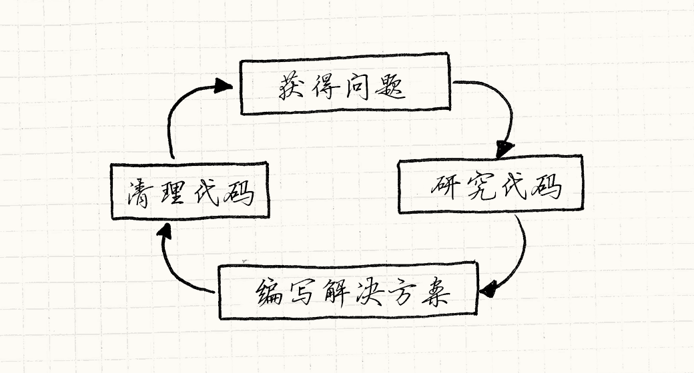

# 架构，性能和游戏（Architecture, Performance, and Games）

> **章节**：序言与导读（Introduction）  
> **原著**：Robert Nystrom (Bob Nystrom) · 《Game Programming Patterns》  
> **导航**：[目录](README.md) ｜ [上一章：序](introduction.md) ｜ [下一章：重访设计模式](design-patterns-revisited.md)

---

在一头扎进一堆设计模式之前，我想先讲一些我对软件架构及如何将其应用到游戏之中的理解，
这也许能帮你更好地理解这本书的其余部分。
至少，在你被卷入一场关于设计模式和软件架构有多么糟糕（或多么优秀）的辩论时，
这可以给你一些火力支援。

> [!NOTE] 旁注
> 注意，我没有预设你在那场战斗中选择哪一边。就像任何军火贩子一样，我愿意向交战双方出售武器。

## 什么是软件架构？

如果把本书从头到尾读一遍，
你不会学会3D图形背后的线性代数或者游戏物理背后的微积分。
本书不会告诉你如何对AI的搜索树做α-β剪枝，也不会告诉你如何在音频播放中模拟房间的混响。

> [!NOTE] 旁注
> 好家伙，这段文字简直给这本书做了个糟糕透顶的广告。

相反，这本书讲的是所有这些技术*之间*的代码。
与其说这本书是关于如何写代码，不如说是关于如何*组织*代码的。
每个程序都有*某种*组织，哪怕这组织只是“将所有东西都塞到`main()`中看看如何”，
所以我认为讲讲什么造就了*好的*组织更有意思。我们如何区分好的架构和差的架构呢？

我思考这个问题大约有五年了。当然，像你一样，我对好的设计有一种直觉。
我们都被糟糕透顶的代码库折磨过，你唯一能为它们做的，就是把它们拖到后院，帮它们了断痛苦。

> [!NOTE] 旁注
> 不得不承认，我们中大多数人都该对一些糟糕代码*负责*。

少数幸运儿有相反的经验，有机会在精心设计的代码库上工作。
那种代码库感觉就像一间布置完美的豪华酒店，礼宾们像装饰一样挂得满满当当，热切地等着满足你的每一个心血来潮。
这两者之间的区别是什么呢？

### 什么是*好的*软件架构？

对我而言，好的设计意味着当我作出改动，整个程序就好像正等着这种改动。
我只需调用几个恰到好处的函数就能完成任务，它们严丝合缝，不在代码平静的水面上激起一丝涟漪。

这听起来很美，但并不具备可操作性。“把代码写得让改动不会扰动其平静的水面。”说得倒轻巧。

让我把它拆开来说说。第一个关键点是*架构是关于改动的*。
必须得有人在修改代码库。如果没人碰代码——无论是因为代码至善至美，还是因为代码糟糕透顶以至于没人会为了修改它而玷污自己的文本编辑器——那么它的设计就无关紧要。
评价设计的好坏就是评价它应对改动有多么轻松。
如果没有改动，设计就像一个永远不会离开起跑线的运动员。

### 你如何处理改动？

在你改动代码去添加新特性、修复漏洞，或者无论是什么原因让你打开编辑器之前，
你需要先理解现有代码正在做什么。当然，你不需要理解整个程序，
但你需要把所有相关的部分装进你那灵长类大脑里。

> [!NOTE] 旁注
> 有点诡异，这字面上是一个OCR过程。

我们往往忽略这一步，但它常常是编程中最耗时的部分。
如果你觉得把数据从磁盘分页到RAM里很慢，
试试通过一对视神经把它分页进猿猴的大脑。

一旦把所有正确的上下文都装进你的湿件（大脑）里，
思考一会儿，你就能想出解决方案。
这里可能会有很多来回反复，但通常相对直接。
一旦理解了问题以及它涉及到的代码部分，实际的编码工作有时是微不足道的。

你用肉乎乎的指头在键盘上敲打一阵，直到屏幕上闪烁起正确的彩色光芒，
搞定了，对吧？还没呢！
在你写测试并把它送去代码评审之前，通常还有些清理工作要做。

> [!NOTE] 旁注
> 我是不是说了“测试”？噢，是的。给某些游戏代码写单元测试很难，但代码库的很大一部分是完全可以测试的。
>
> 我不会在这里发表演说，但我建议你，如果还没做自动化测试，就考虑多做一点吧。
> 难道你就没有比一遍又一遍手动验证更重要的事可做吗？

你把一些代码塞进了游戏，但肯定不想下一个人被你留在源码里的小毛刺绊倒。
除非改动很小，否则通常还需要做一些重新组织，让新代码与程序其余部分无缝地整合。
如果做得好，下一个来的人将无法分辨任何一行代码是什么时候写下的。

简而言之，编程的流程图看起来是这样的：

> [!NOTE] 旁注
> 细想起来，这个循环没有出口这一点还挺让人不安的。

### 解耦帮了什么忙？

虽然并不明显，但我认为很多软件架构都是关于那个学习阶段的。
把代码加载进神经元慢得让人痛苦，所以找到减少加载量的策略是值得的。
这本书有整整一节是关于[*解耦*模式](decoupling-patterns.md)，
而《设计模式：可复用面向对象软件的基础》中有很大一部分也在讲同样的思想。

可以用多种方式定义“解耦”，但我认为如果有两块代码是耦合的，
那就意味着无法只理解其中一个。
如果*解*耦了它们俩，就可以单独地理解某一块。
这当然很好，因为只有一块与问题相关，
只需将*这一块*加载到你的猴子大脑中，而不需要加载另外那一半。

对我来说，这是软件架构的关键目标：
**最小化在你取得进展之前需要装进脑子里的知识量。**

当然，后面的阶段也会起作用。
解耦的另一种定义是：对一块代码的*改动*不必然要求改动另一块代码。
我们显然需要改动*某些东西*，但耦合越少，改动在游戏其余部分激起的涟漪就越小。

## 代价呢？

听起来很棒，对吧？把所有东西都解耦，你就能像风一样编写代码。
每次改动都只需触及一两个精选的方法，你可以轻舞着掠过代码库的表面，不留下一丝影子。

正是这种感觉让人们为抽象、模块化、设计模式和软件架构而兴奋。
在一个架构良好的程序里工作确实是一种愉快的体验，而每个人都喜欢效率更高。
好的架构在生产力上能带来*巨大的*差别。它的深远影响怎么说都不为过。

但是，天下没有免费的午餐。好的设计需要汗水和纪律。
每次做出改动或实现特性时，你都必须努力把它优雅地集成到程序的其他部分。
你必须非常用心，既要组织好代码，
又要在构成开发周期的成千上万次小改动中*保持*它的组织有序。

> [!NOTE] 旁注
> 后半部分——维护你的设计——值得特别关注。
> 我见过许多程序起初很漂亮，随后死于千刀万剐，因为程序员们一遍又一遍地添加“小小的黑魔法”。
>
> 就像园艺，仅仅种植是不够的，还需要除草和修剪。

你得考虑程序的哪些部分应该解耦，并在那些位置引入抽象。
同样，你需要决定在哪里设计好可扩展性，让未来的改动更容易。

人们对这一点会变得十分狂热。
他们设想，未来的开发者（或者只是未来的自己）走进代码库，
发现它开放、强大，正渴望着被扩展。
他们幻想着那个“统御万物的唯一游戏引擎”。（译注：原文是《指环王》中“至尊魔戒御众戒”的梗。）

但是，事情从这里开始变得棘手。
每当你添加了抽象或者扩展支持，你就是在*赌*以后这里需要灵活性。
你是在向游戏添加需要时间来开发、调试和维护的代码和复杂度。

如果你赌对了，后来使用了这些代码，那么功夫不负有心人。
但预测未来*很难*，而当那种模块化最终派不上用场时，它很快就会变得有害。
毕竟，你得处理更多的代码。

> [!NOTE] 旁注
> 有些人创造了“YAGNI”这个术语——[You aren't gonna need it（你不需要那个）](http://en.wikipedia.org/wiki/You_aren't_gonna_need_it)——作为咒语，用来对抗预测未来的自己会想要什么的冲动。

当人们对此过分狂热时，代码库的架构就会失控。
接口和抽象无处不在。插件系统、抽象基类、成堆的虚方法，还有各种各样的扩展点。

你得花上无尽的时间穿过所有这些脚手架，才能找到真正做事的代码。
当你需要改动时，没错，那里可能有个接口能帮忙，但要找到它可得祝你好运。
理论上，所有这些解耦意味着你在扩展它之前需要理解的代码更少，
但抽象层本身最终会填满你大脑里的暂存盘。

像这样的代码库会使得人们*反对*软件架构，特别是设计模式。
人们很容易深陷代码本身，以至于忘了你是在努力发布一款*游戏*。
可扩展性的塞壬之歌把无数开发者吸了进去，他们花上多年时间制作“引擎”，却从没搞清楚这个引擎是*为了什么*。

## 性能和速度

关于软件架构和抽象，还有另一种你有时会听到的批评，尤其是在游戏开发中：它会损害游戏的性能。
许多让代码更灵活的模式依赖虚分派、接口、指针、消息和其他机制，
它们都至少有某种运行时开销。

> [!NOTE] 旁注
> 一个有趣的反例是C++中的模板。模板元编程有时能给你接口式的抽象，而没有任何运行时开销。
>
> 这里有一个灵活性的光谱。
> 当写代码调用类中的具体方法时，你就是在*编写（author）*的时候指定类——硬编码了调用的是哪个类。
> 当使用虚方法或接口时，直到*运行*时才知道调用的类。这更加灵活但增加了运行时开销。
>
> 模板元编程介于两者之间。在那里，你在*编译时*模板实例化之际决定调用哪个类。

这是有原因的。很多软件架构是为了让程序更灵活，让改动它更省力。
这意味着在程序中编码更少的假设。使用接口，你的代码就能与*任何*实现了该接口的类协作，而不只是今天恰好是的那一个。
今天，你可以使用[观察者](observer.md)和[消息](event-queue.md)让游戏的两部分相互交流，
到了明天，就能轻松扩展成三个或四个部分相互交流。

但性能完全关乎假设。优化实践依赖具体的限制条件。
我们能否安全地假设敌人永远不会超过256个？好，可以把敌人ID塞进一个字节。
这里只会在一个具体类型上调用方法吗？好，我们可以静态派发或内联它。
所有实体都是同一类？太好了，我们可以为它们创建一个漂亮的[连续数组](data-locality.md)。

但这并不意味着灵活性不好！它能让我们快速改动游戏，
而*开发*速度对得到有趣的体验绝对至关重要。
没有人能只在纸面上就设计出一个平衡的游戏，哪怕是Will Wright。这需要迭代和实验。

尝试想法并查看效果的速度越快，能尝试的东西就越多，也就越可能找到有价值的东西。
就算找到了正确的机制，你也需要大量时间进行调优。
一个微小的不平衡就有可能破坏整个游戏的乐趣。

这里没有简单的答案。
让你的程序更灵活以便更快地做原型，会带来一些性能代价；
同样，优化代码会让它更不灵活。

不过以我的经验，让一个好玩的游戏变快，比让一个快的游戏变好玩更容易。
一种折中方案是，在游戏设计稳定下来之前保持代码灵活，之后再移除部分抽象来提高性能。

## 糟糕代码的优势

这引出了下一点：不同的编码风格各有其适用的时间和场合。
这本书大部分内容是关于编写可维护、干净的代码，所以我的立场很明确地偏向用“正确”的方式做事，但草率的代码也有其价值。

编写架构良好的代码需要仔细地思考，这会转化为时间。
更重要的是，在项目的整个生命周期中*维护*良好的架构需要大量努力。
你必须像优秀的露营者对待营地一样对待代码库：总是尽量让它比你刚来时更好一点。

当你打算长时间生活在这份代码里并在其上工作时，这是很好的。
但就像早先提到的，游戏设计需要很多实验和探索。
特别是在早期，写一些你*知道*将会扔掉的代码是很普遍的事情。

如果你只是想弄清某个玩法点子到底行不行，
把它架构得很漂亮就意味着，在真正把它显示到屏幕上并获得反馈之前，要花掉更多时间。
如果最后证明这点子不行，那么删除代码时，那些让代码更优雅的工夫就付诸东流了。

原型——把勉强能用来回答设计问题的代码草草拼凑在一起——是一种完全合理的编程实践。
不过，这里有一个非常大的告诫。如果你写一次性代码，你*必须*确保自己能够把它扔掉。
我见过很多次糟糕的经理人在玩这种把戏：

> 老板：“嗨，我有些想试试的点子。只要原型，不需要做得很好。你能多快搞定？”

> 开发者：“嗯，如果我偷工减料、不做测试、不写文档，而且代码里满是bug，那我几天后就能给你一些临时代码。”

> 老板：“太好了。”

*几天后*

> 老板：“嘿，原型很棒，你能花上几个小时稍微清理一下，然后我们就把它当作正式成品吗？”

你得确保使用一次性代码的人明白，即使它看上去能工作，它也不能被*维护*，*必须*被重写。
如果*有可能*最终不得不保留它，你就得防御性地把它写好。

> [!NOTE] 旁注
> 有个小技巧能保证原型代码不会被逼着变成正式代码：用与游戏实现不同的语言来写它。
> 这样，在它能混进你真正的游戏之前，必须先重写一遍。

## 保持平衡

有些因素在相互角力：

1. 我们想要良好的架构，好让代码在项目的整个生命周期里更容易理解。
2. 我们想要快速的运行时性能。
3. 我们想要快速完成今天的功能。

> [!NOTE] 旁注
> 有趣的是，这些都是速度：长期开发的速度，游戏运行的速度，和短期开发的速度。

这些目标至少是部分对立的。
好的架构长期来看能提高生产力，
但要维护它，就意味着每次改动都需要多花一点力气来保持整洁。

写得最快的实现很少是*运行*最快的。
相反，优化需要可观的工程时间。
一旦完成，它往往会让代码库僵化：高度优化的代码不灵活，也很难改动。

总有压力要今天完成今天的工作，把其他一切都留到明天。但如果我们尽可能快地塞进功能，
代码库就会变成一堆黑魔法、bug 和不一致，削弱我们未来的生产力。

这里没有简单的答案，只有权衡。
从我收到的邮件来看，这让很多人感到沮丧，尤其是那些只想做个游戏的新手。
听到“没有正确的答案，只是不同口味的错误”这句话，确实挺吓人的。

但对我而言，这让人兴奋！看看任何人们投入整个职业生涯去精通的领域，
在其核心你总能发现一组相互交织的约束。毕竟，如果有简单的答案，每个人都会那么做。
一周就能掌握的领域终究是无聊的。你没听说过有谁在挖沟方面拥有卓越的职业生涯。

> [!NOTE] 旁注
> 也许你确实听说过；我没有去考据这个类比。
> 据我所知，可能有狂热的挖沟爱好者、挖沟大会，以及围绕它的一整套亚文化。
> 我有什么资格评判呢？

对我来说，这和游戏本身有很多相似之处。
国际象棋之类的游戏永远无法被掌握，因为每个棋子都与其他棋子完美地相互制衡。
这意味着你可以花一辈子探索广阔的可行策略空间。设计糟糕的游戏会坍缩成一种反复使用的制胜策略，直到你厌倦并退出。

## 简单

最近，我觉得如果说有什么方法能缓解这些约束，那就是*简单*。
在我现在的代码中，我非常努力地写出最干净、最直接的解决方案。
读完这种代码，你会完全明白它做了什么，而且想象不出任何其他可能的写法。

我的目标是先把数据结构和算法搞对（大致按这个先后顺序），然后再从那里继续。
我发现如果能让事物保持简单，最终的代码总量就更少，
这意味着改动时需要装进脑子里的代码就更少。

它通常跑得很快，因为本来就没有多少开销，也没有多少代码要执行。
（不过这当然并非总是如此。你可以在很少的代码里塞进大量的循环和递归。）

但是，注意我并没有说简单的代码需要更少的时间*编写*。
你可能会这么认为，因为最终代码总量更少，但好的解决方案不是代码的堆积，而是代码的*提炼*。

> [!NOTE] 旁注
> Blaise Pascal在一封信的结尾留下一句名言：“我本想写一封更短的信，但我没有时间。”
>
> 另一句名言来自Antoine de Saint-Exupery：“臻于完美之时，不是加无可加，而是减无可减。”
>
> 说回与我们更相关的事，我发现每次修订本书的某一章，它都会变短。有些章节完成时被压缩了20%。

我们很少遇到一个优雅的问题，通常面对的是一堆用例。
你想要X在Z时做Y，但在A时做W，诸如此类。换句话说，一长串不同的示例行为。

最省脑力的做法就是把这些用例一个一个地编码实现。
看看新手程序员，他们经常就是这么干的：为脑子里冒出来的每种情况写出一大堆条件逻辑。

但那里面没有任何优雅可言，这种风格的代码遇到哪怕与程序员考虑过的示例稍有不同的输入，也往往会崩溃。
当我们想象优雅的解决方案时，我们通常想到的是一种*通用*的解法：
一小段逻辑就能正确覆盖大量的用例。

找到这种解法有点像模式匹配或者解谜。
需要努力去识破散乱的示例用例，找到它们底下隐藏的秩序。
当你做到时，感觉会非常棒。

## 好啦，说正题吧

几乎每个人都会跳过介绍章节，所以祝贺你看到这里。
我没有太多东西回报你的耐心，但还有些建议给你，希望对你有用：

* 抽象和解耦能让你程序的演化更快、更容易，但除非你确信相关代码需要这种灵活性，否则别在上面浪费时间。

* 在整个开发周期中为性能考虑并做好设计，但要把那些底层的、细枝末节的、会把假设锁进代码的优化尽量推迟。

> [!NOTE] 旁注
> 相信我，发布前两个月*可不是*开始操心那个烦人的“游戏只能跑到1 FPS”的小问题的时候。

* 快速地探索游戏的设计空间，但不要跑得太快，在身后留下烂摊子。毕竟你得一直和它相处。

* 如果打算抛弃这段代码，就别浪费时间把它写得漂亮。摇滚明星把旅店房间弄得一团糟，因为他们知道明天就走人了。

* 但最重要的是，**如果你想做出有趣的东西，那就开开心心地去做它。**

---

> **导航**：[目录](README.md) ｜ [上一章：序](introduction.md) ｜ [下一章：重访设计模式](design-patterns-revisited.md)
