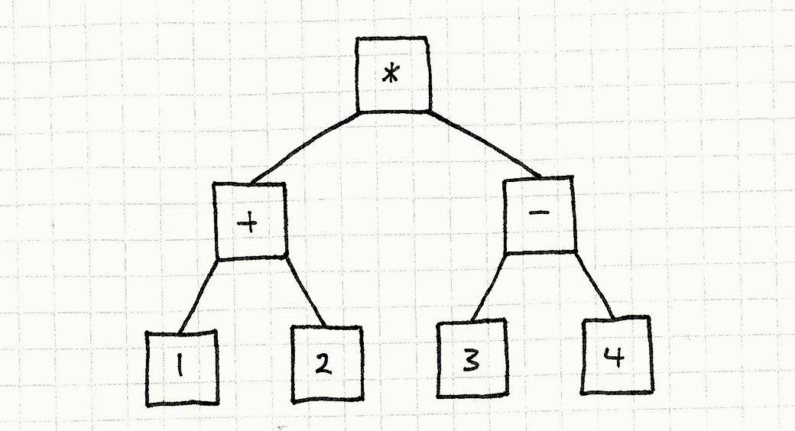
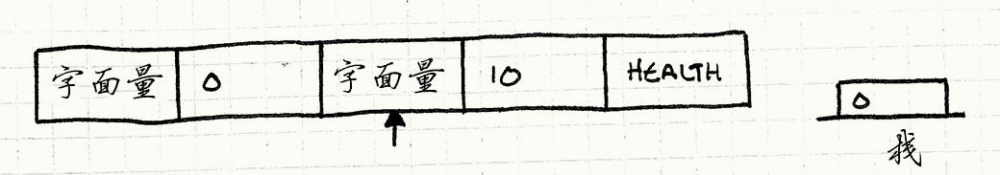
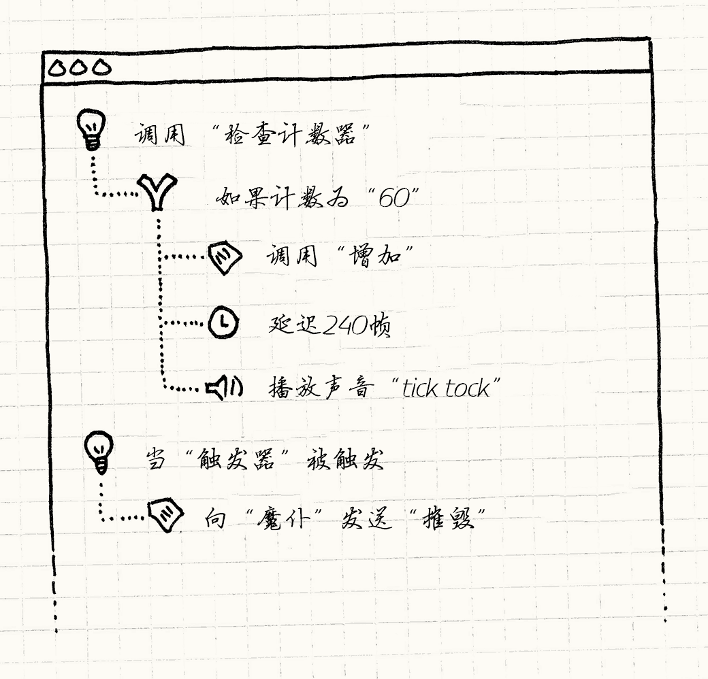

# 字节码（Bytecode）

> **章节**：行为模式（Behavioral Patterns）  
> **原著**：Robert Nystrom (Bob Nystrom) · 《Game Programming Patterns》  
> **导航**：[目录](README.md) ｜ [上一章：行为模式](behavioral-patterns.md) ｜ [下一章：子类沙箱](subclass-sandbox.md)

---

## 意图

*将行为编码为虚拟机器上的指令，赋予其数据的灵活性。*

## 动机


制作游戏也许很有趣，但绝不容易。
现代游戏的代码库很是庞杂。
主机厂商和应用市场有严格的质量要求，
小小的崩溃漏洞就能阻止游戏发售。

> [!NOTE] 旁注
> 我曾参与制作有六百万行C++代码的游戏。作为对比，控制好奇号火星探测器的软件还没有其一半大小。

与此同时，我们希望榨干平台的每一点性能。
游戏对硬件的压榨无出其右，只有坚持不懈地优化才能跟上竞争。

为了保证稳定性和性能，我们使用C++这样的重量级编程语言：它既有能充分利用硬件的底层表达能力，又有能防止（或至少约束）漏洞的丰富类型系统。

我们为自己的这门手艺感到自豪，但它是有代价的。
要成为熟练的程序员，需要多年专注的训练，之后还要与庞大的代码库体量搏斗。
构建大型游戏所需的时间，可能在“喝杯咖啡”和
“烤咖啡豆、手磨咖啡豆、做杯espresso、打奶泡、在拿铁上拉花”之间变动。

除开这些挑战，游戏还多了个苛刻的限制：“乐趣”。
玩家需要既新颖又经过精心平衡的游玩体验。
这需要不断的迭代，但如果每次微调都得去烦工程师，让他们在一堆底层代码里折腾，然后再等一场冰川般缓慢的重新编译，创作灵感就被扼杀了。

### 法术战斗！

假设我们在完成一个基于法术的格斗游戏。
两名巫师摆开阵势，互相丢法术，直到决出胜者。
我们可以将这些法术都定义在代码中，但这就意味着每次修改法术都会牵扯到工程师。
当设计师想微调几个数字找找手感，就得重新编译整个游戏、重启，再回到战斗中。

像现在的许多游戏一样，我们也需要在发售之后更新游戏，修复漏洞或是添加新内容。
如果所有法术都是硬编码的，那么每次修改都意味着要给游戏的可执行文件打补丁。

更进一步，假设我们还想支持*模组*。我们想让*玩家*创造自己的法术。
如果它们写在代码里，那每个模组作者都得备齐一整套编译器工具链来构建游戏，
我们还得开放源代码。更糟的是，如果他们的法术里有个bug，还可能把别的玩家机器上的游戏搞崩溃。

### 数据 > 代码

显然，我们引擎的实现语言并不是合适的选择。
我们需要将法术放在与游戏核心隔绝的沙箱中。
我们想要它们易于修改、易于重新加载，并在物理上独立于可执行文件的其他部分。

我不知道你怎么想，但在我看来，这听上去简直太像*数据*了。
如果能在分离的数据文件中定义行为，游戏引擎还能加载并“执行”它们，就可以实现所有目标。

我们只需要弄清“执行”对数据意味着什么。如何让文件中的一些字节表达行为呢？这里有几种方式。
我认为，把它与另一个模式——[解释器模式](http://en.wikipedia.org/wiki/Interpreter_pattern)——对比着看，会帮助你看清本模式的优缺点。

### 解释器模式

关于这个模式，我本可以写上一整章，但已经有另外四个家伙替我写好了。
所以，我只在这里塞进一份最简短的介绍。

它源于一种你想要执行的语言——想想*编程*语言。

比如，它支持这样的算术表达式

    ```text
    (1 + 2) * (3 - 4)
    ```

然后，把每块表达式，每条语言规则，都装到*对象*中去。数字字面量都变成对象：


简单地说，它们在原始值上做了个小封装。
运算符也是对象，它们拥有操作数的引用。
如果你考虑了括号和优先级，那么表达式就魔术般变成这样的小树：



> [!NOTE] 旁注
> 这里的“魔术”是什么？很简单——*语法分析*。
> 语法分析器接受一串字符作为输入，将其转为*抽象语法树*，即一个包含了表示文本语法结构的对象集合。
>
> 随手写一个，你就拥有了半个编译器。

解释器模式关注的不是*创建*这棵树，而是*执行*这棵树。
它工作的方式非常巧妙。树中的每个对象都是表达式或子表达式。
用真正面向对象的方式描述，我们会让表达式自己对自己求值。

首先，我们定义所有表达式都实现的基本接口：

```cpp
class Expression
{
public:
  virtual ~Expression() {}
  virtual double evaluate() = 0;
};
```

然后，为我们语言中的每种语法定义一个实现这个接口的类。最简单的是数字：

```cpp
class NumberExpression : public Expression
{
public:
  NumberExpression(double value)
  : value_(value)
  {}

  virtual double evaluate()
  {
    return value_;
  }

private:
  double value_;
};
```

一个数字字面量表达式就简单地求值为它的值。加法和乘法有点复杂，因为它们包含子表达式。在一个表达式计算自己的值之前，必须先递归地计算其子表达式的值。像这样：


```cpp
class AdditionExpression : public Expression
{
public:
  AdditionExpression(Expression* left, Expression* right)
  : left_(left),
    right_(right)
  {}

  virtual double evaluate()
  {
    // 计算操作数
    double left = left_->evaluate();
    double right = right_->evaluate();

    // 把它们加起来
    return left + right;
  }

private:
  Expression* left_;
  Expression* right_;
};
```

> [!NOTE] 旁注
> 你肯定能想明白乘法的实现是什么样的。

很优雅对吧？只需几个简单的类，现在我们可以表示和计算任意复杂的算术表达式。
只需要创建正确的对象，并正确地连起来。

> [!NOTE] 旁注
> Ruby用了这种实现方法差不多15年。在1.9版本，他们转换到了本章所介绍的字节码。看看我给你节省了多少时间！


这是个优美、简单的模式，但它有一些问题。
看看插图，看到了什么？大量的小盒子，以及它们之间大量的箭头。
代码被表示为众多小对象组成的巨大分形树。这会带来些令人不快的后果：

* 从磁盘上加载它需要实例化并连接成吨的小对象。


* 这些对象和它们之间的指针会占据大量的内存。在32位机上，那个小的算术表达式至少要占据68字节，这还没考虑内存对齐呢。

    > [!NOTE] 旁注
    > 如果你想在家跟着一起算，别忘了把虚函数表指针也算进去。


* 顺着那些指针遍历子表达式是对数据缓存的谋杀。同时，虚函数调用是对指令缓存的屠戮。

    > [!NOTE] 旁注
    > 参见[数据局部性](data-locality.md)一章以了解什么是缓存以及它是如何影响游戏性能的。

把这些凑到一块儿，拼出来的是什么？S-L-O-W。
这就是为什么大多数广泛使用的编程语言都不采用解释器模式：
它实在太慢，也太吃内存了。

### 虚拟的机器码

想想我们的游戏。玩家电脑在运行游戏时并不会遍历一堆C++语法结构树。
我们提前将其编译成了机器码，CPU基于机器码运行。机器码有什么好处呢？

* *密集。* 它是一块坚实连续的二进制数据块，没有一位被浪费。

* *线性。* 指令紧凑排列，一条紧接着一条执行。不会在内存里到处乱跳（当然，除非你确实在进行真正的控制流）。

* *底层。* 每条指令都做一件小事，有趣的行为从*组合*中诞生。

* *速度快。* 综合所有这些条件（当然，也包括它直接由硬件实现这一事实），机器码跑得跟风一样快。


这听起来很好，但我们不希望真的用机器码来写法术。
让用户提供由我们游戏执行的机器码，简直是在招惹安全问题。我们需要的是机器码的性能和解释器模式的安全之间的折中。

如果不是加载机器码并直接执行，而是定义自己的*虚拟*机器码呢？
然后，在游戏中写个小模拟器。
这与机器码类似——密集，线性，相对底层——但也由游戏直接掌控，所以可以放心地将其放入沙箱。

> [!NOTE] 旁注
> 这就是为什么很多游戏主机和iOS不允许程序执行在运行时加载或生成的机器码。
> 这挺扫兴的，因为最快的编程语言实现恰恰就是这么干的。
> 它们包含了“即时（just-in-time）”编译器，或者*JIT*，在运行时将语言翻译成优化的机器码。


我们将小模拟器称为*虚拟机*（或简称“VM”），它运行的二进制机器码叫做*字节码*。
它既有用数据定义事物的灵活性和易用性，又比解释器模式这样的高层表示性能更好。

> [!NOTE] 旁注
> 在编程语言圈子里，“虚拟机”和“解释器”是同义词，我在这里交替使用。
> 当指代GoF的解释器模式，我会加上“模式”来表明区别。

这听起来有点吓人。
本章剩余部分的目标是向你展示：只要把功能清单控制得很精简，它实际上相当容易上手。
即使最终没有使用这个模式，你也至少可以对Lua和其他使用了这一模式的语言有个更好的理解。

## 模式

**指令集** 定义了可执行的底层操作。
一系列的指令被编码为**字节序列**。
**虚拟机** 使用 **中间值栈** 依次执行这些指令。
通过组合指令，可以定义复杂的高层行为。

## 何时使用

这是本书中最复杂的模式，可不能轻率地把它扔进游戏里。这个模式应当用在你有许多行为需要定义，而游戏实现语言因为如下原因不适用时：

* 过于底层，繁琐易错。
* 编译慢或者其他工具因素导致迭代缓慢。
 * 它被信任过了头。如果想确保所定义的行为不会破坏游戏，就需要把它与代码库的其他部分隔离开来。

当然，这张列表描述了你游戏的很多方面。谁不希望有更快的迭代循环和更多的安全性？
然而，世上没有免费的午餐。字节码比原生代码慢，所以不适合引擎中性能关键的部分。

## 记住


创建自己的语言，或者建立系统中的系统，有一种诱人之处。
我在这里做的是小演示，但在现实项目中，这些东西会像藤蔓一样疯长。

> [!NOTE] 旁注
> 对我来说，游戏开发也以同样的方式引人入胜。
> 不管哪种情况，我都是在努力创造一个让他人游玩和发挥创造力的虚拟空间。


每当我看到有人定义小语言或脚本系统，他们都说，“别担心，它很小。”
于是，不可避免地，他们会不断增加小功能，直到它变成一门完整的语言。
只不过，与某些其他语言不同，它是在一种临时拼凑、自然生长的过程中发展起来的，其建筑上的优雅程度堪比一座棚户区。

> [!NOTE] 旁注
> 例如每一种模板语言。

当然，做出一门完整的语言并没有什么*错*。只是要确保你是刻意为之。 否则，就要非常小心地控制你的字节码所能表达的范围。趁它还没从你身边跑掉，先给它拴上条短绳。

### 你需要一个前端


底层的字节码指令性能优越，但是二进制的字节码格式*不是*用户会去编写的东西。
我们将行为移出代码的一个原因是想要以更*高层*的形式表示它。
如果说写C++太过底层，那么让你的用户实际上用汇编语言编写——即便那是你自己设计的汇编——也谈不上改进！

> [!NOTE] 旁注
> 一个反例是令人尊敬的游戏[RoboWar](http://en.wikipedia.org/wiki/RoboWar)。
> 在游戏中，*玩家*用一门与汇编（以及我们这里将要讨论的指令集）非常相似的语言编写小程序来控制机器人。
>
> 这是我第一次接触类似汇编的语言。

就像GoF的解释器模式，它假设你有某些方法来*生成*字节码。
通常情况下，用户在更高层编写行为，再用工具将其翻译为虚拟机能理解的字节码。
这里的工具就是编译器。

我知道，这听起来很吓人。正因如此，我才在这里先提出来。
如果你没有资源去构建创作工具，那么字节码不适合你。
但是，接下来你会看到，事情也可能没你想的那么糟。

### 你会想念调试器

编程很难。我们知道想要机器做什么，但并不总能正确地传达——所以我们会写出漏洞。
为了查找和修复漏洞，我们已经积累了一堆工具来了解代码做错了什么，以及如何修正。
我们有调试器，静态分析器，反编译工具等。
所有这些工具都是为现有的语言设计的：无论是机器码还是某些更高层次的东西。

当你定义自己的字节码虚拟机时，你就得把这些工具抛在脑后了。
当然，你可以在调试器中单步调试虚拟机，但它告诉你的是虚拟机*本身*在做什么，而不是它正在解释的字节码在做什么。

它当然也不会把字节码映射回编译前的高层次的形式。


如果你定义的行为很简单，可能无需太多工具帮忙调试就能勉强坚持下来。
但随着内容规模增长，就应计划投入实实在在的时间来构建功能，让用户看到他们的字节码在做什么。
这些功能也许不随游戏发布，但它们至关重要，它们能确保你的游戏*能*被发布。

> [!NOTE] 旁注
> 当然，如果你想要让游戏支持模组，那你*会*发布这些特性，它们就更加重要了。

## 示例代码

经历了前面几节之后，你也许会惊讶于它的实现是多么直截了当。
首先需要为虚拟机设定一套指令集。
在开始考虑字节码之类的东西前，先把它当作一个API来思考。

### 法术的API

如果直接使用C++代码定义法术，代码需要调用何种API呢？
在游戏引擎中，构成法术的基本操作是什么样的？

大多数法术最终改变的是巫师的某项属性，所以我们先来定义几个这样的方法。

```cpp
void setHealth(int wizard, int amount);
void setWisdom(int wizard, int amount);
void setAgility(int wizard, int amount);
```

第一个参数指定哪个巫师被影响，`0`代表玩家而`1`代表对手。
这样一来，治愈法术可以作用于玩家自己的巫师，而伤害法术则打击他的宿敌。
这三个小方法能覆盖的法术种类出人意料地多。

如果法术只是默默地调整属性，游戏逻辑就已经完成了，
但玩这样的游戏会让玩家无聊得要哭。让我们修复这点：

```cpp
void playSound(int soundId);
void spawnParticles(int particleType);
```

这些并不影响游戏玩法，但它们提升了游戏*体验*的强度。
我们可以增加一些镜头晃动，动画之类的，但这足够我们开始了。

### 法术指令集

现在让我们把这种*程序化*的API转化为可被数据控制的东西。
先从小处着手，再一步步扩展到整套东西。
现在，我们先丢掉这些方法的所有参数。
假设`set__()`方法总影响玩家自己的巫师，并总是把属性直接设为最大值。
同样，FX操作总是播放一个硬编码的声音和粒子效果。

这样，一个法术就只是一系列指令了。
每条指令都标识了你想执行的操作。我们可以枚举如下：

```cpp
enum Instruction
{
  INST_SET_HEALTH      = 0x00,
  INST_SET_WISDOM      = 0x01,
  INST_SET_AGILITY     = 0x02,
  INST_PLAY_SOUND      = 0x03,
  INST_SPAWN_PARTICLES = 0x04
};
```


为了将法术编码进数据，我们存储一个`enum`值数组。
我们只有几种不同的基本操作原语，因此`enum`值的取值范围可以轻松放进一个字节。
这就意味着法术的代码就是一系列字节——也就是“字节码”。


> [!NOTE] 旁注
> 有些字节码虚拟机为每条指令使用多个字节，解码规则也更复杂。
> 事实上，在x86这样的常见芯片上的机器码更加复杂。
>
> 但单字节对于[Java虚拟机](http://en.wikipedia.org/wiki/Java_virtual_machine)和支撑了.NET平台的[Common Language Runtime](http://en.wikipedia.org/wiki/Common_Language_Runtime)已经足够了，对我们来说也一样。

为了执行一条指令，我们看看它的基本操作原语是什么，然后调用正确的API方法。

```cpp
switch (instruction)
{
  case INST_SET_HEALTH:
    setHealth(0, 100);
    break;

  case INST_SET_WISDOM:
    setWisdom(0, 100);
    break;

  case INST_SET_AGILITY:
    setAgility(0, 100);
    break;

  case INST_PLAY_SOUND:
    playSound(SOUND_BANG);
    break;

  case INST_SPAWN_PARTICLES:
    spawnParticles(PARTICLE_FLAME);
    break;
}
```

用这种方式，解释器在代码世界和数据世界之间架起了桥梁。我们可以像这样把它包装成一个能执行整个法术的小型虚拟机：

```cpp
class VM
{
public:
  void interpret(char bytecode[], int size)
  {
    for (int i = 0; i < size; i++)
    {
      char instruction = bytecode[i];
      switch (instruction)
      {
        // 每条指令的跳转分支……
      }
    }
  }
};
```

输入这些，你就写出了你的首个虚拟机。
不幸的是，它并不灵活。
我们无法定义影响对手的法术，也无法降低某项属性。我们只能播放一种声音！

为了获得像一个真正的语言那样的表达能力，我们需要在这里引入参数。

### 栈式机器

要执行复杂的嵌套表达式，得先从最里面的子表达式开始。
计算完里面的，将结果作为参数向外流向包含它们的表达式，
直到得出最终结果，整个表达式就算完了。


解释器模式将其明确地表现为嵌套对象组成的树，但我们想要的是扁平指令列表的速度。我们仍然需要确保子表达式的结果正确地流向包含它的外层表达式。

但由于数据是扁平的，我们得使用指令的*顺序*来控制这一点。我们的做法和CPU一样——使用栈。

> [!NOTE] 旁注
> 这种架构被毫不花哨地称为[*栈式计算机*](http://en.wikipedia.org/wiki/Stack_machine)。像[Forth](http://en.wikipedia.org/wiki/Forth_(programming_language))，[PostScript](http://en.wikipedia.org/wiki/PostScript)，和[Factor](http://en.wikipedia.org/wiki/Factor_(programming_language)) 这些语言直接将这点暴露给用户。

```cpp
class VM
{
public:
  VM()
  : stackSize_(0)
  {}

  // 其他代码……

private:
  static const int MAX_STACK = 128;
  int stackSize_;
  int stack_[MAX_STACK];
};
```

虚拟机用内部栈保存值。在例子中，指令交互的值只有一种，那就是数字，
所以可以使用简单的`int`数组。
每当数据需要从一条指令传到另一条，它就得通过栈。

顾名思义，值可以压入栈或者从栈弹出，所以让我们添加一对方法。

```cpp
class VM
{
private:
  void push(int value)
  {
    // 检查栈溢出
    assert(stackSize_ < MAX_STACK);
    stack_[stackSize_++] = value;
  }

  int pop()
  {
    // 保证栈不是空的
    assert(stackSize_ > 0);
    return stack_[--stackSize_];
  }

  // 其余的代码
};
```

当一条指令需要接受参数，就将参数从栈弹出，如下所示：

```cpp
switch (instruction)
{
  case INST_SET_HEALTH:
  {
    int amount = pop();
    int wizard = pop();
    setHealth(wizard, amount);
    break;
  }

  case INST_SET_WISDOM:
  case INST_SET_AGILITY:
    // 像上面一样……

  case INST_PLAY_SOUND:
    playSound(pop());
    break;

  case INST_SPAWN_PARTICLES:
    spawnParticles(pop());
    break;
}
```

为了将一些值*存入*栈中，需要另一条指令：字面量。
它代表了原始的整数值。但是*它*的值又是从哪里来的呢？
我们怎样才能避免陷入“乌龟叠乌龟”式的无限递归呢？

技巧是利用指令流是字节序列这一事实——我们可以直接把数值塞进字节数组。
如下，我们为数值字面量定义了另一条指令类型：

```cpp
case INST_LITERAL:
{
  // 从字节码中读取下一个字节
  int value = bytecode[++i];
  push(value);
  break;
}
```

> [!NOTE] 旁注
> 这里，从单个字节中读取值，从而避免了解码多字节整数需要的代码，
> 但在真实实现中，你会需要支持整个数域的字面量。


它读取字节码流中的下一个字节，*将其作为数值*压入栈。

让我们把一些这样的指令串起来看看解释器的执行，感受下栈是如何工作的。
从空栈开始，解释器指向第一个指令：


首先，它执行第一条`INST_LITERAL`，读取字节码流的下一个字节(`0`)并压入栈中。



然后，它执行第二条`INST_LITERAL`，读取`10`然后压入。


最后，执行`INST_SET_HEALTH`。这会弹出`10`存进`amount`，弹出`0`存进`wizard`。然后用这两个参数调用`setHealth()`。

搞定！我们得到了一个把玩家巫师血量设为10点的法术。
现在我们拥有了足够的灵活度，来定义把任一巫师的属性设为任意值的法术。
我们还可以播放不同的声音，生成粒子效果。

但是……这感觉还是像*数据*格式。比如，不能将巫师的血量提升相当于其智慧的一半。
设计师希望法术能表达*规则*，而不仅仅是*数值*。

### 行为 = 组合

如果我们视小虚拟机为编程语言，现在它能支持的只有一些内置函数，以及常量参数。
为了让字节码感觉像*行为*，我们缺少的是*组合*。

设计师需要能以有趣的方式组合不同的值，来创建表达式。
举个简单的例子，他们想让法术*按一定量*修改属性，而不是*把属性设为*某个值。

这需要考虑到属性的当前值。
我们有*写入*属性的指令，现在需要再添加几条*读取*属性的指令：

```cpp
case INST_GET_HEALTH:
{
  int wizard = pop();
  push(getHealth(wizard));
  break;
}

case INST_GET_WISDOM:
case INST_GET_AGILITY:
  // 你知道思路了吧……
```

正如你所看到的，这要与栈双向交互。
弹出一个参数来确定获取哪个巫师的属性，然后查找属性值并压回栈中。

这允许我们创造复制属性的法术。
我们可以创建一个法术，根据巫师的智慧设定敏捷度，或者写一条古怪的咒语，让一名巫师的血量镜像成对手的血量。

有所改善，但仍很受限制。接下来，我们需要算术。
是时候让小虚拟机学习如何计算1 + 1了，我们将添加更多的指令。
现在，你可能已经知道如何去做，猜到了大概的模样。我只展示加法：

```cpp
case INST_ADD:
{
  int b = pop();
  int a = pop();
  push(a + b);
  break;
}
```

像其他指令一样，它弹出数值，做点工作，然后压入结果。
在此之前，每条新指令都只是让表达力渐进提升，但我们刚刚完成了一次大飞跃。
这并不显而易见，但现在我们可以处理各种复杂的，深层嵌套的算术表达式了。

来看个稍微复杂点的例子。
假设我们希望有个法术，能让玩家巫师的血量增加其敏捷和智慧的平均值。
用代码表示如下：

```cpp
setHealth(0, getHealth(0) +
    (getAgility(0) + getWisdom(0)) / 2);
```

你可能会认为我们需要指令来处理括号造成的分组，但栈隐式支持了这一点。可以手算如下：

1. 获取巫师当前的血量并记录。
2. 获取巫师敏捷并记录。
3. 对智慧执行同样的操作。
4. 获取最后两个值，加起来并记录。
5. 除以二并记录。
6. 回想巫师的血量，将它和这结果相加并记录。
7. 取出结果，设置巫师的血量为这一结果。

你看到这些“记录”和“回想”了吗？每个“记录”对应一个压入，“回想”对应弹出。
这意味着可以很容易将其转化为字节码。例如，第一行获得巫师的当前血量：

    ```text
    ```
    LITERAL 0
    GET_HEALTH

这些字节码将巫师的血量压入堆栈。
如果我们机械地将每行都这样转化，最终得到一大块等价于原来表达式的字节码。
为了让你感觉这些指令是如何组合的，我在下面给你做个示范。

为了展示堆栈如何随着时间推移而变化，我们举个代码执行的例子。
巫师目前有45点血量，7点敏捷，和11点智慧。
每条指令的右边是栈在执行指令之后的模样，再右边是解释指令意图的注释：

    ```text
    ```
    LITERAL 0    [0]            # 巫师索引
    LITERAL 0    [0, 0]         # 巫师索引
    GET_HEALTH   [0, 45]        # 获取血量()
    LITERAL 0    [0, 45, 0]     # 巫师索引
    GET_AGILITY  [0, 45, 7]     # 获取敏捷()
    LITERAL 0    [0, 45, 7, 0]  # 巫师索引
    GET_WISDOM   [0, 45, 7, 11] # 获取智慧()
    ADD          [0, 45, 18]    # 将敏捷和智慧加起来
    LITERAL 2    [0, 45, 18, 2] # 被除数：2
    DIVIDE       [0, 45, 9]     # 计算敏捷和智慧的平均值
    ADD          [0, 54]        # 将平均值加到现有血量上。
    SET_HEALTH   []             # 将结果设为血量


如果你注意每步的栈，你可以看到数据如何魔法一般地在其中流动。
我们最开始压入`0`作为巫师索引，然后它一直挂在栈的底部，直到最后的`SET_HEALTH`才用到它。

> [!NOTE] 旁注
> 也许我在这里对“魔法”的门槛设得太低了。

### 一台虚拟机

我可以继续下去，添加越来越多的指令，但现在是停下来的好时机。
就目前而言，我们已经有了一个可爱的小虚拟机，可以用简单、紧凑的数据格式定义相当开放的行为。
虽然“字节码”和“虚拟机”听起来很吓人，但你可以看到它们往往简单到只需一个栈、一个循环和一个switch语句。

还记得我们最初的目标——让行为乖乖待在沙盒里吗？
现在，你已经看到虚拟机是如何实现的，很明显，那个目标已经完成。
字节码不能把恶意触角伸到游戏引擎的其他部分，因为我们只定义了几个与其他部分接触的指令。


我们通过控制栈的大小来控制内存使用量，并很小心地确保它不会溢出。
我们甚至可以控制它使用多少*时间*。
在指令循环里，我们可以追踪已经执行了多少指令，如果超过某个上限就退出。

> [!NOTE] 旁注
> 控制运行时间在例子中没有必要，因为我们没有任何用于循环的指令。
> 可以限制字节码的总体大小来限制运行时间。
> 这也意味着我们的字节码不是图灵完备的。

现在就剩一个问题了：创建字节码。
到目前为止，我们都是拿几段伪代码，再手工把它编译成字节码。
除非你有*很多*的空闲时间，否则这种方式并不实用。

### 施法工具

我们最初的目标之一是拥有一种更*高层*的方式来*编写*行为，结果却搞出了一个比C++还*底层*的东西。
它具有我们想要的运行性能和安全性，但绝对没有对设计师友好的可用性。

为了填补这一空白，我们需要一些工具。
我们需要一个程序，让用户定义法术的高层次行为，然后生成对应的低层栈式机字节码。


这可能听起来比虚拟机更难。
许多程序员都在大学里被拖着上完编译原理课，除了看到封面带龙的书，或者“[lex](http://en.wikipedia.org/wiki/Lex_(software))”和“[yacc](http://en.wikipedia.org/wiki/Yacc)”这些词会引发PTSD之外，什么也没真正学到。

> [!NOTE] 旁注
> 我指的，当然，是经典教材[*Compilers: Principles, Techniques, and Tools*](http://en.wikipedia.org/wiki/Compilers:_Principles,_Techniques,_and_Tools)。

事实上，编译一门基于文本的语言并没有那么糟，只不过这个话题要硬塞进本章还是*稍微*宽泛了点。但是，你不是非得那么做。
我前面说的是，我们需要的是*工具*——它并不一定是个输入格式为*文本文件*的*编译器*。

相反，我建议你考虑构建图形界面让用户定义自己的行为，
尤其是在使用它的人没有很高的技术水平时。
没有花几年时间习惯编译器怒吼的人很难写出没有语法错误的文本。

你可以构建一个应用程序，让用户通过单击拖动小盒子、下拉菜单项，或任何对你希望他们创建的行为类型有意义的方式，来编写“脚本”。




> [!NOTE] 旁注
> 我为[Henry Hatsworth in the Puzzling Adventure][hatsworth]编写的脚本系统就是这么工作的。
>
> [hatsworth]: http://en.wikipedia.org/wiki/Henry_Hatsworth_in_the_Puzzling_Adventure


这样做的好处是，你的UI可以保证用户无法创建“无效的”程序。
与其向他们吐一大堆错误警告，不如主动禁用按钮或提供默认值，
以确保他们创造的东西在任何时间点上都有效。

> [!NOTE] 旁注
> 我想要强调错误处理是多么重要。作为程序员，我们倾向于把人为错误看作一种可耻的性格缺陷，并努力在自己身上消除它。
>
> 为了制作用户喜欢的系统，你需要接纳他们的人性，*包括他们的易错性*。犯错是人之常情，也是创作过程的基本组成部分。
> 用撤销这样的特性优雅地处理它们，这能让用户更有创意，创作出更好的成果。

这免去了设计语法和编写解析器的工作。
但是我知道，你们中的一些人会觉得UI编程同样令人不快。
好吧，如果是这样，我也没有什么好消息给你。

归根结底，这种模式是关于以对用户友好的高层方式表达行为。
你必须精心打造用户体验。
要高效地执行行为，又需要将其转换成底层形式。这是实打实的工作，但如果你准备好迎接挑战，它会有所回报。

## 设计决策


我本想尽可能让本章简短，但我们所做的事情实际上可是创造语言啊。
那可是个宽泛的设计领域，你可以从中获得很多乐趣，所以别沉迷于此反而忘了完成你的游戏。

> [!NOTE] 旁注
> 这是本书中最长的章节，看来我失败了。

### 指令如何访问堆栈？

字节码虚拟机主要有两种：基于栈的和基于寄存器的。
栈式虚拟机中，指令总是操作栈顶，如同我们的示例代码所示。
例如，`INST_ADD`弹出两个值，将它们相加，将结果压入。

基于寄存器的虚拟机也有栈。唯一不同的是指令可以从栈的深处读取值。
不像`INST_ADD`始终*弹出*其操作数，
它在字节码中存储两个索引，指示了从栈的何处读取操作数。

* **基于栈的虚拟机：**

    *  *指令短小。*
      由于每个指令隐式认定在栈顶寻找参数，不需要为任何数据编码。
      这意味着每条指令可能会非常短，一般只需一个字节。

    *  *易于生成代码。*
      当你需要为生成字节码编写编译器或工具时，你会发现基于栈的字节码更容易生成。
      由于每个指令隐式地在栈顶工作，你只需要以正确的顺序输出指令就可以在它们之间传递参数。

     *  *你会有更多的指令。*
        每条指令只能看到栈顶。这意味着，产生像`a = b + c`这样的代码，
         你需要单独的指令将`b`和`c`移到栈顶，执行操作，再把结果移入`a`。

* **基于寄存器的虚拟机：**

    

     *  *指令较长。*
        由于指令需要参数记录栈偏移量，单个指令需要更多的位。
         例如，Lua——可能是最著名的基于寄存器的虚拟机——中的一条指令就有完整的32位。
         它采用6位做指令类型，其余的是参数。

    > [!NOTE] 旁注
    > Lua团队没有指定Lua的字节码格式，而且它在每个版本之间都会变化。我这里描述的内容在Lua 5.1中是正确的。
    >     要深究Lua的内部构造，
    >     读读[这个](http://luaforge.net/docman/83/98/ANoFrillsIntroToLua51VMInstructions.pdf)。

    * *你会有更少的指令。*
      由于每个指令可以做更多的工作，你不需要那么多的指令。
      有人说，性能会得以提升，因为不需要将值在栈中移来移去了。

那么，该选哪种？我的建议是坚持使用基于栈的虚拟机。
它们更容易实现，也更容易生成代码。
Lua 改用这种风格之后变得更快，寄存器式虚拟机由此博得了“快一点”的名声，
但这*深深*取决于你实际的指令，以及虚拟机的许多其他细节。

### 你有什么指令？

指令集定义了在字节码中可以干什么，不能干什么，对虚拟机性能也有很大的影响。
这里有个清单，记录了你可能需要的不同种类的指令：

* **外部基本操作原语。**
  这类指令会伸出虚拟机，进入游戏引擎的其他部分，做玩家能看到的事情。
  它们控制了字节码可以表达的真实行为。
  如果没有这些，你的虚拟机除了消耗CPU循环以外一无所得。

* **内部基本操作原语**
  这些指令在虚拟机内操作数值——比如字面量、算术、比较运算符，以及摆弄栈的指令。

* **控制流。**
  我们的例子没有包含这些，但当你想要命令式的行为——有条件地执行指令，或循环地多次执行指令——就需要控制流。
  在字节码这样底层的语言中，它们出奇地简单：跳转。

    在我们的指令循环中，用索引来跟踪执行到了字节码的哪里。
    跳转指令所做的就是修改这个变量，从而改变当前执行的位置。
    换言之，这就是`goto`。你可以用它构建各种更高层的控制流。

* **抽象。**
  如果用户开始在数据中定义*很多*东西，最终他们会想要重用字节码片段，而不是复制粘贴。
  你也许会需要可调用过程这样的东西。

    最简单的形式中，过程并不比跳转复杂。
    唯一不同的是，虚拟机需要管理另一个*返回*栈。
    当执行“call”指令时，将当前指令索引压入返回栈，然后跳转到被调用的字节码。
    当它执行到“return”时，虚拟机从返回栈弹出索引，然后跳回那个位置。

### 数值是如何表示的？

我们的虚拟机示例只与一种值打交道：整数。
这让回答这个问题变得简单——栈只是一个`int`栈。
功能更完善的虚拟机会支持不同的数据类型：字符串、对象、列表等。
你必须决定在内部如何存储这些值。

* **单一数据类型：**

    * *简单。*
      你不必担心类型标签、转换或类型检查。

    * *无法使用不同的数据类型。*
      这是明显的缺点。把不同类型硬塞进单一的表示形式——比如把数字存成字符串——这是自找麻烦。

* **带类型标签的联合体：**

    这是动态类型语言中常见的表示法。
    所有的值有两部分。
    第一部分是类型标签——一个标识所存储数据类型的`enum`。其余位则根据该类型进行相应解释，比如：

    ```cpp
    enum ValueType
    {
      TYPE_INT,
      TYPE_DOUBLE,
      TYPE_STRING
    };

    struct Value
    {
      ValueType type;
      union
      {
        int    intValue;
        double doubleValue;
        char*  stringValue;
      };
    };
    ```

    * *值知道自己的类型。*
      这个表示法的好处是可以在运行时检查值的类型。
      这对动态分派很重要，也能确保你不会试图对不支持某操作的类型执行该操作。

    * *消耗更多内存。*
      每个值都要带一些额外的位来标识类型。在像虚拟机这样的底层，这里几位，那里几位，总量就会快速增加。

* **无类型标签的union：**

    像前面一样使用union，但是*没有*类型标签。
    你有一小团可以表示多种类型的位，得由你自己确保不会误解它们。

    

    这是静态类型语言在内存中表示事物的方式。
    由于类型系统在编译时保证没弄错值的类型，不需要在运行时对其进行验证。

    > [!NOTE] 旁注
    > 这也是*无类型*语言，比如汇编和Forth存储值的方式。
    >     这些语言把确保不写出误解值类型代码的责任留给*用户*。这可不是胆小者能干的！

    * *结构紧凑。*
      找不到比只存储需要的值更加有效率的存储方式。

    * *速度快。*
      没有类型标签意味着在运行时无需消耗周期检查它们的类型。这是静态类型语言往往比动态类型语言快的原因之一。

    

    * *不安全。* 当然，这是真正的代价。一段错误的字节码如果让你误解某个值——把数字当作指针，或反过来——就可能破坏游戏的安全，或导致游戏崩溃。

        > [!NOTE] 旁注
        > 如果你的字节码是由静态类型语言编译而来，你也许认为这里是安全的，因为编译器不会生成不安全的字节码。
        >         那也许没错，但请记住，恶意用户也许不经过你的编译器，直接手工构造恶意的字节码。
        >
        >         举个例子，这就是为什么Java虚拟机在加载程序时要做*字节码验证*。

* **接口：**

    多种类型值的面向对象解决方案是通过多态。接口为不同的类型的测试和转换提供虚方法，如下：

    ```cpp
    class Value
    {
    public:
      virtual ~Value() {}

      virtual ValueType type() = 0;

      virtual int asInt() {
        // 只能在int上调用
        assert(false);
        return 0;
      }

      // 其他转换方法……
    };
    ```

    然后你为每个特定的数据类型设计特定的类，如：

    ```cpp
    class IntValue : public Value
    {
    public:
      IntValue(int value)
      : value_(value)
      {}

      virtual ValueType type() { return TYPE_INT; }
      virtual int asInt() { return value_; }

    private:
      int value_;
    };
    ```

    * *开放。*
      可在虚拟机的核心之外定义新的值类型，只要它们实现了基本接口就行。

    *  *面向对象。*
      如果你坚持OOP原则，这是“正确”的做法，为特定类型行为使用多态分派，而不是对类型标签做switch之类的。

    * *冗长。*
      你必须为每个数据类型定义单独的类，还带有一整套相关的仪式性代码。
      注意，在前面的例子中，我们展示了*所有*值类型的完整定义。在这里，只展示了一个！

    * *低效。*
      为了使用多态，必须使用指针，这意味着即使是短小的值，如布尔和数字，也得裹在堆中分配的对象里。
      每使用一个值，你就得做一次虚方法调用。

        在虚拟机核心之类的地方，像这样的性能影响会迅速叠加。
        事实上，这引起了许多我们试图在解释器模式中避免的问题。
        只是现在的问题不在*代码*中，而是在*值*中。

我的建议是：如果可以，只用单一数据类型。
除此以外，使用带类型标签的union。这是世界上几乎每个语言解释器的选择。

### 如何生成字节码？

我将最重要的问题留到最后。我已经带你走完了*消费*和*解释*字节码的代码，
但*生产*字节码的工具要由你来构建。
典型的解决方案是写个编译器，但它不是唯一的选择。

* **如果你定义了基于文本的语言：**

    * *必须定义语法。*
      业余和专业的语言设计师都无一例外地低估了这件事的难度。让解析器满意的语法很简单，让*用户*满意的语法很*难*。

        语法设计是用户界面设计，当你将用户界面限制到字符构成的字符串，这可没把事情变简单。

    * *必须实现解析器。*
      不管名声如何，这部分其实非常简单。无论使用ANTLR或Bison，还是——像我一样——手写递归下降，都可以完成。

    * *必须处理语法错误。*
      这是最重要和最困难的部分。
      当用户犯了语法和语义错误——他们会经常犯——引导他们回到正确道路上就是你的任务。
      当你只知道解析器停在某个意想不到的标点上时，给出有帮助的反馈并不容易。

    * *可能会对非技术用户关上大门。*
      我们程序员喜欢文本文件。配合强大的命令行工具，我们把它们当作计算机的乐高积木——简单，却能以上百万种方式轻松组合。

        大部分非程序员不这样想。
        对他们来说，文本文件就像给一个愤怒的机器人审核员填写税表，忘一个分号就会被它痛斥。

* **如果你定义了一个图形化创作工具：**

    *  *必须实现用户界面。*
      按钮，点击，拖动，诸如此类。
      有些人对这个想法发怵，但我个人很喜欢。
      如果走这条路，重要的是把设计用户界面当作做好本职工作的核心部分——而不是一件硬着头皮糊弄过去的不愉快任务。

        这里每一点额外工作都会让你的工具更容易、更舒适地使用，并直接带来游戏中更好的内容。
        如果你看看许多你喜爱的游戏幕后，往往会发现秘诀就是有趣的创作工具。

    * *错误情况更少。*
      由于用户以交互方式一步一步地构建行为，应用程序可以在错误一出现时就引导他们避开。

        而使用基于文本的语言时，直到用户把整个文件丢给工具，工具才能看到用户内容的*任何一部分*，预防和处理错误就更困难了。

    

    * *更难移植。*
      文本编译器的好处是，文本文件是通用的。编译器简单地读入文件并写出。跨平台移植的工作实在微不足道。

        > [!NOTE] 旁注
        > 除了换行符。还有编码。

        当你构建UI时，必须选择使用哪个框架，而其中许多框架都专属于某个操作系统。
        也有跨平台的UI工具包，但它们往往以牺牲熟悉感为代价换取通用性——在所有平台上都显得同样陌生。

## 参见

* 这个模式的近亲是GoF的[解释器模式](http://en.wikipedia.org/wiki/Interpreter_pattern)。两者都让你能用数据表达可组合的行为。

    事实上，最终你往往会*同时*使用这两种模式。你用来生成字节码的工具内部会有一棵表示代码的对象树。这正是解释器模式所预期的。

    为了把树编译成字节码，你需要递归遍历整棵树，就像用解释器模式解释它一样。
    *唯一的* 不同在于，你不是立即执行一小段原始行为，而是输出一条稍后执行它的字节码指令。

* [Lua](http://www.lua.org/)是游戏中最广泛应用的脚本语言。
  它的内部被实现为一个非常紧凑的，基于寄存器的字节码虚拟机。

* [Kismet](http://en.wikipedia.org/wiki/UnrealEd#Kismet)是个图形化脚本工具，内置于Unreal引擎的编辑器UnrealEd中。

* 我的脚本语言[Wren](https://github.com/munificent/wren)，是一个简单的，基于栈的字节码解释器。

---

> **导航**：[目录](README.md) ｜ [上一章：行为模式](behavioral-patterns.md) ｜ [下一章：子类沙箱](subclass-sandbox.md)
