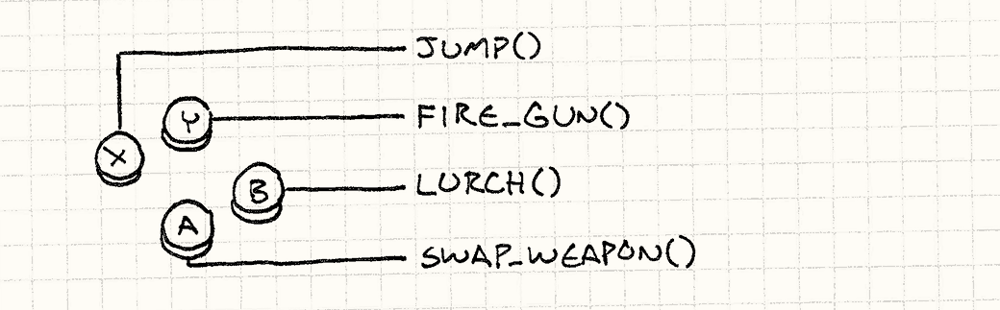
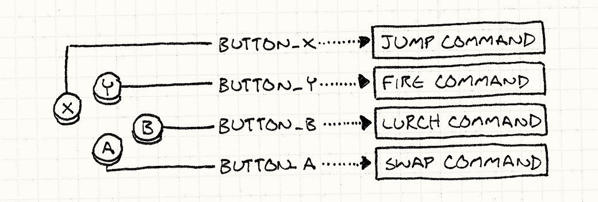
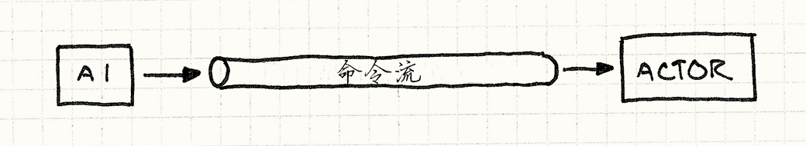

# 命令模式（Command）

> **章节**：重访设计模式（Design Patterns Revisited）  
> **原著**：Robert Nystrom (Bob Nystrom) · 《Game Programming Patterns》  
> **导航**：[目录](README.md) ｜ [上一章：重访设计模式](design-patterns-revisited.md) ｜ [下一章：享元模式](flyweight.md)

---

命令模式是我最喜欢的模式之一。
我写过的大多数大型程序，无论是游戏还是别的什么，最终都会在某个地方用到它。
当用在正确的地方时，它能利落地解开一些缠成一团乱麻的代码。
对于这样一个了不起的模式，不出所料地，GoF有个深奥的定义：

> 将一个请求封装为一个对象，从而使你可用不同的请求对客户进行参数化；
> 对请求排队或记录请求日志，以及支持可撤销的操作。

我想我们都会同意，这句话糟透了。
首先，它把想要建立的比喻搅得一团糟。
在词语可以指代任何事物的怪异软件世界之外，“客户”是一个*人*——那些和你做生意的人。
据我上次查看，人类可没法被“参数化”。

然后，这句话的其余部分只是一份清单，列出你也许、可能用得上这个模式的各种场景。
除非你的用例恰好在那份清单里，否则它没什么启发性。
*我的*命令模式精简定义为：


**命令是*具现化的方法调用*。**

> [!NOTE] 旁注
> “Reify（具现化）”源自拉丁语“res”，意为“thing”（事物），再加上英语后缀“–fy”。
> 所以它基本上就是“thingify（事物化）”，老实说，这个词用起来可有趣多了。

当然，“精简”往往意味着“简短到费解”，所以这也许没改善多少。
让我稍微展开一下。如果你没听说过“具现化”，它的意思是“让……成为真实的东西”。
具现化的另一种说法，是让某事物成为“第一公民”。

> [!NOTE] 旁注
> 某些语言中的*反射系统*让你可以在运行时命令式地操作程序中的类型。
> 你可以获得一个对象，它代表另一个对象所属的类，并摆弄它看看这个类型能做什么。换言之，反射是一种*具现化的类型系统*。

两种说法都意味着将某个*概念*变成一块*数据*
——一个对象——你可以把它放进变量、传给函数，等等。
所以说命令模式是“具现化的方法调用”，我的意思是：它是一次被包装在对象里的方法调用。

这听起来很像“回调”、“第一公民函数”、“函数指针”、“闭包”或“部分应用函数”，
取决于你用的是哪种语言，而事实上它们都大同小异。GoF随后说：

> 命令是回调的面向对象替代品。

这比他们选的那句更适合作为这个模式的简介。

不过这些都既抽象又飘忽。我本来习惯用具体的东西来开篇，这次却搞砸了。
作为弥补，从这里开始，全都是命令模式大放异彩的例子。

## 配置输入

每个游戏里都有一块代码读取原始的用户输入——按键、键盘事件、鼠标点击，诸如此类。
它接收每个输入，并将其转换为游戏中有意义的动作：



一个简单得要命的实现看起来像这样：


```cpp
void InputHandler::handleInput()
{
  if (isPressed(BUTTON_X)) jump();
  else if (isPressed(BUTTON_Y)) fireGun();
  else if (isPressed(BUTTON_A)) swapWeapon();
  else if (isPressed(BUTTON_B)) lurchIneffectively();
}
```

> [!NOTE] 旁注
> 行家提示：别老按B键。

这个函数通常由[游戏循环](game-loop.md)每帧调用一次，我确信你能看懂它在做什么。
如果我们愿意把用户输入硬编码到游戏动作上，这段代码可以正常工作，但许多游戏允许玩家*配置*按键如何映射。

为了支持这一点，我们需要把对`jump()`和`fireGun()`的直接调用变成可以替换掉的东西。
“替换掉”听起来很像给变量赋值，因此我们需要一个用来表示游戏动作的*对象*。于是，命令模式登场了。

我们定义一个基类，代表可触发的游戏命令：


```cpp
class Command
{
public:
  virtual ~Command() {}
  virtual void execute() = 0;
};
```

> [!NOTE] 旁注
> 当你有一个接口，它只有一个不返回任何东西的方法时，它很可能是命令模式。

然后，我们为每一种不同的游戏动作创建子类：

```cpp
class JumpCommand : public Command
{
public:
  virtual void execute() { jump(); }
};

class FireCommand : public Command
{
public:
  virtual void execute() { fireGun(); }
};

// 你知道思路了吧
```

在我们的输入处理器中，为每个按键存储一个指向命令的指针。

```cpp
class InputHandler
{
public:
  void handleInput();

  // 绑定命令的方法……

private:
  Command* buttonX_;
  Command* buttonY_;
  Command* buttonA_;
  Command* buttonB_;
};
```

现在输入处理只需委托给这些命令：


```cpp
void InputHandler::handleInput()
{
  if (isPressed(BUTTON_X)) buttonX_->execute();
  else if (isPressed(BUTTON_Y)) buttonY_->execute();
  else if (isPressed(BUTTON_A)) buttonA_->execute();
  else if (isPressed(BUTTON_B)) buttonB_->execute();
}
```

> [!NOTE] 旁注
> 注意到这里没有检查`NULL`了吗？这是假设每个按键都会连接*某个*命令。
>
> 如果想支持什么也不做的按键，又不想显式检查`NULL`，我们可以定义一个命令类，让它的`execute()`方法什么也不做。
> 然后，与其把按键处理器设为`NULL`，不如让它指向那个对象。这种模式被称为[空对象](http://en.wikipedia.org/wiki/Null_Object_pattern)。

以前每个输入都直接调用函数，现在多了一层间接性：



以上就是命令模式的全部精髓。如果你已经看出它的好处，那么本章剩下的内容就权当是额外奖励了。

## 给角色的指令

我们刚才定义的类可以在之前的例子上正常工作，但有很大的局限。
问题在于，它假设存在顶层的`jump()`、`fireGun()`之类的函数，这些函数暗地里知道怎么找到玩家的角色，然后像扯线木偶一样让它跳舞。

这些假定的耦合限制了这些命令的用处。`JumpCommand`*只能*让玩家角色跳跃。让我们放宽这个限制。
不再调用那些自己去寻找被指挥对象的函数，而是把想要指挥的对象*传进去*：

```cpp
class Command
{
public:
  virtual ~Command() {}
  virtual void execute(GameActor& actor) = 0;
};
```

这里的`GameActor`是代表游戏世界中角色的“游戏对象”类。
我们将其传给`execute()`，这样命令类的子类就可以调用所选游戏对象上的方法，就像这样：

```cpp
class JumpCommand : public Command
{
public:
  virtual void execute(GameActor& actor)
  {
    actor.jump();
  }
};
```

现在，我们可以使用这个类让游戏中的任何角色跳来跳去了。
我们只是还缺一段代码：它在输入处理器和命令之间，接收命令并在正确的对象上调用它。
首先，我们修改`handleInput()`，让它*返回*命令：

```cpp
Command* InputHandler::handleInput()
{
  if (isPressed(BUTTON_X)) return buttonX_;
  if (isPressed(BUTTON_Y)) return buttonY_;
  if (isPressed(BUTTON_A)) return buttonA_;
  if (isPressed(BUTTON_B)) return buttonB_;

  // 没有按下任何按键，就什么也不做
  return NULL;
}
```

它不能立即执行命令，因为还不知道要传入哪个角色。
这里正是利用命令是具现化调用这一点的好机会——我们可以*延迟*调用的执行时机。

然后，我们需要一些代码来接收该命令，并在代表玩家的角色上运行它。比如：

```cpp
Command* command = inputHandler.handleInput();
if (command)
{
  command->execute(actor);
}
```

假设`actor`是对玩家角色的引用，它就会根据用户输入正确地驱动他，
所以我们又回到了与第一个例子相同的行为。
通过在命令和执行命令的角色之间增加一层间接性，
我们获得了一个小巧的能力：*现在，只需改变执行命令时所作用的角色，就能让玩家控制游戏中的任何角色。*

在实践中，这个特性并不经常使用，但是*经常*会有类似的用例跳出来。
到目前为止，我们只考虑了玩家控制的角色，但是游戏中的其他角色呢？
它们由游戏AI驱动。我们可以把同样的命令模式用作AI引擎和角色之间的接口；AI代码只需生成`Command`对象。

选择命令的AI与执行命令的角色代码之间的这种解耦，给了我们很大的灵活性。
我们可以对不同的角色使用不同的AI模块，也可以为不同种类的行为混搭AI。
想要更有攻击性的对手？只需接入一个更有攻击性的AI来为它生成命令。
事实上，我们甚至可以把AI安到*玩家*角色上，这在演示模式等游戏需要自动驾驶运行的情况下很有用。

把控制角色的命令变成第一公民对象，我们就去掉了直接方法调用带来的紧密耦合。
把它看作命令队列，或者是命令流：

> [!NOTE] 旁注
> 关于排队还能为你做什么，参见[事件队列](event-queue.md)。




> [!NOTE] 旁注
> 为什么我觉得有必要为你画一幅“流”的图？它为什么又长得像根管子？

一些代码（输入处理器或AI）*生产*命令，并把它们放进流中。
另一些代码（调度器或角色自身）*消费*并调用命令。
通过在中间放上这个队列，我们把一端的生产者与另一端的消费者解耦了。

> [!NOTE] 旁注
> 如果我们让这些命令*可序列化*，就可以把命令流通过网络发送出去。
> 我们可以拿到玩家的输入，通过网络推送到另一台机器上，然后重放它。这是制作网络多人游戏的一个重要组成部分。

## 撤销和重做


最后一个例子是这种模式最广为人知的用途。
如果一个命令对象能*做*事情，那么让它能*撤销*这些事情，也就只差一小步了。
一些策略游戏会使用撤销，让你回滚那些不喜欢的操作。
在人们用来*制作*游戏的工具里，撤销是*必不可少的*。
让游戏设计师恨你的最稳办法，就是给他们一个无法撤销手滑错误的关卡编辑器。

> [!NOTE] 旁注
> 这大概是我的切身体会。

没有命令模式时，实现撤销难得出奇；有了它，就是小菜一碟。
假设我们在制作单人回合制游戏，想让玩家能撤销移动，这样他们就能把心思更多地放在策略上，而不是靠猜。

我们碰巧已经在用命令来抽象输入处理，所以玩家的每一步行动都已经封装在命令里了。
举个例子，移动一个单位的代码可能如下：

```cpp
class MoveUnitCommand : public Command
{
public:
  MoveUnitCommand(Unit* unit, int x, int y)
  : unit_(unit),
    x_(x),
    y_(y)
  {}

  virtual void execute()
  {
    unit_->moveTo(x_, y_);
  }

private:
  Unit* unit_;
  int x_, y_;
};
```

注意这和前面的命令有些许不同。
在上一个例子中，我们想把命令与它所修改的角色*解耦*。
在这个例子中，我们将命令*绑定*到要移动的单位上。
这条命令的实例不是那种可以在许多情境里使用的通用“移动某物”操作；它是游戏回合序列中的一次具体移动。

这凸显了命令模式实现方式的一种变化。
在某些情况下，比如我们前面的几个例子，命令是一个可重用的对象，代表*一件可以完成的事*。
我们之前的输入处理器持有单个命令对象，每当对应按钮被按下时，就调用它的`execute()`方法。

这里的命令更加具体。它们代表的是在特定时间点可以完成的事情。
这意味着输入处理代码每次在玩家选择一步行动时，都会*创建*一个实例。比如：

```cpp
Command* handleInput()
{
  Unit* unit = getSelectedUnit();

  if (isPressed(BUTTON_UP)) {
    // 向上移动单位
    int destY = unit->y() - 1;
    return new MoveUnitCommand(unit, unit->x(), destY);
  }

  if (isPressed(BUTTON_DOWN)) {
    // 向下移动单位
    int destY = unit->y() + 1;
    return new MoveUnitCommand(unit, unit->x(), destY);
  }

  // 其他的移动……

  return NULL;
}
```

> [!NOTE] 旁注
> 当然，在像C++这样没有垃圾回收的语言中，这意味着执行命令的代码也要负责释放内存。

命令只能用一次这一点，马上就会变成我们的优势。
为了让命令可撤销，我们为每个命令类再定义另一个需要实现的操作：

```cpp
class Command
{
public:
  virtual ~Command() {}
  virtual void execute() = 0;
  virtual void undo() = 0;
};
```

`undo()`方法会逆转对应的`execute()`方法所改变的游戏状态。
这里是添加了撤销功能后的移动命令：

```cpp
class MoveUnitCommand : public Command
{
public:
  MoveUnitCommand(Unit* unit, int x, int y)
  : unit_(unit),
    xBefore_(0),
    yBefore_(0),
    x_(x),
    y_(y)
  {}

  virtual void execute()
  {
    // 保存移动之前的位置
    // 这样之后可以复原。

    xBefore_ = unit_->x();
    yBefore_ = unit_->y();

    unit_->moveTo(x_, y_);
  }

  virtual void undo()
  {
    unit_->moveTo(xBefore_, yBefore_);
  }

private:
  Unit* unit_;
  int xBefore_, yBefore_;
  int x_, y_;
};
```

注意我们为类添加了更多的状态。
当单位移动时，它会忘记自己之前在哪里。
如果我们想撤销这次移动，就得自己记住单位之前的位置，这正是`xBefore_`和`yBefore_`的作用。

> [!NOTE] 旁注
> 这看起来像是使用[备忘录](http://en.wikipedia.org/wiki/Memento_pattern)模式的地方，但我发现它效果并不好。
> 由于命令往往只修改对象状态的一小部分，对其余数据做快照就是浪费内存。手动只存储你修改的那部分数据更节省。
>
> *[持久化数据结构](http://en.wikipedia.org/wiki/Persistent_data_structure)*是另一个选项。
> 使用它，每次修改对象都返回一个新对象，保持原来的对象不变。通过巧妙的实现，这些新对象与之前的对象共享数据，所以比克隆整个对象开销更小。
>
> 使用持久化数据结构，每条命令都存储了命令执行之前对象的引用，而撤销只是切换回之前的对象。

为了让玩家撤销一步行动，我们保留他们执行过的最后一条命令。当他们狂按 Ctrl-Z 时，我们调用那条命令的`undo()`方法。
（如果他们已经撤销过了，那就变成“重做”，我们会再次执行该命令。）

支持多层撤销也不太难。
与其只记住最后一条命令，我们保留一个命令列表和一个指向“当前”命令的引用。
当玩家执行一条命令时，我们把它追加到列表里，并让“当前”指向它。


当玩家选择“撤销”，我们撤销当前命令，并把当前指针往回移。
当他们选择“重做”，我们把指针向前移，然后执行那条命令。
如果在撤销一些命令后又选择了新命令，列表中当前命令之后的所有内容都会被丢弃。

第一次在关卡编辑器里实现这个功能时，我觉得自己简直就是个天才。
我惊讶于它竟然如此直白、又如此好用。
你需要的只是约束自己，保证每一处数据修改都经由命令完成；一旦做到这一点，剩下的就轻松了。

> [!NOTE] 旁注
> 重做在游戏中并不常见，但重*放*常见。
> 一种朴素的重放实现会记录每一帧的整个游戏状态以便重放，但那会消耗太多内存。
>
> 相反，很多游戏记录每个实体在每一帧执行的命令集合。
> 为了重放游戏，引擎只需运行正常的游戏模拟，执行预先记录的命令。

## 有类无函数？

早些时候，我说过命令与第一公民函数或者闭包类似，
但是在这里展现的每个例子都是通过类完成的。
如果你更熟悉函数式编程，你也许会疑惑：函数都跑哪儿去了？

我用这种方式写例子，是因为C++对第一公民函数的支持相当有限。
函数指针没有状态，函数对象很奇怪，而且仍然需要定义类，
C++11的lambda因为需要手动管理内存，用起来很棘手。


这并*不是*说你在其他语言中就不该用函数来实现命令模式。
如果你有幸使用一门拥有真正闭包的语言，请尽管用它们！
在某种程度上说，命令模式是为一些没有闭包的语言模拟闭包。

> [!NOTE] 旁注
> 我说*某种程度上*，是因为即使在有闭包的语言里，
> 为命令建立真正的类或结构也仍然有用。
> 如果你的命令有多个操作（比如可撤销的命令），
> 把它们映射到单个函数上会很别扭。
>
> 定义一个带字段的真实类，还能帮助读者轻松看出命令包含哪些数据。
> 闭包能极简洁地自动包装一些状态，但它们可能太过自动，以至于很难看清它们实际持有的是什么状态。

举个例子，如果我们用 JavaScript 来写游戏，就可以像这样创建移动单位的命令：

    ```javascript
    ```
    function makeMoveUnitCommand(unit, x, y) {
      // 这个函数就是命令对象:
      return function() {
        unit.moveTo(x, y);
      }
    }

我们可以通过一对闭包来为撤销提供支持：

    ```javascript
    ```
    function makeMoveUnitCommand(unit, x, y) {
      var xBefore, yBefore;
      return {
        execute: function() {
          xBefore = unit.x();
          yBefore = unit.y();
          unit.moveTo(x, y);
        },
        undo: function() {
          unit.moveTo(xBefore, yBefore);
        }
      };
    }

如果你熟悉函数式风格，这种写法就很自然。
如果不熟悉，希望这一章能多少帮你入门。
对我来说，命令模式的实用性真正说明了函数式范式对许多问题有多么有效。

## 参见

* 你最终可能会得到很多不同的命令类。
为了让这些类更容易实现，定义一个具体的基类，带上一些便捷的高层方法，让派生命令可以组合这些方法来定义自身行为，往往会有帮助。
这把命令的主要`execute()`方法变成了[子类沙箱](subclass-sandbox.md)。

* 在上面的例子中，我们明确地指定哪个角色会处理命令。
在某些情况下，尤其是当对象模型是分层的时候，事情可能就没那么清晰明了。
对象可以响应命令，也可以决定把它甩给某个下级对象。
如果你这样做，你就得到了一个[职责链模式](http://en.wikipedia.org/wiki/Chain-of-responsibility_pattern)。


* 有些命令是无状态的纯粹行为，比如第一个例子中的`JumpCommand`。
  在这种情况下，为该类保留多个实例是在浪费内存，因为所有实例都是等价的。
  可以用[享元模式](flyweight.md)解决。

> [!NOTE] 旁注
> 你也可以把它做成[单例](singleton.md)，但真朋友不会让朋友创建单例。

---

> **导航**：[目录](README.md) ｜ [上一章：重访设计模式](design-patterns-revisited.md) ｜ [下一章：享元模式](flyweight.md)
