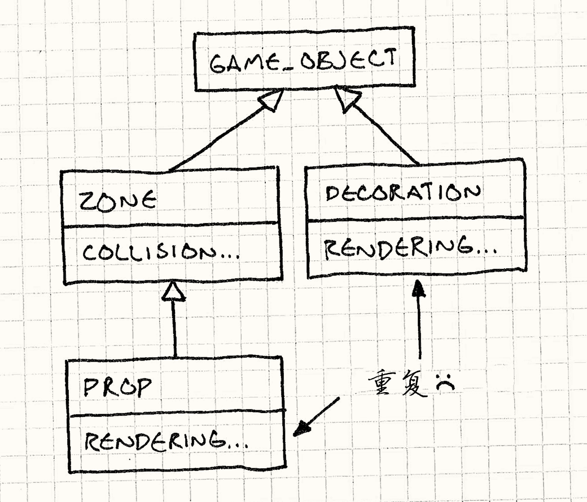

# 组件模式（Component）

> **章节**：解耦模式（Decoupling Patterns）  
> **原著**：Robert Nystrom (Bob Nystrom) · 《Game Programming Patterns》  
> **导航**：[目录](README.md) ｜ [上一章：解耦模式](decoupling-patterns.md) ｜ [下一章：事件队列](event-queue.md)

---

## 意图

*允许单一的实体跨越多个领域而不会导致这些领域彼此耦合。*

## 动机


假设我们正在制作一款平台跳跃游戏。
意大利水管工这个细分市场已经有人占了，所以我们的主角是一位丹麦面包师，Bjorn。
照理说，会有一个类来表示友好的糕点厨师，包含他在游戏中做的一切。

> [!NOTE] 旁注
> 像这样的游戏创意正是我成为程序员而不是设计师的原因。

由于玩家控制着他，这意味着要读取控制器输入，并把输入转化为动作。
当然，他还得和关卡互动，所以物理和碰撞也得塞进来。
这些搞定之后，他还得在屏幕上亮相，那就再把动画和渲染扔进去。
他多半还会发出点声音。

等一下，事情正在失控。软件架构 101 告诉我们，程序中的不同领域应彼此隔离。
如果我们做的是文字处理器，处理打印的代码就不该受加载和保存文档的代码影响。
游戏和企业应用的领域不尽相同，但这条规则仍然适用。

我们希望AI，物理，渲染，声音和其他领域尽可能相互不了解，
但现在我们将所有这一切挤在一个类中。
我们已经看到这条路通向何方：一个 5000 行的垃圾倾倒场源码文件，大到只有你们团队里最勇敢的忍者程序员才敢进去。

这对能驯服它的少数人来说是极好的工作保障，但对其他人而言是地狱。
这么大的类意味着，即使是看似微不足道的变化亦可有深远的影响。
很快，这个类累积*错误*的速度就会超过累积*功能*的速度。

### 一团乱麻


比起单纯的规模问题，更糟糕的是耦合。
在游戏中，所有不同的系统被绑成了一个巨大的代码球：

```cpp
if (collidingWithFloor() && (getRenderState() != INVISIBLE))
{
  playSound(HIT_FLOOR);
}
```

任何试图修改这种代码的程序员，都得懂点物理、图形和声音知识，以免弄坏什么东西。

> [!NOTE] 旁注
> 这样的耦合在*任何*游戏中出现都是个问题，但是在使用并发的现代游戏中尤其糟糕。
> 在多核硬件上，让代码同时在多个线程上运行是至关重要的。
> 将游戏分割为多线程的一种通用方法是沿领域边界划分——在一个核上运行AI代码，在另一个上运行声音，在第三个上渲染，等等。
>
> 一旦你这么做了，在领域间保持解耦就是至关重要的，这是为了避免死锁或者其他噩梦般的并发问题。
> 如果有一个类，它的`UpdateSounds()`方法必须从一个线程调用，而`RenderGraphics()`方法必须从另一个线程调用，那简直是在自找这些麻烦。

这两个问题相互加剧；这个类涉及太多的领域，每个程序员都得接触它，
但它又太过巨大，这就变成了一场噩梦。
如果情况糟到一定程度，程序员会开始往代码库的其他地方塞各种 hack，就为了躲开这个已经变成一团毛球的 `Bjorn` 类。

### 快刀斩乱麻

我们可以像亚历山大大帝那样解决这个问题——用剑劈开。
把庞大的 `Bjorn` 类按领域边界切成相互独立的部分。
例如，抽出所有处理用户输入的代码，将其移动到一个单独的`InputComponent`类。
`Bjorn`拥有这个部件的一个实例。我们将对`Bjorn`接触的每个领域重复这一过程。

当完成后，我们就将`Bjorn`中几乎所有的东西都移出去了。
剩下的是一个把组件绑在一起的薄壳。
通过把类划分成多个小类，我们已经解决了巨型类的问题。但我们所完成的远不止如此。

### 松散的线头

我们的组件类现在解耦了。
尽管`Bjorn`有`PhysicsComponent`和`GraphicsComponent`，
但这两部分都不知道对方的存在。
这意味着处理物理的人可以修改组件而不需要了解图形，反之亦然。

在实践中，这些部件之间需要有*一些*相互作用。
例如，AI组件可能需要告诉物理组件Bjorn试图去哪里。
然而，我们可以将这种交互限制在*确实*需要交互的组件之间，
而不是把它们统统扔进同一个围栏里。

### 绑到一起


这种设计的另一特性是，组件现在是可复用的包。
到目前为止，我们专注于面包师，但是让我们考虑几个游戏世界中其他类型的对象。
*装饰* 是玩家看到但不能交互的事物：灌木，杂物等视觉细节。
*道具* 像*装饰*，但可以交互：箱，巨石，树木。
*区域* 与装饰相反——无形但可互动。
它们是很好的触发器，比如在Bjorn进入区域时触发过场动画。

> [!NOTE] 旁注
> 当面向对象编程第一次登场时，继承是其工具箱里最闪耀的工具。
> 它被认为是代码重用的终极锤子，程序员们常常挥舞它。
> 此后我们才痛苦地学到，它实在是一把沉重的大锤。
> 继承自有其用武之地，但对简单的代码重用来说往往太过笨重。
>
> 相反，当今软件设计的趋势是尽可能使用组合代替继承。
> 不是让两个类*继承*同一类来分享代码，而是让它们*拥有同一个类的实例*。

现在，考虑如果不用组件，我们将如何建立这些类的继承层次。第一遍可能是这样的：




我们有`GameObject`基类，包含位置和方向之类的通用部分。
`Zone`继承它，增加了碰撞检测。
同样，`Decoration`继承`GameObject`，并增加了渲染。
`Prop`继承`Zone`，因此它可以重用碰撞代码。
然而，`Prop`不能*同时*继承`Decoration`来重用*渲染*，
否则就会造成致命菱形结构。

> [!NOTE] 旁注
> “致命菱形”发生在使用多重继承的类层次中：当有两条不同的路径通向同一个基类时。
> 它带来的痛苦稍微超出了本书的范围，但要知道，人们称它为“致命”是有原因的。

我们可以反过来让`Prop`继承`Decoration`，但随后不得不重复*碰撞检测*代码。
无论哪种方式，没有干净的办法重用碰撞和渲染代码而不诉诸多重继承。
唯一的其他选择是把所有内容都上移到`GameObject`，
但这样`Zone`会在不需要的渲染数据上浪费内存，
`Decoration`则会在物理数据上有同样的浪费。


现在，让我们尝试用组件。子类将彻底消失。
取而代之的是一个`GameObject`类和两个组件类：`PhysicsComponent`和`GraphicsComponent`。
装饰是个简单的`GameObject`，包含`GraphicsComponent`但没有`PhysicsComponent`。
区域与其恰好相反，而道具包含两种组件。
没有代码重复，没有多重继承，只有三个类，而不是四个。

> [!NOTE] 旁注
> 可以拿餐厅菜单打个比方。如果每个实体都是一个整体的类，那就只能点套餐。
> 每种*可能*的特性组合都得有一个单独的类。
> 为了满足每位顾客，我们就需要几十种套餐。
>
> 组件则是单点用餐——每位顾客只选自己想要的菜，而菜单就是可供选择的菜品清单。

对对象而言，组件基本上就是即插即用的。
把不同的可复用组件对象插到实体上的插槽里，我们就能构建出行为丰富的复杂实体。
想想软件版战神金刚。

## 模式


**单一实体跨越了多个领域**。为了保持领域之间相互分离，将每部分代码放入**各自的组件类**中。
实体被简化为*组件的容器*。

> [!NOTE] 旁注
> “组件”和“对象”一样，是编程中那种“什么都指、又什么都不指”的词。
> 正因如此，它被用来描述不少概念。
> 在商业软件中，“组件”设计模式描述的是通过网络通信、彼此解耦的服务。
>
> 我试图为游戏里这个不相关的模式另找一个名字，但“组件”看来是最常用的术语。
> 由于设计模式要记录的是既有实践，我可没有自创新术语的奢侈。
> 所以，跟着XNA、Delta3D和其他人的脚步，就叫它“组件”。

## 何时使用

组件最常见于定义游戏实体的核心类中，但它们在其他地方也可能有用。
当以下任一条件成立时，这个模式都能派上用场：

* 有一个涉及了多个领域的类，而你想保持这些领域互相隔离。

* 一个类正在变大而且越来越难以使用。

* 想要能定义一系列具备不同能力的对象，但是使用继承无法让你足够精确地选取要重用的部分。

## 记住

组件模式比起简单地创建一个类并在里面写代码，会增加不少复杂性。
每个概念上的“对象”都变成了一簇对象，需要实例化、初始化并正确地连接在一起。
不同组件之间的沟通会变得更有挑战，而控制它们如何占用内存也更加复杂。

对于大型代码库，为了解耦和代码重用而付出这样的复杂度是值得的。
但是在使用这种模式之前，要确保你没有为了不存在的问题而“过度设计”。


使用组件的另一个后果是，你常常需要多经过一层间接引用才能完成要做的事。
拿到容器对象后，先获得想要的组件，*然后* 才能做想做的事情。
在性能攸关的内部循环中，这种指针跟随可能导致糟糕的性能。

> [!NOTE] 旁注
> 硬币也有另一面：组件模式常常能*提升*性能和缓存一致性。
> 组件让你更容易使用[数据局部性](data-locality.md)模式，按CPU期望的顺序组织数据。

## 示例代码

我写这本书的最大挑战之一就是搞明白如何隔离各个模式。
许多设计模式存在的意义，就是容纳那些本身并不属于该模式的代码。
为了提炼出模式的本质，我尽可能地削减代码，
但是在某种程度上，这就像是不展示任何衣服，却要说明如何整理衣柜。

说明组件模式尤其困难。
如果看不到它解耦的各个领域的代码，你就无法真正体会它，
所以我不得不比我希望的多写一点 Bjorn 的代码。
这个模式实际上只涉及组件*类*本身，但类中的代码可以帮助说明这些类是做什么用的。
它是伪代码——它会调用其他这里没有展示的类——但这应该能让你理解我们的意图。

### 单块类


为了清晰地看到这个模式是如何应用的，
我们先展示一个`Bjorn`类，
它包含了所有我们需要的事物，但是*没有*使用这个模式：

> [!NOTE] 旁注
> 我应指出，在代码库中使用角色的真名通常是个坏主意。市场部有个恼人的习惯：在发售前几天要求改名字。
> “焦点测试表明，11岁到15岁之间的男性对‘Bjorn’反应消极。请改用‘Sven’”。
>
> 这就是为什么很多软件项目使用仅限内部的代号。
> 当然，还有一个原因：比起告诉别人你在做“Photoshop 的下一版本”，说你在做“大电猫”要有趣得多。

```cpp
class Bjorn
{
public:
  Bjorn()
  : velocity_(0),
    x_(0), y_(0)
  {}

  void update(World& world, Graphics& graphics);

private:
  static const int WALK_ACCELERATION = 1;

  int velocity_;
  int x_, y_;

  Volume volume_;

  Sprite spriteStand_;
  Sprite spriteWalkLeft_;
  Sprite spriteWalkRight_;
};
```

`Bjorn`有一个由游戏每帧调用的`update()`方法。

```cpp
void Bjorn::update(World& world, Graphics& graphics)
{
  // 根据用户输入修改英雄的速度
  switch (Controller::getJoystickDirection())
  {
    case DIR_LEFT:
      velocity_ -= WALK_ACCELERATION;
      break;

    case DIR_RIGHT:
      velocity_ += WALK_ACCELERATION;
      break;
  }

  // 根据速度修改位置
  x_ += velocity_;
  world.resolveCollision(volume_, x_, y_, velocity_);

  // 绘制合适的图形
  Sprite* sprite = &spriteStand_;
  if (velocity_ < 0)
  {
    sprite = &spriteWalkLeft_;
  }
  else if (velocity_ > 0)
  {
    sprite = &spriteWalkRight_;
  }

  graphics.draw(*sprite, x_, y_);
}
```

它读取操纵杆以确定如何让面包师加速。
然后，用物理引擎算出它的新位置。
最后，将Bjorn绘制到屏幕上。

这里的示例实现非常简单。
没有重力、动画，或任何其他让角色玩起来有趣的细节。
即便如此，也能看到，团队里好几位程序员可能都得花时间在这个函数上，而它已经开始变得有些混乱了。
想象把它扩展到一千行，你就知道这会有多难受了。

### 分离领域

从一个领域开始，我们从`Bjorn`里抽出一部分代码，放入一个独立的组件类。
我们从首个被处理的领域开始：输入。
`Bjorn`做的头件事就是读取玩家输入，然后基于此调整他的速度。
让我们将这部分逻辑移入一个独立的类：

```cpp
class InputComponent
{
public:
  void update(Bjorn& bjorn)
  {
    switch (Controller::getJoystickDirection())
    {
      case DIR_LEFT:
        bjorn.velocity -= WALK_ACCELERATION;
        break;

      case DIR_RIGHT:
        bjorn.velocity += WALK_ACCELERATION;
        break;
    }
  }

private:
  static const int WALK_ACCELERATION = 1;
};
```

很简单吧。我们将`Bjorn`的`update()`的第一部分取出，放入这个类中。
对`Bjorn`的改变也很直接：

```cpp
class Bjorn
{
public:
  int velocity;
  int x, y;

  void update(World& world, Graphics& graphics)
  {
    input_.update(*this);

    // 根据速度修改位置
    x += velocity;
    world.resolveCollision(volume_, x, y, velocity);

    // 绘制合适的图形
    Sprite* sprite = &spriteStand_;
    if (velocity < 0)
    {
      sprite = &spriteWalkLeft_;
    }
    else if (velocity > 0)
    {
      sprite = &spriteWalkRight_;
    }

    graphics.draw(*sprite, x, y);
  }

private:
  InputComponent input_;

  Volume volume_;

  Sprite spriteStand_;
  Sprite spriteWalkLeft_;
  Sprite spriteWalkRight_;
};
```

`Bjorn`现在拥有了一个`InputComponent`对象。
之前它在`update()`方法中直接处理用户输入，现在委托给组件：

```cpp
input_.update(*this);
```

我们才刚开始，但已经摆脱了一些耦合——`Bjorn`主类现在不再有任何对`Controller`的引用了。这以后会派上用场。

### 将剩下的分割出来

现在让我们对物理和图形代码继续这种剪切粘贴的工作。
这是我们新的 `PhysicsComponent`：

```cpp
class PhysicsComponent
{
public:
  void update(Bjorn& bjorn, World& world)
  {
    bjorn.x += bjorn.velocity;
    world.resolveCollision(volume_,
        bjorn.x, bjorn.y, bjorn.velocity);
  }

private:
  Volume volume_;
};
```

除了把物理*行为*移出`Bjorn`主类，你可以看到我们也把*数据*移了出来：`Volume`对象现在由组件所有。

最后，这是现在的渲染代码：

```cpp
class GraphicsComponent
{
public:
  void update(Bjorn& bjorn, Graphics& graphics)
  {
    Sprite* sprite = &spriteStand_;
    if (bjorn.velocity < 0)
    {
      sprite = &spriteWalkLeft_;
    }
    else if (bjorn.velocity > 0)
    {
      sprite = &spriteWalkRight_;
    }

    graphics.draw(*sprite, bjorn.x, bjorn.y);
  }

private:
  Sprite spriteStand_;
  Sprite spriteWalkLeft_;
  Sprite spriteWalkRight_;
};
```

我们几乎把一切东西都拽了出来，那么这位谦卑的糕点师傅还剩下什么？没多少了：

```cpp
class Bjorn
{
public:
  int velocity;
  int x, y;

  void update(World& world, Graphics& graphics)
  {
    input_.update(*this);
    physics_.update(*this, world);
    graphics_.update(*this, graphics);
  }

private:
  InputComponent input_;
  PhysicsComponent physics_;
  GraphicsComponent graphics_;
};
```

`Bjorn`类现在基本上就做两件事：持有真正定义它的那组组件，以及保存在多个领域之间共享的状态。
位置和速度仍然留在`Bjorn`核心类中有两个原因：
首先，它们是“泛领域”状态——几乎每个组件都会用到它们，
所以即使我们确实想把它们下放下去，也不清楚哪个组件*应该*拥有它们。

第二，也是更重要的一点，它给了我们一种无需让组件彼此耦合就能沟通的简易方法。
让我们看看能不能利用这一点。

### 机器人Bjorn

到目前为止，我们已经把行为推到了各个组件类中，但还没把行为*抽象*出来。
`Bjorn`仍然知道定义其行为的具体类。让我们改变这一点。

取出处理用户输入的组件，把它隐藏在一个接口之后，并将`InputComponent`变成抽象基类。

```cpp
class InputComponent
{
public:
  virtual ~InputComponent() {}
  virtual void update(Bjorn& bjorn) = 0;
};
```

然后，将现有的处理输入的代码取出，放进一个实现该接口的类中。

```cpp
class PlayerInputComponent : public InputComponent
{
public:
  virtual void update(Bjorn& bjorn)
  {
    switch (Controller::getJoystickDirection())
    {
      case DIR_LEFT:
        bjorn.velocity -= WALK_ACCELERATION;
        break;

      case DIR_RIGHT:
        bjorn.velocity += WALK_ACCELERATION;
        break;
    }
  }

private:
  static const int WALK_ACCELERATION = 1;
};
```

我们将`Bjorn`改为只拥有一个指向输入组件的指针，而不是拥有一个内联的实例。

```cpp
class Bjorn
{
public:
  int velocity;
  int x, y;

  Bjorn(InputComponent* input)
  : input_(input)
  {}

  void update(World& world, Graphics& graphics)
  {
    input_->update(*this);
    physics_.update(*this, world);
    graphics_.update(*this, graphics);
  }

private:
  InputComponent* input_;
  PhysicsComponent physics_;
  GraphicsComponent graphics_;
};
```

现在当我们实例化`Bjorn`，我们可以传入一个输入组件供它使用，就像下面这样：

```cpp
Bjorn* bjorn = new Bjorn(new PlayerInputComponent());
```

这个实例可以是任何实现了抽象`InputComponent`接口的类型。
我们为此付出了代价——`update()`现在是虚方法调用了，这会慢一些。这一代价的回报是什么？

大多数主机都要求游戏支持“演示模式”。
如果玩家停在主菜单什么也不做，游戏就会自动开始运行，由电脑代替玩家操作。
这样能避免主菜单长时间显示在电视上造成烧屏，也能让游戏在商店的展示机上运行得更好看。

把输入组件类隐藏在接口之后，就能让我们实现这一点。
我们已经有了正常玩游戏时使用的具体`PlayerInputComponent`。
现在，让我们再做一个：

```cpp
class DemoInputComponent : public InputComponent
{
public:
  virtual void update(Bjorn& bjorn)
  {
    // 自动控制Bjorn的AI……
  }
};
```

当游戏进入演示模式时，我们不再像之前那样构造Bjorn，而是用新组件来装配他：

```cpp
Bjorn* bjorn = new Bjorn(new DemoInputComponent());
```


现在，只需要换掉一个组件，我们就得到了一个在演示模式下完全可用的电脑控制玩家。
我们可以重用Bjorn其余的所有代码——物理和图形组件甚至不知道有什么区别。
也许我有点怪，但正是这样的事让我每天早上愿意起床。

> [!NOTE] 旁注
> 那个，还有咖啡。香甜滚烫的咖啡。

### 完全没有Bjorn？

如果你看看现在的`Bjorn`类，你会意识到那里完全没有“Bjorn”——那只是个组件包。
事实上，它看起来很适合作为游戏中*每个*对象都能使用的“游戏对象”基类。
我们只需传入所有组件，就能像弗兰肯斯坦博士那样，通过挑选拼装零件来构建任何对象。

让我们将剩下的两个具体组件——物理和图形——像输入那样藏到接口之后。

```cpp
class PhysicsComponent
{
public:
  virtual ~PhysicsComponent() {}
  virtual void update(GameObject& obj, World& world) = 0;
};

class GraphicsComponent
{
public:
  virtual ~GraphicsComponent() {}
  virtual void update(GameObject& obj, Graphics& graphics) = 0;
};
```


然后我们把`Bjorn`重新命名为通用的`GameObject`类，并使用这些接口。

```cpp
class GameObject
{
public:
  int velocity;
  int x, y;

  GameObject(InputComponent* input,
             PhysicsComponent* physics,
             GraphicsComponent* graphics)
  : input_(input),
    physics_(physics),
    graphics_(graphics)
  {}

  void update(World& world, Graphics& graphics)
  {
    input_->update(*this);
    physics_->update(*this, world);
    graphics_->update(*this, graphics);
  }

private:
  InputComponent* input_;
  PhysicsComponent* physics_;
  GraphicsComponent* graphics_;
};
```

> [!NOTE] 旁注
> 有些组件系统走得更远。
> 不使用包含组件的`GameObject`，游戏实体只是一个ID，一个数字。
> 然后你维护若干独立的组件集合，其中每个组件都知道它所属实体的ID。
>
> 这些[实体组件系统](http://en.wikipedia.org/wiki/Entity_component_system)把组件之间的解耦推向了极致，让你向实体添加新组件而实体甚至毫不知情。
> [数据局部性](data-locality.md)一章有更多细节。

我们现有的具体类被重命名并实现这些接口：

```cpp
class BjornPhysicsComponent : public PhysicsComponent
{
public:
  virtual void update(GameObject& obj, World& world)
  {
    // 物理代码……
  }
};

class BjornGraphicsComponent : public GraphicsComponent
{
public:
  virtual void update(GameObject& obj, Graphics& graphics)
  {
    // 图形代码……
  }
};
```

现在我们无需为Bjorn建立具体类，就能构建拥有所有Bjorn行为的对象。


```cpp
GameObject* createBjorn()
{
  return new GameObject(new PlayerInputComponent(),
                        new BjornPhysicsComponent(),
                        new BjornGraphicsComponent());
}
```

> [!NOTE] 旁注
> 这个`createBjorn()`函数当然就是经典GoF[工厂方法模式](http://c2.com/cgi/wiki?FactoryMethod)的例子。

通过定义其他用不同组件实例化`GameObject`的函数，我们可以创建游戏所需的各类对象。

## 设计决策

使用这个模式时，你需要回答的最重要的设计问题是“我需要什么样的组件？”
答案取决于你游戏的需求和类型。
引擎越大越复杂，你多半就越想将组件切得更细。

除此之外，还有几个更具体的选项需要考虑：

### 对象如何获取组件？

一旦将单块对象分割为多个分离的组件，就需要决定谁将它们拼到一起。

* **如果对象创建组件：**

    * *这保证了对象总是能拿到需要的组件。*
      你永远不必担心有人忘了给对象接上正确的组件而破坏了游戏。容器对象自己会替你处理好。

    * *重新配置对象比较困难。*
      这个模式的强力特性之一就是只需重新组合组件就可以创建新的对象。
      如果对象总是用硬编码的组件组装自己，我们就无法利用这个特性。

* **如果外部代码提供组件：**

     * *对象更加灵活。*
       我们可以提供不同的组件，这样就能改变对象的行为。
       发挥到极致时，我们的对象会变成一个通用的组件容器，可以一遍又一遍地用于不同目的。

     * *对象可以与具体的组件类型解耦。*

       如果我们允许外部代码传入组件，那很可能也会让它传入*派生*的组件类型。
       这样，对象只知道组件*接口*而不知道组件的具体类型。这可以形成一个封装良好的架构。

### 组件之间如何通信？

完美解耦、各自独立运作的组件是个美好的理想，但在实践中并不真正行得通。
这些组件同属*一个*对象这一事实，意味着它们是一个更大整体的一部分，需要彼此协调。
这就意味着通信。

那么组件如何相互通信呢？
这里有好几种选择，但与本书中大多数设计“备选方案”不同，它们并不互斥——你很可能在一个设计中同时支持多种方案。

* *通过修改容器对象的状态：*

    * *保持了组件解耦。*
      当我们的`InputComponent`设置了Bjorn的速度，而后`PhysicsComponent`使用它，
      这两个组件都不知道对方的存在。在它们的理解中，Bjorn的速度是被黑魔法改变的。

    * *需要把组件要共享的所有信息都上移到容器对象中。*
      通常有些状态其实只有一部分组件需要。比如，动画组件和渲染组件可能需要共享图形专用的信息。
      把这些信息上移到容器对象会让*所有*组件都能访问它，从而把对象类弄得一团糟。

        更糟的是，如果我们为不同的组件配置使用同一个容器类，最终可能会在*任何*组件都不需要的状态上浪费内存。
        如果我们将渲染专用的数据放入容器对象中，任何不可见对象都会白白消耗内存。

    * *这让通信变得隐式，并且依赖于组件被处理的顺序。*
      在我们的示例代码中，原先一整块的`update()`方法小心地排列了这些操作的顺序。
      玩家的输入修改了速度，速度被物理代码用来修改位置，位置又被渲染代码用来把Bjorn绘制到正确位置。
      当我们将这些代码拆分成组件时，我们小心翼翼地保持了这种操作顺序。

        

        如果我们不那么做，就会引入微妙而难以追踪的缺陷。
        比如，我们*先*更新图形组件，就会错误地把Bjorn渲染在他*上一帧*而不是这一帧所处的位置上。
        如果你考虑更多的组件和更多的代码，那你可以想象要避免这样的错误有多么困难了。

        > [!NOTE] 旁注
        > 像这样被大量代码同时读写的共享可变状态，是出了名的难以保证正确。
        >         这就是为什么学术界花大量时间研究Haskell这样的纯函数式语言——那里根本没有可变状态。

* *通过直接相互引用：*

    这里的思路是，需要交流的组件直接持有彼此的引用，完全不必经过容器对象。

    假设我们想让Bjorn跳跃。图形代码需要知道他是否应该使用跳跃精灵来绘制。
    这可以通过询问物理引擎他当前是否在地上来确定。一种简单的方式是让图形组件直接知道物理组件的存在：

    ```cpp
    class BjornGraphicsComponent
    {
    public:
      BjornGraphicsComponent(BjornPhysicsComponent* physics)
      : physics_(physics)
      {}

      void Update(GameObject& obj, Graphics& graphics)
      {
        Sprite* sprite;
        if (!physics_->isOnGround())
        {
          sprite = &spriteJump_;
        }
        else
        {
          // 现存的图形代码……
        }

        graphics.draw(*sprite, obj.x, obj.y);
      }

    private:
      BjornPhysicsComponent* physics_;

      Sprite spriteStand_;
      Sprite spriteWalkLeft_;
      Sprite spriteWalkRight_;
      Sprite spriteJump_;
    };
    ```

    当构建Bjorn的`GraphicsComponent`时，我们给它相应的`PhysicsComponent`引用。

    * *简单快捷。*
      通信就是一个对象对另一个对象的直接方法调用。组件可以调用它所引用组件支持的任何方法，完全不受约束。

    * *两个组件紧绑在一起。*
      这是不受约束带来的坏处。我们基本上朝着原本的整块类倒退了一步。
      不过它没有原来那个单一类那么糟，至少我们把耦合限制在了确实需要交互的那些组件对之间。

* *通过发送消息：*

    * 这是最复杂的选项。我们可以在容器对象中构建一个小型消息系统，让组件向彼此广播信息。

        下面是一种可能的实现。我们从定义所有组件都会实现的`Component`基接口开始：

        ```cpp
        class Component
        {
        public:
          virtual ~Component() {}
          virtual void receive(int message) = 0;
        };
        ```

        它只有一个`receive()`方法，组件类通过实现它来监听传入的消息。
        这里，我们只用一个`int`来标识消息，但更完整的实现还可以在消息上附加数据。

        然后，向容器类添加发送消息的方法。

        ```cpp
        class ContainerObject
        {
        public:
          void send(int message)
          {
            for (int i = 0; i < MAX_COMPONENTS; i++)
            {
              if (components_[i] != NULL)
              {
                components_[i]->receive(message);
              }
            }
          }

        private:
          static const int MAX_COMPONENTS = 10;
          Component* components_[MAX_COMPONENTS];
        };

        ```

        

        现在，如果组件能访问它的容器，它就能向容器发送消息，容器再把消息重新广播给所有包含的组件。
        （这包括最初发送消息的那个组件；小心别陷入反馈循环！）这会带来一些结果：

        > [!NOTE] 旁注
        > 如果你真想玩出花样，甚至可以让这个消息系统把消息放入*队列*，稍后再投递。
        >         想了解更多，请看[事件队列](event-queue.md)。

    

    * *同级组件解耦。*
      通过父级容器对象，就像共享状态的方案一样，我们保证了组件之间仍然是解耦的。
      使用这套系统后，它们之间唯一的耦合就是消息值本身。

        > [!NOTE] 旁注
        > GoF称之为[中介](http://c2.com/cgi-bin/wiki?MediatorPattern)模式——两个或更多的对象通过中间对象间接路由消息来通信。
        >         现在这种情况下，容器对象本身就是中介。

     * *容器对象很简单。*
        和共享状态方案不同（在那里，容器对象自己拥有并了解组件所用的数据），这里它只是盲目地把消息传递下去。
         这有助于让两个组件在彼此之间传递非常领域化的信息，而不会让这些信息渗入容器对象。

不出意料，这里没有唯一的最佳答案。你最终很可能会把这些方法都用上一点。
共享状态对于每个对象都理所当然具备的基本数据很好用——比如位置和大小。

有些领域彼此不同，但仍紧密相关。想想动画和渲染、用户输入和AI，或者物理和碰撞。
如果你为这些成对领域各准备了一个独立组件，你可能会发现让它们直接了解彼此的另一半是最容易的。

消息对于“不那么重要”的通信很有用。它的“即发即忘”特性很适合这类事情：物理组件发现对象与某物碰撞后发出消息，让音频组件播放声音。

就像以前一样，我建议你从简单的开始，然后如果需要的话，加入其他的通信路径。

## 参见

* [Unity](http://unity3d.com)框架的核心[`GameObject`](http://docs.unity3d.com/Documentation/Manual/GameObjects.html)类完全围绕[组件](http://docs.unity3d.com/Manual/UsingComponents.html)设计。

* 开源的[Delta3D](http://www.delta3d.org)引擎有一个`GameActor`基类，通过名字贴切的`ActorComponent`基类实现了这种模式。

* 微软的[XNA](http://creators.xna.com/en-US/)游戏框架有一个核心的`Game`类。它拥有一组`GameComponent`对象。我们的示例是在单个游戏实体层面使用组件，XNA则在主游戏对象本身的层面实现了这种模式，但目的是一样的。

* 这种模式与GoF的[策略模式](http://c2.com/cgi-bin/wiki?StrategyPattern)类似。
  两种模式都是把对象的一部分行为取出，委派给一个独立的附属对象。
  不同之处在于，使用策略模式时，那个独立的“策略”对象通常是无状态的——它封装了算法，但不包含数据。
  它定义了对象*如何*行动，但没有定义对象*是*什么。

    组件则更“拿自己当回事”一些。它们经常保存着描述对象的状态，这有助于确定其真正的身份。
    但是，这条界限很模糊。有一些组件也许根本没有任何状态。
    在这种情况下，你可以在不同的容器对象中使用相同的组件*实例*。这样看来，它的行为确实更像一种策略。

---

> **导航**：[目录](README.md) ｜ [上一章：解耦模式](decoupling-patterns.md) ｜ [下一章：事件队列](event-queue.md)
