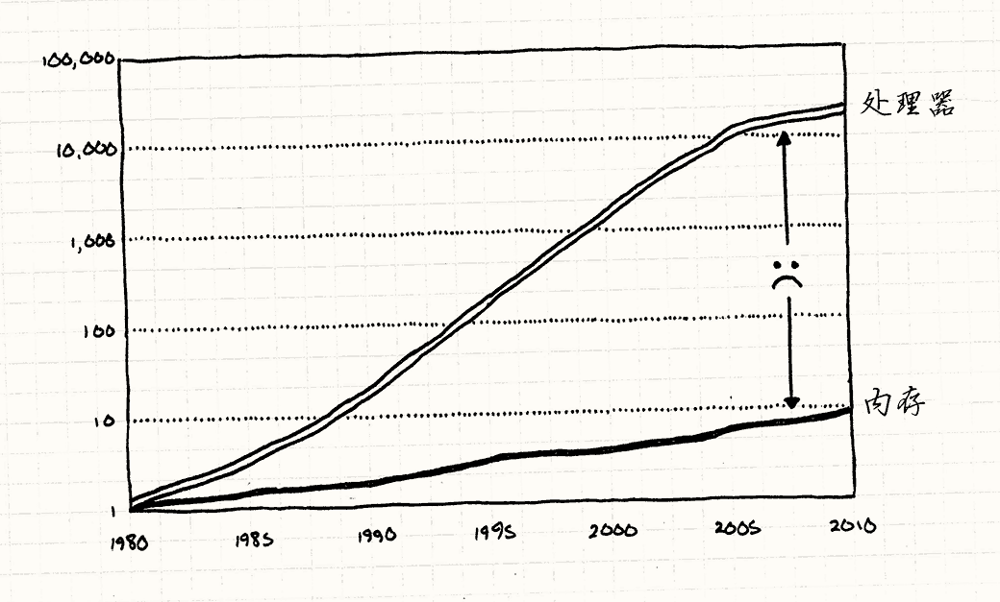
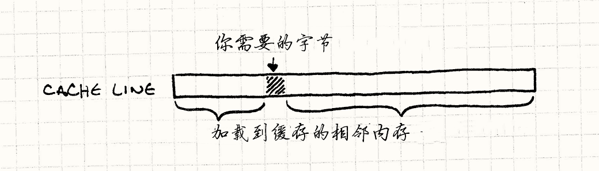
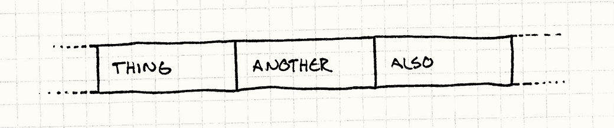
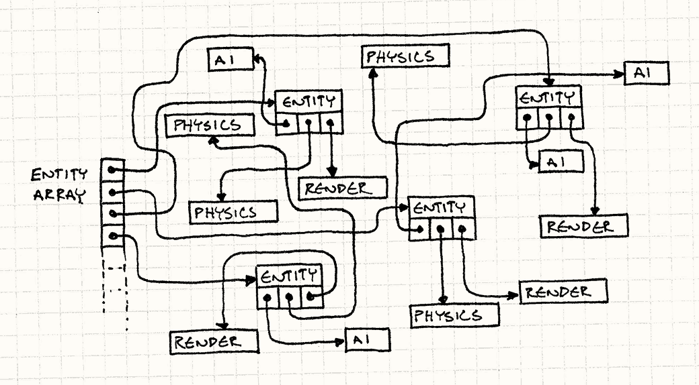
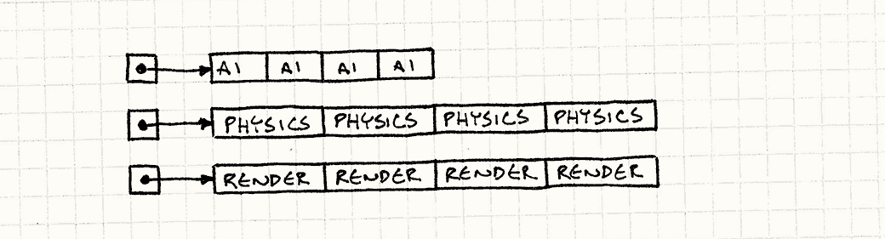

# 数据局部性（Data Locality）

> **章节**：优化模式（Optimization Patterns）  
> **原著**：Robert Nystrom (Bob Nystrom) · 《Game Programming Patterns》  
> **导航**：[目录](README.md) ｜ [上一章：优化模式](optimization-patterns.md) ｜ [下一章：脏标识模式](dirty-flag.md)

---

## 意图

*合理组织数据，充分使用CPU的缓存来加速内存读取。*

## 动机

我们被骗了。
他们一直向我们展示CPU速度逐年递增的图表，就好像摩尔定律不只是对历史的观察，而是某种天经地义的权利。
我们这些做软件的人无需动一根手指，就能看着程序凭借新硬件奇迹般地加速。

芯片*确实*越来越快（尽管现在连这一点也趋于停滞了），但硬件专家们没有提到某些事情。
诚然，我们可以更快地*处理*数据，但不能更快地*获得*数据。




> [!NOTE] 旁注
> 处理器和RAM的速度是相对于各自1980年的速度而言的。如你所见，CPU飞跃式发展，RAM访问速度被远远甩到了后面。
>
> 这个数据来自John L. Hennessy、David A. Patterson、Andrea C. Arpaci-Dusseau所著的
> *Computer Architecture: A Quantitative Approach*，经由Tony
> Albrecht的“[Pitfalls of Object-Oriented Programming][poop]”一文引用。
>
> [poop]: http://seven-degrees-of-freedom.blogspot.com/2009/12/pitfalls-of-object-oriented-programming.html

为了让你超高速的CPU能一口气吞掉海量计算，
它实际上得先把数据从主存取出来装进寄存器。
如你所知，RAM没有跟上CPU的速度增长，差远了。


以今天的硬件水平，从RAM取一个字节的数据可能要花上*上百个*周期。
如果大部分指令都需要数据，而获取数据又要上百个周期，
那么为什么我们的CPU没有在99%的时间里空转着等待数据？

事实上，如今它们*确实*把惊人比例的时间都卡在等待内存上，但情况本可能更糟。
为了解释原因，让我们去“过度冗长类比之国”走一遭……

> [!NOTE] 旁注
> 它被称为“随机访问存储器（RAM，random access memory）”是因为，
> 不像磁盘，理论上你访问任意一块数据的速度都和访问其他块一样快。你不需要像读磁盘那样考虑连续读取。
>
> 或者说，至少过去*不需要*。就像接下来看到的，RAM不再那么随机访问了。

### 数据仓库


想象一下，你是间小办公室里的会计。
你的任务是取来一盒文件，然后干点会计那套活儿——把一堆数字加起来什么的。
你必须按照某种只有会计才懂的晦涩逻辑，去处理那些贴着特定标签的文件盒。

> [!NOTE] 旁注
> 我大概不该拿一个我完全一窍不通的职业来打比方。

由于勤奋、天赋，再加上兴奋剂的共同作用，你可以在一分钟内处理完一个文件盒。
但是这里有个小问题。所有这些文件盒都存放在另一栋楼的仓库里。
想要拿到一个文件盒，需要让仓库管理员带给你。
他开着叉车在货架之间的过道里转悠，直到找到你要的文件盒。

说真的，这要花掉他一整天。
不像你，他短期内别想拿到月度最佳员工了。
这就意味着无论你有多快，一天只能拿到一个文件盒。
剩下的时间，你只能坐在那里，质疑自己当初怎么会选择这份折磨灵魂的工作。

一天，一组工业设计师出现了。
他们的任务是提高运营效率——比如让流水线跑得更快。
在看着你工作几天后，他们发现了几件事情：


* 经常，当你处理完一个文件盒，下一个要的盒子就在仓库同一个货架上紧挨着它。

* 叉车一次只取一个文件盒太愚蠢了。

* 在你的办公室角落里还是有些空余空间的。

> [!NOTE] 旁注
> 访问刚刚访问的事物旁边的位置，描述这种行为的术语是*引用局部性*。

他们想出来一个巧妙的办法。
无论何时你问仓库要一个盒子，他都会带给你一托盘的盒子。
他给你想要的盒子，再加上它旁边的一些盒子。
他不知道你是不是想要这些（而且，以他的工作态度，显然也根本不在乎）；
他只是尽可能多地拿，直到塞满托盘，然后带给你。

他装好整托盘，把它带给你。无视工作场所安全，他直接把叉车开进你的办公室，然后把托盘卸在办公室的角落。

现在当你需要新盒子时，你要做的第一件事就是看看它是不是已经在办公室的托盘里。
如果在，很好！你只需一秒钟就能拿到它，然后继续计算数据。
如果一个托盘能装五十个盒子，而你又运气好，需要的*所有*盒子恰好都在上面，你就能处理比以前多五十倍的工作。

但如果你需要的盒子*不在*托盘上，就又回到了原点。
由于你的办公室里只能放一托盘的盒子，你的仓库朋友只能把旧托盘拿走，再给你带来一托盘全新的盒子。

### CPU的托盘

奇怪的是，这就是现代CPU运转的方式。如果还不够明显，你是CPU。
你的桌子是CPU的寄存器，一盒文件就是寄存器能放下的数据。
仓库是机器的RAM，那个烦人的仓库管理员是从主存加载数据到寄存器的总线。

如果我在三十年前写这一章，这个比喻就到此为止了。
但是芯片越来越快，而RAM，好吧，“没有跟上”，硬件工程师开始寻找解决方案。
他们想到的是*CPU缓存*技术。


现代的电脑在芯片内部有一小块存储器。
CPU从那里取数据比从主存取数据快得多。
它很小，一方面因为它必须放在芯片里，另一方面因为它使用的那种更快的内存（静态RAM，即SRAM）贵得多。

> [!NOTE] 旁注
> 现代硬件有多层缓存，就是你听到的“L1”，“L2”，“L3”之类的。
> 每一层都比上一层更大，也更慢。在这章里，我们不深究内存实际上是一个[层级结构](http://en.wikipedia.org/wiki/Memory_hierarchy)，但了解一下还是很有必要的。

这一小片内存被称为*缓存*（特别地，芯片上的那块被称为*L1级缓存*），
在我这个费了老大劲的比喻里，扮演这个角色的是那托盘盒子。
无论何时芯片需要从RAM取一字节的数据，它都会自动抓取一整块连续内存——通常是64到128字节——放入缓存。
这一小块内存被称为*cache line*。




如果你需要的下一字节数据就在这块上，
CPU从缓存中直接读取，比从RAM中读取*快得多*。
成功从缓存中找到数据被称为“缓存命中”。
如果不能从中获得而得去主存里取，这就是一次*缓存不命中*。

> [!NOTE] 旁注
> 我在类比中一笔带过了（至少）一个细节。在办公室里，只能放一个托盘，或者说一个cache line。
> 真实的缓存包含多个cache line。关于这点的细节超出了本章的范围，搜索“缓存关联性”来了解相关内容。

当缓存不命中时，CPU*空转*——它不能执行下一条指令，因为它没有数据。
它坐在那里，百无聊赖地干等上几百个周期，直到把数据取回来。
我们的任务是避免这一点。想象你在优化一块性能攸关的游戏代码，长得像这样：

```cpp
for (int i = 0; i < NUM_THINGS; i++)
{
  sleepFor500Cycles();
  things[i].doStuff();
}
```

你会做的第一个改动是什么？对了。
去掉那个毫无意义又代价高昂的函数调用。
这个调用等价于一次缓存不命中的性能代价。
每次跳到主存，都像在代码里插入了一段延时。

### 等等，数据是性能？

刚开始写这一章时，我花了一些时间编写几个类似游戏的小程序，用来触发最好和最坏的缓存使用情况。
我想要一些能狠狠折磨缓存的基准测试，这样就能亲眼看看它造成的损失有多惨重。


当我让一些程序跑起来时，结果让我大吃一惊。
我知道这是个大事，但亲眼看到完全是另一回事。
我写的两个程序完成*完全相同*的计算，唯一的区别是它们造成的缓存不命中数量。
较慢的那个比较快的慢*五十*倍。

> [!NOTE] 旁注
> 这里有很多需要注意的地方。特别是，不同的计算机有不同的缓存设置，所以我的机器可能和你的不同，
> 专用游戏主机与个人电脑差别很大，而个人电脑与移动设备又差别很大。
>
> 实际情况会因人而异。

这让我大开眼界。我一直从*代码*的角度考虑性能，而不是*数据*。
一个字节本身没有快慢，它就只是个静静躺着的东西。但是因为缓存的存在，*组织数据的方式直接影响了性能*。


现在真正的挑战是把它压缩成能塞进本章篇幅的内容。
优化缓存使用是一个很大的话题。
我还没有谈到*指令缓存*呢。
记住，代码也在内存上，而且在执行前需要加载到CPU上。
有些更熟悉这个主题的人可以就这个问题写一整本书。

> [!NOTE] 旁注
> 事实上，有人*确实*写了一本书：[*Data-Oriented Design*](http://www.dataorienteddesign.com/dodmain/)，作者Richard Fabian.

不过，既然你已经在读*这本书*了，
我这儿有几个基本技巧，能带你入门，开始思考数据结构如何影响性能。


这可以归结成很简单的事情：芯片读内存时总是获得一整块cache line。
你能从cache line读到越多你要的东西，速度就越快。
所以目标是*组织数据结构，让要处理的数据紧紧相邻。*

> [!NOTE] 旁注
> 这里有一个关键假设：单线程。
> 如果在多个线程上修改邻近数据，让它们位于*不同*的cache line上会更快。
> 如果两个线程试图修改同一cache line上的数据，两个核都得进行代价高昂的缓存同步。

换言之，如果你的代码正在吭哧吭哧地处理`Thing`、`Another`和`Also`，你就希望它们像这样躺在内存里：



注意，这些不是`Thing`、`Another`和`Also`的*指针*，而是它们真实的数据，一个接一个地排在一起。
CPU一读到`Thing`，也会开始读`Another`和`Also`（取决于它们有多大，以及cache line有多大）。
当你接下来处理它们时，它们已经在缓存里了。芯片很高兴，你也很高兴。

## 模式

现代的CPU有**缓存来加速内存读取**。
它可以**更快地读取与最近访问过的内存相邻的内存**。
通过**提高内存局部性**来提高性能——保证数据**以处理顺序排列在连续内存上**。

## 何时使用

就像大多数优化方案一样，使用数据局部性模式的第一准则是*在遇到性能问题时再用。*
不要将其应用在代码库中不经常执行的角落上。
优化不需要优化的代码只会让你的日子更难过，因为结果几乎总是更复杂、更不灵活。

就本模式而言，还得确认你的性能问题*确实是由缓存不命中引发的*。
如果代码是因为其他原因而缓慢，这个模式帮不上忙。

廉价的性能分析方法是手动添加一些测量代码，检查代码中两点之间经过了多少时间，最好使用精确的计时器。
为了发现糟糕的缓存使用，你需要更复杂一些的工具。
你想要知道有多少缓存不命中，以及它们发生在哪里。


幸运的是，有现成的性能分析器能报告这些。
在数据结构上动大手术之前，值得花时间把其中一个跑起来，
并确保你理解它抛给你的（复杂得令人惊讶的）数字。

> [!NOTE] 旁注
> 不幸的是，这些工具大部分不便宜。如果你在主机开发团队，可能已经有了它们的许可证。
>
> 如果没有，一个极好的替代选项是[Cachegrind](http://valgrind.org/docs/manual/cg-manual.html)。
> 它在模拟的CPU和缓存结构上运行你的程序，然后报告所有的缓存交互。

话虽这么说，缓存不命中*仍会*影响游戏的性能。
虽然不应该花费大量时间提前优化缓存的使用，但是在设计过程中仍要思考数据结构是不是对缓存友好。

## 记住


软件体系结构的特点之一是*抽象*。
这本书的很多章节都在谈论如何解耦代码块，这样可以更容易地进行改变。
在面向对象的语言中，这几乎总是意味着接口。


在C++中，使用接口意味着通过指针或者引用访问对象。
但是使用指针就意味在内存中跳跃，这就带来了这章想要避免的缓存不命中。

> [!NOTE] 旁注
> 接口的另一半是*虚方法调用*。
> 这需要CPU查找对象的虚函数表，找到调用方法的真实指针。
> 所以，你又一次追踪指针，造成缓存不命中。

为了讨好这个模式，你需要牺牲一些宝贵的抽象。
你越围绕数据局部性设计程序，就越是在放弃继承、接口和它们带来的好处。
没有银弹，只有挑战性的权衡。这就是乐趣所在！

## 示例代码

如果你真的钻进数据局部性优化这个无底洞，你会发现有无数种方法把数据结构切分成CPU最容易消化的小块。
为了让你入门，我会展示几种最常用的数据组织方法，各举一个例子。
我们会结合游戏引擎的某个具体部分来讲解它们，
但是（像其他模式一样）记住这些通用方法也能在任何合适的地方使用。

### 连续数组

让我们从处理一系列游戏实体的[游戏循环](game-loop.md)开始。
实体使用了[组件](component.md)模式，被分解到不同的领域——AI，物理，渲染。
这里是`GameEntity`类。

```cpp
class GameEntity
{
public:
  GameEntity(AIComponent* ai,
             PhysicsComponent* physics,
             RenderComponent* render)
  : ai_(ai), physics_(physics), render_(render)
  {}

  AIComponent* ai() { return ai_; }
  PhysicsComponent* physics() { return physics_; }
  RenderComponent* render() { return render_; }

private:
  AIComponent* ai_;
  PhysicsComponent* physics_;
  RenderComponent* render_;
};
```


每个组件都有相对较少的状态，也许只有几个向量或一个矩阵，
然后会有方法去更新它。这里的细节无关紧要，但是想象一下，大概是这样的：

> [!NOTE] 旁注
> 就像名字暗示的，这些是[更新方法](update-method.md)模式的例子。
> 甚至`render()`也是这个模式，只是换了个名字。

```cpp
class AIComponent
{
public:
  void update() { /* 处理并修改状态…… */ }

private:
  // 目标，情绪，等等……
};

class PhysicsComponent
{
public:
  void update() { /* 处理并修改状态…… */ }

private:
  // 刚体，速度，质量，等等……
};

class RenderComponent
{
public:
  void render() { /* 处理并修改状态…… */ }

private:
  // 网格，纹理，着色器，等等……
};
```

游戏维护着一个大数组，存放指向世界中所有实体的指针。游戏循环每转一圈，我们都要做如下事情：

1. 为每个实体更新他们的AI组件。
2. 为每个实体更新他们的物理组件。
3. 为每个实体更新他们的渲染组件。

很多游戏引擎以这种方式实现：

```cpp
while (!gameOver)
{
  // 处理AI
  for (int i = 0; i < numEntities; i++)
  {
    entities[i]->ai()->update();
  }

  // 更新物理
  for (int i = 0; i < numEntities; i++)
  {
    entities[i]->physics()->update();
  }

  // 绘制屏幕
  for (int i = 0; i < numEntities; i++)
  {
    entities[i]->render()->render();
  }

  // 其他和时间有关的游戏循环机制……
}
```

在你听说CPU缓存之前，这些代码看上去完全无害。
但到了现在，你隐约觉得这里有什么不对劲。
这段代码不只是让缓存颠簸，简直是把它拖到后巷揍个半死。看看它做了什么：

1. 游戏实体的数组存储的是*指针*，所以为了获取游戏实体，我们得顺着指针走。这是一次缓存不命中。
2. 然后游戏实体又有指向组件的指针。又一次缓存不命中。
3. 然后我们更新组件。
4. 再然后我们退回第一步，为*游戏中每个实体的每个组件*做这件事。

令人害怕的是，我们不知道这些对象是如何在内存中布局的。
我们完全任由内存管理器摆布。
随着实体被不断地分配和释放，堆的布局很可能变得越来越杂乱无章。




> [!NOTE] 旁注
> 每一帧，游戏循环得追踪这些指针来获取数据。


如果我们的目标是在游戏地址空间里来一场走马观花式的巡游，就像“四晚游遍256MB内存”的廉价旅行套餐，这倒是一笔划算的买卖。
但我们的目标是让游戏跑得尽可能快，而在主存里到处闲逛*不是*办法。
还记得`sleepFor500Cycles()`函数吗？这段代码实际上*每时每刻*都在调用它。

> [!NOTE] 旁注
> 描述浪费大量时间遍历指针这一行为的术语是“追逐指针”，它其实远没有听上去那么好玩。

我们能做得更好。
第一个发现是，之所以跟着指针去寻找游戏实体，是因为可以立刻跟着*另一个*指针去获得组件。
`GameEntity`本身没有有意义的状态和有用的方法。*组件* 才是游戏循环需要的。

与其让游戏实体和组件像巨大的星座一样散落在地址空间的漆黑之中，不如脚踏实地。
我们将每种组件存入一个大的扁平数组：一个数组给AI组件，一个给物理，另一个给渲染。

就像这样：


```cpp
AIComponent* aiComponents =
    new AIComponent[MAX_ENTITIES];
PhysicsComponent* physicsComponents =
    new PhysicsComponent[MAX_ENTITIES];
RenderComponent* renderComponents =
    new RenderComponent[MAX_ENTITIES];
```

> [!NOTE] 旁注
> 使用组件时，我最不喜欢的就是组件这个单词的长度。

让我强调一点，这些都是*组件*的数组，而不是*指向组件的指针*。数据都在那里，一个字节接着一个字节排列。
游戏循环现在可以直接遍历它们了。


```cpp
while (!gameOver)
{
  // 处理AI
  for (int i = 0; i < numEntities; i++)
  {
    aiComponents[i].update();
  }

  // 更新物理
  for (int i = 0; i < numEntities; i++)
  {
    physicsComponents[i].update();
  }

  // 绘制屏幕
  for (int i = 0; i < numEntities; i++)
  {
    renderComponents[i].render();
  }

  // 其他和时间有关的游戏循环机制……
}
```

> [!NOTE] 旁注
> 一个表明我们在这里做得更好的迹象是新代码中有更少的`->`操作符。
> 如果你想要提高数据局部性，找找那些你可以去掉的间接寻址操作符。

我们甩掉了所有的指针追逐。不再在内存中跳来跳去，而是笔直地爬过三个连续数组。



这简直是把一股字节流直接泵进CPU饥饿的血盆大口。
在我的测试中，这个改写后的更新循环是之前性能的*50*倍。

有趣的是，我们并没有在这里放弃太多的封装。
诚然，游戏循环直接更新组件而不是通过游戏实体，但为了确保组件按正确的顺序处理，它之前也是这么做的。
即便如此，每个组件本身仍然封装得很好。
它拥有自己的数据和方法。我们只是改变了使用它的方式。

这也不意味着我们需要去掉`GameEntity`。我们可以让它保持原样，保留指向组件的指针。
这些指针现在只是指向那些数组。
对游戏的其他部分来说，如果你还是想传递一个概念上的“游戏实体”以及它附带的一切，这仍然有用。
重要的是性能攸关的游戏循环绕过它，直接访问数据。

### 打包数据


假设我们在做粒子系统。
根据上节的建议，将所有的粒子放在巨大的连续数组中。让我们用管理类封装它。

> [!NOTE] 旁注
> `ParticleSystem`类是[对象池](object-pool.md)的一个例子，专门为单一类型对象而构建。

```cpp
class Particle
{
public:
  void update() { /* 重力，等等…… */ }
  // 位置，速度，等等……
};

class ParticleSystem
{
public:
  ParticleSystem()
  : numParticles_(0)
  {}

  void update();
private:
  static const int MAX_PARTICLES = 100000;

  int numParticles_;
  Particle particles_[MAX_PARTICLES];
};
```

系统中的基本更新方法看起来是这样的：

```cpp
void ParticleSystem::update()
{
  for (int i = 0; i < numParticles_; i++)
  {
    particles_[i].update();
  }
}
```

但实际上我们不需要一直处理*所有*的粒子。
粒子系统维护固定大小的对象池，但粒子通常不是全部同时在屏幕上活跃闪烁。
最简单的解决方案是这样的：

```cpp
for (int i = 0; i < numParticles_; i++)
{
  if (particles_[i].isActive())
  {
    particles_[i].update();
  }
}
```


我们给`Particle`一个标志位来追踪它是否在使用。
在更新循环时，我们检查每个粒子的这个标志位。
这会把标志位连同该粒子的其他所有数据一起加载进缓存。
如果粒子*没有*在使用，那么就跳过它，去检查下一个。
我们加载进缓存的粒子其余数据都浪费了。

活跃的粒子越少，要在内存中跳过的部分就越多。
越这样做，在两次活跃粒子有效更新之间发生的缓存不命中就越多。
如果数组很大又有*很多*不活跃的粒子，我们又在颠簸缓存了。

如果实际要处理的对象在数组中不是连续的，把它们放进连续数组也解决不了多少问题。
如果数组里到处是需要绕开的不活跃对象，我们就又回到了最初的问题。

> [!NOTE] 旁注
> 理解底层代码的程序员也可以看出这里的问题。
> 使用`if`为每个粒子检查会引起*分支预测错误*和*流水线暂停*。
> 在现代CPU中，一条简单的“指令”实际消耗多个时钟周期。
> 为了保持CPU繁忙，指令*流水线化*，在前面的指令处理完成之前就开始处理后续指令。
>
> 为了实现流水线，CPU需要猜测接下来要执行哪一条指令。
> 在顺序结构的代码中，这很简单；但是加入控制流，就难了。
> 当它为`if`执行指令，它是猜粒子是活跃的然后执行`update()`调用，还是猜它不活跃呢？
>
> 为了回答这一点，芯片做*分支预测*——它看看之前的代码选择了哪条分支然后照做。
> 但是当循环不断在活跃的和不活跃的粒子之间转换，预测就失败了。
>
> 当预测失败时，CPU必须丢弃它已经开始投机执行的指令（*流水线冲刷*），然后从头开始。
> 这对性能的影响因机器而异，但这就是为什么你有时会看到开发者在热点代码中避免使用控制流。

鉴于本节的标题，你大概可以猜出答案是什么了。
我们不再*检查*活跃标志位，而是按它来*排序*粒子。
把所有活跃的粒子放在列表的前头。
如果我们知道这些粒子全都是活跃的，就不必再检查标志位了。

还可以很容易地追踪有多少活跃的粒子。这样，更新循环变成了这种美丽的东西：

```cpp
for (int i = 0; i < numActive_; i++)
{
  particles[i].update();
}
```

现在没有跳过*任何*数据。
被吸入缓存的每一字节，都是我们需要处理的某个活跃粒子的一部分。

当然，我可没说每帧都要对整个数组做快速排序。
那样可就得不偿失了。我们想要的是*保持*数组有序。

假设数组已经排好序了——开始时确实如此，因为所有粒子都不活跃——它变得无序只可能是在粒子被激活或反激活时。
我们可以很轻松地处理这两种情况。
当一个粒子被激活时，我们将它与第一个*不*活跃粒子交换，把它移到活跃粒子区间的末尾：

```cpp
void ParticleSystem::activateParticle(int index)
{
  // 不应该已被激活！
  assert(index >= numActive_);

  // 将它和第一个未激活的粒子交换
  Particle temp = particles_[numActive_];
  particles_[numActive_] = particles_[index];
  particles_[index] = temp;

  // 现在多了一个激活粒子
  numActive_++;
}
```

为了反激活粒子，只需做相反的事情：

```cpp
void ParticleSystem::deactivateParticle(int index)
{
  // 不应该已被激活！
  assert(index < numActive_);

  // 现在少了一个激活粒子
  numActive_--;

  // 将它和最后一个激活粒子交换
  Particle temp = particles_[numActive_];
  particles_[numActive_] = particles_[index];
  particles_[index] = temp;
}
```


很多程序员（包括我在内）已经对在内存中移动数据产生了过敏。
把一堆字节拖来拖去，*感觉*比赋值一个指针要沉重得多。
但如果你再加上*遍历*这个指针的代价，我们的直觉有时是错的。
在某些情况下，如果移动数据有助于让缓存保持充满，这样做反而更便宜。

> [!NOTE] 旁注
> 这是给你的友情提醒：在做这类决定前要*做性能分析*。

将粒子按激活状态保持*排序*有一个巧妙的好处——我们完全不需要在每个粒子中存储激活标志位了。
它可以根据粒子在数组中的位置和`numActive_`计数器推断出来。
这让粒子对象更小，意味着我们能在cache line中装入更多数据，从而跑得更快。

但是并非万事如意。
你可以从API看出，我们放弃了一定的面向对象思想。
`Particle`类不再控制其激活状态了。
你不能在它上面调用`activate()`因为它不知道自己的索引。
相反，任何想要激活粒子的代码都需要接触到粒子*系统*。

在这个例子中，`ParticleSystem`和`Particle`如此紧密地绑在一起，我觉得没问题。
我将它们视为一个*概念*分布在两个物理*类*上。
这意味着接受一个想法：粒子只在某个粒子系统的上下文中才有意义。
而且，在这种情况下，本来就很可能由粒子系统生成和销毁粒子。

### 冷/热 分割

好了，这是最后一个让缓存更开心的简单技术例子。
假设某个游戏实体有AI组件。
它里面有一些状态——当前正在播放的动画、它正前往的目标位置、能量等级等等——这些东西每一帧都要检查和调整。
大概是这样的：

```cpp
class AIComponent
{
public:
  void update() { /* ... */ }

private:
  Animation* animation_;
  double energy_;
  Vector goalPos_;
};
```

但它也有一些罕见事件的状态。
它存储了一些数据，描述它与猎枪那喧嚣的枪口发生不幸的亲密接触后会掉落什么战利品。
这些掉落数据在实体的整个生命周期中只会用到一次——就在它生命苦涩的终点：

```cpp
class AIComponent
{
public:
  void update() { /* ... */ }

private:
  // 之前的字段……
  LootType drop_;
  int minDrops_;
  int maxDrops_;
  double chanceOfDrop_;
};
```

假设我们遵循了前面的模式，那么更新这些AI组件时，我们会遍历一个打包整齐的连续数据数组。
但那个数据包含了所有掉落物信息。
这让每个组件变得更大，从而减少了能装进一条cache line的组件数量。
因为我们遍历的总内存变大了，所以会有更多缓存不命中。每一帧每个组件的战利品数据都被拉进缓存，即使我们根本没碰它。

这里的解决方案被称为“冷/热分割”。思路是把数据结构拆成两个独立的部分。
第一部分保存“热”数据，即我们每帧都要访问的状态。
另一部分被称为“冷”数据，存放其余使用频率较低的一切。

热部分是*主*AI组件。
它是我们最常使用的部分，所以我们不想追着指针去找它。
冷组件可以放在一边，但我们仍需要访问它，因此我们给热组件一个指向它的指针，就像这样：

```cpp
class AIComponent
{
public:
  // 方法……
private:
  Animation* animation_;
  double energy_;
  Vector goalPos_;

  LootDrop* loot_;
};

class LootDrop
{
  friend class AIComponent;
  LootType drop_;
  int minDrops_;
  int maxDrops_;
  double chanceOfDrop_;
};
```


现在每帧遍历AI组件时，加载进缓存的数据只有我们真正在处理的那些（除了那个指向冷数据的小指针）。

> [!NOTE] 旁注
> 我们可以继续去除指针，为冷热数据维护平行数组。
> 仍能够为组件找到冷数据，因为两者在各自数组中索引值是相同的。

你可以看到事情是怎么开始变得模糊的。
在我的例子中，哪些数据该是热的、哪些该是冷的非常明显，但在真实的游戏中很少能这么界限分明。
如果有些字段在实体处于某种模式时会用到，而在其他模式下不会，那该怎么办？
如果实体只在位于关卡中的某些区域时才会使用某块数据，又该怎么办？

做这种优化介于一门玄学和一个无底洞之间。
很容易陷进去，花费无尽的时间把数据挪来挪去，看看能带来多少速度差异。
需要通过练习来掌握该把精力花在哪里。

## 设计决策


这个模式实际上关乎一种思维模式——它让你把数据在内存中的排布看作游戏性能的关键部分。
具体的设计空间是开放的。
你可以让数据局部性影响整个架构，或者只在局部几个核心数据结构上应用这个模式。

你需要回答的最大问题是何时何地应用这个模式，不过这里还有几个可能遇到的问题。

> [!NOTE] 旁注
> Noel Llopis的[著名文章](http://gamesfromwithin.com/data-oriented-design)让更多人开始思考围绕缓存使用来设计游戏，他称之为“面向数据的设计”。

### 你如何处理多态？

到了现在，我们避开了子类和虚方法。
我们假设有打包好的*同类*对象。
这种情况下，我们知道它们有同样的大小。
但是多态和动态调用也是有用的工具。我们如何调和呢？

* *别这么干*

    

    最简单的解决方案是避免子类，至少在你优化缓存使用的地方避免使用。
    无论如何，软件工程师文化已经和大量使用继承渐行渐远了。

    > [!NOTE] 旁注
    > 一种保持多态的灵活性而不使用子类的方法是借助于[类型对象](type-object.md)模式。

    * *简单又安全。*
      你确切知道自己在处理什么类，所有对象显然都是同样大小。

    

    * *更快*
      动态分派意味着在虚函数表中查找方法，然后顺着指针找到实际的代码。
      这种代价在不同硬件上差别很大，但动态分派总会带来*一些*代价。

    > [!NOTE] 旁注
    > 就像往常一样，唯一绝对的事情就是没有绝对。
    >     在大多数情况下，虚方法调用中C++编译器需要一次间接寻址。
    >     但是在*某些*情况下，如果编译器知道接收者的具体类型，它可以*去虚拟化*，然后静态地调用正确的方法。
    >     去虚拟化在Java和JavaScript等语言的即时编译器中更为常见。

    * *不灵活*
      当然，使用动态分派的原因就是它提供了在不同对象之间改变行为的强大能力。
      如果游戏想让不同实体拥有各自的渲染风格或独特的招式和攻击，虚方法是经过验证的建模方式。
      而如果把这些代码全都塞进一个包含巨大`switch`的非虚方法里，很快就会变得一团糟。

* *为每种类型使用分离的数组：*

    我们使用多态，是为了能在不知道对象类型的情况下调用它的行为。
    换言之，我们手里是一大包混杂的东西，想让里面的每个对象在我们一声令下时各干各的。

    但这提出了一个问题：为什么一开始要把它们混在一起呢？
    取而代之，为什么不为每种类型维护单独的同质集合呢？

    * *对象被紧密地排列着。*
      每个数组只包含同类的对象，这里没有填充或者其他的古怪。

    * *可以静态分派*。
      一旦将对象按类型划分好，你就完全不再需要多态了。你可以使用常规的非虚方法调用。

    * *得追踪每个集合*。
      如果你有很多不同类型，为每种类型分别管理数组可是件苦差事。

    * *得明了每一种类型*。
      由于你为每种类型管理分离的集合，你无法解耦*类型集合*。
      多态的魔力之一在于它是*开放的*——与一个接口交互的代码可以与实现此接口的众多类型解耦。

* *使用指针的集合：*

    如果你不太担心缓存，这是自然的解法。
    只要一个指针数组指向基类或者接口类型，你就获得了想要的多态，对象可以想多大就多大。

    * *灵活*。使用这个集合的代码可以与任何支持你所需接口的类型的对象协作。完全开放。

    * *对缓存不友好*。
      当然，我们在这里讨论其他方案的原因就是指针跳转导致的缓存不友好。
      但是，记住，如果代码不是性能攸关的，这很有可能是行得通的。

### 游戏实体是如何定义的？

如果与[组件](component.md)模式配合使用此模式，
你会得到一组漂亮的连续数组，包含组成游戏实体的所有组件。
游戏循环会直接遍历这些数组，所以游戏实体本身就不那么重要了，
但是在代码库的其他部分，如果你想处理单个概念上的“实体”，它仍然很有用。

这里的问题是它该如何被表示？如何追踪这些组件？

* *如果游戏实体是拥有它组件指针的类：*

    这是第一个例子中的情况。算是标准的OOP解决方案。
    你得到了`GameEntity`类，以及指向它拥有的组件的指针。
    由于它们只是指针，它并不关心这些组件在内存中的位置和组织方式。

    * *你可以将组件存储到连续数组中。*
      既然游戏实体不在乎组件在哪里，你可以将组件好好打包，组织在数组中来优化遍历。

    * *拿到一个实体，可以轻易地获得它的组件。*
      就在一次指针跳转后的位置。

    * *在内存中移动组件很难。*
      当组件启用或关闭时，你可能想在数组中移动它们，让活跃的组件保持在前面并连续排列。
      如果在实体还持有指向组件的裸指针时移动该组件，一不小心指针就会失效。你得保证同时更新实体中的指针。

* *如果游戏实体是拥有组件ID的类：*

    使用裸指针的挑战在于在内存中移动组件很难。你可以使用更抽象的东西来解决：一个可用于*查找*组件的ID或索引。

    ID和查找过程的具体语义由你决定。它可以很简单，只需在每个组件中存储唯一ID，然后遍历数组查找，
    也可以更复杂，比如使用哈希表把ID映射到组件数组中的当前索引。

    * *更复杂*。
      你的ID系统不必搞得像造火箭那么复杂，但还是比一个基本指针要做更多工作。你得实现并调试它，而且簿记还会带来内存开销。

    *  *更慢*。
      很难比直接使用指针更快。需要使用搜索或者哈希来帮助实体找到它的组件。

    * *你需要访问组件“管理器”*。
      基本思路是用抽象的ID标识组件。你可以使用它来获得对应组件对象的引用。
      但为了做到这点，你需要把ID交给某个能真正找到组件的东西。
      这正是那个包装着连续组件对象数组的类。

        

        通过裸指针，如果你有游戏实体，你就能找到它的组件，而这种方式你既需要游戏实体，*也需要组件注册表*。

        > [!NOTE] 旁注
        > 你也许在想，“把它做成单例不就行了！问题解决！”嗯，算是吧。
        >         不过，你也许应该先看看[这章](singleton.md)。

* *如果游戏实体*本身*就是一个ID：*

    这是某些游戏引擎使用的新方式。一旦把实体的所有行为和状态都从主类中移出、塞进组件，还剩下什么呢？
    事实证明，所剩无几。实体干的唯一一件事就是把一组组件绑在一起。
    它的存在只是为了说明：*这个*AI组件、*这个*物理组件，还有*这个*渲染组件合在一起，
    定义了一个活生生的游戏实体。

    这很重要，因为组件要相互交互。
    渲染组件需要知道实体位于何处，而位置信息也许是物理组件的属性。
    AI组件想要移动实体，因此它需要对物理组件施加力。每个组件都需要以某种方式获得同一实体中的其他组件。

    有些聪明人意识到你唯一需要的东西就是ID。不是实体知道组件，而是组件知道实体。
    每个组件都知道拥有它的实体的ID。当AI组件需要它所属实体的物理组件时，它只需要找到那个拥有同样ID的物理组件。

    你的实体*类*彻底消失了，取而代之的不过是一个被捧上天的数字包装。

    *  *实体很小*。当你想要传递游戏实体的引用时，只需一个简单的值。

    * *实体是空的*。当然，把所有东西移出实体的代价是，你*必须*把所有东西移出。
      你再也没有地方放非组件特有的状态或行为了。这种风格更加倚重[组件](component.md)模式。

    * *不必管理实体的生命周期。*
      由于实体只是简单的值类型，不需要被显式分配和释放。当它的所有组件都被销毁时，实体就隐式“死亡”了。

     * *查找实体的某一组件也许会很慢。*
        这和前一方案有相同的问题，但是是在另一个方向上。
         为了找某个实体的组件，你需要给ID做对象映射。这一过程消耗也许很大。

        但是，这一次*是*性能攸关的。
        在更新时，组件经常与它的兄弟组件交互，因此你需要经常地查找组件。
        解法是让组件在数组中的索引作为实体的“ID”。

        如果每个实体都拥有相同的一组组件，那么组件数组就是完全平行的。
        AI组件数组三号槽位的组件所属的实体，与*物理组件*数组三号槽位的组件所属的实体相同。

        但是，记住，这*强迫*你保持这些数组平行。
        如果你想要按不同标准排序或打包它们，这就很难了。
        你可能有某些实体禁用了物理，而另一些实体不可见。
        如果物理组件数组和渲染组件数组必须彼此保持同步，就没有办法为这两种情况分别进行最优排序。

## 参见


* 这一章大部分围绕着[组件](component.md)模式。
  该模式绝对是最常被做缓存使用优化的数据结构之一。事实上，使用组件模式让这种优化变得更容易。
  由于实体是按“领域”（AI，物理，等等）更新的，把它们拆分成组件，就能把一堆实体切成对缓存友好的合适小块。

    但是这不意味你*只能*为组件使用这个模式！
    任何需要接触很多数据的关键代码，考虑数据局部性都是很重要的。

* Tony Albrecht的
  [《Pitfalls of Object-Oriented Programming》](http://research.scee.net/files/presentations/gcapaustralia09/Pitfalls_of_Object_Oriented_Programming_GCAP_09.pdf)
  也许是最广为人知的关于为缓存友好性设计游戏数据结构的入门读物。它让很多人（包括我！）明白了数据结构对性能而言是多么重要。

* 几乎同时，Noel Llopis关于同一话题写了一篇
  [非常有影响力的博客](http://gamesfromwithin.com/data-oriented-design)。

* 这一模式几乎总是利用同类对象的连续数组。
  随着时间的推移，你很可能会向那个数组添加或删除对象。
  [对象池](object-pool.md)模式正是关于这一点。

* 游戏引擎[Artemis](http://gamadu.com/artemis/)是最早也最广为人知的、为游戏实体使用简单ID的框架之一。

---

> **导航**：[目录](README.md) ｜ [上一章：优化模式](optimization-patterns.md) ｜ [下一章：脏标识模式](dirty-flag.md)
