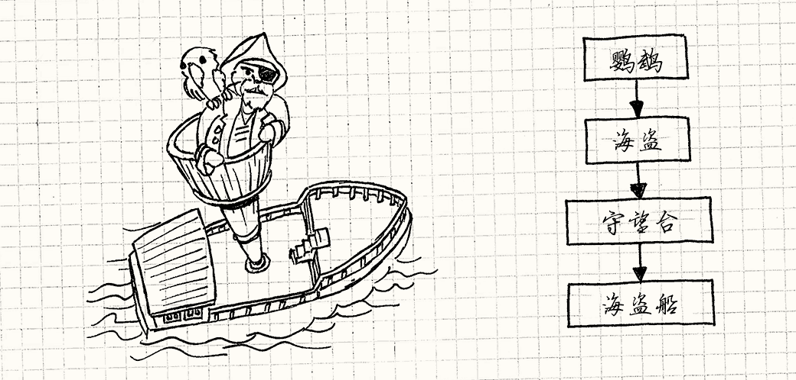
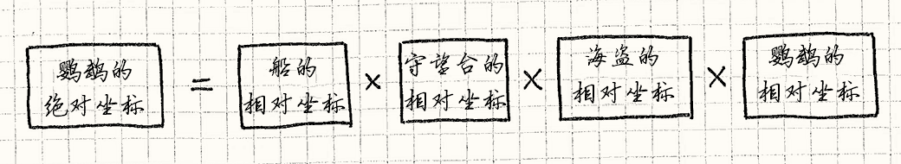
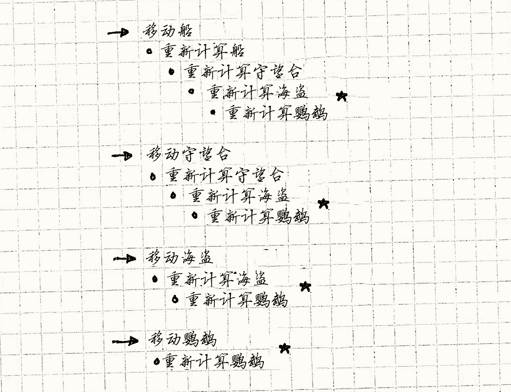
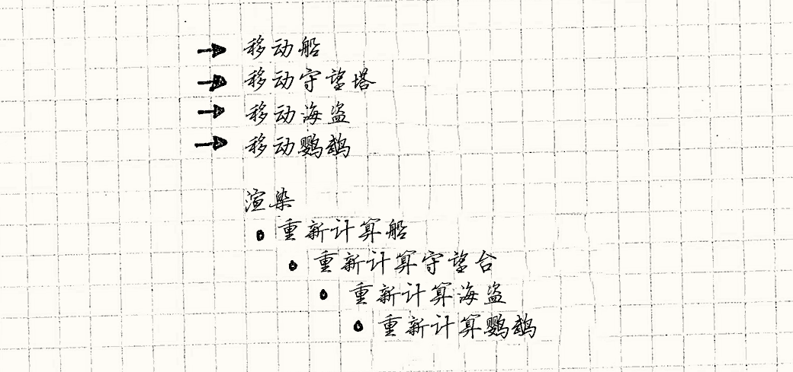
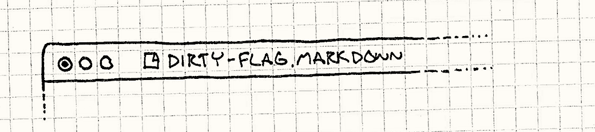

# 脏标识模式（Dirty Flag）

> **章节**：优化模式（Optimization Patterns）  
> **原著**：Robert Nystrom (Bob Nystrom) · 《Game Programming Patterns》  
> **导航**：[目录](README.md) ｜ [上一章：数据局部性](data-locality.md) ｜ [下一章：对象池模式](object-pool.md)

---

## 意图

*将工作延期至需要其结果时才去执行，避免不必要的工作。*

## 动机

很多游戏有*场景图*。
那是一个巨大的数据结构，包含了游戏世界中所有的对象。
渲染引擎用它来决定在屏幕上画什么、画在哪里。


在最简单的实现中，场景图只是一个扁平的对象列表。
每个对象都有模型，或者其他图形图元，以及*变换*。
变换描述了对象在世界中的位置、旋转和缩放。
为了移动或者旋转对象，只需简单地改变它的变换。

> [!NOTE] 旁注
> *如何*存储和操作变换的机制，很不幸超出了本书的讨论范围。
> 简略得有点好笑地说，它就是个4x4矩阵。
> 你可以把两个变换组合成一个变换——例如先平移再旋转对象——方法就是把两个矩阵相乘。
>
> 它如何工作，以及为什么那样工作是留给读者的练习。

当渲染器绘制对象时，它会取出对象的模型，对模型应用变换，然后将其渲染到世界中的那个位置。
如果我们有的是场景*包*而不是场景*图*，那事情就到此为止，生活也会简单很多。


但是，大多数场景图都是*分层的*。
场景图中的对象可能有一个它所锚定的父对象。
这种情况下，它的变换是相对于*父对象*的位置，而不是世界中的绝对位置。

举个例子，想象游戏世界中有一艘海上的海盗船。
桅杆的顶端有瞭望塔，瞭望塔里蜷缩着一个海盗，海盗肩上紧抓着一只鹦鹉。
船的自身变换定位船在海上的位置。瞭望塔的变换定位它在船上的位置，诸如此类。




> [!NOTE] 旁注
> 程序员的画风！


这样的话，当父对象移动时，它的子节点也会自动跟着移动。
如果我们改变了船的自身变换，瞭望塔、海盗和鹦鹉都会随之一起移动。
如果船移动时，我们还得手动调整船上所有对象的变换来防止它们滑出去，那可真是让人头疼。

> [!NOTE] 旁注
> 老实说，当你在海上时，你*确实*得不断手动调整位置，才不至于从船上滑下去。
> 也许我该选个更“干燥”点的例子——没那么湿，也没那么有趣。

但是为了在屏幕上真正画出鹦鹉，我们需要知道它在世界中的绝对位置。
我把相对父对象的变换称为对象的*自身变换*。
为了渲染对象，我们需要知道它的*世界变换*。

### 自身变换和世界变换

计算对象的世界变换非常直接——从根节点开始，沿着它的父节点链一路向下走到该对象，边走边把沿途的变换组合起来。
换言之，鹦鹉的世界变换如下：




> [!NOTE] 旁注
> 如果对象没有父对象，它的自身变换和世界变换是一样的。

我们每帧都需要为世界中的每个对象计算世界变换，所以哪怕每个模型只有少量矩阵乘法，
它也是性能关键的热代码路径。
让它们保持最新是件棘手的事，因为当父对象移动时，不仅影响它自己的世界变换，还会递归地影响所有子节点。

最简单的方法是在渲染时即时计算变换。
每一帧，我们都从层次结构的顶端开始递归遍历整个场景图。
对每个对象，我们当场计算它的世界变换并绘制它。

但这简直是在挥霍宝贵的CPU算力！
世界中的很多对象*并不是*每帧都在移动。
想想那些构成关卡的静态几何体。
在它们没有变化的情况下还每帧重新计算世界变换，是一种浪费。

### 缓存世界变换

显而易见的答案是*缓存*它。
在每个对象中，我们存储它的自身变换和由它推导出的世界变换。
渲染时我们只使用预先计算好的世界变换。
如果对象从未移动，缓存的变换就永远是最新的，一切都很美好。

当一个对象*确实*移动了，简单的做法是立即刷新它的世界变换。
但别忘了层次结构！当父节点移动时，我们得重新计算它的世界变换，*以及它所有子节点的世界变换，递归进行*。

想象一段忙碌的游戏过程。
在短短一帧里，船在海上颠簸，瞭望塔在风中摇晃，海盗探身到船舷边，鹦鹉跳到了他的头上。
我们改变了四个自身变换。如果每当一个自身变换改变时，我们都急切地重新计算世界变换，最终会发生什么？




> [!NOTE] 旁注
> 你可以看到在标记了&#x2605;的行上，我们重复计算了四次鹦鹉的世界变换，但我们只需要最后的那次。

我们只移动了四个对象，却做了*十次*世界变换计算。
其中有六次是无用计算，还没等到渲染器使用就被丢弃了。
我们计算了鹦鹉的世界变换*四*次，但它只被渲染一次。

问题在于，一个世界变换可能依赖于多个自身变换。
由于每当*其中一个*变换改变时我们就立即重新计算，当它依赖的多个自身变换在同一帧里发生变化时，
我们就会对同一个变换重复计算多次。

### 延迟重计算


我们会通过把“改变自身变换”与“更新世界变换”解耦来解决这个问题。
这样，我们可以一次性批量改变多个自身变换，等这些修改全部完成*之后*、渲染需要用到它之前，再只重新计算一次受影响的世界变换。

> [!NOTE] 旁注
> 有趣的是，软件架构中有相当一部分是在有意制造一点“松弛”。

为了做到这点，我们为图中的每个对象添加一个*标识*。
“标识”和“位”在编程中是同义词——都表示一丁点儿只处于两种状态之一的数据。
我们称这两种状态为“真”和“假”，有时也叫“设置”和“清除”。
我之后会交替使用这些叫法。


当自身变换改变时，我们设置它。
当我们需要对象的世界变换时，就检查这个标识。
如果它被设置了，就先计算世界变换，然后清除标识。
这个标识代表的是：“世界变换是否过时了？”
出于一些不太明确的原因，这种“过时状态”的传统叫法就是“脏”。
于是就有了*脏标识*。“脏位”也是这个模式同样常见的名字，不过我决定坚持用那个听起来没那么容易让人想歪的。

> [!NOTE] 旁注
> 维基百科的编辑者没有我这样的自制力，使用了[dirty bit](http://en.wikipedia.org/wiki/Dirty_bit)。

如果我们运用这个模式，然后移动之前例子中所有对象，那么游戏最终是这样的：



这就是你能期望的最好结果了——每个受影响对象的世界变换都恰好只被计算一次。
仅用一位数据，这个模式就为我们做了以下几件事：

* 它把对象父节点链上多个自身变换的修改，归并成该对象上的一次重新计算。

* 它避免了在没有移动的对象上重新计算。

* 还有一个小小的意外收获：如果对象在渲染前被删除了，不必再计算它的世界变换。

## 模式

一组**原始数据**会随着时间变化。
由这些原始数据通过某个**代价昂贵的过程**推导出一组**导出数据**。
用一个**“脏”标识**来追踪导出数据是否与原始数据失去同步。
它在**原始数据改变时被设置。** 当需要导出数据时，如果该标识处于设置状态，那么就**重新处理并清除该标识**，
否则就使用之前**缓存的导出数据**。

## 何时使用

与本书中的其他一些模式相比，这个模式解决的问题相当具体。
同时，就像大多数优化一样，只有当你遇到的性能问题大到足以证明值得增加代码复杂度时，才应该使用它。

脏标识适用于两类工作：*计算*和*同步*。
在这两种情况下，从原始数据得到导出数据的过程都很耗时，或在其他方面代价高昂。

在我们的场景图例子中，这个过程慢是因为要执行大量数学运算。
而当用这个模式做同步时，更常见的情况是，
导出数据在*别的地方*——要么在磁盘上，要么在网络上另一台机器上——把它从A点送到B点本身就是昂贵的。

此外还有几个前提条件：

* **原始数据的变化频率必须远高于导出数据的使用频率。**
  这个模式的原理是：如果一次后续的原始数据变化会在导出数据被使用之前就使其失效，那就避免去处理它。
  如果你发现自己每次修改原始数据之后总是立刻需要导出数据，那这个模式就帮不上忙了。

* **增量更新应该很困难。**
  假设我们的海盗船只能装下有限的战利品，而我们需要知道船舱里所有东西的总重量。
  我们*可以*使用这个模式，为总重量设一个脏标识。每次添加或移除战利品时，我们就设置这个标识。
  当需要总量时，把所有战利品的重量加在一起，然后清除标识。

    但更简单的做法是*维护一个不断更新的累计总量*。
    当我们添加或移除一个物品时，只需在当前总重量上加上或减去它的重量。
    如果我们能这样“随改随算”，让导出数据保持最新，那通常比使用这个模式、
    在需要时从头重新计算导出数据更好。


这让人感觉脏标识很少有用武之地，但你总会在这里或那里找到它们能帮上忙的地方。
在普通的游戏代码库中搜索“dirty”这个词，通常就能发现这个模式的使用痕迹。

> [!NOTE] 旁注
> 根据我的研究，搜索“dirty”还会找到很多为“dirty”黑客手段道歉的注释。

## 记住

哪怕是在说服自己这个模式在这里很恰当之后，这里还有几处小褶皱，可能会让你有点不舒服。

### 延期太久是有代价的

这个模式把某些慢工作推迟到真正需要结果的时候，但当需要它时，往往*立刻*就要。
可我们当初使用这个模式，正是因为计算结果很慢！


在我们的例子中，这不是问题，因为我们计算世界坐标的速度仍足以在一帧内完成；但你可以想象，在其他情况下，你要做的工作是一大块，需要花费明显的时间才能啃完。
如果游戏直到玩家期望看到结果的那一刻才*开始*啃这块硬骨头，就可能造成令人不快的可见卡顿。

延期的另一个问题是，如果出了什么岔子，你可能根本没做这项工作。
当你用这个模式把某些状态保存成更持久的形式时，这一点尤其成问题。

例如，文本编辑器知道你的文档有“未保存的修改”。
文件标题栏里的那个小圆点或星号，简直就是脏标识的可视化。
原始数据是内存中打开的文档，导出数据是磁盘上的文件。



很多程序直到文档关闭或应用退出时才保存到磁盘。
大多数情况下这没什么，但如果你不小心踢掉了电源线，你的杰作也就随之消失了。

在后台自动保存备份的编辑器正是为了弥补这一缺陷。
自动保存的频率是在两点之间的权衡：既要让崩溃时不丢失太多工作，又不要因为时刻保存而让文件系统不堪重负。

> [!NOTE] 旁注
> 这对应了自动内存管理系统中不同的垃圾回收策略。
> 引用计数会在内存不再需要的那一刻立即释放它，但每次引用改变时都要急切地更新引用计数，这会耗费大量CPU时间。
>
> 简单的垃圾回收器把内存回收推迟到确实需要时，但代价是可怕的
> “垃圾回收暂停”，它会冻住整个游戏，直到回收器清扫完整个堆。
>
> 介于两者之间的是更复杂的系统，如延迟引用计数和增量式垃圾回收，
> 它们回收内存不如纯引用计数急切，但比“暂停整个世界”的收集器更急切。

### *每次*状态改变时，你都得确保设置该标识。


由于导出数据是从原始数据计算而来的，它本质上是一种缓存。
无论何时你有了缓存数据，其中最棘手的部分就是*缓存失效*——在缓存与其源数据不同步时正确地察觉出来。
在这个模式中，这意味着只要*任何*原始数据变化，就要设置脏标识。

> [!NOTE] 旁注
> Phil Karlton有句名言：“计算机科学中只有两件难事：缓存失效和给事物命名。”

只要有一处遗漏，你的程序就会错误地使用过时的导出数据。
这会导致玩家困惑，以及非常难以追踪的缺陷。
使用这个模式时，你还得注意，任何修改原始状态的代码都必须设置脏标识。

缓解这一问题的一种方法，是把对原始数据的修改封装在某个接口之后。
任何能改变状态的代码都只经由同一个狭窄的API，你在那里设置脏标识，就可以放心它不会被漏掉。

### 得将之前的导出数据保存在内存中。


当需要导出数据而脏标识*没有*设置时，就使用之前计算出的数据。
这显而易见，但这确实意味着你得把导出数据保留在内存中，以防之后还需要它。

> [!NOTE] 旁注
> 如果你用这个模式将原始状态同步到其他地方，这不是问题。
> 那样的话，导出数据通常不在内存里。

如果你不使用这个模式，就可以在每次需要时即时计算导出数据，用完就丢弃。
这样避免了把它缓存在内存中的开销，代价是每次需要结果时都得重新计算。


因此，就像很多优化一样，这种模式用内存换速度。
通过在内存中保留之前计算的结果，避免了在它没有变化时重新计算。
当计算缓慢而内存便宜时，这种权衡是划算的。
当你手头的时间比内存更充裕时，最好按需计算。

> [!NOTE] 旁注
> 相反，压缩算法做的是相反的权衡：
> 它们优化*空间*，代价是解压所需的处理时间。

## 示例代码

假设我们已经满足了这份长得惊人的需求列表，来看看这个模式在代码中是什么样子。
就像我之前提到的，变换矩阵背后的具体数学超出了本书的微薄目标，所以我把它封装进一个类里，你可以假定其实现存在于某处虚空之中：

```cpp
class Transform
{
public:
  static Transform origin();

  Transform combine(Transform& other);
};
```

这里我们唯一需要的操作就是`combine()`，
这样把父节点链上所有的自身变换组合起来，就能得到对象的世界变换。
它还有一个方法可以获取“原点”变换——基本上就是一个单位矩阵，表示没有任何平移、旋转或缩放。

下面，我们勾勒出场景图中的对象类。这是在应用模式*之前*所需的最低限度的东西：

```cpp
class GraphNode
{
public:
  GraphNode(Mesh* mesh)
  : mesh_(mesh),
    local_(Transform::origin())
  {}

private:
  Transform local_;
  Mesh* mesh_;

  GraphNode* children_[MAX_CHILDREN];
  int numChildren_;
};
```

每个节点都有一个自身变换，描述它相对于父节点的位置。
它有一个网格，也就是对象的实际图形。（我们也允许`mesh_`为`NULL`，以便处理那些仅用来组合子节点的非可视节点。）
最后，每个节点都有一个可能为空的子节点集合。

有了这些，一个“场景图”实际上只是一个根`GraphNode`，它的子节点（以及孙节点等）就是世界中的所有对象：

```cpp
GraphNode* graph_ = new GraphNode(NULL);
// 向根图节点增加子节点……
```

为了渲染场景图，我们需要的就是从根节点开始遍历节点树，然后使用正确的世界变换为每个节点的网格调用函数：

```cpp
void renderMesh(Mesh* mesh, Transform transform);
```

我们不会在这里实现它，但如果实现了，它就会施展渲染器所需的魔法，把网格绘制在世界中的给定位置。
如果我们能在场景图的每个节点上都正确且高效地调用它，我们就心满意足了。

### 尚未优化的遍历

为了先“弄脏”双手，让我们拼凑一个用于渲染场景图的基础遍历，在渲染时即时计算世界位置。
它不是最优的，但很简单。我们给`GraphNode`添加一个新方法：

```cpp
void GraphNode::render(Transform parentWorld)
{
  Transform world = local_.combine(parentWorld);

  if (mesh_) renderMesh(mesh_, world);

  for (int i = 0; i < numChildren_; i++)
  {
    children_[i]->render(world);
  }
}
```

我们通过`parentWorld`把节点父对象的世界变换传进来。
有了它，要得到*这个*节点正确的世界变换，剩下的就只是把它与节点自己的自身变换组合起来。
我们不必*向上*遍历父链来计算世界变换，因为在*向下*遍历时我们已经在边算边走了。

我们计算节点的世界变换并存入`world`，然后如果有网格就渲染它。
最后，我们递归进入子节点，传入*这个*节点的世界变换。
总的来说，这是一个紧凑、简单的递归方法。

为了绘制整个场景图，我们从根节点开始整个过程。

```cpp
graph_->render(Transform::origin());
```

### 让我们弄脏双手

所以这段代码做的是正确的事——它在正确的位置渲染了所有网格——但做得并不高效。
它每一帧都在图中的每个节点上调用`local_.combine(parentWorld)`。
让我们看看这个模式如何修复这一点。首先，我们需要给`GraphNode`添加两个字段：

```cpp
class GraphNode
{
public:
  GraphNode(Mesh* mesh)
  : mesh_(mesh),
    local_(Transform::origin()),
    dirty_(true)
  {}

  // 其他方法……

private:
  Transform world_;
  bool dirty_;
  // 其他字段……
};
```

`world_`字段缓存了上一次计算出的世界变换，`dirty_`当然就是脏标识。
注意这个标识初始为`true`。当我们创建新节点时，还没有计算过它的世界变换。
从一出生起，它就已经与自身变换不同步了。

我们需要这个模式的唯一原因是对象可以*移动*，因此让我们添加对这点的支持：

```cpp
void GraphNode::setTransform(Transform local)
{
  local_ = local;
  dirty_ = true;
}
```

这里重要的部分是同时设置脏标识。我们忘了什么吗？是的——子节点！

当父节点移动时，它所有子节点的世界坐标也都失效了。
但这里我们不设置它们的脏标识。
我们*可以*那样做，但那要递归，而且很慢。改为在渲染时做点更聪明的事。让我们看看：


```cpp
void GraphNode::render(Transform parentWorld, bool dirty)
{
  dirty |= dirty_;
  if (dirty)
  {
    world_ = local_.combine(parentWorld);
    dirty_ = false;
  }

  if (mesh_) renderMesh(mesh_, world_);

  for (int i = 0; i < numChildren_; i++)
  {
    children_[i]->render(world_, dirty);
  }
}
```

> [!NOTE] 旁注
> 这里有一个微妙的假设：`if`检查比矩阵乘法快。直觉上你会这么想；测试单个位当然比一堆浮点运算要快。
>
> 然而，现代CPU极其复杂。它们严重依赖*流水线*——把一系列顺序指令排成队列。
> 像我们这里的`if`这样的分支可能会引发*分支预测失败*，迫使CPU损失周期去重新填充流水线。
>
> [数据局部性](data-locality.md)一章有更多关于现代CPU如何尝试跑得更快、
> 以及如何避免让它们这样栽跟头的内容。

这与原来那个朴素的实现很相似。
关键变化在于：我们在计算世界变换之前先检查节点是否是脏的，并把结果存到字段而不是局部变量里。
当节点是干净的，我们就完全跳过`combine()`，直接使用旧的但仍然正确的`world_`值。


巧妙之处在于那个`dirty`参数。
如果父链中位于本节点之上的任何节点是脏的，它就会是`true`。
正如`parentWorld`在我们顺着层次向下遍历时增量地更新世界变换一样，`dirty`追踪的是父链的脏状态。

这让我们不必在`setTransform()`里递归地标记每个子节点的`dirty_`标识。
相反，渲染时我们把父节点的脏标识向下传给它的子节点，并同时检查它，以判断是否需要重新计算世界变换。

这里的结果正是我们想要的：
改变节点的自身变换只是几次赋值，而渲染世界时，只计算自上一帧以来发生变化的世界变换，而且数量恰好最少。

> [!NOTE] 旁注
> 注意，这个巧妙技巧之所以有效，是因为`render()`是`GraphNode`中*唯一*需要最新世界变换的东西。
> 如果还有其他东西访问它，我们就得另想办法。

## 设计决策

这个模式相当具体，所以能拧的旋钮只有那么几个：

### 什么时候清空脏标识？

* **当结果被请求时：**

    * *如果结果永远不会被用到，就能完全避免计算。*
      如果原始数据的变化频率远高于导出数据的访问频率，这会是一个很大的胜利。

    * *如果计算很耗时，可能造成可察觉的卡顿。*
      把工作推迟到玩家期待看到结果的时候，会影响他们的游戏体验。
      它通常足够快，不会成为问题，但如果确实成了问题，你就得提前完成这些工作。

* **在精心设计的检查点处：**

    有时候，在时间上或在游戏进程中，会有一个天然的时机适合做这些延迟处理。
    例如，我们可能只想在海盗船驶入港口时才保存游戏。
    或者，同步点可能并不属于游戏机制本身，我们只是想把这些工作隐藏在加载画面或过场动画之后。

    * *做这些工作不会影响用户体验。*
      与上一个选项不同，你通常可以在游戏忙于处理时给玩家一些东西来分散其注意力。

    * *你会失去对工作何时进行的控制。*
      这多少和前面那一点相反。你可以对何时处理进行细粒度的控制，并确保游戏优雅地处理它。

        你*不能*保证玩家真的抵达了检查点，或者满足了你定义的任何条件。
        如果他们在游戏中迷失了，或者游戏进入了奇怪的状态，最终工作会推迟得超乎预料的晚。

* **在后台处理：**

    

    通常情况下，你在第一次更改时启动固定时长的计时器，然后在计时器到时间后处理之间的所有变化。

    > [!NOTE] 旁注
    > 在人机交互领域，程序接收用户输入到作出响应之间这种有意为之的延迟，术语叫[*hysteresis*](http://en.wikipedia.org/wiki/Hysteresis)。

    * *可以控制工作进行的频率。*
      通过调节计时器，可以保证它发生得像预期一样频繁（或者不频繁）。

    * *可能做更多冗余工作。*
      如果原始状态在计时器运行期间只改变了很少一点，最终你可能会处理一大块大部分都未改变的数据。

    * *需要支持异步工作。*
      在“后台”处理数据意味着玩家可以同时继续做他们正在做的事。
      这意味着你很可能会需要线程或其他并发支持，好让游戏在数据被处理的同时仍然可以继续游玩。

        由于玩家很可能正在与你处理的同一个原始状态交互，你还需要考虑让并发修改变得安全。

### 脏追踪的粒度有多细？

想象我们的海盗游戏允许玩家建造并定制自己的海盗船。
船会自动在线保存，这样玩家就能从上次停下的地方继续游戏。
我们使用脏标识来判断船的哪些甲板经过改装、需要发送到服务器。
我们发送给服务器的每一块数据，都包含一些修改过的船只数据，以及一小段描述这次改动发生在船上哪个位置的元数据。

* **如果粒度更细：**

    假设你在每块甲板的每一小块木板上都随手贴一个脏标识。

    * *你只需处理真正改变的数据。*
      你只把船上被修改过的那些部分发送到服务器。

* **如果粒度更粗：**

    

    或者，我们可以为每层甲板关联一个脏标识。改变它上面的任何东西都会让整个甲板变脏。

    > [!NOTE] 旁注
    > 我本可以在这里开一个关于甲板需要擦洗的烂笑话，但我忍住了。

    * *最终会处理未变化的数据。*
      在甲板上添加一个桶，就得把整层甲板发送到服务器。

    * *存储脏标识所用的内存更少。*
      往甲板上添加十个桶，也只需要一位来追踪它们全部。

    * *花在固定开销上的时间更少。*
      处理某些修改过的数据时，除了处理数据本身，通常还要做一点固定的工作。
      在这个例子里，就是用来标识改动发生在船上哪个位置的元数据。
      你处理的块越大，块的数量就越少，也就意味着开销越小。

## 参见

* 在游戏之外，这个模式在像[Angular](http://angularjs.org/)这样的浏览器端Web框架中也很常见。
  它们使用脏标识来追踪浏览器中哪些数据被修改过、需要推送到服务器。

* 物理引擎追踪哪些对象在运动、哪些在静止。
  由于静止的刚体在受到冲量之前不会移动，所以它们在被碰到之前不需要处理。
  这个“正在移动”位就是一个脏标识，用来标记哪些对象受到了力并需要求解其物理状态。

---

> **导航**：[目录](README.md) ｜ [上一章：数据局部性](data-locality.md) ｜ [下一章：对象池模式](object-pool.md)
