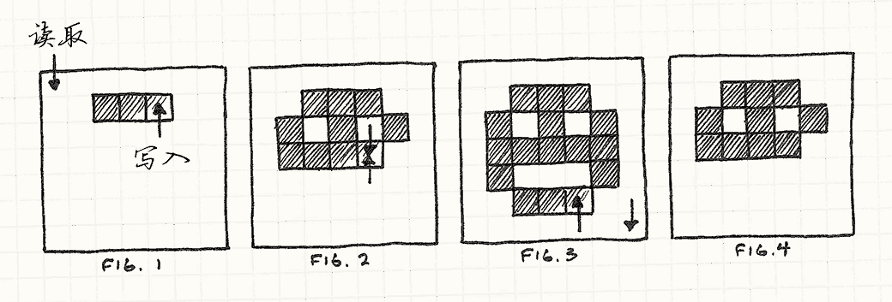
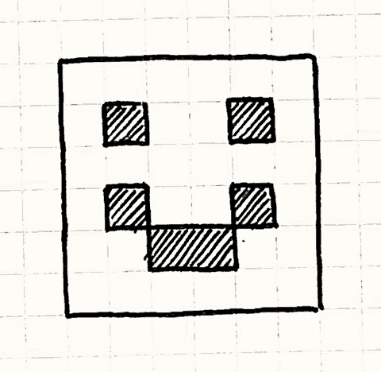
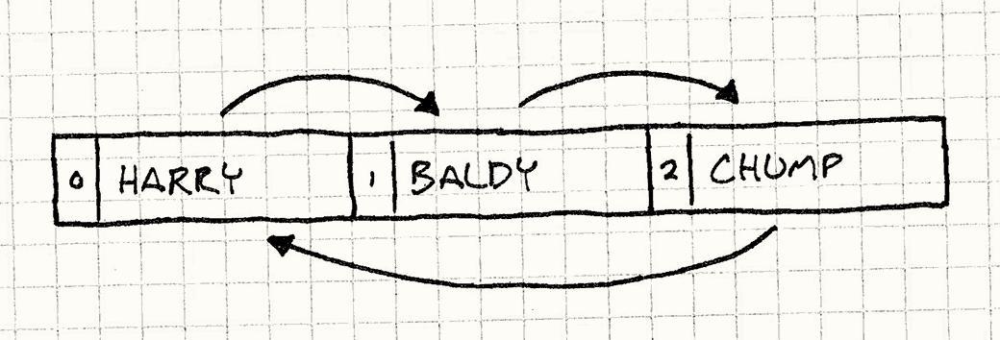
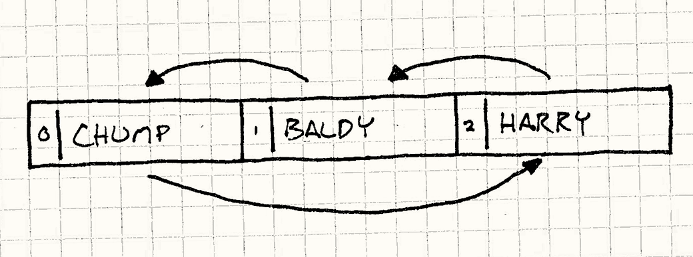

# 双缓冲模式（Double Buffer）

> **章节**：序列模式（Sequencing Patterns）  
> **原著**：Robert Nystrom (Bob Nystrom) · 《Game Programming Patterns》  
> **导航**：[目录](README.md) ｜ [上一章：序列模式](sequencing-patterns.md) ｜ [下一章：游戏循环](game-loop.md)

---

## 意图

*让一系列顺序执行的操作看起来是瞬间完成或同时发生的。*

## 动机


从骨子里说，计算机就是顺序执行的野兽。
它的力量来自能把最庞大的任务拆解成一个个可以依次执行的小步骤。
不过，我们的用户常常需要看到事情瞬间完成，或者看到多个任务同时进行。

> [!NOTE] 旁注
> 随着线程和多核架构的出现，这种说法越来越不成立了；但即便有多个核心，也只有少数几个操作在并发运行。

一个典型的例子，也是每个游戏引擎都必须处理的问题，就是渲染。
当游戏绘制玩家所见的世界时，它一次只画一部分——远处的山、起伏的丘陵、树木，轮番绘制。
如果用户*看着*画面这样一块块地绘制出来，连贯世界的幻觉就会被打破。
场景必须流畅快速地更新，显示出一系列完整的帧，每一帧都瞬间呈现。

双缓冲解决了这个问题，但为了理解其原理，我们需要先复习一下计算机是如何显示图形的。

### 计算机图形系统是如何工作的（概述）


像电脑显示器这样的视频显示设备一次绘制一个像素。
它从左到右扫描每一行像素，然后移动到下一行。
当到达右下角后，它重新扫描回左上角，再从头开始。
它做得非常快——大约每秒六十次——我们的眼睛察觉不到这种扫描。
对我们来说，那是一整片静态的彩色像素——一幅图像。

> [!NOTE] 旁注
> 这个解释嘛，嗯，“简化过了”。
> 如果你是底层硬件人员，现在正看得浑身难受，可以放心地跳到下一节。
> 你对本章其余部分已经了解得足够多了。
> 如果你*不是*那样的人，这部分的目标是给你足够的背景知识，好理解我们稍后要讨论的模式。

你可以把这个过程想象成一根细小的软管把像素输送到屏幕上。
一滴滴颜色从软管后端流入，再被喷洒到屏幕上，依次给每个像素喷上一点颜色。
那么，软管怎么知道哪种颜色该喷到哪里？


在大多数电脑上，答案是它从*帧缓冲*中取颜色。
帧缓冲是内存中的一个像素数组，也就是 RAM 里的一块区域，其中每几个字节表示一个像素点的颜色。
当软管在屏幕上喷洒时，它从这个数组中读取颜色值，一次一个字节。

> [!NOTE] 旁注
> 字节值与颜色之间的具体映射由系统的*像素格式*和*色深*描述。
> 在当今大多数游戏主机上，每个像素占32位：红、绿、蓝三个通道各占8位，剩下8位留给其他用途。

最终，为了让游戏出现在屏幕上，我们需要做的全部事情就是写入这个数组。
我们手头那些疯狂的高级图形算法，归根结底都只是这么一件事：往帧缓冲里填字节值。
但这里有个小问题。

早先，我说过计算机是顺序执行的。
如果机器正在执行一段渲染代码，我们不指望它同时还能做别的什么事。
这大体上没错，但有几件事*确实*会在程序运行期间发生。
其中一件是，当游戏运行时，视频显示器会*不断地*从帧缓冲中读取数据。
这可能给我们带来问题。

假设我们要在屏幕上显示一张笑脸。
程序开始循环遍历帧缓冲，为像素涂色。
我们没有意识到的是，就在我们写入的同时，视频驱动也在从帧缓冲中读取。
当它扫过我们已经写好的像素时，笑脸开始浮现，但随后它超过了我们，进入我们还没写的像素。结果就是*撕裂*——一个难看的视觉缺陷：你在屏幕上看到只画了一半的东西。




> [!NOTE] 旁注
> 就在显卡驱动开始从帧缓冲读取时，我们开始绘制像素（图1）。
> 显卡最终追上了渲染器，然后越过它，读取了我们还没有写入的像素（图2）。
> 我们完成了绘制（图3），但驱动没有读到那些新像素。
>
> 结果（图4）是用户只看到了一半的绘制内容。
> “撕裂”这个名字来自它看起来像是下半部分被撕掉了。

这就是我们需要这个模式的原因。
我们的程序一次渲染一个像素，但我们需要显示驱动一次性看到全部——这一帧里笑脸还不存在，下一帧它就出现了。
双缓冲解决了这个问题。我会用一个类比来解释。

### 第一幕，第一场

想象一下，用户正在观看我们自己排的一出戏。
当第一场结束、第二场开始时，我们需要更换舞台布景。
如果让场务在一场结束后冲上台，开始拖拽道具，“这就是同一个地方”的幻觉就会破灭。
我们可以在搬道具时调暗灯光（现实中的剧院当然就是这么做的），但观众还是知道*有事情*在发生，而我们希望场与场之间不留一丝时间空档。


只要多占一点场地，我们就能想出这个聪明的办法：搭*两个*舞台，让观众能同时看到两个。
每个舞台都有自己的一组灯光。我们把它们叫作舞台A和舞台B。
第一场在舞台A上演。与此同时，舞台B一片漆黑，场务们正在那里布置第二场。
第一场刚一结束，我们就关掉舞台A的灯、打开舞台B的灯。观众转向新舞台，第二场立刻开演。

与此同时，场务们来到现在暗下来的舞台*A*，撤掉第一场的布景，开始布置第*三*场。
第二场一结束，我们就把灯光再切回舞台A。
整出戏我们都这样进行，把暗下来的舞台当作工作区，在上面布置下一场。
每次换场，我们只是在两个舞台之间切换灯光。
观众看到的是连续不断的演出，场与场之间毫无延迟。他们永远看不到场务的身影。

> [!NOTE] 旁注
> 使用半透镜以及非常巧妙的布局，你其实可以做到让两个舞台在观众看来处于同一*位置*。
> 灯光一切换，他们看到的就是不同的舞台，却永远不必改变视线方向。
> 至于怎么搭出来，就留给读者当练习吧。

### 重新回到图形


这正*是*双缓冲的工作原理，
而这个过程也是你所见过的几乎所有游戏渲染系统的底层机制。
我们不是只有一个帧缓冲，而是有*两个*。其中一个代表当前帧，即类比中的舞台A，它是显卡正在读取的那一个。
GPU可以想什么时候扫描就什么时候扫描，想扫多久就扫多久。

> [!NOTE] 旁注
> 但并不是*所有*游戏和主机都这么做。
> 在内存有限的更老、更简单的主机上，它们会小心地把绘制同步到视频刷新。这很棘手。

与此同时，我们的渲染代码正在写入*另一个*帧缓冲。
它就是暗下来的舞台B。当渲染代码绘制完场景后，它通过*交换*缓冲区来切换灯光。
这告诉图形硬件现在从第二个缓冲区而不是第一个开始读取。
只要把交换安排在刷新的末尾，就不会出现任何撕裂，整个场景会一次性全部出现。

与此同时，旧的帧缓冲现在又可以使用了。我们开始把下一帧渲染到它上面。瞧！

## 模式

一个**缓冲类**封装了一个**缓冲**：一段可被修改的状态。
这个缓冲被增量地修改，但我们希望所有外部代码把这次修改看作一个单一的原子变更。
为此，类保存了缓冲区的*两个*实例：**下一缓冲**和**当前缓冲**。

当信息*从*缓冲区读取时，它总是来自*当前*缓冲区。
当信息写入到缓冲区时，它总是发生在*下一*缓冲区上。
当修改完成后，一个**交换**操作会立即交换下一缓冲和当前缓冲，
这样新缓冲区就公开可见了。旧的当前缓冲区现在可以作为新的下一缓冲区重复使用。

## 何时使用

这是那种你需要它时自然就会知道的模式。
如果你的系统缺少双缓冲，它很可能会看起来明显不对（撕裂等），或者行为不正确。
但是，“你需要时自然就会知道”并没有给你多少依据。
更具体地说，当以下所有条件都成立时，这个模式就很合适：

* 我们有一些被增量修改的状态。
* 同一状态可能会在修改进行到一半时被访问。
* 我们想要防止访问状态的代码看到进行到一半的工作。
* 我们想要能读取状态，并且不想在它被写入时干等。

## 记住

与较大的架构模式不同，双缓冲存在于较低的实现层面。
正因如此，它对代码库其余部分的影响较小——游戏的大部分甚至察觉不到差别。
不过，还是有几个注意事项。

### 交换本身需要时间

一旦状态修改完成，双缓冲需要一个*交换*步骤。
这个操作必须是原子的——在交换进行时，任何代码都不能访问*任意一个*状态。
通常，这就像给一个指针赋值一样快；但如果交换所需的时间比一开始修改状态还长，那我们就完全没帮到自己。

### 我们得保存两个缓冲区

这个模式的另一个后果是内存使用量增加。
顾名思义，这个模式要求你在内存中始终保留*两份*状态拷贝。
在内存受限的设备上，这可能是个沉重的代价。
如果你负担不起两个缓冲区，你可能得寻找其他方法来确保状态在修改期间不被访问。

## 示例代码

现在我们已经了解了理论，来看看它在实践中如何工作。
我们编写一个非常基础的图形系统，让我们能在帧缓冲上绘制像素。
在大多数主机和 PC 上，显卡驱动提供了图形系统中的这个底层部分，
但在这里亲手实现它，能让我们看清发生了什么。首先是缓冲区本身：

```cpp
class Framebuffer
{
public:
  Framebuffer() { clear(); }

  void clear()
  {
    for (int i = 0; i < WIDTH * HEIGHT; i++)
    {
      pixels_[i] = WHITE;
    }
  }

  void draw(int x, int y)
  {
    pixels_[(WIDTH * y) + x] = BLACK;
  }

  const char* getPixels()
  {
    return pixels_;
  }

private:
  static const int WIDTH = 160;
  static const int HEIGHT = 120;

  char pixels_[WIDTH * HEIGHT];
};
```

它有把整个缓冲区清成默认颜色的基本操作，以及设置单个像素颜色的操作。
它还有一个函数 `getPixels()`，用来暴露保存像素数据的原始数组。
虽然这个例子中看不到它，但显卡驱动会频繁调用这个函数，把缓冲区中的数据流式传输到屏幕上。

我们把这个原始缓冲区包装进 `Scene` 类。它的职责就是通过在缓冲区上进行一系列 `draw()` 调用来渲染出某样东西：


```cpp
class Scene
{
public:
  void draw()
  {
    buffer_.clear();

    buffer_.draw(1, 1);
    buffer_.draw(4, 1);
    buffer_.draw(1, 3);
    buffer_.draw(2, 4);
    buffer_.draw(3, 4);
    buffer_.draw(4, 3);
  }

  Framebuffer& getBuffer() { return buffer_; }

private:
  Framebuffer buffer_;
};
```

> [!NOTE] 旁注
> 特别地，它画出了这幅旷世杰作：
>
> 

每一帧，游戏让场景去绘制。场景清空缓冲区，然后一个接一个地绘制一大堆像素。
它还通过 `getBuffer()` 提供对内部缓冲区的访问，这样显卡驱动就能拿到它。

这看起来直截了当，但如果就这样放着，我们会遇到麻烦。
问题在于显卡驱动可以在*任何*时间对缓冲区调用 `getPixels()`，甚至是在这里：

```cpp
buffer_.draw(1, 1);
buffer_.draw(4, 1);
// <- 图形驱动从这里读取像素！
buffer_.draw(1, 3);
buffer_.draw(2, 4);
buffer_.draw(3, 4);
buffer_.draw(4, 3);
```

当这种情况发生时，用户会看到脸的眼睛，但这一帧里嘴却消失了。
下一帧，它又可能在别的地方被打断。最终结果是糟糕的闪烁画面。我们用双缓冲来修复这个问题：

```cpp
class Scene
{
public:
  Scene()
  : current_(&buffers_[0]),
    next_(&buffers_[1])
  {}

  void draw()
  {
    next_->clear();

    next_->draw(1, 1);
    // ...
    next_->draw(4, 3);

    swap();
  }

  Framebuffer& getBuffer() { return *current_; }

private:
  void swap()
  {
    // 只需交换指针
    Framebuffer* temp = current_;
    current_ = next_;
    next_ = temp;
  }

  Framebuffer  buffers_[2];
  Framebuffer* current_;
  Framebuffer* next_;
};
```

现在 `Scene` 有了存储在 `buffers_` 数组中的两个缓冲区。
我们不直接从数组中引用它们。而是通过两个成员 `next_` 和 `current_` 指向数组中的元素。
绘制时，我们绘制到 `next_` 所指向的缓冲区上。
当显卡驱动需要获取像素时，它总是通过 `current_` 访问*另一个*缓冲区。

这样，显卡驱动永远看不到我们正在处理的缓冲区。
剩下的最后一块拼图，就是场景绘制完一帧后调用 `swap()`。
它通过交换 `next_` 和 `current_` 的引用，来交换这两个缓冲区。
下一次显卡驱动调用 `getBuffer()` 时，它就会拿到我们刚刚绘制完成的新缓冲区，
把刚画好的缓冲区放到屏幕上。不再有撕裂，也不再有难看的毛刺。

### 不仅是图形

双缓冲解决的核心问题是状态在被修改的同时被访问。
这通常有两种原因。我们的图形例子覆盖了第一种——状态被另一个线程或中断中的代码直接访问。

但还有另一个同样常见的原因：*进行修改的*代码访问了它正在修改的同一状态。
这可能出现在很多地方，尤其是物理和 AI 中，实体会彼此交互。
双缓冲在这里往往也很有用。

### 人工不智能

假设我们正在为一个以打闹喜剧为主题的游戏构建行为系统。
这个游戏里有一个舞台，上面有一堆跑来跑去、搞各种恶作剧和胡闹的角色。这是我们的基础角色：

```cpp
class Actor
{
public:
  Actor() : slapped_(false) {}

  virtual ~Actor() {}
  virtual void update() = 0;

  void reset()      { slapped_ = false; }
  void slap()       { slapped_ = true; }
  bool wasSlapped() { return slapped_; }

private:
  bool slapped_;
};
```


每一帧，游戏负责在角色身上调用 `update()`，让它有机会做一些处理。
关键的是，从用户的角度看，*所有角色都应该看起来同时更新*。

> [!NOTE] 旁注
> 这是[更新方法](update-method.md)模式的例子。

角色之间也可以相互交互——如果“交互”的意思是“互相扇巴掌”的话。
在更新时，角色可以对另一个角色调用 `slap()` 来扇它，并调用 `wasSlapped()` 来判断自己是否被扇了。

角色需要一个可以交互的舞台，让我们来布置一下：

```cpp
class Stage
{
public:
  void add(Actor* actor, int index)
  {
    actors_[index] = actor;
  }

  void update()
  {
    for (int i = 0; i < NUM_ACTORS; i++)
    {
      actors_[i]->update();
      actors_[i]->reset();
    }
  }

private:
  static const int NUM_ACTORS = 3;

  Actor* actors_[NUM_ACTORS];
};
```

`Stage` 允许我们添加角色，并提供一个 `update()` 调用，用来更新每个角色。
在用户看来，角色是同时移动的，但在内部，它们是一次更新一个。

另一点要注意的是，每个角色的“被扇”状态在更新后立即被清除。
这样角色对同一巴掌只会反应一次。

为了把一切运转起来，让我们定义一个具体的角色子类。
这里的喜剧演员很简单。
他面向某一个角色。当他被扇时——无论被谁扇——他的反应是扇他所面向的那个角色一巴掌。

```cpp
class Comedian : public Actor
{
public:
  void face(Actor* actor) { facing_ = actor; }

  virtual void update()
  {
    if (wasSlapped()) facing_->slap();
  }

private:
  Actor* facing_;
};
```

现在，我们把几个喜剧演员丢到舞台上，看看会发生什么。
我们设置三个喜剧演员，每个都面向下一个。最后一个面向第一个，围成一个大圈：

```cpp
Stage stage;

Comedian* harry = new Comedian();
Comedian* baldy = new Comedian();
Comedian* chump = new Comedian();

harry->face(baldy);
baldy->face(chump);
chump->face(harry);

stage.add(harry, 0);
stage.add(baldy, 1);
stage.add(chump, 2);
```

最终舞台布置如下图所示。箭头代表角色面向谁，数字代表它们在舞台数组中的索引。



我们扇哈利一巴掌，为表演拉开序幕，看看之后会发生什么：

```cpp
harry->slap();

stage.update();
```

记住，`Stage` 中的 `update()` 函数会依次更新每个角色，
因此如果我们单步执行代码，就会发现发生了下面这些事：

    ```text
    Stage updates actor 0 (Harry)
    Harry was slapped, so he slaps Baldy
    Stage updates actor 1 (Baldy)
    Baldy was slapped, so he slaps Chump
    Stage updates actor 2 (Chump)
    Chump was slapped, so he slaps Harry
    Stage update ends
    ```

在一帧之内，我们最初扇哈利的那一巴掌传遍了所有喜剧演员。
现在，为了打乱一下局面，假设我们重新排列舞台数组中喜剧演员的顺序，
但让他们仍以同样的方式彼此相向。



我们不动舞台的其余部分，只是将添加角色到舞台的代码块改为如下：

```cpp
stage.add(harry, 2);
stage.add(baldy, 1);
stage.add(chump, 0);
```

让我们看看再次运行时会发生什么：

    ```text
    Stage updates actor 0 (Chump)
    Chump was not slapped, so he does nothing
    Stage updates actor 1 (Baldy)
    Baldy was not slapped, so he does nothing
    Stage updates actor 2 (Harry)
    Harry was slapped, so he slaps Baldy
    Stage update ends
    ```


哎呀。结果完全不同了。问题直截了当。
更新角色时，我们修改了他们的“被扇”状态，而这正是我们在更新过程中*读取*的同一状态。
因此，在更新早期对该状态的修改，会影响*同一次*更新步骤后面的部分。

> [!NOTE] 旁注
> 如果你继续更新舞台，你会看到巴掌在角色间逐渐传递，每帧传递一个。
> 在第一帧，Harry 扇了 Baldy。下一帧，Baldy 扇了 Chump，以此类推。

最终结果是，一个角色可能在被扇的*同一*帧或*下一*帧才作出反应，
这完全取决于两个角色恰好在舞台上如何排序。
这违反了我们要求角色看起来并行运行的需求——它们在一帧内的更新顺序不应该有影响。

### 缓冲的巴掌

幸运的是，双缓冲模式可以帮忙。
这一次，我们不是为一个整体“缓冲”对象保存两份副本，而是在更细的粒度上缓冲：每个角色的“被扇”状态。

```cpp
class Actor
{
public:
  Actor() : currentSlapped_(false) {}

  virtual ~Actor() {}
  virtual void update() = 0;

  void swap()
  {
    // 交换缓冲区
    currentSlapped_ = nextSlapped_;

    // 清空新的“下一个”缓冲区。.
    nextSlapped_ = false;
  }

  void slap()       { nextSlapped_ = true; }
  bool wasSlapped() { return currentSlapped_; }

private:
  bool currentSlapped_;
  bool nextSlapped_;
};
```

现在每个角色不再只有一个 `slapped_` 状态，而是有两个。
就像之前的图形例子一样，当前状态用于读取，下一状态用于写入。

`reset()` 函数被替换为 `swap()`。
现在，就在清除交换状态之前，它把下一状态复制到当前状态上，
使其成为新的当前状态。这还需要在 `Stage` 中做一个小小的改动：

```cpp
void Stage::update()
{
  for (int i = 0; i < NUM_ACTORS; i++)
  {
    actors_[i]->update();
  }

  for (int i = 0; i < NUM_ACTORS; i++)
  {
    actors_[i]->swap();
  }
}
```

`update()` 函数现在更新所有角色，*然后*交换它们的状态。
最终结果是，角色只有在实际被扇*之后*的那一帧才能看到这一巴掌。
这样一来，无论角色在舞台数组中如何排列，行为都相同。
在用户或任何外部代码看来，所有角色都在一帧内同时更新。

## 设计决策

双缓冲相当直观，我们目前看到的例子也覆盖了你可能会遇到的大多数变体。
实现这个模式时，会面临两个主要决策。

### 缓冲区是如何被交换的？

交换操作是整个过程最关键的一步，
因为在它发生时，我们必须阻止对两个缓冲区的一切读取和修改。
为了获得最佳性能，我们希望它发生得尽可能快。

* **交换缓冲区的指针或引用：**
    这是我们图形例子中的做法，也是双缓冲图形最常见的解决方案。

    * *速度快。* 不管缓冲区有多大，交换都只是几次指针赋值。在速度和简洁性上，很难有比这更好的了。

    * *外部代码不能保存指向缓冲区的持久指针。* 这是主要的限制。
      由于我们没有真正移动*数据*，本质上是在周期性地告诉代码库其余部分去别处找缓冲区，
      就像前面的舞台类比一样。这意味着代码库其余部分不能直接保存指向缓冲区内部数据的指针——
      它们可能在片刻之后指向错误的缓冲区。

        在显卡驱动期望帧缓冲始终位于内存中固定地址的系统上，这会特别麻烦。在这种情况下，我们无法使用这个选项。

    *  *缓冲区中已有的数据来自两帧之前，而不是上一帧。*
      连续的帧交替绘制在两个缓冲区上，缓冲区之间不拷贝数据，就像这样：

            ```text
            ```
            Frame 1 drawn on buffer A
            Frame 2 drawn on buffer B
            Frame 3 drawn on buffer A
            ...

        
        你会注意到，当我们绘制第三帧时，缓冲区上的数据是*第一帧*的，而不是更近的第二帧的。大多数情况下，这不是什么问题——我们通常会在绘制之前清空整个缓冲区。但如果想沿用缓冲区中已有的一些数据，就需要考虑到这些数据会比你预期的旧一帧。

        > [!NOTE] 旁注
        > 旧帧缓冲数据的一个经典用途是模拟运动模糊。
        >         把当前帧与少量之前渲染的帧混合，得到的图像看起来更像真实相机捕捉到的画面。

* **在缓冲区之间拷贝数据：**
    如果我们无法把用户重定向到另一个缓冲区，唯一的选择就是把下一帧的数据实实在在地拷贝到当前帧上。
    这就是我们的扇巴掌喜剧所用的方法。
    这种情况下，我们选择这种方法，是因为状态——一个简单的布尔标志——拷贝起来并不比一个指向缓冲区的指针更费时。

    * *下一缓冲区上的数据只落后一帧。*
      这正是拷贝数据相比在两块缓冲区之间来回乒乓切换的好处。
      如果我们需要访问前一个缓冲区的数据，这样我们就能用上更新的数据。

    * *交换可能更耗时。*
      这当然是最大的缺点。交换操作现在意味着在内存中拷贝整个缓冲区。
      如果缓冲区很大，比如一整个帧缓冲，这需要花费可观的时间。
      由于交换进行时任何代码都无法读取或写入*任何一个*缓冲区，这是一个巨大的限制。

### 缓冲的粒度如何？

这里的另一个问题是缓冲区本身是如何组织的——是单个数据块还是散布在对象集合中？
图形例子是前一种，而角色例子是后一种。

大多数情况下，你要缓冲的内容的性质自然而然会引导你找到答案，但这里也有一些灵活度。
比如，我们的角色本可以都把消息存储在一个统一的消息块中，通过各自的索引来引用。

* **如果缓冲区是整块的：**

    * <p>*交换操作更简单。*
      由于只有一对缓冲区，一次简单的交换就完成了。
      如果可以通过改变指针来交换，那么无论缓冲区多大，只需几次赋值就可以交换整个缓冲区。</p>

* **如果很多对象都持有一块数据：**

    * *交换操作更慢。*
      为了交换，需要遍历整个对象集合，通知每个对象交换。

        在喜剧的例子中，这没问题，因为反正需要清除下一轮的被扇状态
        ——每一块被缓冲的状态每帧都需要接触。
        如果我们本来就不需要接触旧缓冲区，有一种简单的优化：在把缓冲区分散到多个对象上的同时，
        获得与整块缓冲区相同的性能。

        思路是沿用“当前”和“下一”指针的概念，把它应用到每个对象上，将其改为相对对象的*偏移量*。就像这样：

        ```cpp
        class Actor
        {
        public:
          static void init() { current_ = 0; }
          static void swap() { current_ = next(); }

          void slap()        { slapped_[next()] = true; }
          bool wasSlapped()  { return slapped_[current_]; }

        private:
          static int current_;
          static int next()  { return 1 - current_; }

          bool slapped_[2];
        };
        ```

        角色使用`current_`作为索引访问状态数组，获得当前的被扇状态，
        下一状态总是数组中的另一个索引，所以可以用`next()`来计算。
        交换状态只需交替改变`current_`索引。
        聪明之处在于`swap()`现在是*静态*函数——它只需被调用一次，*每个*角色的状态都会被交换。

## 参见

* 你可以在几乎每个图形 API 中找到双缓冲模式。举个例子，OpenGL 有 `swapBuffers()`，Direct3D 有“交换链”（swap chains），Microsoft 的 XNA 框架则在其 `endDraw()` 方法中交换帧缓冲。

---

> **导航**：[目录](README.md) ｜ [上一章：序列模式](sequencing-patterns.md) ｜ [下一章：游戏循环](game-loop.md)
