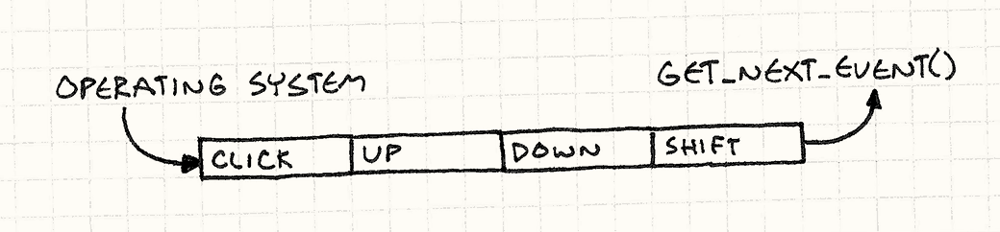
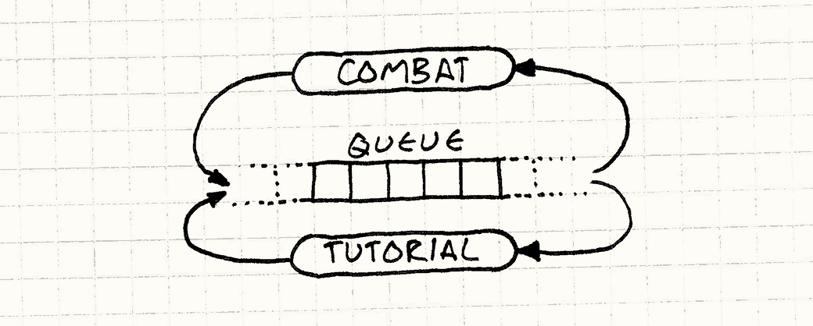
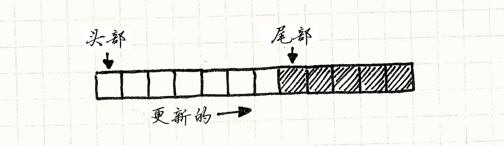
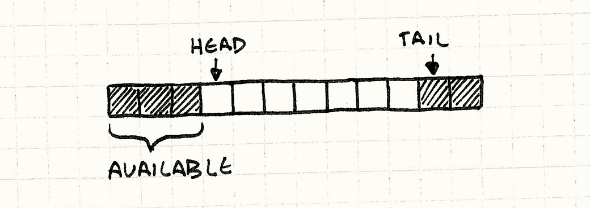
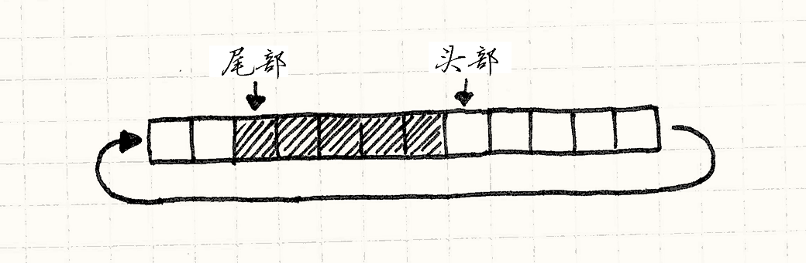

# 事件队列（Event Queue）

> **章节**：解耦模式（Decoupling Patterns）  
> **原著**：Robert Nystrom (Bob Nystrom) · 《Game Programming Patterns》  
> **导航**：[目录](README.md) ｜ [上一章：组件模式](component.md) ｜ [下一章：服务定位器](service-locator.md)

---

## 意图

*解耦消息或事件的发送时间和处理它的时间。*

## 动机


除非还住在少数几个没通网的石头底下，否则你很可能已经听说过“事件队列”了。
如果没有，也许“消息队列”、“事件循环”或“消息泵”能让你觉得耳熟。
为了唤醒你的记忆，让我们了解几个此模式的常见应用吧。

> [!NOTE] 旁注
> 这章的大部分里，我交替使用“事件”和“消息”。
> 在两者的意义有区别时，我会表明的。

### GUI事件循环


如果你做过任何用户界面编程，就会对*事件*再熟悉不过了。
每当用户与你的程序交互——点击按钮，下拉菜单，或者按个键——操作系统就会生成一个事件。
它会将这个对象扔给你的应用程序，你的工作就是获取它然后将其与有趣的行为相挂钩。

> [!NOTE] 旁注
> 这个程序风格非常普遍，被认为是一种编程范式：[*事件驱动编程*](http://en.wikipedia.org/wiki/Event-driven_programming)。

为了接收这些消息，在你代码深处的某个地方有一个*事件循环*。它大体上是这样的：

```cpp
while (running)
{
  Event event = getNextEvent();
  // 处理事件……
}
```


调用`getNextEvent()`会将一点未处理的用户输入拉入你的应用程序。
你将它导向事件处理器，之后应用就像被施了魔法一样活了过来。
有趣的部分是应用在*它*想要的时候*获取*事件。
当用户敲打外设时，操作系统不会立即跳转到你应用中的某处代码。

> [!NOTE] 旁注
> 相反，操作系统的*中断*确实是那样工作的。
> 当中断发生时，操作系统会停下应用正在做的事，强制它跳到中断处理器。
> 这种唐突劲儿正是中断难以驾驭的原因。

这就意味着当用户输入进来时，它需要到某处去，
这样操作系统在设备驱动报告输入和应用去调用`getNextEvent()`之间不会漏掉它。
这个“某处”是一个*队列*。



当用户输入抵达时，操作系统将其添加到未处理事件的队列中。
当你调用`getNextEvent()`时，它从队列中获取最旧的事件然后交给应用程序。

### 中心事件总线


大多数游戏不是像这样事件驱动的，但游戏拥有自己的事件队列作为其神经系统的骨干是很常见的。
你通常会听到用“中心”、“全局”或“主”来描述它。
它被用于想要保持解耦的游戏系统之间的高层通信。

> [!NOTE] 旁注
> 如果你想知道*为什么*它们不是事件驱动的，不妨翻开[游戏循环](game-loop.md)一章看看。


假设游戏有新手教程系统，在某些特定游戏事件后显示帮助框。
举个例子，当玩家第一次干掉一只邪恶的小怪兽，你想要一个显示着“按X拿起战利品！”的小气泡。

> [!NOTE] 旁注
> 新手教程系统很难优雅地实现，大多数玩家只会花一小部分时间使用游戏内的帮助，所以这感觉上吃力不讨好。
> 但正是那些*使用*教程的一小部分时间，对于引导玩家进入游戏可能是无价的。

你的游戏玩法和战斗代码本身可能已经够复杂了。
你最不想做的就是在里面塞进一堆触发教程的检查。
相反，你可以使用中心事件队列。
任何游戏系统都可以发事件给队列，这样战斗代码可以在砍倒敌人时发出“敌人死亡”事件。


类似地，任何游戏系统都能从队列*接收*事件。
教程引擎在队列中注册自己，然后表明它想要收到“敌人死亡”事件。
用这种方式，敌人死了的消息从战斗系统传到了教程引擎，而不需要这两个系统直接知道对方的存在。

> [!NOTE] 旁注
> 这种拥有一个共享空间、实体可以向其中发布信息并从中接收通知的模型，很像AI界的[blackboard systems](http://en.wikipedia.org/wiki/Blackboard_system)。



我本想把这个作为本章其余部分的例子，但我一般不喜欢这样庞大的全局系统。
事件队列不必用于在整个游戏引擎的各部分之间通信。它们在单个类或领域内也同样有用。

### 你说什么？

所以说点别的，让我们给游戏加点声音吧。
人类主要是视觉动物，但听觉与我们的情感和对物理空间的感知紧密相连。
正确模拟的回声可以让漆黑的屏幕感觉上是巨大的洞穴，而一段时机恰好的小提琴慢板能让你的心弦产生共鸣。


为了让游戏变得有声有色，我们从最简单的解决方法开始，看看结果如何。
添加一个小小的“音频引擎”，其中有使用标识符和音量就可以播放声音的API：

> [!NOTE] 旁注
> 我几乎总是对[单例模式](singleton.md)敬而远之。
> 这是少数它可以使用的领域，因为机器通常只有一套扬声器。
> 我使用更简单的方法，直接将方法设为静态。

```cpp
class Audio
{
public:
  static void playSound(SoundId id, int volume);
};
```

它负责加载合适的声音资源，找到可用的频道来播放它，然后启动它。
这章不是关于某个平台真实的音频API，所以我会变出一个API，并假设它在别处已经实现了。
使用它，我们像这样写方法：

```cpp
void Audio::playSound(SoundId id, int volume)
{
  ResourceId resource = loadSound(id);
  int channel = findOpenChannel();
  if (channel == -1) return;
  startSound(resource, channel, volume);
}
```

我们签入以上代码，创建一些声音文件，然后像神奇的音效小仙女一样，在代码库中到处撒满`playSound()`调用。
举个例子，在UI代码中，当选中菜单项改变时，我们就播放一小声“啵”：

```cpp
class Menu
{
public:
  void onSelect(int index)
  {
    Audio::playSound(SOUND_BLOOP, VOL_MAX);
    // 其他代码……
  }
};
```

这样做了之后，我们注意到有时候你改变菜单项目，整个屏幕就会冻住几帧。
我们遇到了第一个问题：

* **问题一：API在音频引擎完成对请求的处理前阻塞了调用者。**

我们的`playSound()`方法是*同步*的——直到扬声器里传出“啵啵”声，它才会返回调用者。
如果声音文件要从光盘上加载，那就得花费一定时间。
与此同时，游戏的其他部分被卡住了。

先把这个放一边，我们继续。
在AI代码中，我们增加了一个调用，在敌人承受玩家伤害时发出痛苦的哀嚎。
没有什么比在虚拟的生物身上施加痛苦更能温暖玩家心灵的了。


这能行，但是有时英雄使出强力攻击，会在同一帧击中两个敌人。
这让游戏同时要播放两遍哀嚎。
如果你了解一些音频的知识，那么就知道要把两个不同的声音混合在一起，就要加和它们的波形。
当这两个是*同一*波形时，它与*一个*声音播放*两倍响*是一样的。那会很刺耳。

> [!NOTE] 旁注
> 我在开发[Henry Hatsworth in the Puzzling Adventure](http://en.wikipedia.org/wiki/Henry_Hatsworth_in_the_Puzzling_Adventure)时就撞上了完全一样的问题。我那时的解决办法和这里讲的差不多。

在Boss战中有个相关的问题，当有一堆小怪跑动并制造混乱时。
硬件只能同时播放一定数量的声音。当数量超过限度时，声音就被忽视或者切断了。

为了处理这些问题，我们需要审视声音调用的整个*集合*，对它们进行聚合和排定优先级。
不幸的是，音频API独立处理每一个`playSound()`调用。
它就像通过针眼观察请求，一次只能看到一个。

* **问题二：请求无法合并处理。**

与接下来落到我们头上的问题相比，这些问题只是小烦恼。
到现在为止，我们已经把`playSound()`调用撒满了代码库中许多不同的游戏系统。
但是游戏引擎是在现代多核机器上运行的。
为了使用多核带来的优势，我们将系统分散在不同线程上——渲染在一个，AI在另一个，诸如此类。

由于我们的API是同步的，它在*调用者*的线程上运行。
当从不同的游戏系统调用时，我们从多个线程同时使用API。
看看示例代码，能找出任何线程同步吗？反正我是找不着。

这尤其糟糕，因为我们本来打算为音频分配一个*单独的*线程。
当其他线程都忙着互相踩来踩去、把事情搞得一团糟时，它却完全闲置地待在那里。

* **问题三：请求在错误的线程上执行。**

音频引擎把对`playSound()`的调用理解为“放下所有事情，现在就播放声音！”。*立即*就是问题所在。
其他游戏系统在*它们*方便时调用`playSound()`，但这不一定是音频引擎方便处理该请求的时候。
为了解决这点，我们需要将*接收*请求和*处理*请求解耦。

## 模式

**队列**以先入先出的顺序存储一系列**通知或请求**。
发送通知时，**将请求放入队列并返回**。
处理请求的系统之后稍晚**从队列中获取请求**并处理。
这**解耦了发送者和接收者**，既**静态**又**在时间上**。

## 何时使用


如果你只是想解耦消息的*接收者*和发送者，像[观察者模式](observer.md)
和[命令模式](command.md)都可以用较小的复杂度进行处理。
只有当你想要在时间上解耦某些东西时，才需要队列。

> [!NOTE] 旁注
> 我在之前的几乎每章都提到了，但这值得反复提。
> 复杂度会拖慢你，所以要将简单视为宝贵的资源。

用推和拉来考虑。
有一块代码A需要另一块代码B去做些事情。
对A自然的处理方式是将请求*推*给B。

同时，对B自然的处理方式是在*它*运行周期中方便的时刻将请求*拉*入。
当一端有推模型另一端有拉模型，你需要在它们之间设置缓冲区。
这就是队列比简单的解耦模式多提供的部分。

队列把控制权交给了从中拉取的代码——接收者可以延迟处理、合并请求或完全丢弃它们。
但队列做这些事是通过将控制权从发送者那里*拿走*完成的。
发送者能做的只是把请求扔进队列，然后听天由命。
当发送者需要回复时，队列不是好的选择。

## 记住

与本书中一些更朴素的模式不同，事件队列很复杂，往往会对游戏架构产生广泛影响。
这就意味着你得仔细考虑如何——或者要不要——使用它。

### 中心事件队列是一个全局变量

这个模式的一个常见用途是充当某种“纽约中央车站”，游戏的所有部分都可以通过它传递消息。
这是一块强大的基础设施，但是*强大*并不总是意味着*好*。

这花了不少时间，但我们大多数人都是吃过苦头才明白全局变量不是好东西。
当有一块状态可被程序的任何部分随意摆弄时，各种微妙的相互依赖就会悄悄出现。
这个模式将状态封装在一个不错的小协议里，但是它还是全局的，仍然带着随之而来的全部危险。

### 世界的状态可能在你脚下改变

假设在某个虚拟小怪一命呜呼时，一些AI代码将“实体死亡”事件发送到队列中。
这个事件在队列里待了不知多少帧，直到最终排到最前面并被处理。

同时，经验系统想要追踪女英雄的杀敌数，并奖励她可怕的效率。
它接收每个“实体死亡”事件，确定被击杀实体的种类以及击杀难度，以便发放合适的奖励。

这需要游戏世界的多种不同状态。
我们需要死亡的实体，才能知道它有多难对付。
我们也许想检查它的周围，看看附近还有什么障碍物或小怪。
但是如果事件直到稍后才被接收，这些东西可能已经消失了。
实体可能已被释放，附近的其他敌人也可能已经走开。

当你收到事件时，得小心，不能假设*当前*的世界状态反映了*事件被触发时*的世界状态。
这就意味着排队的事件往往比同步系统中的事件携带更多数据。
对于后者，通知只需说“某事发生了”，接收者可以四处查看细节。
使用队列时，这些短暂的细节必须在事件发送时就被捕获，以方便之后使用。

### 你可能会陷入反馈循环

任何事件系统和消息系统都得担心环路：

1. A发送了一个事件
2. B接收然后发送事件作为回应。
3. 这个事件恰好是A关注的，所以它收到了。为了回应，它发送了一个事件。
5. 回到 2。


当消息系统是*同步的*，你很快就能发现循环——它们造成了栈溢出并让游戏崩溃。
使用队列时，异步性会展开栈，所以即使多余的事件在队列里来回晃荡，游戏仍然可以继续运行。
避免这个的通用方法就是避免在*处理*事件的代码中*发送*事件。

> [!NOTE] 旁注
> 在你的事件系统中加一个小小的调试日志也是一个好主意。

## 示例代码

我们已经看到一些代码了。它不完美，但是有正确的基本功能——我们想要的公共API和正确的底层音频调用。
剩下需要做的就是修复它的问题。

第一个问题是我们的API是*阻塞的*。
当一段代码播放声音时，在`playSound()`完成加载资源并真正让扬声器震动之前，它不能做任何其他事情。

我们想要推迟这项工作，这样 `playSound()` 可以很快地返回。
为了达到这一点，我们需要*具体化*播放声音的请求。
我们需要一个小结构来存储待处理请求的细节，这样我们就能把它保留到以后使用：

```cpp
struct PlayMessage
{
  SoundId id;
  int volume;
};
```

接下来，我们需要给`Audio`一些存储空间来追踪这些待处理的播放消息。
现在，你的算法教授也许会告诉你用上激动人心的数据结构，
比如[Fibonacci heap](http://en.wikipedia.org/wiki/Fibonacci_heap)或者[skip list](http://en.wikipedia.org/wiki/Skip_list)，或者，老天，至少用个*链表*吧。
但在实践中，存储一堆同类事物的最好方法几乎总是一个普通的老式数组：

> [!NOTE] 旁注
> 算法研究者靠发表新奇数据结构的分析来赚钱。
> 他们可没什么动力去死守那些基础结构。

* 没有动态分配。

* 没有用于记录信息或指针的内存开销。


* 对缓存友好的连续内存使用。

> [!NOTE] 旁注
> 更多“缓存友好”的内容，见[数据局部性](data-locality.md)一章。

所以让我们开干吧：

```cpp
class Audio
{
public:
  static void init()
  {
    numPending_ = 0;
  }

  // 其他代码……
private:
  static const int MAX_PENDING = 16;

  static PlayMessage pending_[MAX_PENDING];
  static int numPending_;
};
```

我们可以调整数组大小以覆盖最坏的情况。
为了播放声音，简单地将新消息插到最后：

```cpp
void Audio::playSound(SoundId id, int volume)
{
  assert(numPending_ < MAX_PENDING);

  pending_[numPending_].id = id;
  pending_[numPending_].volume = volume;
  numPending_++;
}
```

这让`playSound()`几乎是立即返回，当然我们仍得播放声音。
那段代码需要放在某个地方，而那个地方就是`update()`方法：


```cpp
class Audio
{
public:
  static void update()
  {
    for (int i = 0; i < numPending_; i++)
    {
      ResourceId resource = loadSound(pending_[i].id);
      int channel = findOpenChannel();
      if (channel == -1) return;
      startSound(resource, channel, pending_[i].volume);
    }

    numPending_ = 0;
  }

  // 其他代码……
};
```

> [!NOTE] 旁注
> 就像名字暗示的，这是[更新方法](update-method.md)模式。

现在，我们需要从某个方便的地方调用它。
这个“方便”取决于你的游戏。
它可能意味着从主[游戏循环](game-loop.md)中调用，或从一个专用的音频线程调用。

这可行，但是这假定了我们在对`update()`的单一调用中可以处理*每个*声音请求。
如果你做了像在声音资源加载后处理异步请求的事情，这就没法工作了。
为了让`update()`一次处理一个请求，它需要能在从缓冲区中拉出请求的同时保留其余部分。
换言之，我们需要一个真实的队列。

### 环形缓冲区

有很多种方式能实现队列，但我最喜欢的是*环形缓冲区*。
它保留了数组的所有优点，同时能让我们不断从队列的前方移除事物。

现在，我知道你在想什么。
如果我们从数组的前方移除东西，不是需要将所有剩下的部分都移动一次吗？这不是很慢吗？

这就是当年老师逼我们学链表的原因——你可以从链表中移除节点，而无需移动其他东西。
好吧，其实你可以用数组实现一个队列而无需移动东西。
我会带你走一遍，但是首先让我们明确一些术语：

*  队列的**头部**是*读取*请求的地方。头部是最早的待处理请求。

*  **尾部**是另一端。它是数组中下一个入队请求将被*写入*的位置。注意它正好在队列末尾*之后*。如果这样有帮助，你可以把它想成一个半开区间。

由于 `playSound()` 向数组的末尾添加了新的请求，头部开始指向元素0而尾部向右增长。



让我们开始编码。首先，我们稍微调整一下字段，让这两个标记在类中显式化：

```cpp
class Audio
{
public:
  static void init()
  {
    head_ = 0;
    tail_ = 0;
  }

  // 方法……
private:
  static int head_;
  static int tail_;

  // 数组……
};
```

在 `playSound()` 的实现中，`numPending_`被`tail_`取代，但是其他都是一样的：

```cpp
void Audio::playSound(SoundId id, int volume)
{
  assert(tail_ < MAX_PENDING);

  // Add to the end of the list.
  pending_[tail_].id = id;
  pending_[tail_].volume = volume;
  tail_++;
}
```

更有趣的变化在`update()`中：

```cpp
void Audio::update()
{
  // 如果这里没有待处理的请求
  // 那就什么也不做。
  if (head_ == tail_) return;

  ResourceId resource = loadSound(pending_[head_].id);
  int channel = findOpenChannel();
  if (channel == -1) return;
  startSound(resource, channel, pending_[head_].volume);

  head_++;
}
```

我们处理头部的请求，然后通过将头部指针向右移动来丢弃它。
我们通过查看头部和尾部之间是否有距离来检测空队列。

> [!NOTE] 旁注
> 这就是为什么我们让尾部指向最后元素*之后*的那个位置。
> 这意味着头尾相等则队列为空。


现在，我们获得了一个队列——我们可以向尾部添加元素，从头部移除元素。
不过这里有个明显的问题。随着请求经过队列，头部和尾部不断向右爬行。
最终`tail_`碰到了数组的尾部，欢乐时光结束了。
妙就妙在这里。

> [!NOTE] 旁注
> 你想结束欢乐时光吗？不，你不想。



注意当尾部移动时，*头部* 也是如此。
这就意味着在数组*开始*部分的元素不再被使用了。
所以我们所做的就是，当尾部越过末尾时，把它绕回到数组的开头。
这就是为什么它被称为*环形*缓冲区，它表现得像是一个环形的数组。



实现这个非常简单。
当我们入队一个项目时，只需要确保尾部在到达末尾时绕回到数组的开头：

```cpp
void Audio::playSound(SoundId id, int volume)
{
  assert((tail_ + 1) % MAX_PENDING != head_);

  // 添加到列表的尾部
  pending_[tail_].id = id;
  pending_[tail_].volume = volume;
  tail_ = (tail_ + 1) % MAX_PENDING;
}
```

用对数组大小取模的增量替换`tail_++`，就能把尾部绕回来。
另一个改变是断言。我们得保证队列不会溢出。
只要队列中的请求少于`MAX_PENDING`个，头部和尾部之间就会有一小段未使用的单元间隙。
如果队列满了，这些空隙就会消失，尾部会像一条倒着转的古怪衔尾蛇一样撞上头部，然后开始覆盖它。
断言保证了这不会发生。

在`update()`中，头部也绕回了：

```cpp
void Audio::update()
{
  // 如果没有待处理的请求，就啥也不做
  if (head_ == tail_) return;

  ResourceId resource = loadSound(pending_[head_].id);
  int channel = findOpenChannel();
  if (channel == -1) return;
  startSound(resource, channel, pending_[head_].volume);

  head_ = (head_ + 1) % MAX_PENDING;
}
```


这样就好了——一个没有动态分配、不用搬移元素、拥有简单数组的缓存友好性的队列完成了。

> [!NOTE] 旁注
> 如果最大容量让你困扰，你可以使用可增长的数组。
> 当队列满了后，分配一个大小为当前数组两倍的新数组（或者更多倍），然后将对象拷进去。
>
> 哪怕你在队列增长时需要拷贝，入队一项仍然具有常数级的*均摊*复杂度。

### 合并请求

现在有队列了，我们可以转向其他问题了。
首先，多个播放同一声音的请求最终会导致声音过大。
由于我们知道哪些请求在等待处理，需要做的所有事就是：如果请求与某个已经待处理的请求匹配，就把它合并掉：

```cpp
void Audio::playSound(SoundId id, int volume)
{
  // 遍历待处理的请求
  for (int i = head_; i != tail_;
       i = (i + 1) % MAX_PENDING)
  {
    if (pending_[i].id == id)
    {
      // 使用较大的音量
      pending_[i].volume = max(volume, pending_[i].volume);

      // 无需入队
      return;
    }
  }

  // 之前的代码……
}
```

当我们收到两个播放同一声音的请求时，把它们合并成单个请求，保留其中音量最大的那个。
这种“聚合”相当原始，但是我们可以用同样的思路做很多有趣的批处理。

注意在请求*入队*时合并，而不是*处理*时。
这对队列来说更轻松，因为我们不会在最终会被合并的多余请求上浪费槽位。
实现起来也更简单。


然而，这确实把处理负担放到了调用者肩上。
对`playSound()`的调用返回前会遍历整个队列。
如果队列很长，那么会很慢。
在`update()`中合并也许更加合理。

> [!NOTE] 旁注
> 避免*O(n)* 的队列扫描代价的另一种方式是使用不同的数据结构。
> 如果我们将`SoundId`作为哈希表的键，那么我们就可以在常量时间内检查重复。

这里有些要记住的要点。
我们能够聚合的“同时”请求窗口只有队列那么大。
如果我们处理请求更快、队列保持较小，那么我们把事情合并在一起的机会就更少。
同样地，如果处理慢了，队列满了，我们能找到更多的东西合并。

这个模式让请求者不必知道请求何时被处理，但当你把整个队列当作一个可以摆弄的活数据结构时，发出请求和处理请求之间的延迟就会明显影响行为。
在做这件事之前，确保你能接受这一点。

### 跨越线程

最后，最棘手的问题。
使用同步的音频API，调用`playSound()`的线程就是处理请求的线程。
这通常不是我们想要的。


在当今的多核硬件上，你需要不止一个线程来充分发挥芯片的能力。
在线程间分配代码的方法有无数种，但一个常见的策略是把游戏的每个领域都放到各自的线程上——音频、渲染、AI等等。

> [!NOTE] 旁注
> 直线型代码一次只能运行在单个核心上。
> 如果你不使用线程，哪怕做了流行的异步风格编程，能做的极限就是让一个核心忙碌，那也只发挥了CPU能力的一小部分。
>
> 服务器程序员将他们的程序分割成多个独立*进程*作为弥补。
> 这让操作系统在不同的核上并发运行它们。
> 游戏几乎总是单进程的，所以增加线程真的有用。

现在我们有了三个关键部分，可以很好地做到这一点：

1. 请求音频的代码与播放音频的代码解耦。
2. 有一个队列在两者之间进行传递。
3. 队列与程序其余部分是封装的。

剩下要做的事情就是写修改队列的方法——`playSound()`和`update()`——使之线程安全。
通常，我会写点具体代码来完成这件事，但既然这是一本关于架构的书，我不想陷入某个特定API或锁机制的细节。

从高层看来，我们只需保证队列不会被并发修改。
由于`playSound()`只做很少的工作——基本上只是给几个字段赋值——它可以加锁而不会长时间阻塞处理。
在`update()`中，我们等待条件变量之类的东西，这样在有请求要处理之前就不会浪费CPU周期。

## 设计决策

很多游戏把事件队列作为其通信结构的关键部分，你可以花大量时间为消息设计各种复杂的路由和过滤。
但是，在你动手去造一座洛杉矶电话交换机那样的庞然大物之前，我劝你先从简单的开始。这里有几个起步时需要思考的问题：

### 队列中存储了什么？

到目前为止，我交替使用“事件”和“消息”，因为大多时候两者的区别并不重要。
无论你在队列中塞什么，都能获得相同的解耦和聚合能力，但两者存在一些概念上的差异。

* **如果你存储事件：**

    “事件”或“通知”描述的是*已经*发生的事情，比如“怪物死了”。
    你把它入队，这样其他对象就能对这个事件作出*响应*，有点像异步的[观察者](observer.md)模式。

    * *很可能允许多个监听者。*
      由于队列包含的是已经发生的事情，发送者可能不关心谁接收它。
      从它的角度来看，事件已经过去，早被抛到脑后了。

    * *队列的作用域往往更广。*
      事件队列通常*广播*事件到任何感兴趣的各方。为了让任意感兴趣的各方都能参与进来，这些队列往往更全局可见。

* **如果你存储消息：**

    

    “消息”或“请求”描述的是我们*希望*在*未来*发生的动作，比如“播放声音”。可以将其视为某项服务的异步API。

    > [!NOTE] 旁注
    > 另一个描述“请求”的词是“命令”，就像在[命令模式](command.md)中那样，队列也可以在那里使用。

    

     * *更可能只有一个监听者。*
        在这个例子中，排队的消息是专门请求*音频API*播放声音的。如果游戏引擎的其他随机部分开始从队列中偷走消息，那可没什么好处。

        > [!NOTE] 旁注
        > 我在这里说“更可能”，是因为你可以把消息入队而不关心哪块代码处理它，只要它按你期望的*方式*被处理。
        >         这样的话，你在做的事情类似于[服务定位器](service-locator.md)。

### 谁能从队列中读取？

在例子中，队列是封装的，只有`Audio`类可以从中读取。
在用户界面的事件系统中，你可以随心所欲地注册监听器。
你有时会听到用术语“单播”和“广播”来区分它们，这两种风格都很有用。

* **单播队列：**

    在队列是类API的一部分时，单播是很自然的。
    就像我们的音频例子，从调用者的角度来说，它们只能看到可以调用的`playSound()`方法。

    * *队列变成了读取者的实现细节。* 发送者只知道它发了一条消息。

    * *队列更封装。* 其他都一样时，封装越多通常越好。

    * *无须担心监听者之间的竞争。*
      使用多个监听者，你需要决定是让它们*全部*获得每个项目（广播）
      还是把队列中的*每个*项目分配给*一个*监听者（更加像工作队列）。

        无论哪种情况，监听者最终都可能做冗余的工作或相互干扰，你必须仔细考虑你想要的行为。
        使用单一的监听者，这种复杂性消失了。

* **广播队列：**

    这是大多数“事件”系统工作的方法。如果你有十个监听者，一个事件进来，所有监听者都能看到这个事件。

    *  *事件可能被丢在地上。*
      由上一条可以推出：如果有*零个*监听者，那么这零个监听者全都看到了事件。
      在大多数广播系统中，如果处理事件时没有监听者，事件就被丢弃了。

    * *也许需要过滤事件。*
      广播队列通常对程序的大部分广泛可见，最终你可能会得到一大堆监听者。
      大量事件乘以大量监听者，最终你会得到一大堆要调用的事件处理器。

        为了削减规模，大多数广播事件系统让监听者筛选出它们要接收的事件。
        比如，可能它们只想要接收鼠标事件或者在某一UI区域内的事件。

* **工作队列：**

    类似广播队列，这里也有多个监听器。不同之处在于队列中的每个东西只会发给监听器*其中的一个*。
    这是把任务分配给一池并发运行线程的常见模式。

    * *你得调度。*
      由于每个项目只交给一个监听者，队列需要逻辑来决定选哪个最好。
      这也许像round robin算法或者随机选择一样简单，或者可以使用更加复杂的优先级系统。

### 谁能写入队列？


这是前一个设计决策的另一面。
这个模式适用于所有可能的读/写配置：一对一，一对多，多对一，多对多。

> [!NOTE] 旁注
> 你有时听到用“扇入”描述多对一的沟通系统，而用“扇出”描述一对多的沟通系统。

* **使用单个写入器：**

    这种风格和同步的[观察者](observer.md)模式很像。
    有一个特权对象生成事件，其他对象可以接收这些事件。

    * *你隐式知道事件是从哪里来的。*
      由于这里只有一个对象可向队列添加事件，任何监听器都可以安全地假设那就是发送者。

    * *通常允许多个读取者。*
      你可以使用单发送者对单接收者的队列，但是那样它就开始不太像这个模式所关注的通信系统，而更像一个普通的队列数据结构。

* **使用多个写入器：**

    这是例子中音频引擎工作的方式。
    由于`playSound()`是公开的方法，代码库的任何部分都能给队列添加请求。“全局”或“中心”事件总线像这样工作。

    * *得更小心循环。*
      由于任何代码都有可能往队列里塞东西，就更容易在处理事件的过程中不小心把事件入队。
      如果你不小心，那可能会触发反馈循环。

     * *很可能需要在事件中添加对发送者的引用。*
        当监听者接到事件时，它不知道是谁发送的，因为可能是任何人。
         如果它确实需要知道发送者，你得将发送者打包到事件对象中去，这样监听者才可以使用它。

### 对象在队列中的生命周期如何？

使用同步通知时，直到所有接收者都处理完消息，执行才会返回到发送者。
这意味着消息本身可以安全地存在栈的局部变量中。
使用队列，消息比让它入队的调用活得更久。

如果你用的是带垃圾回收的语言，就不用太担心这一点。
把消息塞进队列，只要还需要它，它就会一直留在内存中。
而在C或C++中，得由你来保证对象活得足够长。

* **传递所有权：**

    这是手动管理内存时的传统方法。当消息入队时，队列拥有了它，发送者不再拥有它。
    当它被处理时，接收者获取了所有权，负责销毁它。

    > [!NOTE] 旁注
    > 在C++中，`unique_ptr<T>`开箱即用地给了你这些确切的语义。

* **共享所有权：**

    如今，既然连C++程序员都对垃圾回收习以为常了，共享所有权也就更容易被接受。
    这样，消息只要有东西对其有引用就会存在，当被遗忘时自动释放。

    > [!NOTE] 旁注
    > 同样地，对应的C++类型是`shared_ptr<T>`。

* **队列拥有它：**

    

    另一个选项是让消息*始终*存在于队列中。
    发送者不自行分配消息，而是向队列请求一个“新鲜”的消息。
    队列返回一个对队列内存中已有消息的引用，发送者填入内容。当消息被处理时，接收者引用队列中的同一条消息。

    > [!NOTE] 旁注
    > 换言之，队列的后备存储是一个[对象池](object-pool.md)模式。

## 参见

* 我在之前提到了几次，但很大程度上，
  这个模式是广为人知的[观察者](observer.md)模式的异步表亲。

* 就像其他很多模式一样，事件队列有很多别名。
  其中一个是“消息队列”。这通常指代一个更高层次的实现。
  事件队列在应用*中*，消息队列通常在应用*间*交流。

    另一个术语是“发布/订阅”，有时被缩写为“pubsub”。
    就像“消息队列”一样，这通常指代更大的分布式系统，而不是我们现在关注的这个朴实的小模式。

* [有限状态机](http://en.wikipedia.org/wiki/Finite-state_machine)，很像GoF的[状态模式](state.md)，需要一个输入流。如果想要异步响应，可以考虑用队列存储它们。

    当你有一堆状态机相互发送消息时，每个状态机都有一个装满待处理输入的小小队列（称为*信箱*），
    那么你就重新发明了计算领域的[actor model](http://en.wikipedia.org/wiki/Actor_model)。

* [Go](http://golang.org/)语言内建的“通道”类型本质上是事件队列或消息队列。

---

> **导航**：[目录](README.md) ｜ [上一章：组件模式](component.md) ｜ [下一章：服务定位器](service-locator.md)
