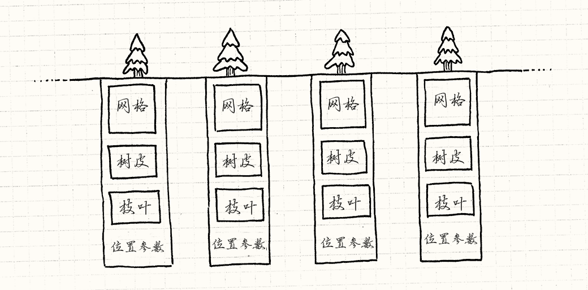
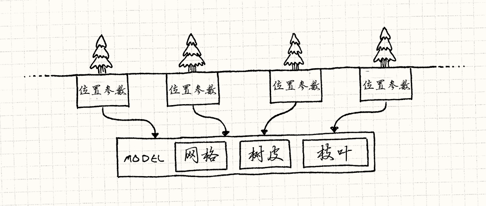
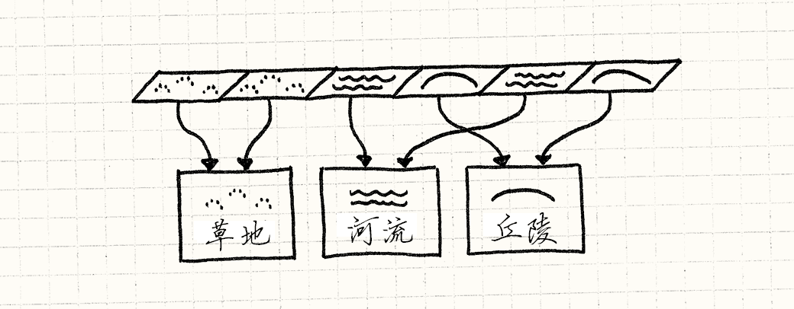

# 享元模式（Flyweight）

> **章节**：重访设计模式（Design Patterns Revisited）  
> **原著**：Robert Nystrom (Bob Nystrom) · 《Game Programming Patterns》  
> **导航**：[目录](README.md) ｜ [上一章：命令模式](command.md) ｜ [下一章：观察者模式](observer.md)

---

迷雾散尽，露出了一片壮丽的原始森林。数不清的古老铁杉高耸在头顶，
交织成一座绿色的大教堂。树叶如同彩色玻璃般的天篷，把阳光打碎成一缕缕金色的雾中光柱。
透过巨大的树干，你能辨认出广袤的森林一直延伸到远方。

这是我们作为游戏开发者所梦想的那种超脱尘世的场景，而这样的场景往往离不开一个名字再朴素不过的模式：低调的享元模式。

## 见树又见林

我用几句话就能描述一片绵延的林地，但在实时游戏中真正*实现*它就是另一回事了。
当屏幕上要填满一整片由独立树木组成的森林时，图形程序员看到的只有数百万个多边形——
他们得想办法每六十分之一秒就把它们铲进GPU。

我们说的可是成千上万棵树，每棵树都有包含上千个多边形的精细几何体。
就算你有足够的*内存*来描述这片森林，要渲染它，这些数据还得通过总线从CPU传到GPU。

每棵树都关联着一堆数据：

* 定义树干、树枝和树叶形状的多边形网格。
* 树皮和树叶的纹理。
* 它在森林中的位置和朝向。
* 大小和色彩之类的调节参数，让每棵树看起来都与众不同。

如果用代码表示，那么会得到这样的东西：

```cpp
class Tree
{
private:
  Mesh mesh_;
  Texture bark_;
  Texture leaves_;
  Vector position_;
  double height_;
  double thickness_;
  Color barkTint_;
  Color leafTint_;
};
```

这是很大的一堆数据，网格和纹理尤其大。
要把由这些对象构成的一整片森林在一帧之内丢给GPU，实在太多了。
幸运的是，有一个久经考验的诀窍来处理它。

关键在于，尽管森林里可能有成千上万棵树，它们大多看上去很相似。
它们很可能都使用相同的网格和纹理。
这意味着这些对象的大部分字段在所有实例之间都是*相同的*。

> [!NOTE] 旁注
> 除非你是疯子或亿万富翁，才会让美术为整片森林里的每棵树都单独建模。




> [!NOTE] 旁注
> 注意，每棵树小盒子里的东西都是一样的。


我们可以把对象一分为二，从而显式地表达出这种共享。
首先，把所有树木共有的数据抽出来，放进一个单独的类中：

```cpp
class TreeModel
{
private:
  Mesh mesh_;
  Texture bark_;
  Texture leaves_;
};
```

这种对象游戏里只需要一个，
因为没有必要在内存中把相同的网格和纹理重复一千遍。
游戏世界中每棵树的实例只需有一个指向这个共享`TreeModel`的*引用*。
留在`Tree`中的是那些与实例相关的状态：

```cpp
class Tree
{
private:
  TreeModel* model_;

  Vector position_;
  double height_;
  double thickness_;
  Color barkTint_;
  Color leafTint_;
};
```

你可以将其想象成这样：



> [!NOTE] 旁注
> 这很像[类型对象](type-object.md)模式。
> 两者都涉及把对象的一部分状态委托给另一个对象，从而在多个实例之间共享这部分状态。
> 但是，这两种模式背后的意图不同。
>
> 使用类型对象时，目标是通过把“类型”提升到自己的对象模型中，来尽量减少需要定义的类。
> 随之而来的内存共享只是额外的好处。享元模式则纯粹是为了效率。

这一切对于把数据存进主内存来说固然很好，但对渲染毫无帮助。
在森林出现在屏幕之前，它得先到达GPU。我们需要以显卡能理解的方式来表达这种资源共享。

## 一千个实例

为了尽量减少推送到GPU的数据量，我们希望共享的数据——`TreeModel`——只需要发送*一次*。
然后，再分别发送每个树实例独有的数据——它的位置、颜色和缩放。
最后，告诉GPU：“用那一个模型渲染这些实例中的每一个。”


幸运的是，如今的图形API和显卡正好支持这一点。
细节很琐碎，也超出了本书的范围，但Direct3D和OpenGL都支持一种叫做[*实例渲染*](http://en.wikipedia.org/wiki/Geometry_instancing)的技术。

在这两种API中，你都要提供两路数据流。
第一路是要被渲染多次的公共数据块——在我们这个关于树的例子中就是网格和纹理。
第二路是实例及其参数的列表，每次绘制时用它们来让第一块数据产生变化。
只需一次绘制调用，整片森林就长出来了。

> [!NOTE] 旁注
> 这个API由显卡直接实现，这意味着享元模式可能是唯一拥有实际硬件支持的GoF设计模式。

## 享元模式

好，我们已经掌握了一个具体例子，下面带你过一遍这个模式的一般形式。
享元，顾名思义，会在对象需要变得更轻量时派上用场——
通常是因为对象数量太多了。

在使用实例渲染时，问题与其说是它们占用了太多内存，不如说是把每棵独立的树通过总线送到GPU花了太多*时间*，但基本思路是一样的。

这个模式通过把对象的数据分成两类来解决这个问题。
第一类数据并不专属于对象的某一个*实例*，可以在所有实例之间共享。
GoF把它叫做*内在*状态，不过我更喜欢把它想成“与上下文无关”的东西。
在这个例子里，就是树的几何体和纹理。

剩下的数据是*外在*状态，即每个实例所独有的东西。
在这个例子里，就是每棵树的位置、缩放和颜色。
正如上面的示例代码块那样，这种模式通过在对象出现的每个地方共享同一份内在状态来节省内存。

就我们目前所见，这看上去像是基本的资源共享，几乎不配被称为一种模式。
部分原因在于，这个例子里我们可以为共享状态找出一个清晰独立的*身份*：`TreeModel`。

我发现，当共享对象没有一个定义清晰的身份时，这个模式就没那么显而易见（因而也就更巧妙）。
在那些情况下，感觉更像是一个对象神奇地同时存在于多个地方。
让我再给你看一个例子。

## 扎根之所

这些树所生长的地面也需要在我们的游戏中表示出来。
这里可能有草、泥土、丘陵、湖泊、河流，以及其它任何你能想到的地形。
我们*基于区块*建立地表：世界的表面被划分为由微小区块组成的巨大网格。
每个区块都由一种地形覆盖。

每种地形类型都有一系列特性会影响游戏玩法：

* 决定玩家能以多快的速度穿过它的移动开销。
* 一个标志，表明它是否是船只可以通过的水域地形。
* 用来渲染它的纹理。


因为我们游戏程序员对效率偏执到不行，我们绝不会把所有这些状态存进世界里的每一个区块中。
相反，一种常见的做法是为每种地形类型使用一个枚举。

> [!NOTE] 旁注
> 毕竟，我们已经从那些树那里吸取教训了。

```cpp
enum Terrain
{
  TERRAIN_GRASS,
  TERRAIN_HILL,
  TERRAIN_RIVER
  // 其他地形
};
```

然后，世界维护一个由它们组成的巨大网格：


```cpp
class World
{
private:
  Terrain tiles_[WIDTH][HEIGHT];
};
```

> [!NOTE] 旁注
> 这里我用嵌套数组来存储2D网格。
> 这在C/C++中很高效，因为它会把所有元素打包在一起。
> 在Java或其他内存管理语言中，那样做实际上会给你一个行数组，其中每个元素都是一个指向列数组的*引用*，那样可能就不像你期望的那么内存友好了。
>
> 无论哪种情况，真正的代码最好用一个良好的2D网格数据结构把这一实现细节隐藏起来。
> 我在这里这么做只是为了保持简单。

为了真正拿到某个区块的有用数据，我们会做类似这样的事：

```cpp
int World::getMovementCost(int x, int y)
{
  switch (tiles_[x][y])
  {
    case TERRAIN_GRASS: return 1;
    case TERRAIN_HILL:  return 3;
    case TERRAIN_RIVER: return 2;
      // 其他地形……
  }
}

bool World::isWater(int x, int y)
{
  switch (tiles_[x][y])
  {
    case TERRAIN_GRASS: return false;
    case TERRAIN_HILL:  return false;
    case TERRAIN_RIVER: return true;
      // 其他地形……
  }
}
```

你明白我的意思了。这能行，但我觉得它很丑。
我把移动开销和湿润度看作是关于地形的*数据*，但在这里它们被硬编码在了代码中。
更糟的是，单一地形类型的数据散落在一堆方法里。
如果能把所有这些封装在一起就好了。毕竟，对象正是为此而设计的。

如果我们能有一个真正的地形*类*就好了，像这样：


```cpp
class Terrain
{
public:
  Terrain(int movementCost,
          bool isWater,
          Texture texture)
  : movementCost_(movementCost),
    isWater_(isWater),
    texture_(texture)
  {}

  int getMovementCost() const { return movementCost_; }
  bool isWater() const { return isWater_; }
  const Texture& getTexture() const { return texture_; }

private:
  int movementCost_;
  bool isWater_;
  Texture texture_;
};
```

> [!NOTE] 旁注
> 你会注意到这里所有的方法都是`const`。这不是巧合。
> 由于同一个对象被用在多个上下文中，如果你修改它，
> 改动会同时出现在多个地方。
>
> 这多半不是你想要的。
> 通过共享对象来节省内存应该是一种优化，而不应该影响应用的可见行为。
> 因此，享元对象几乎总是不可变的。

但我们不想为世界里的每个区块都负担一个实例的开销。
如果你看看这个类的内部，会发现里面实际上*没有任何*与区块在*哪里*有关的东西。
用享元的术语来说，地形的*所有*状态都是“内在的”，或者说“与上下文无关的”。

既然如此，每种地形类型都没有理由存在多于一个实例。
地面上每个草区块都与其它草区块完全相同。
世界不再是由枚举或`Terrain`对象组成的网格，而是由指向`Terrain`对象的*指针*组成的网格：

```cpp
class World
{
private:
  Terrain* tiles_[WIDTH][HEIGHT];

  // 其他代码……
};
```

使用相同地形的每个区块都会指向同一个地形实例。



由于地形实例被用在很多地方，如果动态分配它们，管理它们的生命周期会有点复杂。
因此，我们直接把它们存储在`World`中。

```cpp
class World
{
public:
  World()
  : grassTerrain_(1, false, GRASS_TEXTURE),
    hillTerrain_(3, false, HILL_TEXTURE),
    riverTerrain_(2, true, RIVER_TEXTURE)
  {}

private:
  Terrain grassTerrain_;
  Terrain hillTerrain_;
  Terrain riverTerrain_;

  // 其他代码……
};
```

然后我们可以像这样用它们来绘制地面：


```cpp
void World::generateTerrain()
{
  // 将地面填满草皮.
  for (int x = 0; x < WIDTH; x++)
  {
    for (int y = 0; y < HEIGHT; y++)
    {
      // 加入一些丘陵
      if (random(10) == 0)
      {
        tiles_[x][y] = &hillTerrain_;
      }
      else
      {
        tiles_[x][y] = &grassTerrain_;
      }
    }
  }

  // 放置河流
  int x = random(WIDTH);
  for (int y = 0; y < HEIGHT; y++) {
    tiles_[x][y] = &riverTerrain_;
  }
}
```

> [!NOTE] 旁注
> 我承认，这算不上世界上最棒的程序化地形生成算法。

现在，我们不再需要`World`中用来访问地形属性的方法，可以直接暴露`Terrain`对象：

```cpp
const Terrain& World::getTile(int x, int y) const
{
  return *tiles_[x][y];
}
```

用这种方式，`World`不再与各种地形的细节耦合。
如果你想要某一区块的属性，可直接从那个对象获得：

```cpp
int cost = world.getTile(2, 3).getMovementCost();
```

我们回到了与真实对象打交道的那种宜人的API，而且几乎没有额外开销——指针通常并不比枚举大。

## 性能如何？


我在这里说“几乎”，是因为那些对性能锱铢必较的人理所当然地想知道它和使用枚举相比如何。
通过指针引用地形意味着一次间接查找。
要拿到移动开销这样的地形数据，你得先顺着网格里的指针找到地形对象，
再在那里找到移动开销。这样追逐指针可能会导致缓存未命中，从而拖慢速度。

> [!NOTE] 旁注
> 关于指针追逐和缓存未命中的更多内容，请参阅[数据局部性](data-locality.md)一章。

和往常一样，优化的金科玉律是*先做性能分析*。
现代计算机硬件太复杂，性能已经不再是一个纯靠推理就能搞定的游戏。
在我为本章所做的测试中，使用享元相比枚举没有任何性能损失。
享元实际上还明显更快。但这完全取决于内存中其它数据是如何布局的。

我能*肯定*的是，使用享元对象不应被轻易否定。
它让你获得面向对象风格的优势，却不必付出大量对象的开销。
如果你发现自己创建了一个枚举，又在它上面写了很多switch分支，不妨改用这个模式。
如果你担心性能，那么至少在把代码改成更难维护的风格之前，先做性能分析。

## 参见

 *  在区块的例子中，我们只是为每种地形事先创建一个实例，并存储在`World`中。
    这样更容易找到并重用这些共享实例。
    但在多数情况下，你不会想一开始就创建*所有*享元。

    如果你无法预料自己实际需要哪些，最好按需创建它们。
    为了获得共享的优势，当你请求一个实例时，先看看是否已经创建过一个相同的实例。
    如果是，就只需返回那个实例。

    这通常意味着你得把构造过程封装在某个能先查找现有对象的接口之后。
    像这样隐藏构造函数就是[工厂方法](http://en.wikipedia.org/wiki/Factory_method_pattern)模式的一个例子。


 *  为了返回一个先前创建的享元，你需要追踪已经实例化的那些享元所组成的池子。
    顾名思义，[对象池](object-pool.md)可能是存储它们的好地方。

 *  当你使用[状态](state.md)模式时，
    经常会遇到一些“状态对象”，它们没有任何专属于使用该状态的那台状态机的字段。
    状态的标识和方法就足以派上用场了。
    在这种情况下，你可以应用享元模式，同时在多个状态机中重用同一个状态实例而不会有任何问题。

---

> **导航**：[目录](README.md) ｜ [上一章：命令模式](command.md) ｜ [下一章：观察者模式](observer.md)
