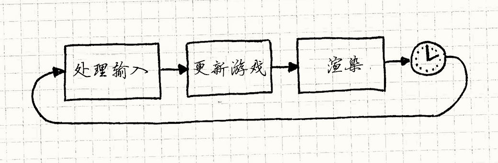
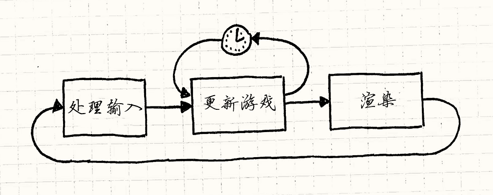
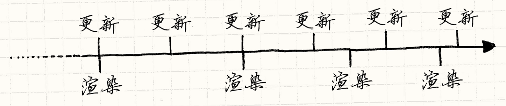
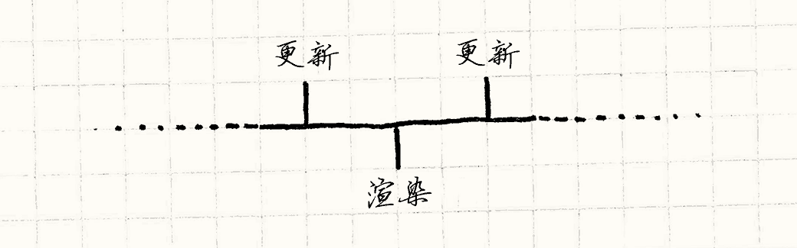

# 游戏循环（Game Loop）

> **章节**：序列模式（Sequencing Patterns）  
> **原著**：Robert Nystrom (Bob Nystrom) · 《Game Programming Patterns》  
> **导航**：[目录](README.md) ｜ [上一章：双缓冲模式](double-buffer.md) ｜ [下一章：更新方法](update-method.md)

---

## 意图

*将游戏的进行和玩家的输入解耦，和处理器速度解耦。*

## 动机

如果本书中有一个模式不可或缺，那非这个模式莫属了。
游戏循环是“游戏编程模式”的精髓。
几乎每个游戏都有，且彼此不尽相同，而游戏之外的程序很少使用它们。


为了看看它们多有用，让我们来一趟快速的怀旧之旅。
在每个编写计算机程序的人都留着胡子的时代，程序像洗碗机一样工作。
你倒进一堆代码，按个按钮，等着，然后取出结果，完事。
程序全都是*批处理模式*的——一旦工作完成，程序就停止了。

> [!NOTE] 旁注
> Ada Lovelace和海军少将Grace Hopper也拥有荣誉胡子。

如今你仍然能看到这些程序，尽管谢天谢地，我们不必再把它们写在打孔卡上了。
Shell脚本，命令行程序，甚至把一堆Markdown转成这本书的小Python脚本，都是批处理模式程序。

### 采访CPU

最终，程序员意识到，把一批代码送到计算办公室，几小时后再回来取结果，这种给程序除错的方式慢得可怕。
他们想要立即的反馈。*交互式* 程序诞生了。
第一批交互式程序中就有游戏：


    ```text
    YOU ARE STANDING AT THE END OF A ROAD BEFORE A SMALL BRICK
    BUILDING . AROUND YOU IS A FOREST. A SMALL
    STREAM FLOWS OUT OF THE BUILDING AND DOWN A GULLY.
    ```
    
    > GO IN
    YOU ARE INSIDE A BUILDING, A WELL HOUSE FOR A LARGE SPRING.

> [!NOTE] 旁注
> 这是[Colossal Cave Adventure](http://en.wikipedia.org/wiki/Colossal_Cave_Adventure)，史上首个冒险游戏。

你可以和这个程序进行实时对话。
它等待你的输入，然后进行响应。
你再回应，就像在幼儿园里学会的那样轮流来。
当轮到你时，它停在那里啥也不做。像这样：


```cpp
while (true)
{
  char* command = readCommand();
  handleCommand(command);
}
```

> [!NOTE] 旁注
> 这程序会永久循环，所以没法退出游戏。
> 真实的游戏会做些`while (!done)`进行检查，然后通过设置`done`为真来退出游戏。
> 我省去了那些内容，保持简明。

### 事件循环

如果你剥掉现代图形UI应用的外皮，会惊讶地发现它们与老旧的冒险游戏差不多。
你的文字处理器通常呆在那里什么也不做，直到你按了个键或者点了什么东西：

```cpp
while (true)
{
  Event* event = waitForEvent();
  dispatchEvent(event);
}
```


这与冒险游戏主要的不同是，程序不是等待*文本指令*，而是等待*用户输入事件*——鼠标点击、按键按下之类的。
其他部分还是和以前的老式文本冒险游戏一样，程序*阻塞*等待用户的输入，这是个问题。

不像其他大多数软件，游戏即使在没有玩家输入时也继续运行。
如果你坐在那里盯着屏幕，游戏不会冻结。动画照样动着，视觉效果照样舞动闪烁。
如果运气不好的话，怪物会继续啃噬你的英雄。

> [!NOTE] 旁注
> 大多数事件循环确实有“空闲”事件，这样你可以在没有用户输入时，间歇地做些事情。
> 这对于闪烁的光标或者进度条已经足够了，但对于游戏就太原始了。

这是真实游戏循环的第一个关键部分：*它处理用户输入，但是不等待它*。循环总是不停地转下去：

```cpp
while (true)
{
  processInput();
  update();
  render();
}
```


我们之后会改善它，但是基本的部分都在这里了。
`processInput()`处理自上次调用以来发生的任何用户输入。
然后，`update()`</span>让游戏模拟一步。
它运行AI和物理（通常是这个顺序）。
最终，`render()`绘制游戏，这样玩家可以看到发生了什么。

> [!NOTE] 旁注
> 就像你可以从名字中猜到的，
> `update()`是使用[更新方法](update-method.md)模式的好地方。

### 时间之外的世界


如果这个循环没有因为输入而阻塞，这就带来了明显的问题：它转得*多快*呢？
游戏循环每转一次都会将游戏状态向前推进一些。
在游戏世界的居民看来，他们钟表的指针就滴答向前走了一下。

> [!NOTE] 旁注
> 运行游戏循环一次的常用术语就是“滴答”(tick)和“帧”(frame)。

同时，*玩家的*真实时钟也在滴答着。
如果我们用真实时间来测量游戏循环转得有多快，就得到了游戏的“帧率”(FPS)。
如果游戏循环转得快，FPS就更高，游戏运行得又流畅又快。
如果转得慢，游戏就会像定格动画一样卡顿。

我们现在写的这个循环是能转多快转多快，两个因素决定了帧率。
一个是*每帧要做多少工作*。复杂的物理、众多游戏对象和大量图形细节都会让CPU和GPU忙碌，完成一帧就需要更长时间。

另一个是*底层平台的速度。* 更快的芯片能在同样的时间里跑完更多的代码。
多核、GPU、专用音频硬件以及操作系统的调度器都会影响你一次滴答能完成多少工作。

### 每秒的秒数

在早期的视频游戏中，第二个因素是固定的。
如果你为NES或者Apple IIe写游戏，你*明确*知道游戏运行在什么CPU上。
你可以（而且确实会）为它专门编写代码。
你唯一需要操心的，就是每次滴答要做多少工作。


早期的游戏被精心编写，每帧只做刚好足够的工作，好让游戏以开发者想要的速度运行。
但是如果你试图在更快或更慢的机器</span>上运行同一款游戏，游戏本身就会加速或减速。

> [!NOTE] 旁注
> 这就是为什么老式PC通常有“[turbo](http://en.wikipedia.org/wiki/Turbo_button )”按钮。
> 新的PC太快了，玩不了老游戏，因为游戏也会运行得过快。
> *关闭* turbo按钮，会减慢机器的运行速度，让老游戏可以游玩。

如今，很少有开发者能奢侈到确切知道自己的游戏会跑在什么硬件上。相反，我们的游戏必须智能地适应多种设备。

这就是游戏循环的另一个关键任务：*尽管底层硬件各不相同，它仍让游戏以一致的速度运行。*

## 模式

一个**游戏循环**在游玩中不断运行。
每一次循环，它无阻塞地**处理玩家输入**，**更新游戏状态**，**渲染游戏**。
它追踪时间的流逝，以**控制游戏进行的速度。**

## 何时使用

使用错误的模式比不使用模式更糟，所以这节通常告诫你不要过于热衷设计模式。
设计模式的目标不是把尽可能多的模式硬塞进你的代码库。


但是这个模式有所不同。我可以相当自信地说你*会*使用这个模式。
如果你使用游戏引擎，你不需要自己编写，但它仍然在那里。

> [!NOTE] 旁注
> 对于我而言，这是“引擎”与“库”的不同之处。
> 使用库时，你拥有游戏循环，调用库代码。
> 使用引擎时，引擎拥有游戏循环，调用*你的*代码。

你可能认为在做回合制游戏时不需要它。
但即使如此，虽然*游戏状态*要等到玩家行动才会推进，游戏的*视觉*和*听觉*状态通常仍会推进。
哪怕游戏在“等待”你行动，动画和音乐也会继续运行。

## 记住


我们这里谈到的循环是游戏代码中最重要的部分之一。
人们常说，程序会把90%的时间花在10%的代码上。
你的游戏循环铁定属于那10%。
对待这段代码要格外小心，并留意它的效率。

> [!NOTE] 旁注
> 像这样编造统计数字，正是“真正的”工程师（比如机械和电气工程师）不把我们当回事的原因。

### 你也许需要与平台的事件循环相协调

如果你在操作系统之上、或者在有图形UI和内建事件循环的平台上构建游戏，
那你就有了两个应用循环在同时运作。
它们得学会和睦相处。

有时候，你可以夺过控制权，让你的循环成为唯一的一个。
举个例子，如果你针对古老的Windows API编写游戏，`main()`可以只包含一个游戏循环。
其中你可以调用`PeekMessage()`来处理和分发系统的事件。
不像`GetMessage()`，`PeekMessage()`不会阻塞等待用户输入，
因此你的游戏循环会保持运作。

其他平台可不会让你这么轻易地退出事件循环。
如果你使用网页浏览器作为平台，事件循环已被内建在浏览器的执行模型深处。
这样，你得用事件循环作为游戏循环。
你会调用`requestAnimationFrame()`之类的函数，它会回调你的代码，保持游戏继续运行。

## 示例代码

在这么长的介绍之后，游戏循环的代码其实相当直白。
我们会浏览几个变种，比较它们的好处和坏处。

游戏循环驱动了AI，渲染和其他游戏系统，但这些不是模式的要点，
所以我们会调用虚构的方法。实际实现`render()`、`update()`等方法，
则留给读者作为（有挑战性的！）练习。

### 跑，能跑多快跑多快

我们已经见过了可能是最简单的游戏循环：

```cpp
while (true)
{
  processInput();
  update();
  render();
}
```

它的问题是你不能控制游戏运行得有多快。
在快速机器上，循环会运行得太快，玩家看不清发生了什么。
在慢速机器上，游戏会慢得像在爬。
如果游戏的某部分内容繁重，或者做了更多的AI或物理运算，游戏在那里就会真的玩得更慢。

### 休息一下


我们来看看第一个变种：加一个简单的修正。
假设你想要游戏以60 FPS运行，这样每帧大约有16毫秒。
只要你能稳定地在少于这个时间内完成所有游戏处理和渲染，就能保持稳定的帧率。
你需要做的就是处理这一帧然后*等待*，直到该处理下一帧时，就像这样：



代码看上去像这样：

> [!NOTE] 旁注
> *1000 毫秒 / 帧率 = 毫秒每帧*。

```cpp
while (true)
{
  double start = getCurrentTime();
  processInput();
  update();
  render();

  sleep(start + MS_PER_FRAME - getCurrentTime());
}
```

如果它很快地处理完一帧，这里的`sleep()`保证了游戏不会运行太*快*。
如果你的游戏运行太*慢*，这无济于事。
如果需要超过16ms来更新并渲染一帧，休眠的时间就变成了*负的*。
要是我们的计算机能穿越回过去，很多事情都会简单得多，可惜它们不能。

相反，游戏变慢了。
你可以每帧少做些工作来绕过这个问题——砍掉一些图形和花哨特效，或者把AI变笨。
但这会降低所有玩家的游戏体验质量，即使是在快速机器上的玩家。

### 一小步，一大步

  让我们尝试一些更复杂的东西。我们的问题基本上归结为：

1. 每次更新把游戏时间向前推进一定的量。
2. 这消耗一定量的*真实*时间来处理它。

如果第二步消耗的时间超过第一步，游戏就变慢了。
如果需要超过16ms的处理时间来推动游戏时间16ms，那它永远也跟不上。
但如果一步中能把游戏时间推进*超过*16ms，那我们就可以减少更新频率，从而跟得上了。

思路就是根据上一帧以来流逝了多少*真实*时间，来选择要推进的时间步长。
帧耗时越长，游戏迈出的步子就越大。
为了追上真实时间，它会迈出越来越大的步子，所以总能跟得上。
有人称之为*可变*或者*流动*的时间步长。它看上去像是：

```cpp
double lastTime = getCurrentTime();
while (true)
{
  double current = getCurrentTime();
  double elapsed = current - lastTime;
  processInput();
  update(elapsed);
  render();
  lastTime = current;
}
```

每一帧，我们计算上次游戏更新到现在有多少*真实*时间过去了（即变量`elapsed`）。
当我们更新游戏状态时将其传入。
然后引擎负责让游戏世界按那个时间量向前推进。

假设有一颗子弹飞过屏幕。
使用固定的时间步长，在每一帧中，你根据它的速度移动它。
使用可变的时间步长，你*用流逝的时间去缩放速度*。
随着时间步长增大，子弹在每帧间移动得更远。
无论是二十个小而快的步子，还是四个大而慢的步子，子弹在*真实*时间里穿过屏幕所用的时间都*相同*。
这看上去成功了：

*  游戏在不同硬件上以一致的速度运行。
*  机器更快的玩家得到更流畅的游戏体验作为回报。


但可惜的是，前方潜伏着一个严重的问题：我们把游戏变得不确定且不稳定。
这里有一个我们给自己设下的陷阱的例子：

> [!NOTE] 旁注
> “确定的”意味着每次你运行程序，如果给它相同的输入，就得到完全相同的输出。
> 可以想得到，在确定的程序中追踪漏洞更容易——一旦找到造成漏洞的输入，每次你都能重现它。
>
> 计算机本身是确定的；它们机械地执行程序。
> 当纷乱的现实世界悄悄渗入时，非确定性就出现了。
> 例如，网络，系统时钟，线程调度都依赖于超出程序控制的外部世界。

假设我们有个双人联网游戏，Fred的游戏机是台性能猛兽，而George正在使用他祖母的老爷机。
前面提到的子弹在他们的屏幕上飞行。
在Fred的机器上，游戏跑得超级快，每个时间步长都很小。
比如，在子弹穿过屏幕的那一秒里，我们塞了大约50帧。
可怜的George的机器只能塞进大约5帧。

这就意味着在Fred的机器上，物理引擎更新子弹的位置50次，但是George的只更新5次。
大多数游戏使用浮点数，它们有*舍入误差*。
每次你将两个浮点数加在一起，获得的结果就会有点偏差。
Fred的机器做了10倍的操作，所以他的误差要比George的更大。
*同样*的子弹最终会在他们的机器上落到*不同的位置*。


这只是可变时间步长可能引起的麻烦之一，后面还有更多。
为了能实时运行，游戏物理引擎是对真实力学定律的近似。
为了防止这些近似爆炸，物理引擎加入了阻尼。
这个阻尼被精心调校成适配某个特定的时间步长。
一旦改变时间步长，物理就不再稳定。

> [!NOTE] 旁注
> “爆炸”在这里用的是它的字面意思。当物理引擎抽风时，物体会获得完全错误的速度，把自己发射到空中。

这种不稳定性实在太糟了，这个例子放在这里，只是当作一个警示故事，并引我们走向更好的方案……

### 追赶进度


游戏引擎中通常*不会*受可变时间步长影响的部分是渲染。
因为渲染引擎捕捉的是时间中的一个瞬间，它不关心自上次以来流逝了多少时间。
它只是把物体渲染在它们当时恰好所在的位置。

> [!NOTE] 旁注
> 这或多或少是对的。像运动模糊之类的东西会受到时间步长影响，但即使它们有点偏差，玩家通常也不会注意到。

我们可以利用这个事实。
我们用固定的时间步长来*更新*游戏，因为这让一切更简单，也让物理和AI更稳定。
但我们在*渲染*的时机上允许灵活性，以释放一些处理器时间。

它是这样运作的：自上一次游戏循环以来，已经过去了一定量的真实时间。
这就是为了让游戏的“现在”追上玩家的“现在”，而需要模拟的游戏时间量。
我们通过一*系列*的*固定*时间步长来实现。
代码大致如下：

```cpp
double previous = getCurrentTime();
double lag = 0.0;
while (true)
{
  double current = getCurrentTime();
  double elapsed = current - previous;
  previous = current;
  lag += elapsed;

  processInput();

  while (lag >= MS_PER_UPDATE)
  {
    update();
    lag -= MS_PER_UPDATE;
  }

  render();
}
```

这里有几个部分。
在每帧的开始，根据流逝了多少真实时间，更新`lag`。
这个变量衡量了游戏世界时钟比真实世界落后了多少。
然后我们用一个内部循环，每次一个固定步长地更新游戏，直到它赶上。
一旦我们追上真实时间，我们就渲染然后开始新一轮循环。
你可以把它大致想象成这样：



注意这里的时间步长不再是*可见的*帧率了。
`MS_PER_UPDATE`只是我们更新游戏的*粒度*。
这个步长越短，追上真实时间所需的处理时间就越多。
它越长，游戏玩起来就越卡顿。
理想情况下，你想要它足够短，通常比60 FPS更快，这样游戏在快速机器上能以高保真度进行模拟。


但是小心不要把它设得*太*短。
你需要保证这个时间步长大于处理一次`update()`所需的时间，即使在最慢的硬件上也是如此。
否则，你的游戏就无法追上。

> [!NOTE] 旁注
> 我在这里略去了这一点，但你可以通过让内层更新循环在达到最大迭代次数后退出，来对此加以保护。
> 游戏会变慢，但是比完全卡死要好。

幸运的是，我们给自己争取到了一些喘息的空间。
技巧在于我们把*渲染从更新循环里硬拽了出来*。
这释放了一大块CPU时间。
最终结果是游戏在一系列硬件上使用安全的固定时间步长，以恒定的速率*模拟*。
只是玩家观察游戏的*可见窗口*在较慢的机器上会更卡顿。

### 卡在中间

我们还剩一个问题，就是残余延迟。
我们以固定的时间步长更新游戏，但在任意时刻渲染。
这就意味着从玩家的角度看，游戏经常显示的是两次更新之间某个时间点的状态。

这是时间线：



就像你看到的那样，我们以漂亮而紧凑的固定间隔进行更新。
同时，我们在能渲染的时候渲染。
它比更新更不频繁，而且也不稳定。
这两点都没问题。美中不足的是，我们并不总在更新的那个时间点渲染。
看看第三次渲染时间。它正好在两次更新之间。



想象一颗子弹飞过屏幕。第一次更新时，它在左边。
第二次更新将它移到了右边。
游戏在两次更新之间的时间点被渲染，所以玩家期望看到子弹在屏幕的中间。
而现在的实现中，它还在左边。这意味着运动看起来是锯齿状或卡顿的。

方便的是，我们*确实*知道渲染时处于更新帧之间的确切位置：它被存储在`lag`中。
我们在`lag`小于更新时间步长时（而不是`lag`为*零*时）退出更新循环。
那剩下的量？那就是我们进入下一帧的程度。

当我们要渲染时，我们将它传入：


```cpp
render(lag / MS_PER_UPDATE);
```

> [!NOTE] 旁注
> 我们在这里除以`MS_PER_UPDATE`来*归一化*值。
> 不管更新时间步长是多少，传给`render()`的值都在0（正好在上一帧）到刚好小于1.0（正好在下一帧）之间变化。
> 这样，渲染器不必担心帧率。它只需处理0到1的值。

渲染器知道每个游戏对象*以及它当前的速度*。
假设子弹在屏幕左边20像素的地方，正在以400像素每帧的速度向右移动。
如果在两帧正中渲染，我们会给`render()`传0.5。
所以它把子弹画在提前半帧的位置，即220像素处。哒哒，平滑的运动。

当然，也许这种外推是错误的。
在我们计算下一帧时，也许会发现子弹撞到了障碍物，或者减速了，又或者别的什么。
我们把它的位置渲染成上一帧位置和我们*认为*的下一帧位置之间插值出来的结果。
但只有在完成物理和AI更新后，我们才能知道真正的位置。

所以外推有猜测的成分，有时候结果是错误的。
不过幸运的是，这类修正通常不会被察觉。
至少，比你完全不做外推得到的卡顿更不明显。

## 设计决策

尽管这一章篇幅不短，但我略去的内容比讲到的还要多。
一旦你考虑显示刷新率的同步、多线程和GPU，真正的游戏循环会变得相当棘手。
不过从高层次看，这里还有一些你很可能会回答的问题：

### 拥有游戏循环的是你，还是平台？

这与其说是你做的选择，不如说是别人替你做的选择。
如果你在做浏览器中的游戏，你基本上*没法*编写自己的经典游戏循环。
浏览器基于事件的本性就不允许你这么做。
类似地，如果你使用现有的游戏引擎，你很可能依赖它的游戏循环，而不是自己动手写一个。

* **使用平台的事件循环：**

    * *简单*。你不必担心编写和优化自己的游戏核心循环。

    * *平台友好。*
      你不必担心显式地给宿主留出时间处理它自己的事件，不必缓存事件，也不必去处理平台输入模型与你自己的输入模型之间的不匹配。

    * *你失去了对时间的控制。*
      平台会在它方便时调用你的代码。
      如果这不如你期望的那样频繁或者平滑，那也没辙。
      更糟的是，大多数应用的事件循环并不是为游戏设计的，通常*是*又慢又卡顿。

* **使用游戏引擎的循环：**

    * *不必自己编写。*
      编写游戏循环可能相当棘手。
      由于那是每帧都要执行的核心代码，小小的漏洞或性能问题都会对游戏产生巨大影响。
      一个紧凑高效的游戏循环，正是考虑使用现有引擎的原因之一。

    * *不能自己编写。*
      当然，硬币的另一面是，如果你的需求与引擎并不完全契合，代价就是失去控制权。

* **自己写：**

    *  *完全掌控。*
      你可以做任何想做的事情。你可以专门针对游戏的需求来设计它。

    *  *你得和平台打交道。*
      应用框架和操作系统通常期望得到一小段时间去处理自己的事件和其他工作。
      如果你拥有应用的核心循环，它就不会得到这些时间。
      你得周期性地显式交出控制权，确保框架不会挂起或变得混乱。

### 如何管理能量消耗？

在五年前这还不是问题。
游戏运行在插在墙上插座上的设备上或者专用的手持设备上。
但是随着智能手机，笔记本以及移动游戏的发展，现在你很可能需要关注这个问题了。
一款画面绚丽，却把玩家的手机变成电暖器、还在三十分钟后就把电耗光的游戏，可不会让人开心。

现在，你不仅要考虑让游戏看上去很棒，还要尽可能少地使用CPU。
很可能会有一个性能的*上限*：如果在一帧内完成了所有需要做的工作，就让CPU休眠。

* **尽可能快地运行：**

    这是PC游戏的常态（即使越来越多的人在笔记本上运行游戏）。
    游戏循环永远不会显式告诉系统休眠。相反，任何空余的周期都会被用来推高FPS或图形保真度。

    这会给你最好的游戏体验。
    但也会尽可能多地耗电。如果玩家在笔记本电脑上玩，他们就有了一个不错的暖腿器。


* **限制帧率**

    移动游戏往往更注重游戏体验的质量，而不是最大化图形细节。
    很多这种游戏都会设置帧率上限（通常是30或60FPS）。
    如果游戏循环在那一时间片用完之前就处理完了，剩余时间它会休眠。

    这给了玩家“足够好”的游戏体验，然后对电池也手下留情。

### 你如何控制游戏速度？


游戏循环有两个关键部分：不阻塞用户输入和适应时间的流逝。
输入部分很直观。真正的奇妙之处在于你如何处理时间。
游戏可以运行的平台数量几乎无穷，
而且任何一款游戏都可能运行在相当多的平台上。
它如何适应这种差异才是关键。

> [!NOTE] 旁注
> 做游戏似乎是人类天性的一部分，因为每当我们造出能计算的机器，最早做的几件事之一就是在上面编游戏。
> PDP-1是一台仅有4096字内存的2kHz机器，但Steve Russell和朋友们还是设法在上面做出了Spacewar!。

* **固定时间步长，没有同步：**

    这就是我们的第一个示例代码。你只需尽可能快地运行游戏循环。

    *  *简单*。这是它主要的（好吧，唯一的）美德。

    *  *游戏速度直接受到硬件和游戏复杂度影响。*
      它的主要恶习是，只要有任何变化，就会直接影响游戏速度。它就是游戏循环里的“死飞”自行车。

* **固定时间步长，有同步：**

    复杂度阶梯上的下一步是使用固定的时间步长，但在循环的末尾增加延迟或同步点，保证游戏不会运行得过快。

    * *还是很简单。*
      这比那个可能简单到无法实际工作的例子只多了一行代码。
      在多数游戏循环中，反正你很可能都需要做同步。
      你可能会对图形做[双缓冲](double-buffer.md)，并把缓冲区翻转与显示器的刷新率同步。

    * *省电。*
      这对移动游戏来说是个出人意料重要的考虑因素。你不想无谓地榨干用户的电池。
      通过简单地休眠几毫秒，而不是试图在每个滴答里塞进更多处理，你就省下了电量。

    * *游戏不会运行得太快。*
      这解决了固定循环速度的一半问题。

    * *游戏可能运行得太慢。*
      如果花了太多时间更新和渲染一帧，播放就会变慢。
      因为这种方案没有分离更新和渲染，它比更高级的方案更容易遇到这个问题。
      它不会通过丢弃*渲染*帧来追上真实时间，而是游戏本身会变慢。

* **可变时间步长：**

    我把这个方案作为解空间中的一个选项放在这里，并附上警告：我认识的大多数游戏开发者都建议不要用它。
    不过记住*为什么*它不是个好主意，是很有价值的。

     * *能适应跑得太慢和太快两种情况。*
        如果游戏跟不上真实时间，它就用越来越大的时间步长更新，直到跟上为止。

     * *让游戏变得不确定而且不稳定。*
        当然，这是真正的问题。使用可变时间步长时，物理和网络部分会变得困难得多。

* **固定更新时间步长，可变渲染：**

    我们在示例代码中提到的最后一个选项是最复杂的，但也是适应性最强的。
    它以固定时间步长更新，但是如果需要赶上玩家的时钟，可以丢弃一些*渲染*帧。

    *  *能适应跑得太慢和太快两种情况。*
      只要能实时*更新*，游戏状态就不会落后于真实时间。如果玩家的机器是顶配，它会回报以更平滑的游戏体验。

    *  *更复杂。*
      主要缺点是实现中要做的事情更多。
      你需要调整更新时间步长，使其对高端机器尽可能小，同时在低端机器上又不至于让游戏太慢。

## 参见

* 关于游戏循环的经典文章是Glenn Fiedler的"[Fix Your Timestep](http://gafferongames.com/game-physics/fix-your-timestep/)"。没有这篇文章，这一章就不会是现在的样子。

* Witters关于[game loops](http://www.koonsolo.com/news/dewitters-gameloop/)的文章紧随其后，也值得一读。

* [Unity](http://unity3d.com/)框架有一个复杂的游戏循环，在一个精彩的图示[这里][unity]中有详细说明。

[unity]: http://docs.unity3d.com/Manual/ExecutionOrder.html

---

> **导航**：[目录](README.md) ｜ [上一章：双缓冲模式](double-buffer.md) ｜ [下一章：更新方法](update-method.md)
