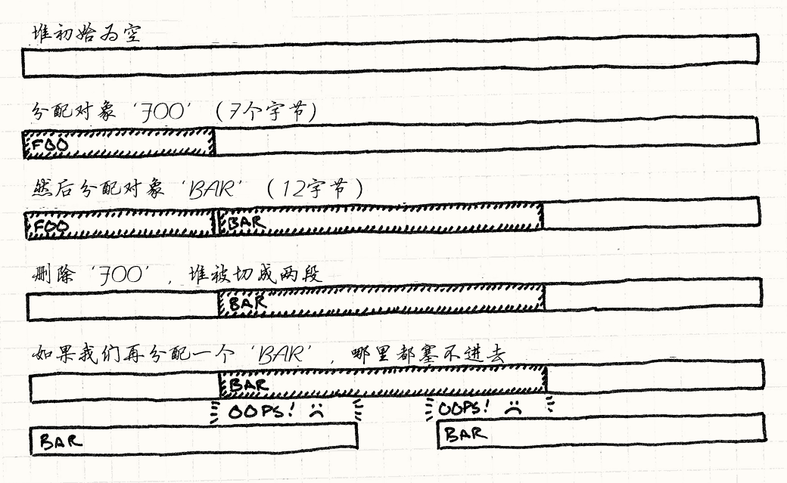

# 对象池模式（Object Pool）

> **章节**：优化模式（Optimization Patterns）  
> **原著**：Robert Nystrom (Bob Nystrom) · 《Game Programming Patterns》  
> **导航**：[目录](README.md) ｜ [上一章：脏标识模式](dirty-flag.md) ｜ [下一章：空间分区](spatial-partition.md)

---

## 意图

*通过从固定池中重用对象，而不是单独分配和释放它们，来提高性能和内存使用率*

## 动机

我们正在制作游戏的视觉效果。
当英雄施放法术时，我们想要一片闪烁的火花在屏幕上迸发开来。
这需要一个*粒子系统*——一个能生成细小闪光图形、让它们播放动画直到一闪而灭的引擎。

由于魔杖轻轻一挥就能生成成百个粒子，系统需要能够非常快速地创建它们。
更重要的是，我们需要确保创建和销毁这些粒子不会造成*内存碎片*。

### 碎片的诅咒

为游戏主机或移动设备编程，在许多方面比常规PC编程更接近嵌入式编程。
内存稀缺，用户希望游戏坚如磐石，而高效的紧凑化内存管理器几乎没有。
在这种环境下，内存碎片是致命的。


碎片意味着堆中的空闲空间被打碎成较小的内存块，而不是一大块连续空间。
*总共的* 可用内存也许很大，但最大的*连续*区域可能小得令人难受。
假设我们有十四字节的空闲内存，但它被一块使用中的内存分割成了两个七字节的碎片。
如果我们尝试分配一个十二字节的对象，就会失败。屏幕上不会再出现闪烁的火花了。

> [!NOTE] 旁注
> 这就像试图在一条繁忙的街道上侧方停车，而已经停好的车彼此之间停得有点太散。
> 如果它们挤在一起，本来是有空间的，但空闲空间被*碎片化*成了五六辆车之间的一小段一小段路边。




> [!NOTE] 旁注
> 这里展现了堆是怎么碎片化的，以及即使在理论上有足够的可用内存，分配也可能失败。


哪怕碎片化并不频繁，它仍会逐渐把堆变成一片满是空洞和裂缝的无用泡沫，最终把游戏彻底冲垮。

> [!NOTE] 旁注
> 大多数主机制造商要求游戏通过“浸泡测试”，也就是让游戏在演示模式下运行好几天。
> 如果游戏崩溃了，他们就不允许它发售。
> 浸泡测试失败有时是因为极少出现的bug，但通常让游戏崩溃的是逐渐蔓延的碎片化或内存泄漏。

### 兼得鱼和熊掌

由于碎片化以及内存分配可能很慢，游戏对何时以及如何管理内存非常小心。
一个简单的解决方案往往最好——在游戏开始时抓取一大块内存，直到游戏结束才释放。
但对于需要在游戏运行时创建和销毁东西的系统来说，这很痛苦。

对象池让我们兼得鱼和熊掌。
对内存管理器来说，我们只是预先分配了一大块内存，并且在游戏运行期间不释放它。
对池的使用者来说，我们可以想分配就分配、想释放就释放，随我们高兴。

## 模式

定义一个**池**类，它维护一组**可重用对象**。
每个对象都支持**“使用中”查询**，用来判断它当前是否“存活”。
池被初始化时，它会预先创建整个对象集合（通常用一次连续分配），并把所有对象初始化到“不在使用中”状态。

当你需要新对象时，向池请求一个。
它找到一个可用对象，将其初始化为“使用中”并返回。
当对象不再被需要时，它被设置回“不在使用中”。
这样，就可以自由地创建和销毁对象，而不必分配内存或其他资源。

## 何时使用

这个模式在游戏中广泛用于像游戏实体和视觉效果这样明显的事物，
但它也用于不那么显眼的数据结构，比如当前正在播放的声音。
在以下情况中使用对象池：

* 需要频繁创建和销毁对象。

* 对象大小相仿。

* 在堆上分配对象很慢，或者可能导致内存碎片。

* 每个对象都封装了像数据库或网络连接这样获取代价高昂且可重用的资源。

## 记住

你通常依赖垃圾回收器或者`new`和`delete`来帮你处理内存管理。
通过使用对象池，你等于是在说：“我更清楚该如何处理这些字节。”
这意味着，应对这个模式种种局限的责任就落在了你身上。

### 池可能在不需要的对象上浪费内存

对象池的大小需要根据游戏的需求进行调校。
调校时，池子太*小*通常很明显（没有什么比崩溃更能引起你的注意了）。
但也要注意别让池子太*大*。更小的池子能腾出内存，用于其他有趣的东西。

### 同时只能激活固定数量的对象

在某种程度上，这是好事。
将内存按不同对象类型划分成独立的池，能确保例如一连串巨大的爆炸不会让你的粒子系统吃掉*所有*可用内存，从而阻止创建像新敌人这样更关键的东西。

尽管如此，这也意味着你要做好准备：从池中重用对象的尝试可能会失败，因为它们都在使用中。
这里有几个常见对策：

* *彻底阻止这种情况。*
  这是最常见的“修复”方式：调整池的大小，这样无论用户做什么，它们都不会溢出。
  对于像敌人或游戏道具这样重要的对象，这通常是正确的答案。
  当玩家到达关卡末尾时，可能没有“正确”的方法来处理缺少空闲槽位来创建大boss的问题，所以聪明的做法是确保这种情况永远不会发生。

    其代价是，你不得不为只在少数罕见边缘情况下才需要的对象槽占用大量内存。
    因此，单一的固定池大小可能并不适合所有游戏状态。
    例如，有些关卡可能突出展现视觉效果，而其他关卡则侧重声音。
    在这种情况下，可以考虑为每个场景分别调整池的大小。

* *干脆不创建对象。*
  这听起来很粗暴，但对于像粒子系统这样的情况是合理的。
  如果所有粒子都在使用中，屏幕可能已经满是闪烁的图形。
  用户不会注意到下一次爆炸不如正在进行的那些令人印象深刻。

* *强制干掉一个已有对象。*
  考虑一个用于当前正在播放的声音的池，假设你想播放新声音但池已经满了。
  你*不想*简单地忽略新声音——用户会注意到魔法杖有时戏剧性地嗖嗖作响，有时却倔强地一声不吭。
  更好的办法是找到已在播放的声音中最安静的那个，然后用新声音替换它。新声音会盖住前一个声音戛然而止时露出的破绽。

    一般来说，如果已有对象的*消失*比新对象的*缺失*更不引人注意，这也许是正确的选择。

* *增加池的大小。*
  如果你的游戏允许你在内存上更灵活一些，你也许可以在运行时增加池的大小，或者创建第二个溢出池。
  如果你通过这两种方式之一获取了更多内存，考虑一下当额外的容量不再需要时，池是否应该缩回之前的大小。

### 每个对象的内存大小是固定的

多数对象池实现把对象直接存储在一个数组里。
如果你所有的对象都是同一种类型，这没问题。
但是，如果你想在池中存储不同类型的对象，或者存储可能添加字段的子类实例，
你需要确保池中的每个槽位都为*最大*的可能对象留出足够内存。
否则，一个出乎意料地大的对象会踩踏到下一个对象，破坏内存。

同时，当对象大小不一时，你就在浪费内存。
每个槽都必须大到足以容纳最大的对象。
如果对象很少有那么大，每次把较小的对象放进那个槽里都是在浪费内存。
这就像过机场安检时，用一个随身行李大小的巨大托盘，却只放你的钥匙和钱包。


当你发现自己以这种方式浪费大量内存时，考虑把池按对象大小拆分成独立的池
——大托盘装行李，小托盘装口袋里的东西。

> [!NOTE] 旁注
> 这是实现高效内存管理器的一种常见模式。
> 管理器拥有一批块大小不同的池。
> 当你请求分配一个块时，它会在合适大小的池中找到一个空闲槽，并从那个池中分配。

### 重用对象不会自动清除

很多内存管理器都有一个调试特性，会把刚分配或刚释放的内存填充成某个醒目的魔数值，比如`0xdeadbeef`。
这能帮你找到由未初始化变量或使用已释放内存引起的、让人头疼的bug。

由于对象池在重用对象时不再经过内存管理器，我们失去了这层安全网。
更糟的是，用于“新”对象的内存之前存放的是类型完全相同的对象。
这几乎让你无法分辨在创建新对象时是否忘了初始化某些东西：
存储该对象的内存中可能已经包含了来自它前世的*几乎*正确的数据。


因此，要特别注意在池中初始化新对象的代码，确保它*完全*初始化了对象。
甚至值得花点时间添加一个调试特性，在对象被回收时清空对象槽的内存。

> [!NOTE] 旁注
> 如果你把它清成`0x1deadb0b`，我将不胜荣幸。

### 未使用的对象会保留在内存中

对象池在支持垃圾回收的系统中不太常见，因为内存管理器通常会帮你处理碎片化。
但对象池在那里仍然有用，可以避免分配和释放的开销，尤其是在CPU更慢、垃圾回收器更简单的移动设备上。

如果你确实与垃圾回收器一起使用对象池，要当心潜在的冲突。
由于池在对象不再使用时并不会真正释放它们，它们会留在内存中。如果它们包含对*其他*对象的引用，也会阻止回收器回收那些对象。
为了避免这种情况，当池中的对象不再使用时，清除它对其他对象的所有引用。

## 示例代码

现实世界的粒子系统通常会应用重力、风、摩擦以及其他物理效果。
我们这个简单得多的示例只会让粒子沿直线移动若干帧，然后消灭该粒子。
算不上电影级水准，但足以说明如何使用对象池。

我们从最简单的实现开始。首先是小小的粒子类：

```cpp
class Particle
{
public:
  Particle()
  : framesLeft_(0)
  {}

  void init(double x, double y,
            double xVel, double yVel, int lifetime)
  {
    x_ = x; y_ = y;
    xVel_ = xVel; yVel_ = yVel;
    framesLeft_ = lifetime;
  }

  void animate()
  {
    if (!inUse()) return;

    framesLeft_--;
    x_ += xVel_;
    y_ += yVel_;
  }

  bool inUse() const { return framesLeft_ > 0; }

private:
  int framesLeft_;
  double x_, y_;
  double xVel_, yVel_;
};
```

默认构造函数把粒子初始化为“不在使用中”。之后对 `init()` 的调用会把粒子初始化到存活状态。
粒子随着时间推移播放动画，用的是那个名字毫无悬念的 `animate()` 函数，它应该每帧调用一次。

对象池需要知道哪些粒子可以重用。它通过粒子的 `inUse()` 函数获知这一点。
这个函数利用了粒子寿命有限这一事实，用 `framesLeft_` 变量来判断哪些粒子正在使用中，而无需存储单独的标志。

对象池类也很简单：

```cpp
class ParticlePool
{
public:
  void create(double x, double y,
              double xVel, double yVel, int lifetime);

  void animate()
  {
    for (int i = 0; i < POOL_SIZE; i++)
    {
      particles_[i].animate();
    }
  }

private:
  static const int POOL_SIZE = 100;
  Particle particles_[POOL_SIZE];
};
```


`create()` 函数允许外部代码创建新粒子。
游戏每帧调用一次 `animate()`，它再依次让池中的每个粒子播放动画。

> [!NOTE] 旁注
> `animate()` 方法是[更新方法](update-method.md)模式的一个例子。

粒子本身被存储在类中一个固定大小的数组里。
在这个示例实现中，池的大小在类声明中被硬编码了，但也可以通过使用给定大小的动态数组或值模板参数在外部定义。

创建新粒子很直观：

```cpp
void ParticlePool::create(double x, double y,
                          double xVel, double yVel,
                          int lifetime)
{
  // 找到一个可用粒子
  for (int i = 0; i < POOL_SIZE; i++)
  {
    if (!particles_[i].inUse())
    {
      particles_[i].init(x, y, xVel, yVel, lifetime);
      return;
    }
  }
}
```

我们遍历整个池，寻找第一个可用的粒子。
找到后，初始化它，就完成了。
注意，在这个实现中，如果没有可用粒子，我们就不创建新的粒子。

除了渲染粒子之外，这就是一个简单粒子系统的全部了。
我们现在可以创建一个池，并用它创建一些粒子。当它们的寿命到期时，粒子会自动停用。


这已经足够发布一款游戏了，但眼尖的人也许已经注意到，创建新粒子需要（可能）遍历整个集合，直到找到空闲槽位。
如果池很大而且几乎满了，这可能会变慢。
让我们看看如何改进这一点。

> [!NOTE] 旁注
> 创建粒子的复杂度是*O(n)*——如果你还记得算法课的话。

### 空闲列表

如果不想浪费时间*寻找*空闲粒子，明显的办法就是不要失去对它们的追踪。
我们可以另外存储一个指针列表，指向每个未使用的粒子。
然后，当需要创建粒子时，从列表中移除第一个指针，并重用它所指向的粒子。

不幸的是，这需要我们维护一个完整的独立数组，其指针数量与池中对象一样多。
毕竟，在首次创建池时，*所有*粒子都未被使用，所以这个列表最初会包含指向池中每个对象的指针。

如果*不用*牺牲任何内存就能解决性能问题，那就好了。
方便的是，这里已经有现成的内存可以借用——那些未使用粒子自身的数据。

当粒子不在使用中时，它的大部分状态都无关紧要。
它的位置和速度没有被用到。它唯一需要的状态是用来判断它是否已死亡的信息。
在我们的例子中，那是 `framesLeft_` 成员。
其余所有位都可以被重用。下面是修改后的粒子：

```cpp
class Particle
{
public:
  // ...

  Particle* getNext() const { return state_.next; }
  void setNext(Particle* next) { state_.next = next; }

private:
  int framesLeft_;

  union
  {
    // 使用时的状态
    struct
    {
      double x, y;
      double xVel, yVel;
    } live;

    // 可重用时的状态
    Particle* next;
  } state_;
};
```


我们把除 `framesLeft_` 之外的所有成员变量都移到了 `state_` union 中的一个 `live` 结构里。
这个结构保存粒子在播放动画时的状态。
当粒子未被使用时，就会用到 union 的另一个分支——`next` 成员。
它保存一个指针，指向这个粒子之后的下一个可用粒子。

> [!NOTE] 旁注
> Union 如今似乎不那么常用了，所以你可能不熟悉这些语法。
> 如果你在游戏团队里，很可能有一位“内存大师”，就是那位饱受折磨的难兄难弟，他的活儿是在游戏不可避免地突破内存预算后想办法补救。
> 问问他们 union 的事。
> 他们不但精通 union，还知道各种有趣的位压缩技巧。

我们可以用这些指针构建一个链表，把池中每个未使用的粒子串在一起。
我们得到了所需的可用粒子列表，却无需使用任何额外内存。
我们拆用了死亡粒子自身的内存来存储这个列表。

这种聪明的技术被称为[*空闲列表*](http://en.wikipedia.org/wiki/Free_list)。
为了让它生效，我们需要确保指针被正确初始化，并在粒子创建和销毁时得到维护。
当然，我们还需要追踪列表的头：

```cpp
class ParticlePool
{
  // ...
private:
  Particle* firstAvailable_;
};
```

当池首次创建时，*所有*粒子都是可用的，所以我们的空闲列表应该贯穿整个池。池构造函数完成这些设置：

```cpp
ParticlePool::ParticlePool()
{
  // 第一个可用的粒子
  firstAvailable_ = &particles_[0];

  // 每个粒子指向下一个
  for (int i = 0; i < POOL_SIZE - 1; i++)
  {
    particles_[i].setNext(&particles_[i + 1]);
  }

  // 最后一个终结的列表
  particles_[POOL_SIZE - 1].setNext(NULL);
}
```


现在为了创建新粒子，我们直接跳到首个可用的粒子：

> [!NOTE] 旁注
> *O(1)* 复杂度，伙计！这才叫带劲！

```cpp
void ParticlePool::create(double x, double y,
                          double xVel, double yVel,
                          int lifetime)
{
  // 保证池没有满
  assert(firstAvailable_ != NULL);

  // 将它从可用粒子列表中移除
  Particle* newParticle = firstAvailable_;
  firstAvailable_ = newParticle->getNext();

  newParticle->init(x, y, xVel, yVel, lifetime);
}
```

我们需要知道粒子何时死亡，以便把它放回空闲列表，
所以我们将 `animate()` 改为：如果此前存活的粒子在这一帧咽了气，就返回 `true`：

```cpp
bool Particle::animate()
{
  if (!inUse()) return false;

  framesLeft_--;
  x_ += xVel_;
  y_ += yVel_;

  return framesLeft_ == 0;
}
```

当这种情况发生时，我们简单地把它串回列表：

```cpp
void ParticlePool::animate()
{
  for (int i = 0; i < POOL_SIZE; i++)
  {
    if (particles_[i].animate())
    {
      // 将粒子加到列表的前部
      particles_[i].setNext(firstAvailable_);
      firstAvailable_ = &particles_[i];
    }
  }
}
```

就这样，一个不错的小对象池，创建和删除都是常数时间。

## 设计决策

如你所见，最简单的对象池实现几乎微不足道：创建一个对象数组，并在需要时重新初始化它们。
生产代码很少那么精简。有很多方式可以在此基础上扩展，让池更通用、使用更安全或更易维护。
在游戏中实现对象池时，你需要回答以下问题：

### 对象和池耦合吗？

编写对象池时你会遇到的第一个问题是：对象本身是否知道自己身处池中。
大多数情况下它们会知道，但在编写能容纳任意对象的通用池类时，你就没有这种便利了。

* **如果对象与池耦合：**

    * *实现更简单。*
      你只需在池化对象中放一个“使用中”标志或函数，就完成了。

    * *你可以确保对象只能由池创建。*
      在 C++ 中，一个简单的做法是让池类成为对象类的友元，然后把对象的构造函数设为私有。

        ```cpp
        class Particle
        {
          friend class ParticlePool;

        private:
          Particle()
          : inUse_(false)
          {}

          bool inUse_;
        };

        class ParticlePool
        {
          Particle pool_[100];
        };
        ```

        这种关系记录了类的预期使用方式，并确保使用者不会创建池没有追踪的对象。

    * *你也许可以避免显式存储“使用中”标志。*
      很多对象已经保留了一些可以用来判断其是否存活的状态。
      例如，如果粒子当前位置在屏幕外，它就可以被重用。
      如果对象类知道自己可能被用在池中，它可以提供一个 `inUse()` 方法来查询该状态。
      这让池不必再额外消耗内存去存储一堆“使用中”标志。

* **如果对象没有和对象池耦合：**

    * *任何类型的对象都可以入池。*
      这是最大的优点。通过把对象与池解耦，你可以实现一个通用的、可复用的池类。

    * *“使用中”状态必须在对象外部追踪。*
      最简单的方式是创建一个单独的位字段：

        ```cpp
        template <class TObject>
        class GenericPool
        {
        private:
          static const int POOL_SIZE = 100;

          TObject pool_[POOL_SIZE];
          bool    inUse_[POOL_SIZE];
        };
        ```

### 谁负责初始化重用对象？

为了重用现有对象，它必须用新状态重新初始化。
这里的关键问题是，在池类内部还是外部重新初始化对象。

* **如果在对象池的内部重新初始化：**

    * *池可以完全封装它的对象。*
      根据对象所需的其他能力，你可以让它们完全留在池内部。
      这确保了其他代码不会保留对可能被意外重用的对象的引用。

    * *池与对象的初始化方式绑定在一起。*
      池化对象可能提供多个初始化函数。
      如果由池管理初始化，它的接口就需要支持所有这些函数，并把它们转发给对象。

        ```cpp
        class Particle
        {
          // 多种初始化方式……
          void init(double x, double y);
          void init(double x, double y, double angle);
          void init(double x, double y, double xVel, double yVel);
        };

        class ParticlePool
        {
        public:
          void create(double x, double y)
          {
            // 转发给粒子……
          }

          void create(double x, double y, double angle)
          {
            // 转发给粒子……
          }

          void create(double x, double y, double xVel, double yVel)
          {
            // 转发给粒子……
          }
        };
        ```

* **如果外部代码初始化对象：**

    * *池的接口可以更简单。*
      池无需提供多个函数来覆盖对象每种可能的初始化方式，只需返回对新对象的引用：

        ```cpp
        class Particle
        {
        public:
          // 多种初始化方法
          void init(double x, double y);
          void init(double x, double y, double angle);
          void init(double x, double y, double xVel, double yVel);
        };

        class ParticlePool
        {
        public:
          Particle* create()
          {
            // 返回可用粒子的引用……
          }
        private:
          Particle pool_[100];
        };
        ```

        调用者可以使用对象暴露的任何方法进行初始化：

        ```cpp
        ParticlePool pool;

        pool.create()->init(1, 2);
        pool.create()->init(1, 2, 0.3);
        pool.create()->init(1, 2, 3.3, 4.4);
        ```

    * *外部代码需要处理无法创建新对象的失败。*
      前面的例子假设`create()`总能成功地返回一个指向对象的指针。
      但如果对象池已经满了，返回的会是`NULL`。安全起见，你需要在初始化之前检查这一点。

        ```cpp
        Particle* particle = pool.create();
        if (particle != NULL) particle->init(1, 2);
        ```

## 参见

* 这看上去很像 [享元](flyweight.md) 模式。
  两者都维护一个可重用对象的集合。区别在于“重用”的含义。
  享元对象通过*同时*在多个拥有者之间共享同一实例来实现重用。享元模式通过在多个上下文中使用同一对象，避免了*重复*的内存使用。

    对象池中的对象也会被重用，但只是在时间上先后重用。
    “重用”在对象池的语境中意味着，在原始拥有者用完对象*之后*回收它的内存。
    对象池并不期望对象在其生命周期内被共享。

* 把一堆相同类型的对象紧密地放在内存中，有助于在游戏遍历这些对象时让CPU缓存保持满载。
  [数据局部性](data-locality.md)模式讲的就是这个。

---

> **导航**：[目录](README.md) ｜ [上一章：脏标识模式](dirty-flag.md) ｜ [下一章：空间分区](spatial-partition.md)
