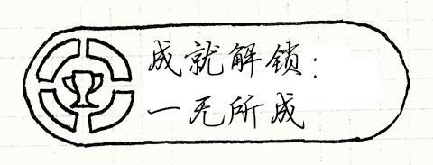
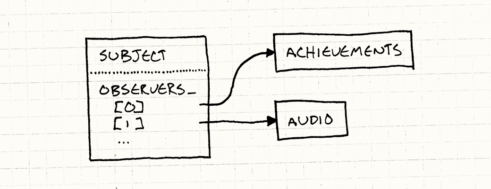
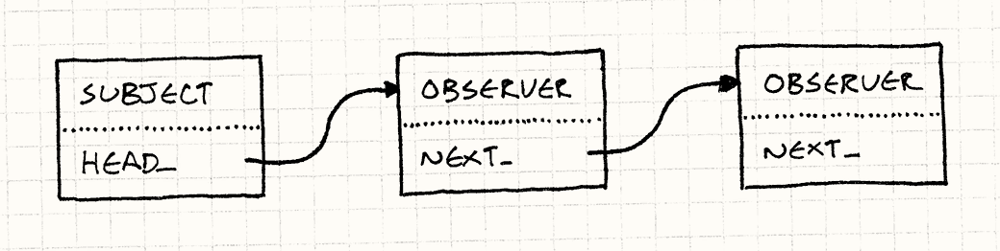
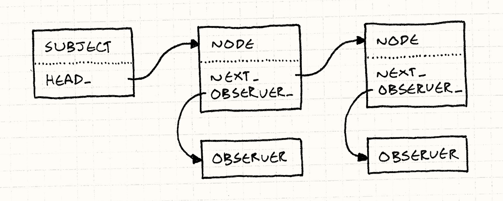

# 观察者模式（Observer）

> **章节**：重访设计模式（Design Patterns Revisited）  
> **原著**：Robert Nystrom (Bob Nystrom) · 《Game Programming Patterns》  
> **导航**：[目录](README.md) ｜ [上一章：享元模式](flyweight.md) ｜ [下一章：原型模式](prototype.md)

---

你朝电脑随便扔块石头，都难免砸中一个用[MVC架构][MVC]构建的应用，
而其底层正是观察者模式。
观察者模式无处不在，Java甚至把它放进了核心库（[`java.util.Observer`][java]），而C#更是直接把它嵌入了*语言*（[`event`][event]关键字）。

[MVC]: http://en.wikipedia.org/wiki/Model%E2%80%93view%E2%80%93controller
[java]: http://docs.oracle.com/javase/7/docs/api/java/util/Observer.html
[event]: http://msdn.microsoft.com/en-us/library/8627sbea.aspx

> [!NOTE] 旁注
> 就像软件中的很多东西一样，MVC 是 Smalltalk 程序员们在七十年代发明的。
> Lisp程序员也许会说其实是他们在六十年代发明的，但是他们懒得记下来。

观察者模式是GoF原始模式中应用最广、知名度最高的模式之一，但游戏开发圈有时会出奇地封闭，
所以对你来说，它也许是全新的。
如果你已经很久没走出过修道院，让我带你过一遍一个有代表性的例子。


## 成就解锁

假设我们向游戏中添加了成就系统。
它会有几十种不同的徽章，玩家完成特定里程碑即可获得，比如“杀死100只猴子恶魔”，“从桥上掉下去”，或者“只用一只死黄鼠狼通关”。

> [!NOTE] 旁注
> 
>
> 我发誓，我画这幅图时可绝对没有别的意思。


由于成就种类繁多，又由各种不同的行为解锁，想要干净地实现它并不容易。
如果我们不够小心，成就系统的触须会蔓延到代码库的每个黑暗角落。
当然，“从桥上掉落”确实和物理引擎相关，
但我们真的想在碰撞解析算法的线性代数运算正中间，
看到对`unlockFallOffBridge()`的调用吗？

> [!NOTE] 旁注
> 这是个反问句。
> 任何有自尊的物理程序员绝不会让我们用*游戏玩法*这种平庸的东西玷污他们优美的数学。

和往常一样，我们想要的是，把与游戏某一方面相关的所有代码都整齐地归拢到一处。
挑战在于，成就是由游戏玩法的许多不同方面触发的。怎样才能在不把成就代码与所有这些方面耦合的情况下做到这一点呢？

这正是观察者模式的用途所在。
它让一段代码宣布有趣的事情发生了，*而不必真正关心谁会收到通知。*

举个例子，我们有一些物理代码处理重力，追踪哪些物体正安安稳稳地待在平坦表面上，哪些正坠向必死无疑的深渊。
为了实现“桥上掉落”的徽章，我们可以直接把成就代码放在那里，但那就会一团糟。
相反，可以这样做：

```cpp
void Physics::updateEntity(Entity& entity)
{
  bool wasOnSurface = entity.isOnSurface();
  entity.accelerate(GRAVITY);
  entity.update();
  if (wasOnSurface && !entity.isOnSurface())
  {
    notify(entity, EVENT_START_FALL);
  }
}
```

它所做的只是说：“额，我不知道有谁感兴趣，但是这个东西刚刚掉下去了。随你怎么处置吧。”

> [!NOTE] 旁注
> 物理引擎确实决定了要发送什么通知，所以这并没有完全解耦。但在架构这个领域，通常只能让系统变得*更好*，而不是*完美*。

成就系统把自己注册为观察者，这样无论何时物理代码发送通知，成就系统都能收到。
它可以检查掉落的物体是不是我们那位不太优雅的英雄，
以及在这次与经典力学不愉快的新遭遇之前，他所待的地方是不是一座桥。
如果满足条件，就伴着烟花和欢呼解锁相应的成就，而这一切都无需牵扯到物理代码。


事实上，我们可以修改成就的集合，或者拆掉整个成就系统，而不必改动物理引擎的一行代码。
它仍会照常发送通知，浑然不知已经没有任何东西接收它们了。

> [!NOTE] 旁注
> 当然，如果我们*永久*移除成就，而且再没有别的东西会监听物理引擎的通知，
> 那我们不妨把通知代码也一并移除。但在游戏的演进过程中，保留这种灵活性是件好事。

## 它如何运作

如果你还不知道如何实现这个模式，你可能可以从之前的描述中猜到，但为了让你轻松点，我还是快速带你过一遍吧。

### 观察者

我们从那个爱打听的类开始，它想知道别的对象何时做了什么有趣的事。
这些好奇的对象由如下接口定义：


```cpp
class Observer
{
public:
  virtual ~Observer() {}
  virtual void onNotify(const Entity& entity, Event event) = 0;
};
```

> [!NOTE] 旁注
> `onNotify()`的参数由你决定。这就是为什么它是观察者*模式*，
> 而不是“可以粘贴到游戏中的现成代码”。
> 典型的参数是发送通知的对象，以及一个用来塞其他细节的通用“数据”参数。
>
> 如果你用泛型或模板编程，你可能会在这里使用它们，但根据你的具体用例来定制它们也完全可以。
> 这里，我将其硬编码为接受一个游戏实体和一个描述发生了什么的枚举。

任何实现了这个的具体类就成为了观察者。
在我们的例子中，是成就系统，所以我们可以像这样实现：

```cpp
class Achievements : public Observer
{
public:
  virtual void onNotify(const Entity& entity, Event event)
  {
    switch (event)
    {
    case EVENT_ENTITY_FELL:
      if (entity.isHero() && heroIsOnBridge_)
      {
        unlock(ACHIEVEMENT_FELL_OFF_BRIDGE);
      }
      break;

      // 处理其他事件，更新heroIsOnBridge_变量……
    }
  }

private:
  void unlock(Achievement achievement)
  {
    // 如果还没有解锁，那就解锁成就……
  }

  bool heroIsOnBridge_;
};
```

### 被观察者

通知方法由被观察的对象调用。用GoF的说法，那个对象被称为“主题”。
它有两个任务。首先，它持有一个观察者列表，这些观察者正无比耐心地等待它发来消息：


```cpp
class Subject
{
private:
  Observer* observers_[MAX_OBSERVERS];
  int numObservers_;
};
```

> [!NOTE] 旁注
> 在真实代码中，你会使用动态大小的集合，而不是一个傻乎乎的定长数组。
> 在这里，我使用这种最基础的形式是为了那些不了解C++标准库的人们。

重点是被观察者暴露了*公开的*API来修改这个列表：

```cpp
class Subject
{
public:
  void addObserver(Observer* observer)
  {
    // 添加到数组中……
  }

  void removeObserver(Observer* observer)
  {
    // 从数组中移除……
  }

  // 其他代码……
};
```

这就允许了外界代码控制谁接收通知。
被观察者与观察者交流，但是不与它们*耦合*。
在我们的例子中，没有一行物理代码会提及成就。
但它仍然可以与成就系统交流。这就是这个模式的巧妙之处。

同样重要的是，被观察者持有的是观察者*列表*，而不是单个观察者。
这保证了观察者之间不会隐式地相互耦合。
举个例子，假设音频引擎也观察坠落事件，以便播放合适的声音。
如果被观察者只支持一个观察者，当音频引擎注册时，就会*取消*成就系统的注册。

这意味着这两个系统会相互干扰——而且是以一种特别糟糕的方式，
因为第二个会让第一个失效。
支持观察者列表保证了每个观察者都被独立处理。
在它们各自看来，自己才是这个世界上唯一盯着被观察者的东西。

被观察者的剩余任务就是发送通知：


```cpp
class Subject
{
protected:
  void notify(const Entity& entity, Event event)
  {
    for (int i = 0; i < numObservers_; i++)
    {
      observers_[i]->onNotify(entity, event);
    }
  }

  // 其他代码…………
};
```

> [!NOTE] 旁注
> 注意，代码假设了观察者不会在它们的`onNotify()`方法中修改观察者列表。
> 更加可靠的实现方法会阻止或优雅地处理这样的并发修改。

### 可被观察的物理系统


现在，我们只需要把这一切接入物理引擎，让它能发送通知，
而成就系统可以把自己接入来接收通知。
我们会贴近《设计模式：可复用面向对象软件的基础》原书的做法，继承`Subject`：

```cpp
class Physics : public Subject
{
public:
  void updateEntity(Entity& entity);
};
```

这让我们可以把`Subject`中的`notify()`设为protected。
这样派生的物理引擎类可以调用它来发送通知，但是外部的代码不行。
同时，`addObserver()`和`removeObserver()`是公开的，
所以任何可以接触物理引擎的东西都可以观察它。

> [!NOTE] 旁注
> 在真实代码中，我会避免使用这里的继承。
> 相反，我会让`Physics` *有* 一个`Subject`的实例。
> 不再是观察物理引擎本身，被观察的会是独立的“下落事件”对象。
> 观察者可以用像这样注册它们自己：
>
> ```cpp
> physics.entityFell()
>   .addObserver(this);
> ```
>
> 对我而言，这是“观察者”系统与“事件”系统的不同之处。
> 使用前者，你观察*做了有趣事情的事物*。
> 使用后者，你观察的对象代表了*发生的有趣事情*。

现在，当物理引擎做了些值得关注的事情，它调用`notify()`，就像之前的例子。
它遍历了观察者列表，通知所有观察者。



很简单，对吧？只要一个类管理一列表指向接口实例的指针。
难以置信的是，如此简单直接的东西是无数程序和应用框架通信的主干。

但观察者模式并非没有批评者。当我问其他游戏程序员对这个模式怎么看时，他们提出了一些抱怨。
让我们看看能做些什么来回应它们——如果有的话。

## “太慢了”

我经常听到这种说法，通常来自那些并不真正了解该模式细节的程序员。
他们有一种默认假设：任何沾点“设计模式”边的东西，一定包含成堆的类、间接调用，以及各种挥霍CPU周期的花样。


观察者模式在这里名声尤其不好，因为它众所周知地与一些形迹可疑的家伙混在一起，
比如“事件”、“消息”，甚至“数据绑定”。
其中一些系统*确实*可能很慢（通常是有意为之，而且理由充分）。
它们涉及排队，或者为每个通知做动态分配。

> [!NOTE] 旁注
> 这就是为什么我认为设计模式文档化很重要。
> 当我们对术语含糊不清时，我们就失去了清晰、简洁表达的能力。
> 你说“观察者”，别人却听成“事件”或“消息”，
> 因为要么没人费心写下它们的区别，要么是别人碰巧没读到。
>
> 这正是我在本书中努力去做的。
> 为了做到面面俱到，本书也有一章讲事件和消息：[事件队列](event-queue.md)。

但现在你已经看到了这个模式实际是如何实现的，
你就知道情况并非如此。
发送通知只是遍历列表并调用一些虚方法。
诚然，它比静态分派调用慢*一点*，但除了最性能关键的代码之外，这点开销都可以忽略不计。

我发现这个模式最适合用在热点代码路径之外，这样你通常能承受动态分派的代价。
除此之外，它几乎没有额外开销。
我们不必为消息分配对象，也没有队列。它不过是对同步方法调用的一次间接调用。

### “太*快*？”

事实上，你得小心，观察者模式*是*同步的。
被观察者直接调用了观察者，这意味着直到所有观察者的通知方法返回后，
被观察者才会继续自己的工作。一个缓慢的观察者就可能阻塞被观察者。

这听起来很吓人，但在实践中，这并不是世界末日。
这只是值得注意的事情。
UI程序员——他们做这种基于事件的编程已经很多年了——对此有句老话：“远离UI线程”。

如果你要同步响应事件，就需要尽快完成并交还控制权，这样UI才不会锁死。
当你有耗时的操作要执行时，将这些操作推到另一个线程或工作队列中去。

不过，把观察者与线程和显式锁混用时，你确实需要小心。
如果观察者试图获取被观察者持有的锁，就可能让游戏陷入死锁。
在高度多线程的引擎中，你最好使用[事件队列](event-queue.md)来做异步通信。

## “它做了太多动态分配”


程序员部落里的很多人——包括许多游戏开发者——已经转向了带垃圾回收的语言，
动态分配已不再是过去那个吓人的怪物了。
但在像游戏这样性能关键的软件中，哪怕是在托管语言里，内存分配也依然重要。
动态分配需要时间，回收内存也需要时间，哪怕它是自动进行的。

> [!NOTE] 旁注
> 很多游戏开发者不太担心分配，更担心*内存碎片*。
> 当你的游戏为了通过认证需要连续运行数天而不崩溃时，日益碎片化的堆可能会让你无法发布。
>
> [对象池](object-pool.md)一章更详细地讨论了这个问题，以及一种避免它的常用技术。

在上面的示例代码中，我使用了定长数组，因为我想尽量保持简单。
在实际实现中，观察者列表几乎总是一个动态分配的集合，随着观察者的添加和删除而增长和收缩。
这种内存的频繁变动吓到了一些人。

当然，第一件需要注意的事情是只在观察者加入时分配内存。
*发送*通知无需内存分配——只需一个方法调用。
如果你在游戏一开始就加入观察者而不乱动它们，分配的总量是很小的。

如果这仍然困扰你，我会介绍一种完全无需动态分配的方式来添加和移除观察者。

### 链式观察者

在我们目前看到的代码中，`Subject`拥有一组指针，指向每一个观察它的`Observer`。
`Observer`类本身没有对这个列表的引用。
它是纯粹的虚接口。优先使用接口，而不是有状态的具体类，这大体上是一件好事。

但如果我们*确实*愿意在`Observer`中放一些状态，
我们可以把被观察者的列表串在*观察者自身*之中来解决动态分配问题。
被观察者不再持有单独的一组指针，观察者对象本身成了链表中的节点：



为了实现这一点，我们首先去掉`Subject`中的数组，改用指向观察者链表头部的指针取而代之：

```cpp
class Subject
{
  Subject()
  : head_(NULL)
  {}

  // 方法……
private:
  Observer* head_;
};
```

然后，我们在`Observer`中添加指向链表中下一观察者的指针。

```cpp
class Observer
{
  friend class Subject;

public:
  Observer()
  : next_(NULL)
  {}

  // 其他代码……
private:
  Observer* next_;
};
```

这里我们也让`Subject`成为了友类。
被观察者拥有增删观察者的API，但它要管理的链表现在位于`Observer`类内部。
最简单的实现办法就是让被观察者类成为友类。

注册一个新观察者就是将其连到链表中。我们用更简单的实现方法，将其插到开头：

```cpp
void Subject::addObserver(Observer* observer)
{
  observer->next_ = head_;
  head_ = observer;
}
```

另一个选项是将其添加到链表的末尾。这么做增加了一定的复杂性。
`Subject`要么遍历整个链表来找到尾部，要么保留一个单独`tail_`指针指向最后一个节点。

加到列表头部更简单，但它确实有一个副作用。
当我们遍历列表给每个观察者发送一个通知，
最*新*注册的观察者最*先*接到通知。
所以如果以A，B，C的顺序来注册观察者，它们会以C，B，A的顺序接到通知。

理论上，无论哪种方式都无所谓。
良好的观察者设计准则之一是：观察同一被观察者的两个观察者，彼此之间不应有任何顺序依赖。
如果顺序*确实*重要，那就意味着这两个观察者之间存在某种微妙的耦合，最终可能会反过来给你惹麻烦。

让我们完成删除操作：


```cpp
void Subject::removeObserver(Observer* observer)
{
  if (head_ == observer)
  {
    head_ = observer->next_;
    observer->next_ = NULL;
    return;
  }

  Observer* current = head_;
  while (current != NULL)
  {
    if (current->next_ == observer)
    {
      current->next_ = observer->next_;
      observer->next_ = NULL;
      return;
    }

    current = current->next_;
  }
}
```

> [!NOTE] 旁注
> 如你所见，从链表移除一个节点通常需要处理一些丑陋的特殊情况，应对头节点。
> 还可以使用指针的指针，实现一个更优雅的方案。
>
> 我在这里没有那么做，是因为半数看到这个方案的人都迷糊了。
> 但这是一个很值得做的练习：它能帮助你深入思考指针。

因为使用的是单链表，所以我们得遍历它才能找到要删除的观察者。
如果我们使用普通的数组，也得做相同的事。
如果我们使用*双向*链表，每个观察者都有指向前面和后面的指针，
就可以用常量时间移除观察者。在实际项目中，我会这样做。

剩下的事情只有发送通知了，这和遍历列表同样简单：

```cpp
void Subject::notify(const Entity& entity, Event event)
{
  Observer* observer = head_;
  while (observer != NULL)
  {
    observer->onNotify(entity, event);
    observer = observer->next_;
  }
}
```

> [!NOTE] 旁注
> 这里，我们遍历了整个链表，通知了其中每一个观察者。
> 这保证了所有的观察者相互独立并有同样的优先级。
>
> 我们可以稍作调整：当观察者接到通知时，它可以返回一个标志，表明被观察者应该继续遍历列表还是停下。
> 如果这样做，你就相当接近[职责链](http://en.wikipedia.org/wiki/Chain-of-responsibility_pattern)模式了。

还不错，对吧？被观察者现在想有多少观察者就有多少观察者，而且不沾一丁点动态内存。
注册和取消注册就像使用简单数组一样快。
但是，我们牺牲了一些小小的功能特性。

由于我们使用观察者对象作为链表节点，这暗示它只能存在于一个观察者链表中。
换言之，一个观察者一次只能观察一个被观察者。
在传统的实现中，每个被观察者有独立的列表，一个观察者同时可以存在于多个列表中。

你也许可以接受这一限制。
通常是一个*被观察者*有多个*观察者*，反过来就很少见了。
如果这*确实*是个问题，还有一种更复杂的解决方案，同样不需要动态分配。
详细介绍的话，这章就太长了，但我会大致描述一下，其余的你可以自行填补……

### 链表节点池


和之前一样，每个被观察者都会有一个观察者链表。
但是，这些链表节点不是观察者本身。
相反，它们是独立的小“链表节点”对象，
包含了指向观察者的指针和指向链表下一节点的指针。



由于多个节点可以指向同一个观察者，这就意味着观察者可以同时出现在不止一个被观察者的列表中。
我们又回到了能够同时观察多个被观察者的状态。

> [!NOTE] 旁注
> 链表有两种风格。学校教授的那种，节点对象包含数据。
> 在我们之前的观察者链表的例子中，是另一种：
> *数据*（这个例子中是观察者）包含了*节点*（`next_`指针）。
>
> 后一种风格被称为“侵入式”链表，因为把对象用于链表会侵入到对象本身的定义中。
> 侵入式链表灵活性较差，但如我们所见，也更高效。
> 在Linux内核这类地方，它们很受欢迎，因为在那里这种取舍是合理的。

避免动态分配的方法很简单：由于这些节点大小和类型都相同，
可以预先分配一个[对象池](object-pool.md)来存放它们。
这样你就得到了一堆固定大小的链表节点可用，可以随你所需使用和重用，
而不必去碰真正的内存分配器。

## 剩余的问题

我想我们已经赶走了那三个用来吓退人们、让他们远离这个模式的怪物。
如我们所见，它简单、快速，还能与内存管理友好相处。
但这是否意味着你该一直使用观察者呢？嗯，那是另一个问题了。
像所有设计模式一样，观察者模式也不是万能药。
即使被正确、高效地实现，它也不一定是正确的解决方案。
设计模式之所以名声不好，原因之一就是人们把好模式用在了错误的问题上，结果把事情弄得更糟。

还有两个挑战：一个是技术上的，另一个则更偏向可维护性层面。
我们先处理关于技术的挑战，因为关于技术的问题总是更容易处理。

### 销毁被观察者和观察者


我们看到的样例代码很可靠，但它回避了一个重要问题：
删除被观察者或观察者时会发生什么？
如果你不小心对某个观察者调用了`delete`，被观察者可能仍然持有指向它的指针。
那是一个指向已释放内存的悬空指针。
当被观察者试图发送通知时，呃……这么说吧，你接下来可不会好过。

> [!NOTE] 旁注
> 不是想指责任何人，但我得说一句：《设计模式》完全没提这个问题。

删除被观察者更容易些，因为在大多数实现中，观察者没有对它的引用。
但即便如此，把被观察者的数据送进内存管理器的回收站，还是可能造成一些问题。
那些观察者可能仍然期待将来收到通知，而它们并不知道这再也不会发生了。
它们其实已经不是观察者了，只是自己还以为是。


你可以用几种不同的方式处理这一点。
最简单的做法就是像我这样，干脆不去管它。
在被删除时从所有被观察者那里注销自己，是观察者的职责。
多数情况下，观察者*确实*知道它在观察哪些被观察者，
所以通常只需在它的析构函数里加一个`removeObserver()`调用。

> [!NOTE] 旁注
> 通常在这种情况下，难点不在如何做，而在*记得*做。


如果你不想在被观察者咽气时把观察者们晾在那儿，这也很好解决。
只需让被观察者在被销毁前发送一个最后的“临终通知”。
这样，任何观察者都能收到通知，并采取它认为合适的行动。

> [!NOTE] 旁注
> 默哀，献花，挽歌……

人——哪怕是那些与机器相伴已久、身上多少沾染了机器那种精确特质的人——在“可靠”这件事上，也可靠地不靠谱。
这就是为什么我们发明了电脑：它们不会像我们那样频繁犯错。

更安全的做法是，让观察者在自身被销毁时自动从所有被观察者那里注销自己。
如果你在观察者基类中实现一次这个逻辑，使用它的人就不必自己记得去做了。
不过，这确实增加了一定的复杂度。
这意味着每个*观察者*都需要一份它正在观察的*被观察者*的列表。
最终你会得到双向的指针。

### 别担心，我有垃圾回收器

你们这些用着带有垃圾回收器的时髦现代语言的小年轻，现在一定很得意吧。
你们以为不必担心这个问题，因为你们从来不必显式删除任何东西？再想想吧！

想象一下：你有一个UI界面，显示玩家角色的一堆属性，比如生命值之类的。
当玩家打开这个界面时，你为它实例化一个新对象。
当玩家关闭它时，你直接忘掉这个对象，交给GC清理。

每当角色脸上（或者其他什么地方）挨了一拳，就发送一个通知。
UI观察到了，然后更新血槽。很好。
当玩家关闭这个界面，但你却没有注销观察者时，会发生什么？

UI界面不再可见，但它不会被垃圾回收，因为角色的观察者列表仍保存着对它的引用。
每当这个界面被加载时，我们都会往那个越来越长的列表里添加它的一个新实例。

在玩家玩游戏、来回跑动、打架的整个过程中，角色发送的通知都会被*所有*那些界面接收。
它们不在屏幕上，却接收通知，浪费CPU周期更新不可见的UI元素。
如果它们还做播放声音之类的事情，你就会看到明显错误的行为。


这个问题在通知系统中非常常见，以至于专门有个名字：*失效监听者问题*。
由于被观察者保留了对监听者的引用，最终内存中会残留僵尸UI对象。
这里的教训是，注销观察者要严格自律。

> [!NOTE] 旁注
> 更能说明其重要性的迹象是：它甚至有专门的[维基条目](http://en.wikipedia.org/wiki/Lapsed_listener_problem)。

### 到底发生了什么？

观察者模式的另一个更深层次的问题，是它的目的直接导致的。
我们使用它，是因为它帮助我们放松两块代码之间的耦合。
它让被观察者间接地与某个观察者通信，而不必与它静态绑定。

当你要理解被观察者的行为时，这很有价值，任何不相关的事情都是在分散注意力。
如果你在捣鼓物理引擎，你真的不希望你的编辑器——或者你的大脑——被一堆成就相关的东西塞满。

另一方面，如果你的程序不工作了，而且这个bug横跨一条观察者链，理清这条通信流就困难得多。
如果是显式耦合，只需查看被调用的方法即可，非常简单。
由于耦合是静态的，这对普通的IDE来说是小菜一碟。

但如果耦合是通过观察者列表发生的，想要知道谁会收到通知，唯一的办法就是看*运行时*哪些观察者恰好在那个列表里。
你无法再*静态*地推理程序的通信结构，而必须推理它*命令式、动态*的行为。

应对这一点的指导原则很简单。
如果你经常需要同时考虑某次通信的*两端*才能理解程序的某一部分，
那就不要用观察者模式来表达这种联系，而是选择更显式的方式。

当你在捣鼓某个大型程序时，你往往会有一些一起处理的代码块。
我们有很多术语来描述这一点，比如“关注点分离”、“连贯性与内聚性”和“模块化”，
但归根结底就是“这些东西归在一起，而不和那些东西归在一起。”

观察者模式是让这些基本不相关的代码块互相交流、而不让它们合并成一大块的好方法。
在专注于某一特性或方面的单一代码块*内部*，它就没那么有用了。

这就是为什么它很适合我们的例子：
成就和物理几乎是完全不相干的领域，很可能由不同的人实现。
我们希望它们之间的通信尽可能少，
这样在其中任何一个上工作，都不需要对另一个有太多了解。

## 今日观察者


《设计模式》出版于1994年。
那时候，面向对象编程*正是*热门的范式。
地球上每个程序员都想“30天学会面向对象编程”，
中层管理者根据程序员创建的类的数量给他们发工资。
工程师们以继承层次的深度来评判自己的本事。

> [!NOTE] 旁注
> 同一年，Ace of Base的热门单曲不是一首，而是*三首*，这也许能让你了解一些我们那时的品味和眼光。

观察者模式在那个时代潮流中流行起来，所以它以类为中心也就不奇怪了。
但现代的主流程序员更适应函数式编程。
仅仅为了接收一个通知就实现整个接口，已不符合今日的美学。


它让人感觉沉重又死板。它*确实*沉重又死板。
举个例子，你没法让一个类针对不同的被观察者使用不同的通知方法。

> [!NOTE] 旁注
> 这就是为什么被观察者经常将自身传给观察者。
> 观察者只有单一的`onNotify()`方法，
> 如果它观察多个被观察者，它需要知道哪个被观察者在调用它的方法。

更现代的做法是让“观察者”只是对方法或函数的引用。
在拥有一等函数的语言中，尤其是有闭包的语言中，
这种实现观察者的方式更为普遍。


> [!NOTE] 旁注
> 今日，几乎*每种*语言都有闭包。C++克服了在没有垃圾回收的语言中构建闭包的挑战，
> 甚至连Java都终于争了口气，在JDK 8中引入了闭包。

举个例子，C#把“事件”内建在语言中。
有了事件，你注册的观察者就是一个“委托”，
这是该语言对方法引用的称呼。
在JavaScript事件系统中，观察者*可以*是支持特定`EventListener`协议的对象，
但它们也可以只是函数。
后者几乎总是人们使用的方式。


如果今天让我来设计一个观察者系统，我会让它基于函数而不是基于类。
哪怕是在C++中，我倾向于让你注册一个成员函数指针作为观察者，而不是`Observer`接口的实例。

> [!NOTE] 旁注
> [这里][delegate]是一篇有趣的博文，介绍了在C++中实现这一点的一种方式。
>
> [delegate]: http://molecularmusings.wordpress.com/2011/09/19/generic-type-safe-delegates-and-events-in-c/

## 明日观察者

事件系统和其他类似观察者的模式如今极为普遍。
它们是一条被走烂的老路。
但如果你用它们写几个大型应用，你会开始注意到一件事。
观察者中的大量代码最终看起来都一样。通常是这样的：

  1. 得知某个状态发生了变化。

  2. 命令式地修改某块UI以反映新的状态。

全都是这样：“哦，英雄的生命值现在是7了？让我们把血条的宽度设为70像素。”
过一段时间，这会变得相当乏味。
计算机科学学者和软件工程师试图消除这种乏味已经*很长*时间了。
这些尝试有过许多不同的名字：“数据流编程”、“函数响应式编程”等等。

虽然已经取得了一些成功，但通常局限在音频处理或芯片设计等有限领域，圣杯仍未找到。
与此同时，一种不那么雄心勃勃的方法开始获得关注。许多较新的应用框架现在使用“数据绑定”。

与更激进的模型不同，数据绑定并不试图完全消除命令式代码，
也不尝试围绕一个巨大的声明式数据流图来架构你的整个应用。
它所做的，是自动化那些繁琐工作：调整UI元素或计算属性以反映某个值的变化。

像其他声明式系统一样，数据绑定可能有点太慢、太复杂，不适合放进游戏引擎的核心。
但如果我看不到它开始进入游戏中不那么关键的部分（比如UI），我会很惊讶。

与此同时，经典观察者模式仍然在这里等着我们。
诚然，它不像某些热门技术那样，名字里硬塞进“函数式”和“响应式”，
但它极其简单而且管用。对我而言，这两点往往是评判一个解决方案最重要的两条标准。

---

> **导航**：[目录](README.md) ｜ [上一章：享元模式](flyweight.md) ｜ [下一章：原型模式](prototype.md)
