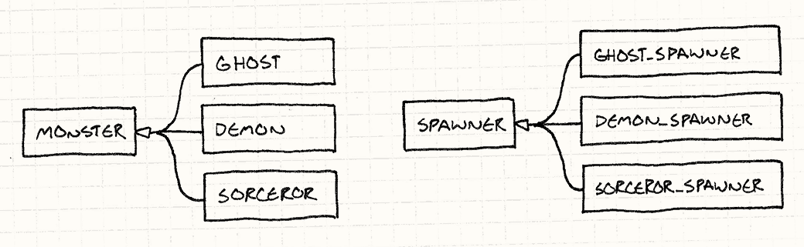
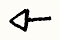
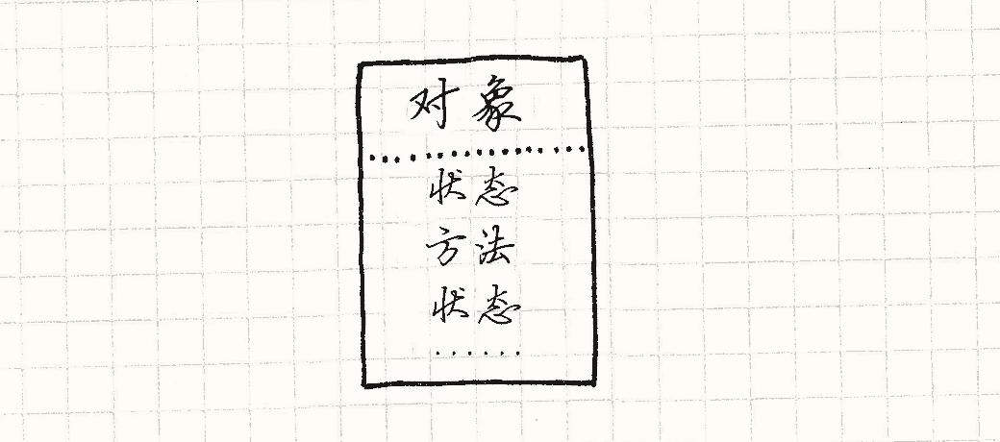
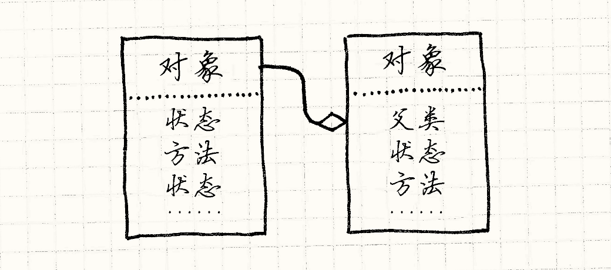
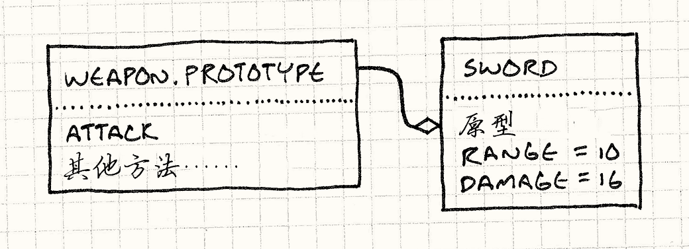

# 原型模式（Prototype）

> **章节**：重访设计模式（Design Patterns Revisited）  
> **原著**：Robert Nystrom (Bob Nystrom) · 《Game Programming Patterns》  
> **导航**：[目录](README.md) ｜ [上一章：观察者模式](observer.md) ｜ [下一章：单例模式](singleton.md)

---

我第一次听到“原型”这个词是在*《设计模式》*中。
如今，似乎每个人都在用这个词，但他们讨论的实际上不是[设计模式](http://en.wikipedia.org/wiki/Prototype_pattern)。
我们会在这一章介绍这个模式，但也会带你看看其他更有趣的地方——“原型”这个术语及其背后的理念还出现在了哪些场合。
不过首先，让我们重访最初的那个模式。

> [!NOTE] 旁注
> “最初”一词我在这里可不是随便用的。
> *《设计模式》*把 Ivan Sutherland 在*1963年*的传奇项目[Sketchpad](http://en.wikipedia.org/wiki/Sketchpad)作为该模式在现实世界中最早出现的例子之一。
> 当其他人在听迪伦和甲壳虫乐队时，Sutherland正忙着，你知道的，发明CAD、交互式图形和面向对象编程的基本概念。
>
> 看看这个[演示](http://www.youtube.com/watch?v=USyoT_Ha_bA)，准备好惊掉下巴吧。

## 原型设计模式

假设我们要用《圣铠传说》的风格做款游戏。
各种生物和恶魔围绕着英雄，争抢着他身上的血肉。
这些令人倒胃口的“饭搭子”通过“生产者”进入竞技场，每种敌人都有各自的生产者。

在这个例子中，假设我们游戏中每种怪物都有不同的类——`Ghost`，`Demon`，`Sorcerer`等等，像这样：

```cpp
class Monster
{
  // 代码……
};

class Ghost : public Monster {};
class Demon : public Monster {};
class Sorcerer : public Monster {};
```

生产者构造特定种类怪物的实例。
为了在游戏中支持每种怪物，我们*可以*用一种暴力的实现方法，
让每个怪物类都有生产者类，得到平行的类结构：




> [!NOTE] 旁注
> 我得翻出落满灰尘的UML书来画这个图表。代表“继承自”。

实现后看起来像是这样：

```cpp
class Spawner
{
public:
  virtual ~Spawner() {}
  virtual Monster* spawnMonster() = 0;
};

class GhostSpawner : public Spawner
{
public:
  virtual Monster* spawnMonster()
  {
    return new Ghost();
  }
};

class DemonSpawner : public Spawner
{
public:
  virtual Monster* spawnMonster()
  {
    return new Demon();
  }
};

// 你知道思路了……
```

除非你是按代码行数拿工资，
否则这显然不是个有趣的实现方式。
一大堆类、一大堆样板代码、一大堆冗余、一大堆重复、一大堆自我重复……

原型模式提供了一个解决方案。
关键思路是*一个对象可以产出与自身相似的对象。*
如果你有一个恶灵，你可以制造更多恶灵。
如果你有一个恶魔，你可以制造其他恶魔。
任何怪物都可以被视为*原型*怪物，产出其他版本的自己。

为了实现这个功能，我们给基类`Monster`添加一个抽象方法`clone()`：

```cpp
class Monster
{
public:
  virtual ~Monster() {}
  virtual Monster* clone() = 0;

  // 其他代码……
};
```

每个怪物子类都提供一个实现，返回一个在类和状态上与自己完全一样的新对象。举个例子：

```cpp
class Ghost : public Monster {
public:
  Ghost(int health, int speed)
  : health_(health),
    speed_(speed)
  {}

  virtual Monster* clone()
  {
    return new Ghost(health_, speed_);
  }

private:
  int health_;
  int speed_;
};
```

一旦我们所有的怪物都支持这个，
我们不再需要为每个怪物类创建生产者类。我们只需定义一个类：

```cpp
class Spawner
{
public:
  Spawner(Monster* prototype)
  : prototype_(prototype)
  {}

  Monster* spawnMonster()
  {
    return prototype_->clone();
  }

private:
  Monster* prototype_;
};
```

它内部存有一个怪物，一个隐藏的怪物，
它唯一的用途就是被生产者当作模板，用来批量产出更多和它一样的怪物，
有点像一只从不离开蜂巢的蜂后。


为了得到恶灵生产者，我们创建一个恶灵的原型实例，然后创建拥有这个实例的生产者：

```cpp
Monster* ghostPrototype = new Ghost(15, 3);
Spawner* ghostSpawner = new Spawner(ghostPrototype);
```

这个模式的一个巧妙之处在于，它不只克隆原型的*类*，也会克隆它的*状态*。
这就意味着我们可以创建一个生产者，用来生产快速恶灵、虚弱恶灵或慢速恶灵，只需先造出合适的原型恶灵。

我在这个模式中发现了某种既优雅又令人惊讶的东西。
我无法想象自己能想出这个点子，但如今既然我知道了它，我也无法想象自己会*不知道*它。

### 效果如何？

好吧，我们不需要为每个怪物创建单独的生产者类，那很好。
但我们*确实*需要在每个怪物类中实现`clone()`。
这跟写那些生产者类的代码量也差不多。

当你坐下来试着写一个正确的`clone()`时，还会掉进一些恼人的语义烂坑。
它是做深克隆还是浅克隆呢？换句话说，如果恶魔拿着一把草叉，克隆恶魔时要不要连草叉一起克隆？

而且，它非但没在这个人为构造的问题里帮我们省下多少代码，
这个问题本身*就是*人为构造出来的。
我们不得不把“每种怪物都有独立的类”当作前提。
如今这绝对*不是*大多数游戏引擎的做法。

我们大多数人吃过苦头才明白，这种庞大的类层次管理起来很痛苦，
所以我们改用[组件模式](component.md)和[类型对象](type-object.md)来为不同类型的实体建模，而不必把每种实体都供在各自的类里。

### 生产函数

哪怕我们确实需要为每个怪物构建不同的类，想给这只猫剥皮，也不止这一种办法。
与其为每种怪物单独建一个生产者*类*，我们可以创建生产*函数*，就像这样：

```cpp
Monster* spawnGhost()
{
  return new Ghost();
}
```

这比为某类怪物写一整个生产者类更省样板代码。然后这个生产者类只需存储一个函数指针：

```cpp
typedef Monster* (*SpawnCallback)();

class Spawner
{
public:
  Spawner(SpawnCallback spawn)
  : spawn_(spawn)
  {}

  Monster* spawnMonster()
  {
    return spawn_();
  }

private:
  SpawnCallback spawn_;
};
```

为了给恶灵构建生产者，你需要做：

```cpp
Spawner* ghostSpawner = new Spawner(spawnGhost);
```

### 模板


到了现在，大多数C++开发者都已经熟悉模板了。
我们的生产者类需要为某种类型构建实例，但我们不想硬编码某个具体的怪物类。
自然的解决方案就是把它做成一个*类型参数*，模板正好能做到这一点：

> [!NOTE] 旁注
> 我不太确定C++程序员是学着爱上了模板，还是模板把一些人彻底吓得远离了C++。
> 不管怎样，今天我见到的用C++的人，也都在用模板。
>
> 这里的`Spawner`类，是为了让不关心生产者创建哪种怪物的代码可以直接使用它，并且只与指向`Monster`的指针打交道。
>
> 如果我们只有`SpawnerFor<T>`类，这个模板的所有实例化就没有一个共同的父类型，
> 这样一来，任何要和各种怪物类型的生产者打交道的代码，自己都得再接收一个模板参数。

```cpp
class Spawner
{
public:
  virtual ~Spawner() {}
  virtual Monster* spawnMonster() = 0;
};

template <class T>
class SpawnerFor : public Spawner
{
public:
  virtual Monster* spawnMonster() { return new T(); }
};
```

像这样使用它：

```cpp
Spawner* ghostSpawner = new SpawnerFor<Ghost>();
```

### 一等类型


前面两种方案都是在满足同一个需求：拥有一个按类型参数化的`Spawner`类。
在C++中，类型通常不是一等公民，所以得费些周折。
如果你使用的是JavaScript、Python或者Ruby这样的动态类型语言，
它们的类*就是*可以随意传递的普通对象，你就可以用更直接的办法解决这个问题。

> [!NOTE] 旁注
> 在某种程度上，[类型对象](type-object.md)也是对“缺少一等类型”的另一种变通。
> 不过那个模式在拥有一等类型的语言里也有用，因为它让*你*来决定什么是“类型”。
> 你也许想要与语言内建类所提供的不同语义。

当你创建一个生产者时，直接传入它要构建的怪物类——也就是代表怪物类的那个运行时对象。易如反掌。

有了以上这些选择，老实说，我还没遇到过觉得原型*设计模式*是最佳答案的情况。
也许你的体验会不一样，但现在先把它放到一边，我们来聊点别的：把原型作为一种*语言范式*。

## 原型语言范式

很多人认为“面向对象编程”和“类”是同义词。
关于OOP的定义常常像对立教派的信条，
但一个比较没有争议的说法是：*OOP让你定义“对象”，把数据和代码打包在一起。*
与C这样的结构化语言、Scheme这样的函数式语言相比，
OOP的决定性特征就是它把状态和行为紧紧绑定在一起。

你也许认为类是做到这一点的唯一方法，
但包括Dave Ungar和Randall Smith在内的一小撮人并不这么认为。
他们在80年代创建了一门叫Self的语言。它虽然再OOP不过了，却没有类。

### Self语言

从纯粹的意义上说，Self比基于类的语言*更加*面向对象。
我们认为OOP是把状态和行为结合在一起的，但基于类的语言实际上在两者之间划了一道分界线。

想想你最喜欢的基于类的语言的语义。
要访问对象上的某个状态，你得到实例自身的内存里去查。状态*包含*在实例中。


但是，为了调用方法，你需要查到实例的类，
然后在*那里*找方法。行为包含在*类*中。
要调用方法总得经过这么一层间接，这意味着字段和方法是彼此分开的。


> [!NOTE] 旁注
> 举个例子，为了调用C++中的虚函数，你需要在实例中找到指向虚函数表的指针，然后再到那里去找方法。

Self消除了这种区分。*无论你要找什么*，都只需在对象上找。
实例可以同时包含状态和行为。你可以有一个对象，拥有完全只属于自己的方法。




> [!NOTE] 旁注
> 没有人是一座孤岛，但这个对象是。

如果Self仅此而已，那它会很难用。
基于类的语言中的继承，尽管有种种缺点，还是提供了一种有用的机制来重用多态代码、避免重复。
为了在没有类的情况下实现类似的功能，Self引入了*委托*。


要在某个对象上查找字段或调用方法，我们先在对象自身里找。
如果它有，就完事了。如果没有，就去找这个对象的*父对象*。
这里的父对象只是对另一个对象的引用。
当我们在第一个对象上找不到某个属性时，就去试它的父对象，再试父对象的父对象，以此类推。
换句话说，失败的查找被*委托*给了对象的父对象。

> [!NOTE] 旁注
> 我在这里做了简化。Self实际上支持多个父对象。
> 父对象只是被特别标记过的字段，这意味着你可以继承它们，或者在运行时改变它们，
> 由此得到所谓的“动态继承”。



父对象让我们能在不同对象间重用行为（还有状态！），这样我们就覆盖了类的一部分功能。
类做的另一件关键事情，是给了我们创建实例的方式。
当你需要某个新玩意儿时，可以直接`new Thingamabob()`，或者按你所用语言喜欢的语法来。
类就是它自己实例的工厂。

没有类，我们该怎么创建新东西？
尤其是，我们怎么创建一堆有共同点的新东西？
和这个设计模式一样，在Self中，做到这一点的方式就是*克隆*。

在Self语言中，就好像*每个*对象都自动支持原型设计模式。
任何对象都能被克隆。为了获得一堆相似的对象，你：

1. 把一个对象敲打成你想要的样子。你可以直接克隆系统内建的基本`Object`，然后往里面塞字段和方法。
2. 克隆它来制造……呃……你想造多少个克隆体，就造多少个。

这样我们就得到了原型设计模式的优雅，又无需费劲自己去实现`clone()`；克隆被内建在了系统里。


这个系统如此美妙、巧妙、极简，
以至于我一了解它，就开始创建一门基于原型的语言，以便获得更多经验。

> [!NOTE] 旁注
> 我知道从头开始构建一门编程语言不是最高效的学习方式，但我能说什么呢？我就是有点怪。
> 如果你好奇的话，这门语言叫[Finch](http://finch.stuffwithstuff.com/)。

### 它的实际效果如何？


能摆弄一门纯粹基于原型的语言让我超级兴奋，但等我把自己的语言做出来并跑起来后，
我发现了一个令人不快的事实：用它编程没那么有趣。

> [!NOTE] 旁注
> 后来我通过小道消息听说，很多Self程序员也得出了相同的结论。
> 不过这个项目绝非一无所获。
> Self太动态了，为了跑得够快，它需要各种各样的虚拟机创新。
>
> 他们为即时编译、垃圾回收和优化方法派发而发明的那些点子，恰恰是同一批技术——而且常常还是由同一批人实现的！——
> 如今正是这些技术，让世界上许多动态类型语言快得足以支撑极受欢迎的应用。

没错，这门语言实现起来很简单，但那是因为它把复杂度甩给了用户。
一旦开始试着使用它，我就发现自己想念类所提供的那种结构。
由于语言本身没有这种结构，我最后只能在库层面尝试把它重新搭出来。

也许这是因为我之前的经验都来自基于类的语言，所以我的脑子已经被那种范式带偏了。
但我猜，大多数人就是喜欢定义清晰的“事物种类”。

除了基于类的语言取得的巨大成功之外，看看有多少游戏有明确的角色职业，以及一份精确的敌人、物品和技能清单，每一种都标注得清清楚楚。
你很少看到有游戏里每种怪物都是独一无二的雪花，比如“有点像巨魔和哥布林的混合体，还掺了一点蛇”。


原型是一种非常酷的范式，我也希望有更多人了解它，
但我很庆幸我们大多数人并没有真的天天用它编程。
我见过的完全拥抱原型的代码都有一种奇怪的黏糊感，让我很难理清头绪。

> [!NOTE] 旁注
> 同样能说明问题的是，用原型风格写的代码*少得可怜*。我查过了。

### JavaScript又怎么样呢？

好吧，如果基于原型的语言那么不友好，我又该怎么解释JavaScript呢？
这是一门带原型的语言，每天被数百万人使用。地球上运行JavaScript的计算机比运行其他任何语言的都多。

Brendan Eich，JavaScript的缔造者，
从Self语言中直接汲取灵感，很多JavaScript的语义都是基于原型的。
每个对象都可以有一组任意的属性，包括字段和“方法”（其实只是存成字段的函数）。
一个对象还可以有另一个对象，称为它的“原型”，
当字段访问失败时，就委托给这个原型。

> [!NOTE] 旁注
> 作为语言设计者，原型的诱人之处是它们比类更易于实现。
> Eich充分利用了这一点：JavaScript的第一个版本就是在十天内完成的。

不过，尽管如此，我相信JavaScript在实践中更像基于类的语言，而不是基于原型的语言。
JavaScript已经与Self渐行渐远的一个迹象是：基于原型语言的核心操作——*克隆*——不见踪影。

在JavaScript中没有克隆对象的方法。
它最接近的是`Object.create()`，可以创建一个委托给现有对象的新对象。
就连这个方法也是到ECMAScript 5才加入，那已经是JavaScript问世十四年后了。
不靠克隆，让我带你走一遍在JavaScript中定义类型和创建对象的典型方法。
我们从*构造函数*开始：

    ```javascript
    ```
    function Weapon(range, damage) {
      this.range = range;
      this.damage = damage;
    }

这会创建一个新对象并初始化它的字段。你像这样调用它：

    ```javascript
    ```
    var sword = new Weapon(10, 16);

这里的`new`调用`Weapon()`函数体，并把`this`绑定到一个新的空对象上。
函数体给它添加了一堆字段，然后这个填好的对象会被自动返回。

`new`还为你做了另一件事。
当它创建那个空白对象时，会把它接好线，让它委托给一个原型对象。
你可以直接用`Weapon.prototype`访问那个对象。

状态是在构造函数体内添加的，而定义**行为**通常是通过向原型对象添加方法。就像这样：

    ```javascript
    ```
    Weapon.prototype.attack = function(target) {
      if (distanceTo(target) > this.range) {
        console.log("Out of range!");
      } else {
        target.health -= this.damage;
      }
    }

这给武器原型添加了一个`attack`属性，其值是一个函数。
由于每个由`new Weapon()`返回的对象都会委托给`Weapon.prototype`，
你现在可以调用`sword.attack()`，它就会去调用那个函数。
看起来有点像这样：



让我们复习一下：

* 创建对象的方式是：借助一个代表该类型的对象——构造函数——来调用“new”操作。
* 状态存储在实例自身中。
* 行为则要经过一层间接——委托给原型——被存储在另一个独立对象里，这个对象代表了某一类型所有对象共享的一组方法。

就算你说我疯了，但这听起来很像是我之前描述过的类。
你*可以*在JavaScript中写原型风格的代码（*没有* 克隆），
但语言的语法和惯用写法更鼓励基于类的方式。


就我个人而言，我认为这是件好事。
就像我说的，我发现一味坚持用原型会让代码更难处理，
所以我喜欢JavaScript把核心语义包进某种更像“类”的东西里。

## 为数据模型构建原型

好吧，我一直都在讲我*不喜欢*把原型用在哪，这让本章读起来挺丧的。
我觉得这本书应该更像喜剧而不是悲剧，所以最后让我们以一个我认为原型——更准确地说，是*委托*——确实有用的领域来收尾。

如果你数一数一款游戏里属于代码的字节数和属于数据的字节数，
就会发现自编程诞生以来，数据的占比一直在稳步增长。
早期游戏几乎一切都靠程序化方式生成，这样才能塞进软盘和老式游戏卡带里。
在今天的许多游戏中，代码只是驱动游戏的“引擎”，游戏本身完全由数据定义。

这很好，但把成堆的内容塞进数据文件，并不能魔术般地解决大型项目的组织难题。
甚至可以说，这让它变得更难了。
我们之所以使用编程语言，是因为它们有管理复杂性的工具。

与其把一段代码复制粘贴到十个地方，我们会把它移进一个函数里，然后通过名字来调用。
与其在一堆类之间复制方法，我们会把它放进一个单独的类里，让这些类去继承或混入。

当你的游戏数据达到一定规模时，你真的会开始想要类似的功能。
数据建模是个很深的话题，我在这里没法把它讲透彻，
但我确实想抛出一个特性，供你在自己的游戏里考虑：用原型和委托来重用数据。


假设我们为早先提到的那个无耻的山寨版《圣铠传说》定义数据模型。
游戏设计者需要在某种文件里设定怪物和物品的属性。

> [!NOTE] 旁注
> 我指的是一个完全原创的标题，绝没有受到任何已有的俯视角多人地牢爬行街机游戏的影响。
> 请不要起诉我。


一个常用的方法是使用JSON。
数据实体基本就是*映射*，或者*属性包*，或者十几种叫法中的随便一种，
因为程序员最喜欢干的事，就是给已经有名字的东西再发明一个新名字。

> [!NOTE] 旁注
> 我们把这些东西反复重新发明了太多次，以至于Steve Yegge称之为["通用设计模式"](http://steve-yegge.blogspot.com/2008/10/universal-design-pattern.html)。

所以游戏中的哥布林也许被定义为像这样的东西：

    ```json
    ```
    {
      "name": "goblin grunt",
      "minHealth": 20,
      "maxHealth": 30,
      "resists": ["cold", "poison"],
      "weaknesses": ["fire", "light"]
    }

这相当直白，哪怕是最讨厌文字的设计师也能应付。
于是，你又往哥布林大家族谱上添了几个旁支：

    ```json
    ```
    {
      "name": "goblin wizard",
      "minHealth": 20,
      "maxHealth": 30,
      "resists": ["cold", "poison"],
      "weaknesses": ["fire", "light"],
      "spells": ["fire ball", "lightning bolt"]
    }
    
    {
      "name": "goblin archer",
      "minHealth": 20,
      "maxHealth": 30,
      "resists": ["cold", "poison"],
      "weaknesses": ["fire", "light"],
      "attacks": ["short bow"]
    }

现在，如果这是代码，我们的审美雷达就会嗡嗡作响。
这些实体之间有很多重复，而训练有素的程序员*讨厌*重复。
它浪费空间，写起来也更费时间。
你得仔细读才能看出这些数据到底*是不是*一样的。
这是维护上的大麻烦。
如果我们决定让游戏里所有哥布林都变强，就得记得把这三个哥布林的血量都更新一遍。糟糕糟糕糟糕。

如果这是代码，我们会为“哥布林”创建一个抽象，并在三个哥布林类型中复用它。
但傻乎乎的JSON可不懂这些。所以让我们把它变得聪明一点。


我们规定：如果一个对象有`"prototype"`字段，那么这个字段就定义了它要委托给的另一对象的名字。
第一个对象上不存在的任何属性，就回退到原型上去查找。

> [!NOTE] 旁注
> 这让`"prototype"`不再是数据，而成为了*元*数据。
> 哥布林有绿色疣皮和黄色牙齿。
> 它们没有原型。
> 原型是*代表哥布林的数据对象*的属性，而不是哥布林本身的属性。

这样，我们可以简化我们的哥布林JSON内容：

    ```json
    ```
    {
      "name": "goblin grunt",
      "minHealth": 20,
      "maxHealth": 30,
      "resists": ["cold", "poison"],
      "weaknesses": ["fire", "light"]
    }
    
    {
      "name": "goblin wizard",
      "prototype": "goblin grunt",
      "spells": ["fire ball", "lightning bolt"]
    }
    
    {
      "name": "goblin archer",
      "prototype": "goblin grunt",
      "attacks": ["short bow"]
    }

由于弓箭手和术士都以grunt为原型，我们就不必在每个里面重复血量、抗性和弱点。
我们为数据模型增加的逻辑超级简单——只是基本的单一委托——但已经摆脱了一堆重复。

这里值得注意的一件趣事是：我们并没有为三个具体哥布林类型再设第四个“基础哥布林”*抽象*原型让它们去委托。
相反，我们只是挑了一个最简单的哥布林，然后委托给它。

在基于原型的系统中，任何对象都可以被当作克隆源来创建新的、更精细的对象，这让人觉得很自然，
而我认为在这里也同样自然。它特别适合游戏中的数据，因为游戏世界里经常会有独一无二的特殊实体。

想想Boss和独特物品。它们通常是对游戏中更常见对象的精化，
而原型委托很适合用来定义它们。
那把魔法“断头剑”，其实只是一把带了些加成的长剑，可以直接这样表示：

    ```json
    ```
    {
      "name": "Sword of Head-Detaching",
      "prototype": "longsword",
      "damageBonus": "20"
    }

在你游戏引擎的数据建模系统里多加一点点能力，就能让设计者更容易地为游戏世界中的武器装备和小怪物添加许多小变化，而正是这种丰富性让玩家感到愉悦。

---

> **导航**：[目录](README.md) ｜ [上一章：观察者模式](observer.md) ｜ [下一章：单例模式](singleton.md)
