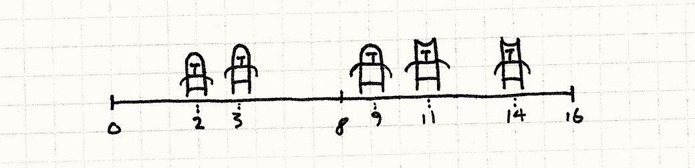
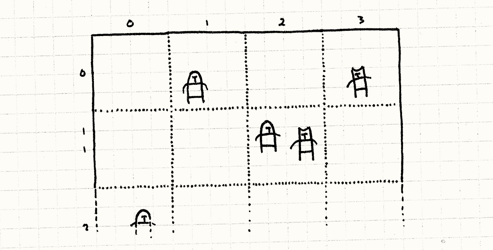
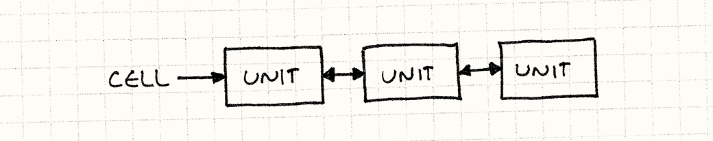
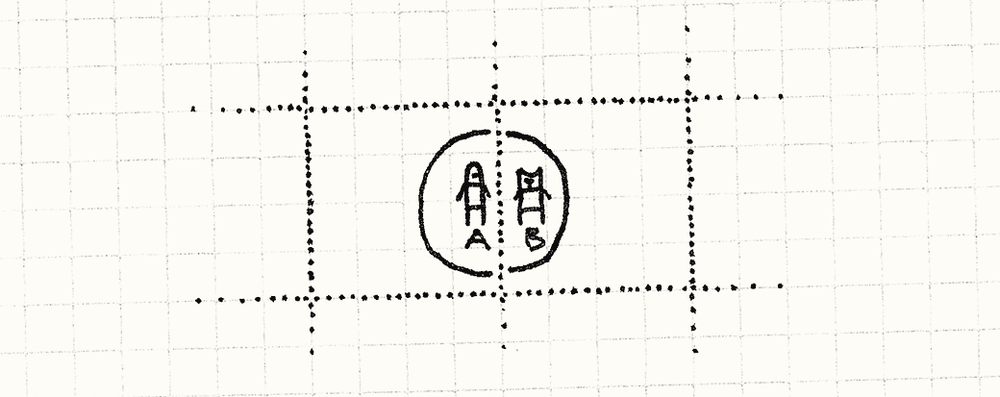
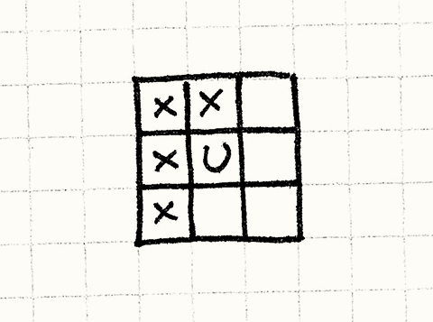
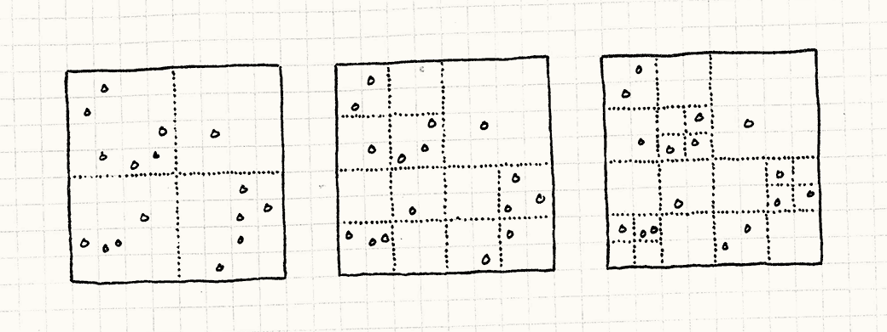

# 空间分区（Spatial Partition）

> **章节**：优化模式（Optimization Patterns）  
> **原著**：Robert Nystrom (Bob Nystrom) · 《Game Programming Patterns》  
> **导航**：[目录](README.md) ｜ [上一章：对象池模式](object-pool.md)

---

## 意图

*将对象根据它们的位置存储在数据结构中，来高效地定位对象。*

## 动机

游戏让我们能拜访其他世界，但这些世界通常和我们的世界没有太多不同。
它们通常拥有和我们宇宙一样的基础物理和实在感。
这就是为什么它们尽管只是由比特和像素构建，却能让人觉得真实。

我们这里要关注的虚构现实中的一小块是*位置*。游戏世界有*空间*感，对象都在空间的某处。
这一点在很多方面有所体现。最明显的是物理——对象移动、碰撞、交互——但还有其他例子。
音频引擎也许会考虑声源和玩家的相对位置，越远的声音越轻。
在线交流也许局限在较近的玩家之间。

这意味着游戏引擎通常需要回答这个问题，“哪些对象在这个位置周围？”
如果每帧都要回答足够多次这个问题，就会变成性能瓶颈。

### 在战场上的单位

假设我们在做实时战略游戏。敌对双方成百上千的单位将在战场上交锋。
战士需要知道该向哪个附近的敌人挥刀。
最简单的处理方法是检查每对单位，然后看看它们互相之间的距离：

```cpp
void handleMelee(Unit* units[], int numUnits)
{
  for (int a = 0; a < numUnits - 1; a++)
  {
    for (int b = a + 1; b < numUnits; b++)
    {
      if (units[a]->position() == units[b]->position())
      {
        handleAttack(units[a], units[b]);
      }
    }
  }
}
```


这里有一个双重嵌套循环，每个循环都会遍历战场上的所有单位。
这意味着每帧需要进行的成对检测次数会随着单位数量的*平方*增长。
每添加一个单位，都要和之前*所有*单位进行比较。
如果有大量单位，这就完全失控了。

> [!NOTE] 旁注
> 内层循环实际没有遍历所有的单位。
> 它只遍历那些外层循环还没有访问过的单位。
> 这避免了把每对单位比较*两次*：A与B一次，B与A一次。
> 如果我们已经处理了A和B之间的碰撞，就不必为B和A再检查一次。
>
> 用大O术语，这还是*O(n&sup2;)* 的。

### 描绘战线

我们这里碰到的问题是单位数组没有任何内在顺序。
为了在某个位置附近找到单位，我们需要遍历整个数组。
现在，我们简化一下游戏。
不再想象二维的战*场*，而是想象一维的战*线*。




在这种情况下，我们可以通过根据单位在战线上的位置*排序*数组元素来简化问题。
一旦我们那样做，我们可以使用像[二分查找](http://en.wikipedia.org/wiki/Binary_search)之类的东西找到附近的单位，而不必扫描整个数组。

> [!NOTE] 旁注
> 二分查找有*O(log n)* 的复杂度，意味着找所有战斗单位的复杂度从*O(n&sup2;)*降到*O(n log n)*。
> 像[鸽巢排序](http://en.wikipedia.org/wiki/Pigeonhole_sort)可将它降到*O(n)*。

这里的经验很明显：如果我们把对象存储在一个按位置组织的数据结构中，就能更快地找到它们。
这个模式便是将这个思路应用到多维空间上。

## 模式

对于一组**对象**，每个对象都有**空间上的位置**。
将它们存储在按位置组织对象的**空间数据结构**中，让你能**高效查询某个位置或其附近的对象**。
当对象的位置改变时，**更新空间数据结构**，这样它可以继续找到对象。

## 何时使用

这是存储活跃的、移动的游戏对象的常用模式，也可用于游戏世界的静态美术和几何体。
复杂的游戏通常会为不同种类的内容使用多个空间分区。

这个模式的基本要求是：你有一组各自具有某种位置的对象，并且你进行了太多按位置查找对象的查询，导致性能受到影响。

## 记住

空间分区的存在是为了把*O(n)*或者*O(n&sup2;)* 的操作降到更可控的数量级。
你拥有的对象*越多*，它的价值就越大。反过来，如果*n*足够小，也许不值得费这个劲。


由于这个模式需要通过位置组织对象，位置会*改变*的对象更难处理。
你需要重新组织数据结构来追踪新位置上的对象，这会增加代码复杂度，*并*消耗CPU周期。
确保这种取舍是值得的。

> [!NOTE] 旁注
> 想象一下哈希表里对象的键会自行改变，你就能体会到这为什么棘手了。

空间分区也会因为记录划分的数据结构而使用额外的内存。
就像很多优化一样，它用内存换速度。如果你的内存比时钟周期更短缺，这可能是一笔亏本的买卖。

## 示例代码


模式总会*变化*——每种实现都略有不同，空间分区也不例外。
不过，与其他模式不同，这些变体中有很多都有完善的文档记录。
学术界喜欢发表论文来证明性能提升。
由于我只关心模式背后的概念，我会给你展示最简单的空间分区：*固定网格*。

> [!NOTE] 旁注
> 看看本章的最后一节，那里有游戏中常用的空间分区方法列表。

### 一张方格纸

想象整个战场。现在，在上面叠加一张由固定大小的方格组成的网格，就像一张方格纸。
不再把单位存到单一的数组中，而是把它们放进这个网格的格子里。
每个格子存储一组位置处在该格子边界内的单位。



当我们处理战斗时，我们只需考虑在同一格子中的单位。
不是将游戏中的每个单位与其他所有单位比较，我们把战场*划分*成许多更小的迷你战场，每个里面的单位都少得多。

### 链接单位的网格

好了，让我们编码吧。首先，一些准备工作。这是我们的基础`Unit`类。

```cpp
class Unit
{
  friend class Grid;

public:
  Unit(Grid* grid, double x, double y)
  : grid_(grid),
    x_(x),
    y_(y)
  {}

  void move(double x, double y);

private:
  double x_, y_;
  Grid* grid_;
};
```

每个单位都有一个（二维的）位置，以及一个指向它所在`Grid`的指针。
我们让`Grid`成为一个`friend`类，
因为，我们稍后会看到，当单位的位置改变时，它就需要和网格跳一支复杂的舞，以确保一切都正确更新。

这里是网格的表示：

```cpp
class Grid
{
public:
  Grid()
  {
    // 清空网格
    for (int x = 0; x < NUM_CELLS; x++)
    {
      for (int y = 0; y < NUM_CELLS; y++)
      {
        cells_[x][y] = NULL;
      }
    }
  }

  static const int NUM_CELLS = 10;
  static const int CELL_SIZE = 20;
private:
  Unit* cells_[NUM_CELLS][NUM_CELLS];
};
```


注意每个格子都是一个指向单位的指针。
下面我们扩展`Unit`，增加`next`和`prev`指针：

```cpp
class Unit
{
  // 之前的代码……
private:
  Unit* prev_;
  Unit* next_;
};
```

这让我们将单位组织为[双向链表](http://en.wikipedia.org/wiki/Doubly_linked_list)，而不是数组。



网格中的每个格子都指向该格子内单位链表里的第一个单位，
而每个单位都有指针指向链表中它前一个和后一个单位。
我们很快就会明白为什么要这样做。

> [!NOTE] 旁注
> 在这本书中，我避免使用任何C++标准库内建的集合类型。
> 我想让理解例子所需的外部知识越少越好，而且，就像魔术师的“我的袖子里什么也没有”，
> 我想让大家看清代码里*究竟*发生了什么。
> 细节很重要，特别是那些与性能相关的模式。
>
> 但这是我*讲解*模式时的选择。
> 如果你在真实代码中*使用*它们，就别给自己找头疼了，直接用如今几乎所有编程语言都内置的那些好用的集合吧。
> 人生苦短，别从头编写链表了。

### 进入战场

我们需要做的第一件事就是保证新单位创建时被放置到了网格中。
我们让`Unit`在它的构造函数中处理这个：

```cpp
Unit::Unit(Grid* grid, double x, double y)
: grid_(grid),
  x_(x),
  y_(y),
  prev_(NULL),
  next_(NULL)
{
  grid_->add(this);
}
```

`add()`方法像这样定义：


```cpp
void Grid::add(Unit* unit)
{
  // 检测它在哪个网格中
  int cellX = (int)(unit->x_ / Grid::CELL_SIZE);
  int cellY = (int)(unit->y_ / Grid::CELL_SIZE);

  // 加到网格的对象列表前段
  unit->prev_ = NULL;
  unit->next_ = cells_[cellX][cellY];
  cells_[cellX][cellY] = unit;

  if (unit->next_ != NULL)
  {
    unit->next_->prev_ = unit;
  }
}
```

> [!NOTE] 旁注
> 世界坐标除以格子大小，就转换到了格子空间。
> 然后，转型为`int`截断小数部分，这样就得到了格子索引。

它和所有链表代码一样有点难伺候，但基本思路非常简单。
我们找到单位所在的格子，然后将它添加到列表前部。
如果那儿已经有单位列表，我们把旧列表链接到新单位的后面。

### 刀剑碰撞

一旦所有单位都安顿在各自的格子里，我们就可以让它们开始互相砍杀了。
使用这个新网格，处理战斗的主要方法看上去是这样的：

```cpp
void Grid::handleMelee()
{
  for (int x = 0; x < NUM_CELLS; x++)
  {
    for (int y = 0; y < NUM_CELLS; y++)
    {
      handleCell(cells_[x][y]);
    }
  }
}
```

它遍历每个格子并调用`handleCell()`。
就像你看到的那样，我们真的已经把战场分割成了一个个孤立的小冲突。
每个格子随后像这样处理它的战斗：

```cpp
void Grid::handleCell(Unit* unit)
{
  while (unit != NULL)
  {
    Unit* other = unit->next_;
    while (other != NULL)
    {
      if (unit->x_ == other->x_ &&
          unit->y_ == other->y_)
      {
        handleAttack(unit, other);
      }
      other = other->next_;
    }

    unit = unit->next_;
  }
}
```


除了遍历链表的指针把戏，注意它和我们原先处理战斗的原始方法完全一样。
它对比每对单位，看看它们是否在同一位置。

不同之处是，我们不必再互相比较战场上*所有的*单位——只与那些近到位于同一格子中的单位比较。
这就是优化的核心。

> [!NOTE] 旁注
> 简单分析一下，似乎我们让性能*更糟*了。
> 我们从对单位的双重循环变成了先遍历格子、再遍历单位的*三重*嵌套循环。
> 这里的技巧是，现在两个内层循环只处理更少数量的单位，这足以抵消遍历格子的外层循环的代价。
>
> 但是，这确实取决于我们格子的粒度。如果格子太小，外层循环就会开始产生影响。

### 冲锋陷阵

我们解决了性能问题，但同时制造了新问题。
单位现在陷在它的格子中。
如果将单位移出了包含它的格子，格子中的单位就再也看不到它了，但其他单位也看不到它。
我们的战场被划分得有点*过头*了。

为了解决这点，需要在每次单位移动时都做些工作。
如果它跨越了格子的边界，我们需要将它从原来的格子中删除，添加到新的格子中。
首先，我们给`Unit`添加一个改变位置的方法：

```cpp
void Unit::move(double x, double y)
{
  grid_->move(this, x, y);
}
```

不出意外的话，它会由控制电脑单位的AI代码调用，也会由控制玩家单位的用户输入代码调用。
它所做的只是把控制权交给网格，网格接着做：

```cpp
void Grid::move(Unit* unit, double x, double y)
{
  // 看看它现在在哪个网格中
  int oldCellX = (int)(unit->x_ / Grid::CELL_SIZE);
  int oldCellY = (int)(unit->y_ / Grid::CELL_SIZE);

  // 看看它移动向哪个网格
  int cellX = (int)(x / Grid::CELL_SIZE);
  int cellY = (int)(y / Grid::CELL_SIZE);

  unit->x_ = x;
  unit->y_ = y;

  // 如果它没有改变网格，就到此为止
  if (oldCellX == cellX && oldCellY == cellY) return;

  // 将它从老网格的列表中移除
  if (unit->prev_ != NULL)
  {
    unit->prev_->next_ = unit->next_;
  }

  if (unit->next_ != NULL)
  {
    unit->next_->prev_ = unit->prev_;
  }

  // 如果它是列表的头，移除它
  if (cells_[oldCellX][oldCellY] == unit)
  {
    cells_[oldCellX][oldCellY] = unit->next_;
  }

  // 加到新网格的对象列表末尾
  add(unit);
}
```

这段代码看起来挺长，但其实相当直白。
第一步检查我们是否穿越了格子的边界。
如果没有，需要做的事情就是更新单位的位置，搞定。

如果单位*已经*离开了现在的格子，我们从格子的链表中移除它，然后再添加到网格中。
就像添加一个新单位，它会插入新格子的链表中。

这就是为什么我们使用双向链表——我们可以通过设置一些指针飞快地添加和删除单位。
每帧都有很多单位移动时，这就很重要了。

### 短兵相接

这看起来很简单，但我在一个方面做了弊。
在我一直展示的例子中，只有位置*完全相同*的单位才会交互。
跳棋和国际象棋中确实如此，但对于更真实的游戏来说就不太成立了。
它们通常需要把攻击*距离*考虑进去。

这个模式仍然工作得很好。不再只是检查位置是否完全匹配，我们会做类似这样的事：

```cpp
if (distance(unit, other) < ATTACK_DISTANCE)
{
  handleAttack(unit, other);
}
```

当涉及攻击范围时，就需要考虑一个边界情况：
不同格子中的单位也许仍然足够接近，可以交互。



这里，虽然B和A的中心点位于不同的格子，但B仍在A的攻击半径内。
为了处理这种情况，我们不仅需要比较同一格子中的单位，还要比较邻近格子中的单位。
为了做到这点，首先我们把内层循环从`handleCell()`里拆分出来：

```cpp
void Grid::handleUnit(Unit* unit, Unit* other)
{
  while (other != NULL)
  {
    if (distance(unit, other) < ATTACK_DISTANCE)
    {
      handleAttack(unit, other);
    }

    other = other->next_;
  }
}
```

现在我们有了一个函数，它接收一个单位和一份其他单位的列表，看看有没有命中。
然后让`handleCell()`使用这个函数：

```cpp
void Grid::handleCell(int x, int y)
{
  Unit* unit = cells_[x][y];
  while (unit != NULL)
  {
    // 处理同一网格中的其他单位
    handleUnit(unit, unit->next_);

    unit = unit->next_;
  }
}
```

注意我们现在还传入了格子的坐标，而不仅仅是它的单位列表。
现在，这也许和前面的例子没有什么区别，但是我们会稍微扩展一下：

```cpp
void Grid::handleCell(int x, int y)
{
  Unit* unit = cells_[x][y];
  while (unit != NULL)
  {
    // 处理同一网格中的其他单位
    handleUnit(unit, unit->next_);

    // 同样检测近邻网格
    if (x > 0 && y > 0) handleUnit(unit, cells_[x - 1][y - 1]);
    if (x > 0) handleUnit(unit, cells_[x - 1][y]);
    if (y > 0) handleUnit(unit, cells_[x][y - 1]);
    if (x > 0 && y < NUM_CELLS - 1)
    {
      handleUnit(unit, cells_[x - 1][y + 1]);
    }

    unit = unit->next_;
  }
}
```


这些新增的`handleUnit()`调用会检查当前单位与八个邻近格子中四个格子里的单位之间是否有命中。
如果邻近格子中的某个单位离边缘足够近，进入了该单位的攻击半径，就会找到这次命中。

> [!NOTE] 旁注
> 有单位的格子是`U`，它查找的邻近格子是`X`。
>
> 

我们只查看*一半*邻近格子，原因和内层循环从当前单位*之后*开始是一样的——避免把每对单位比较两次。
考虑如果我们检查全部八个近邻格子会发生什么。

假设我们有两个在邻近格子的单位近到可以互相攻击，就像前一个例子。
这是我们检查全部8个格子会发生的事情：

1. 在为A寻找命中时，我们会查看它右边的邻居，找到B。于是记录一次A和B之间的攻击。
2. 然后，在为B寻找命中时，我们会查看它*左边*的邻居，找到A。于是记录*第二次*A和B之间的攻击。

只检查一半的近邻格子修复了这点。检查*哪一*半倒无关紧要。

我们还需要考虑另外的边界情况。
这里，我们假设最大攻击距离小于一个格子。
如果格子很小而攻击距离很大，我们可能就需要向外多扫描几行邻近的格子。

## 设计决策

定义明确的空间分区数据结构相对较少，一种选择是逐个进行介绍。
但是，我试图根据它们的本质特性来组织。
我期望当你学习四叉树和二叉空间分区（BSP）之类时，
这能帮助你理解它们*如何*工作、*为何*工作，以及为什么你可能会选择其一而不是另一个。

### 划分是层次的还是平面的？


我们的网格例子将空间划分成平面格子的集合。
相反，层次空间划分将空间分成几个区域。
然后，如果其中一个区域还包含多个对象，再划分它。
这个过程递归进行，直到每个区域中的对象数都少于某个上限。

> [!NOTE] 旁注
> 它们通常分成两块、四块或八块——对程序员来说，这都是些整整齐齐的好数字。

* **如果是平面划分：**

    

    * *更简单。*
      平面数据结构更容易理解，实现也更简单。

        > [!NOTE] 旁注
        > 我在几乎每一章都会提到这个设计要点，而且理由充分。只要有可能，就选简单的那一个。
        >         软件工程的大部分工作都是在与复杂度作斗争。

    * *内存使用量是恒定的。*
      由于添加新对象不需要添加新划分，空间分区的内存使用量通常在之前就可以确定。

    * *在对象改变位置时更新得更快。*
      当对象移动时，数据结构需要更新，以便在新位置找到该对象。
      使用层次空间分区，这可能意味着要调整层级结构中的若干层。

* **如果是层次性的：**

    * *能更有效率地处理空的区域。*
      考虑之前的例子，如果战场的一边是空的。
      我们仍得为大量空格子分配内存，而且每帧都要遍历它们。

        由于层次空间分区不会细分稀疏区域，一大片空区域会保持为单个分区。不必遍历很多小分区，而是只有一个大分区。

    * *它处理密集空间更有效率。*
      这是硬币的另一面：如果你有一堆对象堆在一起，无层次的划分很没有效率。
      你最终会得到一个包含大量对象的分区，简直等于没有分区。
      层次空间分区会自适应地细分成更小的分区，让你一次只需考虑少数对象。

### 划分依赖于对象集合吗？

在示例代码中，网格间距是事先固定的，我们把单位放进格子里。
其他划分方案是自适应的——它们根据实际的对象集合以及对象在世界中的位置来选择分区边界。

目标是*均匀地*划分，让每个区域拥有大致相同数量的对象，以获得最佳性能。
考虑网格的例子，如果所有的单位都挤在战场的一个角落里。
它们都会在同一格子中，找寻单位间攻击的代码退化为原来的*O(n&sup2;)* 问题。

* **如果划分与对象无关：**

     * *对象可以增量添加。*
       添加对象意味着找到正确的分区然后丢进去，所以你可以一次添加一个而不会有任何性能问题。

       

     * *对象移动得更快。*
       使用固定分区时，移动单位意味着把它从一个分区移除并添加到另一个。
       如果分区的边界本身会随着对象集合而变化，那么移动一个对象就可能引起边界移动，进而导致许多其他对象也需要移到不同分区。

         > [!NOTE] 旁注
         > 这与红黑树或AVL树这类有序二叉搜索树直接类似：
         >          当你添加一个元素时，最终可能需要重新排序树，并移动一堆节点。

     * *划分也许不均匀。*
       当然，这种僵化的缺点是，你难以控制分区均匀分布。如果对象挤在一起，那个区域的性能会变差，同时空区域还浪费内存。


* **如果划分适应对象集合：**

    像BSP和k-d树这样的空间分区会递归地切分世界，让每一半都包含大致相同数量的对象。
    为了做到这点，在选择分割平面时，你需要计算每一侧有多少对象。
    包围体层次结构是另一种针对世界中特定对象集合进行优化的空间分区。

    * *你可以保证划分是平衡的。*
      这不仅提供了优良的性能表现，还提供了*稳定*的性能表现：
      如果每个区域的对象数量保持一致，你可以保证游戏世界中的所有查询都会消耗同样的时间。
      当你需要维持稳定的帧率时，这种一致性可能比原始性能更重要。

    * *一次性划分一组对象更加有效率。*
      当对象*集合*影响边界的位置时，最好在划分之前就先拿到所有对象。
      这就是为什么这类分区更常用于美术以及游戏中保持不变的静态几何体。

* **如果划分与对象无关，但*层次*与对象相关：**

    

    有一种空间分区值得特别提及，因为它兼具固定分区和自适应分区两者的某些最佳特性：四叉树。

    > [!NOTE] 旁注
    > 四叉树划分二维空间。它的三维对应物是*八叉树*，后者把一个*体积*划分成八个*立方体*。
    >     除了多出一个维度，它的工作方式和其平面兄弟一样。

    四叉树开始时将整个空间视为单一的划分。
    如果空间中对象的数量超过某个阈值，它就会被切成四个更小的正方形。
    这些正方形的*边界*是固定的：它们总是把空间正好对半切开。

    然后，对于四个正方形中的每一个，我们递归地做相同的事情，直到每个正方形中的对象数量都很少。
    由于我们只递归细分对象较多的正方形，这种划分适应了对象集合，但划分本身不会*移动*。

    你可以在这里从左向右看到分区的过程：

    

    * *对象可以增量添加。*
      添加新对象意味着找到正确的正方形并加入它。
      如果这使该正方形超过最大数量，它就会被细分。
      该正方形中的其他对象会被下推到新的更小正方形中。这需要做一点工作，但工作量是*固定的*：
      你需要移动的对象数量总是少于最大对象数量。添加单个对象绝不会触发超过一次细分。

        删除对象也同样简单。
        你把对象从它所在的正方形中移除，如果父正方形的总数现在低于阈值，就可以合并这些细分。

    * *移动对象很快。*
      当然，如上所述，“移动”对象只是添加和移除，两者在四叉树中都很快。

    * *分区是平衡的。*
      由于任何给定的正方形都会少于某个固定的最大对象数量，即使对象聚集在一起，你也不会有堆积着大量对象的单个分区。

### 对象只存储在分区中吗？

你可以把空间分区当作游戏中存储对象的*唯一*地方，也可以把它当作让查找更快的二级缓存，同时用另一个集合直接持有对象列表。

* **如果它是对象唯一存储的地方：**

    * *这避免了内存开销和两个集合带来的复杂度。*
      当然，把东西存一遍总比存两遍更省。
      同样，如果你有两个集合，你需要保证它们同步。
      每次创建或销毁对象时，都必须从两个集合中添加或移除。

* **如果其他集合保存对象：**

    * *遍历所有的对象更快。*
      如果所讨论的对象是“活跃的”，而且它们需要做些处理，你可能会发现自己经常需要访问每个对象，而不论它们的位置。
      想象一下，在我们早先的例子中，如果大多数格子是空的。要遍历整个格子网格才能找到非空的格子，可能会浪费时间。

        一个只存储对象的第二个集合让你能直接遍历所有这些对象。
        你有两个数据结构，各自为一种用例优化。

## 参见

* 我尽量不在这里详细讨论具体的空间分区结构，好让本章保持概括性（而且不至于太长！），
  但你的下一步应该是去学习几种常见的结构。尽管名字很吓人，但它们都惊人地直观。常见的有：

    * [Grid](http://en.wikipedia.org/wiki/Grid_(spatial_index))
    * [Quadtree](http://en.wikipedia.org/wiki/Quad_tree)
    * [BSP](http://en.wikipedia.org/wiki/Binary_space_partitioning)
    * [k-d tree](http://en.wikipedia.org/wiki/Kd-tree)
    * [Bounding volume hierarchy](http://en.wikipedia.org/wiki/Bounding_volume_hierarchy)

* 每种空间分区数据结构本质上都是把某个广为人知的一维数据结构扩展到更多维度。
  了解它们在一维上的“表亲”，有助于你判断它们是否适合你的问题：

    * 网格是一种持久化的[桶排序](http://en.wikipedia.org/wiki/Bucket_sort)。
    * BSP、k-d树和包围体层次结构是[二叉搜索树](http://en.wikipedia.org/wiki/Binary_search_tree)。
    * 四叉树和八叉树是[前缀树](http://en.wikipedia.org/wiki/Trie)（trie）。

---

> **导航**：[目录](README.md) ｜ [上一章：对象池模式](object-pool.md)
