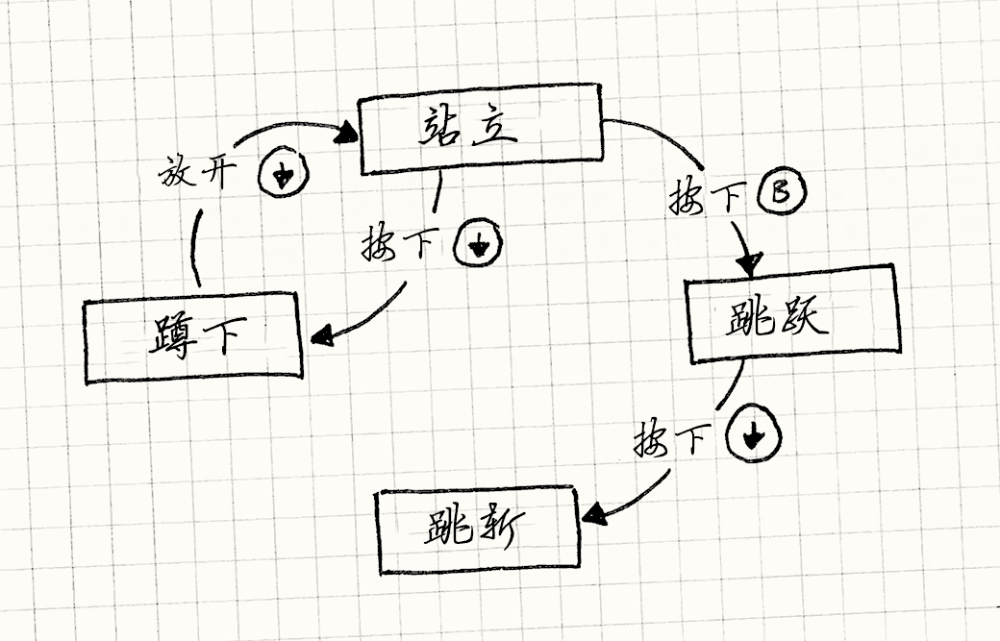
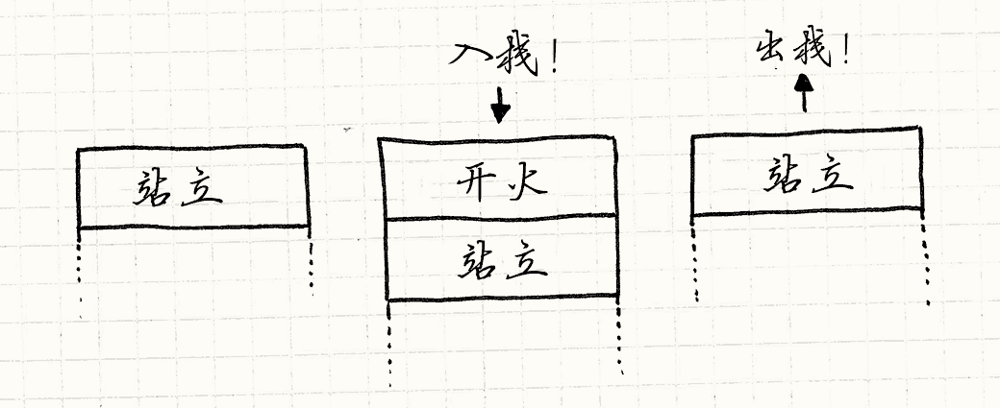

# 状态模式（State）

> **章节**：重访设计模式（Design Patterns Revisited）  
> **原著**：Robert Nystrom (Bob Nystrom) · 《Game Programming Patterns》  
> **导航**：[目录](README.md) ｜ [上一章：单例模式](singleton.md) ｜ [下一章：序列模式](sequencing-patterns.md)

---

忏悔时间：我有点没收住，往这一章里塞了太多东西。
这一章名义上是关于[状态模式](http://en.wikipedia.org/wiki/State_pattern)，
但要聊它和游戏，就绕不开更基础的概念——*有限状态机*（FSMs）。
不过既然都讲到这儿了，我想不如顺带介绍一下*层次状态机*和*下推自动机*。

要讲的内容很多，我会尽量简短，这里的示例代码省略了一些需要你自己补上的细节。
希望它们仍然足够清晰，能让你掌握全貌。


如果你从来没有听说过状态机，不要难过。
虽然AI和编译器圈子里的高手对它很熟悉，但在其他编程圈子里它就没那么出名了。
我认为应该有更多人了解它们，所以在这里我要把它们扔给另一类问题去解决。

> [!NOTE] 旁注
> 这种搭配呼应了人工智能的早期岁月。
> 五六十年代，很多AI研究都聚焦于语言处理。
> 如今编译器用于解析编程语言的许多技术，最初是为解析人类语言而发明的。

## 我们都遇到过

我们正在做一个小小的横版卷轴平台游戏。
现在的任务是实现玩家在游戏世界里操控的女英雄。
这就意味着她需要对玩家的输入做出响应。按B键她应该跳跃。简单实现如下：

```cpp
void Heroine::handleInput(Input input)
{
  if (input == PRESS_B)
  {
    yVelocity_ = JUMP_VELOCITY;
    setGraphics(IMAGE_JUMP);
  }
}
```

看到漏洞了吗？


没有什么能阻止“空中跳跃”——只要在空中狂按B键，她就能一直飘着。
简单的修复是给`Heroine`加一个`isJumping_`布尔字段，用来追踪她是否正在跳跃。然后这样做：

```cpp
void Heroine::handleInput(Input input)
{
  if (input == PRESS_B)
  {
    if (!isJumping_)
    {
      isJumping_ = true;
      // 跳跃……
    }
  }
}
```

> [!NOTE] 旁注
> 这里也应该有在英雄接触到地面时将`isJumping_`设回`false`的代码。
> 为了简洁，我在这里省略了。

接下来，当玩家按下下方向键时，如果角色在地上，我们想要她下蹲，而松开按键时站起来：

```cpp
void Heroine::handleInput(Input input)
{
  if (input == PRESS_B)
  {
    // 如果没在跳跃，就跳起来……
  }
  else if (input == PRESS_DOWN)
  {
    if (!isJumping_)
    {
      setGraphics(IMAGE_DUCK);
    }
  }
  else if (input == RELEASE_DOWN)
  {
    setGraphics(IMAGE_STAND);
  }
}
```

这次看到漏洞了吗？

有了这段代码，玩家可以：

1. 按下键下蹲。
2. 按B从下蹲状态跳起。
3. 在空中放开下键。

英雄会在跳到一半时切换成站立贴图。是时候增加另一个标识了……

```cpp
void Heroine::handleInput(Input input)
{
  if (input == PRESS_B)
  {
    if (!isJumping_ && !isDucking_)
    {
      // 跳跃……
    }
  }
  else if (input == PRESS_DOWN)
  {
    if (!isJumping_)
    {
      isDucking_ = true;
      setGraphics(IMAGE_DUCK);
    }
  }
  else if (input == RELEASE_DOWN)
  {
    if (isDucking_)
    {
      isDucking_ = false;
      setGraphics(IMAGE_STAND);
    }
  }
}
```

下面，如果玩家在跳跃途中按下下方向键，英雄能够做跳斩攻击就太酷了：

```cpp
void Heroine::handleInput(Input input)
{
  if (input == PRESS_B)
  {
    if (!isJumping_ && !isDucking_)
    {
      // 跳跃……
    }
  }
  else if (input == PRESS_DOWN)
  {
    if (!isJumping_)
    {
      isDucking_ = true;
      setGraphics(IMAGE_DUCK);
    }
    else
    {
      isJumping_ = false;
      setGraphics(IMAGE_DIVE);
    }
  }
  else if (input == RELEASE_DOWN)
  {
    if (isDucking_)
    {
      // 站立……
    }
  }
}
```

又到了找漏洞的时间。找到了吗？

我们检查了跳跃时不能空中跳，却没检查速降时也能空中跳。于是又得加一个字段……


我们的做法显然有问题。
每改一次这些代码，就会弄坏点什么。
我们要加的动作还多着呢——连*行走*都还没加呢——但照这个速度，还没做完它就会塌成一堆bug。

> [!NOTE] 旁注
> 那些你崇拜的、看起来永远能写出完美代码的程序员并不是超人。
> 相反，他们对*哪些*代码容易出错有种直觉，并会主动避开。
>
> 复杂分支和可变状态——随时间变化的字段——就是两种易错代码，上面的例子恰好两者都占全了。

## 有限状态机前来救援

一气之下，你把桌上所有东西都扫到一边，只留下纸笔，开始画流程图。
你为英雄每个能做的动作都画了一个盒子：站立、跳跃、下蹲、速降。
当她能在某个状态下响应按键时，你就从那个盒子画出一个箭头，标上那个按键，再连接到她要切换到的状态。



祝贺，你刚刚建好了一个*有限状态机*。
它来自计算机科学中被称为*自动机理论*的分支，这个数据结构家族还包括著名的图灵机。
FSMs是其中最简单的成员。


要点是：

*  **你有一组固定的、状态机可能处于的*状态*。**
    在我们的例子中，是站立，跳跃，下蹲和速降。

*  **状态机同一时间只能处于*一个*状态。**
    英雄不可能同时处于跳跃和站立状态。事实上，防止这点是使用FSM的理由之一。

*  **一连串的*输入*或*事件*被发送给状态机。**
    在我们的例子中，就是按键按下和松开。

*  **每个状态都有*一组转移*，每个转移都与一个输入相关联，并指向另一个状态。**
    当输入到来时，如果它与当前状态的某个转移相匹配，机器就转移到该转移所指向的状态。

    举个例子，在站立状态时，按下下方向键转换为下蹲状态。
    在跳跃时按下下方向键转换为速降。
    如果输入在当前状态没有定义转移，输入就被忽视。

在纯粹的形式上，全部家当就这些：状态、输入和转移。
你可以把它画成一张小流程图。可惜编译器可不认识我们的涂鸦，那要怎么*实现*一个呢？
GoF的状态模式是其中一种方法——我们等会儿会讲到——不过先从更简单的入手吧。

> [!NOTE] 旁注
> 对FSMs我最喜欢的类比是那种老式文字冒险游戏，比如Zork。
> 你有个由屋子组成的世界，屋子彼此通过出口相连。你输入像“去北方”的导航指令探索屋子。
>
> 这其实就是状态机：每个屋子都是一个状态。
> 你现在在的屋子是当前状态。每个屋子的出口是它的转移。
> 导航指令是输入。

## 枚举和分支

`Heroine`类的一个问题是，这些布尔字段的某些组合是不合法的：
`isJumping_`和`isDucking_`永远不该同时为真。
当你有一堆标识、同一时间只有一个为`true`时，这是在提示你真正需要的是`enum`（枚举）。

在这个例子中的`enum`就是FSM的状态的集合，所以让我们这样定义它：

```cpp
enum State
{
  STATE_STANDING,
  STATE_JUMPING,
  STATE_DUCKING,
  STATE_DIVING
};
```

不需要一堆标识，`Heroine`只有一个`state_`字段。
这里我们同时调换了分支的顺序。在前面的代码里，我们先按输入分支，*然后*按状态分支。
这样处理某个按键的代码集中到了一处，却把处理某个状态的代码抹得到处都是。
我们想让处理状态的代码聚在一起，所以先按状态分支。于是就有了：

```cpp
void Heroine::handleInput(Input input)
{
  switch (state_)
  {
    case STATE_STANDING:
      if (input == PRESS_B)
      {
        state_ = STATE_JUMPING;
        yVelocity_ = JUMP_VELOCITY;
        setGraphics(IMAGE_JUMP);
      }
      else if (input == PRESS_DOWN)
      {
        state_ = STATE_DUCKING;
        setGraphics(IMAGE_DUCK);
      }
      break;

    case STATE_JUMPING:
      if (input == PRESS_DOWN)
      {
        state_ = STATE_DIVING;
        setGraphics(IMAGE_DIVE);
      }
      break;

    case STATE_DUCKING:
      if (input == RELEASE_DOWN)
      {
        state_ = STATE_STANDING;
        setGraphics(IMAGE_STAND);
      }
      break;
  }
}

```


这看起来平淡无奇，但相比前面的代码是个实打实的进步。
我们仍有一些条件分支，但把可变状态简化为了单一字段。
处理某个状态的所有代码现在都整齐地归拢到了一处。
这是实现状态机最简单的方法，对某些用途来说已经足够了。

> [!NOTE] 旁注
> 重要的是，英雄不再会处于*不合法*状态。
> 使用布尔标识，很多可能存在的值的组合是不合法的。
> 通过`enum`，每个值都是合法的。

但是，你的问题也许超过了这个解法的能力范围。
假设我们想增加一个动作，英雄可以下蹲一段时间充能，之后释放一次特殊攻击。
当她下蹲时，我们需要追踪充能的持续时间。


我们为`Heroine`添加了`chargeTime_`字段，记录充能的时间长度。
假设我们已经有一个每帧都会调用的`update()`方法。在那里，我们添加：

```cpp
void Heroine::update()
{
  if (state_ == STATE_DUCKING)
  {
    chargeTime_++;
    if (chargeTime_ > MAX_CHARGE)
    {
      superBomb();
    }
  }
}
```

> [!NOTE] 旁注
> 如果你猜这就是[更新方法](update-method.md)模式，恭喜你答对了！

我们需要在她开始下蹲的时候重置计时器，所以我们修改`handleInput()`：

```cpp
void Heroine::handleInput(Input input)
{
  switch (state_)
  {
    case STATE_STANDING:
      if (input == PRESS_DOWN)
      {
        state_ = STATE_DUCKING;
        chargeTime_ = 0;
        setGraphics(IMAGE_DUCK);
      }
      // 处理其他输入……
      break;

      // 其他状态……
  }
}
```

总而言之，为了加入这个充能攻击，我们得修改两个方法，
还要给`Heroine`加一个`chargeTime_`字段，尽管它只在下蹲时才有意义。
我们更希望那些代码和数据都能整齐地打包到一处。对此，GoF早就替我们想好了。

## 状态模式


对于那些深度沉迷于面向对象思维的人来说，每个条件分支都是使用动态分派的机会（在C++中也就是虚方法调用）。
但我觉得，往这个兔子洞里钻得太深就走过头了。有时候一个`if`就足够了。

> [!NOTE] 旁注
> 这是有历史渊源的。
> 许多早期的面向对象布道者，比如《设计模式：可复用面向对象软件的基础》的GoF四人组，以及《重构》的作者Martin Fowler，都来自Smalltalk。
> 在那里，`ifThen:`只是你在条件对象上调用的一个方法，`true`和`false`对象分别以不同的方式实现了它。

但在我们的例子里，已经到了一个临界点，面向对象成了更合适的选择。
这带领我们走向状态模式。GoF这样描述状态模式：

> 允许一个对象在其内部状态发生变化时改变自己的行为，该对象看起来好像修改了它的类

这可没多大帮助。见鬼，我们的`switch`也能做到这一点。
他们描述的具体模式应用到我们的女英雄身上时，看起来是这样的：

### 一个状态接口

首先，我们为状态定义接口。
状态相关的行为——之前用`switch`的每一处——都成为了接口中的虚方法。
在我们的例子中，那是`handleInput()`和`update()`：

```cpp
class HeroineState
{
public:
  virtual ~HeroineState() {}
  virtual void handleInput(Heroine& heroine, Input input) {}
  virtual void update(Heroine& heroine) {}
};
```

### 为每个状态写个类

对于每个状态，我们定义一个类实现接口。它的方法定义了英雄在该状态下的行为。
换言之，从之前的`switch`中取出每个`case`，将它们移动到状态类中。举个例子：

```cpp
class DuckingState : public HeroineState
{
public:
  DuckingState()
  : chargeTime_(0)
  {}

  virtual void handleInput(Heroine& heroine, Input input) {
    if (input == RELEASE_DOWN)
    {
      // 改回站立状态……
      heroine.setGraphics(IMAGE_STAND);
    }
  }

  virtual void update(Heroine& heroine) {
    chargeTime_++;
    if (chargeTime_ > MAX_CHARGE)
    {
      heroine.superBomb();
    }
  }

private:
  int chargeTime_;
};
```

注意我们也将`chargeTime_`移出了`Heroine`，放到了`DuckingState`类中。
这很棒——那部分数据只在这个状态才有意义，现在我们的对象模型显式地反映了这一点。

### 状态委托

接下来，向`Heroine`添加指向当前状态的指针，放弃庞大的`switch`，转向状态委托：


```cpp
class Heroine
{
public:
  virtual void handleInput(Input input)
  {
    state_->handleInput(*this, input);
  }

  virtual void update()
  {
    state_->update(*this);
  }

  // 其他方法……
private:
  HeroineState* state_;
};
```

为了“改变状态”，我们只需要给`state_`赋值，让它指向不同的`HeroineState`对象。
这就是状态模式的全部了。

> [!NOTE] 旁注
> 这看上去有些像[策略](http://en.wikipedia.org/wiki/Strategy_pattern)模式和[类型对象](type-object.md)模式。
> 在三者中，你都有一个主对象委托给下属。区别在于*意图*。
>
> * 在策略模式中，目标是解耦主类和它的部分行为。
> * 在类型对象中，目标是通过*共享*一个对相同类型对象的引用，让一*系列*对象行为相近。
> * 在状态模式中，目标是让主对象通过*改变*委托的对象，来*改变*它的行为。

## 状态对象在哪里？

我在这里略过了一个细节。为了改变状态，我们需要让`state_`指向新的状态，
但那个新状态又是从哪里来的呢？
在`enum`实现里，这压根不用过脑子——`enum`值就像数字一样，是原始类型。
但现在状态变成了类，意味着我们需要一个实际的实例来指向。对此通常有两种做法：

### 静态状态


如果状态对象没有其他数据字段，
那么它存储的唯一数据就是指向虚方法表的指针，用来调用它的方法。
在这种情况下，没理由产生多个实例。毕竟每个实例都完全一样。

> [!NOTE] 旁注
> 如果你的状态没有字段，只有*一个*虚方法，你可以再简化这个模式。
> 将每个状态*类*替换成状态*函数*——只是一个平淡无奇的顶层函数。
> 然后，主类中的`state_`字段变成一个简单的函数指针。

在那种情况下，你可以用一个*静态*实例。
哪怕你有一堆FSM同时在同一状态上运行，它们也都能指向同一实例，因为它没有任何与特定状态机相关的东西。


> [!NOTE] 旁注
> 这是[享元](flyweight.md)模式。

在*哪里*放置静态实例取决于你。找一个合理的地方。
没什么特殊的理由，在这里我将它放在状态基类中。

```cpp
class HeroineState
{
public:
  static StandingState standing;
  static DuckingState ducking;
  static JumpingState jumping;
  static DivingState diving;

  // 其他代码……
};
```

这些静态字段中的每一个都是游戏所用的那个状态的唯一实例。为了让英雄跳跃，站立状态会这样做：

```cpp
if (input == PRESS_B)
{
  heroine.state_ = &HeroineState::jumping;
  heroine.setGraphics(IMAGE_JUMP);
}
```

### 实例化状态

不过有时这一套就行不通。静态状态对下蹲状态不适用。
它有个`chargeTime_`字段，那是与恰好处于下蹲状态的那个英雄具体相关的。
如果游戏里只有一个英雄，这可能碰巧能行，但若要加入双人合作，屏幕上同时出现两个英雄，就会出问题。


在那种情况下，转换时需要创建状态对象。
这让每个FSM都能拥有自己的状态实例。如果我们分配*新*状态，
那意味着我们需要释放*当前的*状态。
这里需要小心，因为触发状态切换的代码位于当前状态的方法中。我们可不想在方法还没返回时就把自己脚下的`this`删掉。

相反，我们允许`HeroineState`中的`handleInput()`选择性地返回一个新状态。
如果它那么做了，`Heroine`会删除旧的，然后换成新的，就像这样：

```cpp
void Heroine::handleInput(Input input)
{
  HeroineState* state = state_->handleInput(*this, input);
  if (state != NULL)
  {
    delete state_;
    state_ = state;
  }
}
```

这样，直到从它的方法返回之后，我们才会删除之前的状态。
现在，站立状态可以通过创建新实例转换为下蹲状态：

```cpp
HeroineState* StandingState::handleInput(Heroine& heroine,
                                         Input input)
{
  if (input == PRESS_DOWN)
  {
    // 其他代码……
    return new DuckingState();
  }

  // 保持这个状态
  return NULL;
}
```

如果可以，我倾向于使用静态状态，因为它们不会在每次状态转换时消耗内存和CPU周期去分配对象。
不过，对于那些更……呃……*有状态*的状态，就得用这种方式了。

> [!NOTE] 旁注
> 当你为状态动态分配内存时，你也许会担心碎片。
> [对象池](object-pool.md)模式可以帮上忙。

## 入口行为和出口行为

状态模式的目标是将状态的行为和数据封装到单一类中。
我们完成了一部分，但是还有一些未了之事。

当英雄改变状态时，我们也改变她的贴图。
现在，那部分代码由她正在切换*离开*的那个状态所拥有。
当她从下蹲转为站立，下蹲状态修改了她的贴图：

```cpp
HeroineState* DuckingState::handleInput(Heroine& heroine,
                                        Input input)
{
  if (input == RELEASE_DOWN)
  {
    heroine.setGraphics(IMAGE_STAND);
    return new StandingState();
  }

  // 其他代码……
}
```

我们想做的是，每个状态控制自己的贴图。这可以通过给状态一个*入口行为*来实现：

```cpp
class StandingState : public HeroineState
{
public:
  virtual void enter(Heroine& heroine)
  {
    heroine.setGraphics(IMAGE_STAND);
  }

  // 其他代码……
};
```

回到`Heroine`中，我们修改处理状态改变的代码，让它在新的状态上调用该方法：

```cpp
void Heroine::handleInput(Input input)
{
  HeroineState* state = state_->handleInput(*this, input);
  if (state != NULL)
  {
    delete state_;
    state_ = state;

    // 调用新状态的入口行为
    state_->enter(*this);
  }
}
```

这让我们将下蹲代码简化为：

```cpp
HeroineState* DuckingState::handleInput(Heroine& heroine,
                                        Input input)
{
  if (input == RELEASE_DOWN)
  {
    return new StandingState();
  }

  // 其他代码……
}
```

它做的所有事情就是转换到站立状态，站立状态控制贴图。
现在我们的状态真正地封装了。
入口行为特别好的一点是，无论你是从哪个状态切换*过来*的，它都会在你进入状态时运行。

大多数真正的状态图都有转为同一状态的多个转移。
举个例子，英雄在跳起或速降落地后也会进入站立状态。
这意味着在每次发生这种转换的地方，我们都要重复一些代码。
入口行为给了我们一个整合这些代码的地方。

当然，我们也可以扩展这个做法，支持*出口行为*。
它就是我们在切换*离开*当前状态、转换到新状态之前调用的方法。

## 有什么猫腻？

我花了这么长时间向你推销FSM，现在却要一把抽走你脚下的地毯。
我前面讲的都是真的，FSM对某些问题确实很合适。但它们最大的优点也正是它们最大的缺点。


状态机通过强制一种非常受限的结构，帮你理清一团乱麻的代码。
你所能拥有的只是一个固定的状态集合、单一的当前状态，以及一些硬编码的转换。

> [!NOTE] 旁注
> 一个有限状态机甚至不是*图灵完全的*。
> 自动机理论用一系列抽象模型来描述计算，每种模型都比前一种更复杂。
> *图灵机* 是其中最具有表现力的模型之一。
>
> “图灵完全”意味着一个系统（通常是编程语言）足以在内部实现一个图灵机，
> 也就意味着，在某种程度上，所有图灵完全的语言具有同样的表现力。
> FSMs不够灵活，并不在其中。

如果你想把状态机用在更复杂的东西上，比如游戏AI，你会一头撞在这个模型的局限上。
幸好，我们的前辈已经找到了一些绕开这些障碍的方法。我会带你了解其中几种，作为本章的收尾。

## 并发状态机

我们决定赋予英雄拿枪的能力。
当她带着家伙时，她还是能做之前所有的事：跑动、跳跃、下蹲，等等。
但她还得能一边做这些一边开火。

如果我们执着于FSM，我们需要*翻倍*现有状态。
对于每个现有状态，我们都需要另一个状态来表示她持枪时做同样的事：站立、持枪站立、跳跃、持枪跳跃，
你知道我的意思了吧。

再多加几种武器，状态数量就会组合爆炸。
不仅状态数量庞大，冗余也极其严重：
持枪和不持枪的状态几乎完全相同，只是多了一点负责射击的代码。


问题在于我们将两种状态绑定到了一个状态机上——她*做的*和她*携带的*。
为了处理所有可能的组合，我们需要为每一*对*组合写一个状态。
修复方法很明显：使用两个单独的状态机。

> [!NOTE] 旁注
> 如果想把她在做什么的*n*个状态、她携带什么的*m*个状态都塞进一个状态机，
> 我们需要*n &times; m*个状态。使用两个状态机，就只有*n + m*个。

我们保留之前记录她在做什么的状态机，不用管它。
然后定义她携带了什么的单独状态机。
`Heroine`将会有*两个*“状态”引用，每个对应一个状态机，就像这样：


```cpp
class Heroine
{
  // 其他代码……

private:
  HeroineState* state_;
  HeroineState* equipment_;
};
```

> [!NOTE] 旁注
> 为了便于说明，她的装备也使用了状态模式。
> 在实践中，由于装备只有两个状态，一个布尔标识就够了。

当英雄把输入委托给状态时，她会把输入交给两个状态：


```cpp
void Heroine::handleInput(Input input)
{
  state_->handleInput(*this, input);
  equipment_->handleInput(*this, input);
}
```

> [!NOTE] 旁注
> 功能更完备的系统也许能让一个状态机*消费掉*输入，这样另一个状态机就不会收到了。
> 这能防止两个状态机错误地同时响应同一个输入。

这样每个状态机都能各自响应输入、产生行为，并独立于另一个状态机改变状态。
当两个状态集合几乎没有联系的时候，它工作得不错。

在实践中，你会发现有些情况下状态之间确实会相互作用。
举个例子，也许她在跳跃时不能开火，或者她在持枪时不能跳斩攻击。
为了处理这种情况，你也许会在一个状态的代码中做一些粗糙的`if`测试，去检查*另一个*状态机的状态来协调它们，
这不是最优雅的解决方案，但这可以搞定工作。

## 分层状态机

再充实一下英雄的行为，她可能会有更多相似的状态。
举个例子，她也许有站立、行走、奔跑和滑铲状态。在这些状态中，按B键会跳跃，按方向下键会下蹲。

如果使用简单的状态机实现，我们必须在每个这样的状态中重复那段代码。
如果我们能够实现一次，在多个状态间重用就好了。


如果这是普通的面向对象代码而不是状态机，在状态间共享代码的一种方式就是继承。
我们可以为“在地面上”定义一个类，处理跳跃和下蹲。
站立、行走、奔跑和滑铲都从它继承，然后增加各自的附加行为。

> [!NOTE] 旁注
> 它的影响有好有坏。
> 继承是代码重用的强大工具，但也会在两块代码之间建立非常强的耦合。
> 这是把大锤子，挥动时要小心。

你会发现，这是个被称为*分层状态机*的通用结构。
状态可以有*父状态*（这让它变为*子状态*）。
当一个事件进来，如果子状态没有处理，它就会交给链上的父状态。
换言之，它就像覆写继承的方法那样运作。

事实上，如果我们使用状态模式实现FSM，我们可以使用继承来实现层次。
定义一个基类作为父状态：

```cpp
class OnGroundState : public HeroineState
{
public:
  virtual void handleInput(Heroine& heroine, Input input)
  {
    if (input == PRESS_B)
    {
      // 跳跃……
    }
    else if (input == PRESS_DOWN)
    {
      // 俯卧……
    }
  }
};
```

每个子状态继承它：

```cpp
class DuckingState : public OnGroundState
{
public:
  virtual void handleInput(Heroine& heroine, Input input)
  {
    if (input == RELEASE_DOWN)
    {
      // 站起……
    }
    else
    {
      // 没有处理输入，返回上一层
      OnGroundState::handleInput(heroine, input);
    }
  }
};
```

当然，这不是实现层次结构的唯一方法。
如果你没用GoF的状态模式，这一招就行不通。
相反，你可以不用主类里的单一状态，而是用一个状态*栈*来显式地表示当前状态的父状态链。

栈顶的状态是当前状态，在它下面是它的直接父状态，
然后是*那个*父状态的父状态，以此类推。
当你需要状态的特定行为，你从栈的顶端开始，
然后向下寻找，直到某一个状态处理了它。（如果到底也没找到，就无视它。）

## 下推自动机

还有一种有限状态机的扩展也用了状态栈。
容易混淆的是，这里的栈表示的是完全不同的事物，被用于解决不同的问题。

要解决的问题是有限状态机没有任何*历史*的概念。
你记得*正在*什么状态中，但是不记得*曾在*什么状态。
没有简单的办法重回上一状态。


举个例子：早先，我们让无畏的女英雄武装到了牙齿。
当她开火时，我们需要新状态播放开火动画，发射子弹，产生视觉效果。
所以我们拼凑了一个`FiringState`，并让她能开火的所有状态在按下开火按钮时都转移到这个状态。

> [!NOTE] 旁注
> 这个行为在多个状态间重复，也许是用层次状态机重用代码的好地方。

问题在于她射击*后*转换到的状态。
她可以在站立、奔跑、跳跃、下蹲时开上一枪。
当射击结束，应该转换为她之前的状态。

如果我们坚持使用普通的FSM，我们早就忘了她之前处在什么状态。
为了追踪之前的状态，我们得定义一大堆几乎完全一样的状态——站立开火、奔跑开火、跳跃开火，诸如此类——
就为了让每个状态都能在结束时硬编码地转回正确的状态。

我们真正想要的是一种方法，能*存储*她开火前所处的状态，之后还能*取回*它。
自动机理论又一次能帮上忙了，相关的数据结构被称为[*下推自动机*](http://en.wikipedia.org/wiki/Pushdown_automaton)。

有限状态机只有*一个*指向状态的指针，下推自动机则有*一个状态指针栈*。
在FSM中，新状态*代替*了之前的那个状态。
下推自动机不仅能完成那个，还能给你两个额外操作：

1. 你可以将新状态*压入*栈中。“当前的”状态总是在栈顶，所以这会转移到新状态。
  但它让之前的状态待在栈中而不是销毁它。

2. 你可以*弹出*最上面的状态。这个状态会被销毁，它下面的状态成为新的当前状态。



这正是我们开火时需要的。我们创建*单一的*开火状态。
当开火按钮在其他状态按下时，我们*压入*开火状态。
当开火动画结束，我们*弹出*开火状态，然后下推自动机自动转回之前的状态。

## 所以它们有多有用呢？

即使给状态机加上这些常见的扩展，它们仍然相当受限。
如今游戏AI的趋势更偏向于*[行为树][]*和*[规划系统][]* 这类激动人心的东西。
如果你关注复杂AI，这一整章只是为了勾起你的食欲。
你需要阅读其他书来满足你的欲望。

[行为树]: http://web.archive.org/web/20140402204854/http://www.altdevblogaday.com/2011/02/24/introduction-to-behavior-trees/
[规划系统]: http://web.media.mit.edu/~jorkin/goap.html

这不意味着有限状态机、下推自动机和其他简单系统就没用了。
对某些类型的问题来说，它们是很好的建模工具。有限状态机在以下情况有用：

*  你有一个实体，它的行为会根据某个内部状态而改变。
*  状态可以被严格地分割为相对较少的、互不相同的选项。
*  实体响应一系列输入或事件。

在游戏中，状态机最出名的是用于AI，但它也常用于其他领域，
比如实现玩家输入处理、菜单界面导航、文本解析、网络协议以及其他异步行为。

---

> **导航**：[目录](README.md) ｜ [上一章：单例模式](singleton.md) ｜ [下一章：序列模式](sequencing-patterns.md)
