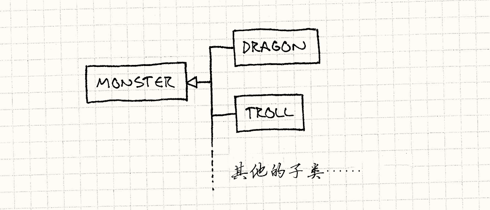
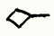

# 类型对象（Type Object）

> **章节**：行为模式（Behavioral Patterns）  
> **原著**：Robert Nystrom (Bob Nystrom) · 《Game Programming Patterns》  
> **导航**：[目录](README.md) ｜ [上一章：子类沙箱](subclass-sandbox.md) ｜ [下一章：解耦模式](decoupling-patterns.md)

---

## 意图

*通过创建一个类，让它的每个实例代表一种不同的对象类型，从而灵活地创建新的“类”。*

## 动机

想象我们在制作一个奇幻RPG游戏。
我们的任务是为成群结队、一心想干掉我们勇敢英雄的凶残怪物编写代码。
怪物有很多属性：生命值、攻击、图像、声音，等等。
但为了举例，我们只关注前两个。

游戏中的每个怪物都有一个当前生命值。
一开始是满的，每次怪物受伤就会减少。
怪物还有一个攻击字符串。
当怪物攻击我们的英雄时，这段文本会以某种方式展示给用户。
（我们这里不关心怎么展示。）

设计者告诉我们，怪物分为不同的*品种*，比如“龙”或“巨魔”。
每个品种描述游戏中存在的一*种*怪物，同一品种的多个怪物可能同时在地牢中游荡。

品种决定了怪物的初始生命值——龙的初始生命值比巨魔高，因此更难被杀死。
它还决定了攻击字符串——同一品种的所有怪物都用相同的方式攻击。

### 典型的面向对象方案


带着这样的游戏设计，我们打开文本编辑器开始写代码。
根据设计，龙是怪物的一种，巨魔是另一种，其他品种以此类推。
用面向对象的方式思考，这引导我们创建`Monster`基类。

> [!NOTE] 旁注
> 这就是所谓的“is-a”（“是一个”）关系。
> 在传统OOP思路中，既然龙“是一个”怪物，我们就把`Dragon`建模成`Monster`的子类。
> 正如我们将看到的，子类化只是将这类概念关系固化进代码的方式之一。

```cpp
class Monster
{
public:
  virtual ~Monster() {}
  virtual const char* getAttack() = 0;

protected:
  Monster(int startingHealth)
  : health_(startingHealth)
  {}

private:
  int health_; // 当前血值
};
```

在怪物攻击英雄时，公开的`getAttack()`函数让战斗代码能获得需要显示的字符串。
每个派生的品种类都会重写它，以提供不同的消息。

构造函数是protected的，接收怪物的初始生命值。
每个品种的派生类会提供自己的公有构造函数，它们调用这个构造函数，并传入适合该品种的初始生命值。

现在让我们看看两个品种子类：


```cpp
class Dragon : public Monster
{
public:
  Dragon() : Monster(230) {}

  virtual const char* getAttack()
  {
    return "The dragon breathes fire!";
  }
};

class Troll : public Monster
{
public:
  Troll() : Monster(48) {}

  virtual const char* getAttack()
  {
    return "The troll clubs you!";
  }
};
```

> [!NOTE] 旁注
> 感叹号让所有事情都更刺激！

每个从`Monster`派生出来的类都传入起始生命值，并重写`getAttack()`返回那个品种的攻击字符串。
一切如预期般运行，不久以后，我们的英雄就可以跑来跑去杀死各种怪物了。
我们继续飞快地写着代码，不知不觉就有了几十个怪物子类，从酸性史莱姆到僵尸山羊。

然后，说来也怪，事情开始陷入泥沼。
设计者最终想要*几百个*品种，而我们发现自己把所有时间都花在了编写这些只有七行长的子类和重新编译上。
事情变得更糟——设计者想要开始调整我们已经写好的品种。我们原本高效的工作日退化成了：

1. 收到设计者的邮件，要求把巨魔的血量从48改到52。
2. 签出并修改`Troll.h`。
3. 重新编译游戏。
4. 签入修改。
5. 回复邮件。
6. 重复。

我们沮丧地度过了一天，因为我们沦为了填数据的猴子。
设计者也感到挫败，因为调一个简单的数值都要等上老半天。
我们需要的是无需每次重新编译整个游戏就能修改品种属性的能力。
如果设计者创建和调整品种时无需*任何*程序员的介入，那就更好了。

### 为类型建类

从较高的层次看，我们要解决的问题非常简单。
游戏中有很多不同的怪物，我们想在它们之间共享某些属性。
一大群怪物正围着英雄拳打脚踢，我们想让其中一些使用相同的攻击文本。
我们通过声明所有这些怪物属于同一“品种”，且品种决定了攻击字符串，来定义这一点。

由于这与我们对“类”的直觉一致，我们决定用继承来实现这个概念。
龙是怪物，游戏中的每条龙都是这个龙“类”的实例。
把每个品种定义为抽象基类`Monster`的子类，并让游戏中的每个怪物都是对应的派生品种类的实例，正好映射了这一点。最终的类层次是这样的：




> [!NOTE] 旁注
> 这里的意为“从……继承”。

游戏中的每个怪物实例都属于某个派生的怪物类型。
我们拥有的品种越多，类层次就越庞大。
这当然是问题所在：添加新品种就意味着添加新代码，而且每个品种都必须作为它自己的类型编译进来。

这可行，但不是唯一的选项。
我们也可以重构代码让每个怪物*有*品种。
不是让每个品种继承`Monster`，我们现在有单一的`Monster`类和`Breed`类。


> [!NOTE] 旁注
> 这里意为“被……引用”。

就这么简单，两个类。注意这里完全没有继承。
通过这个系统，游戏中的每个怪物都只是`Monster`类的一个实例。
`Breed`类包含了同一品种的所有怪物之间共享的信息：起始生命值和攻击字符串。

为了将怪物与品种关联起来，我们给每个`Monster`实例一个指向`Breed`对象的引用，该对象包含该品种的信息。
为了获得攻击字符串，怪物只需调用其品种上的方法。
`Breed`类本质上定义了一个怪物的“类型”。每个品种实例都是一个*对象*，代表一种不同的概念上的*类型*，因此这个模式叫做类型对象。

这个模式尤其强大的地方在于，我们现在可以定义新的事物*类型*，而完全不会让代码库变得更复杂。
我们实质上把类型系统的一部分从硬编码的类层次中抽离出来，放进了可以在运行时定义的数据里。

我们可以通过用不同的值实例化更多`Breed`实例来创建数百种不同的品种。
如果我们通过从某个配置文件中读取数据来初始化品种，我们就有能力完全靠数据定义新类型的怪物。
如此简单，设计者也能做到！

## 模式

定义**类型对象**类和**有类型的对象**类。每个类型对象实例代表一种不同的逻辑类型。
每个有类型的对象保存**对描述它类型的类型对象的引用**。

实例相关的数据存储在有类型对象的实例中，而应该在同一个概念类型的所有实例之间共享的数据或行为存储在类型对象中。
引用同一类型对象的对象会表现得像同一类型一样。
这让我们能在一组相似的对象之间共享数据和行为，就像子类化让我们做的那样，但不需要一组固定的硬编码子类。

## 何时使用

在任何你需要定义多种不同的“种”事物，但把这些“种”固化到你所用语言的类型系统中又太过死板的时候，这个模式都很有用。尤其是当以下任一条件成立时：

* 你不知道将来会需要什么类型。（例如，如果我们的游戏需要支持下载包含新怪物品种的内容呢？）

* 你希望能修改或添加新类型，而无需重新编译或修改代码。

## 记住

这个模式是把“类型”的定义从命令式但僵硬的代码语言世界，搬到内存中对象的世界——那里更灵活，但行为也更少。
灵活性很好，但把类型提升为数据会让你失去一些东西。

### 需要手动追踪类型对象


使用像C++的类型系统这种东西的好处之一，就是编译器会自动处理类的所有簿记工作。
定义每个类的数据会被自动编译进可执行文件的静态内存段，然后直接就能工作。

使用类型对象模式后，我们现在不仅要负责管理内存中的怪物，还要管理它们的*类型*——
我们必须确保，只要我们的怪物还需要它们，所有品种对象就都被实例化并保留在内存中。
每当我们创建新怪物时，都有责任确保它被正确地初始化，带有一个指向有效品种的引用。

我们从编译器的一些限制中解放了自己，但代价是必须重新实现它以前为我们做的一些事情。

> [!NOTE] 旁注
> 在底层，C++的虚方法是使用一种叫做“虚函数表”（简称“vtable”）的东西实现的。
> 虚函数表是个简单的`struct`，包含一组函数指针，每个对应类中的一个虚方法。
> 内存中每个类都有一个虚函数表。每个类的实例都有一个指向它所属类的虚函数表的指针。
>
> 当你调用虚函数时，代码首先查找该对象对应的虚函数表，然后调用表中相应函数指针所存储的函数。
>
> 听起来很熟悉？虚函数表就是我们的品种对象，而指向虚函数表的指针就是怪物所持有的指向其品种的那个引用。
> C++类就是把类型对象模式应用在C上的结果，由编译器自动处理。

### 更难为每种类型定义*行为*

使用子类派生，你可以重写方法，然后做任何你想做的事——用程序计算值，调用其他代码，等等。
天空才是极限。如果我们想的话，可以定义一个怪物子类，让它的攻击字符串根据月相变化。（我猜，这对狼人来说倒是挺方便。）

当我们使用类型对象模式时，我们把被重写的方法替换成了成员变量。
不再让怪物子类重写方法，用不同的*代码*来*计算*攻击字符串，而是让品种对象在不同的*变量*中*存储*攻击字符串。

这让使用类型对象定义类型特定的*数据*变得很容易，但定义类型特定的*行为*变得困难。
例如，如果不同品种的怪物需要使用不同的AI算法，使用这个模式就变得更具挑战性。


有几种方法可以让我们绕开这个限制。
一个简单的办法是准备一组固定的预定义行为，然后用类型对象中的数据简单地*选择*其中一个。
例如，假设我们的怪物AI永远是“站着不动”、“追逐英雄”或“恐惧地呜咽颤抖”（嘿，它们不可能都是强大的龙）。
我们可以定义函数来实现每种行为。
然后，我们可以让品种存储指向合适函数的指针，从而将AI算法与品种关联起来。

> [!NOTE] 旁注
> 听起来又很熟悉？这下我们又回到在*我们的*类型对象里真正实现虚函数表了。


另一个更强大的解决方案是真正支持完全在数据中定义行为。
[解释器](http://c2.com/cgi-bin/wiki?InterpreterPattern)模式和[字节码](bytecode.md)模式都能让我们构建代表行为的对象。
如果我们读取数据文件，并用它来为其中一种模式创建数据结构，我们就把行为的定义完全从代码中移出，放进了内容里。

> [!NOTE] 旁注
> 随着时间推移，游戏越来越多地由数据驱动。
> 硬件变得更强大，而我们发现自己受限制的更多是能创作多少内容，而不是能把硬件压榨到多狠。
> 在64K卡带的时代，挑战是把游戏*塞进*卡带里。
> 而在双面DVD的时代，挑战是用游戏*填满*它。
>
> 脚本语言和其他定义游戏行为的更高层方式能给我们带来急需的生产力提升，代价是运行时性能不那么理想。
> 由于硬件一直在变强，而我们的大脑却没有，这种取舍也就越来越说得通了。

## 示例代码

在第一遍实现中，让我们从简单的开始，只构建动机一节中描述的基础系统。
我们从`Breed`类开始：

```cpp
class Breed
{
public:
  Breed(int health, const char* attack)
  : health_(health),
    attack_(attack)
  {}

  int getHealth() { return health_; }
  const char* getAttack() { return attack_; }

private:
  int health_; // 初始血值
  const char* attack_;
};
```

很简单。它基本上只是两个数据字段的容器：起始生命值和攻击字符串。
让我们看看怪物怎么使用它：

```cpp
class Monster
{
public:
  Monster(Breed& breed)
  : health_(breed.getHealth()),
    breed_(breed)
  {}

  const char* getAttack()
  {
    return breed_.getAttack();
  }

private:
  int    health_; // 当前血值
  Breed& breed_;
};
```

当我们构造怪物时，我们给它一个指向品种对象的引用。
这定义了怪物的品种，取代了之前使用的子类。
在构造函数中，`Monster`使用品种来决定其起始生命值。
为了获得攻击字符串，怪物只需把调用转发给它的品种。

这段非常简单的代码就是这个模式的核心思想。从这里再往后的一切，都算是白赚的。

### 让类型对象更像类型：构造器

按照现在的方式，我们直接构造怪物，并负责传入它的品种。
这与大多数OOP语言中普通对象的实例化方式有点反过来了——我们通常不会先分配一块空白内存，然后再*赋予*它所属的类。
相反，我们在类本身上调用构造函数，它负责给我们一个新实例。


我们可以在类型对象上应用同样的模式。

```cpp
class Breed
{
public:
  Monster* newMonster() { return new Monster(*this); }

  // Previous Breed code...
};
```

> [!NOTE] 旁注
> “模式”一词用在这里正合适。我们讨论的是《设计模式：可复用面向对象软件的基础》中的经典模式之一：[工厂方法](http://c2.com/cgi/wiki?FactoryMethodPattern)。
>
> 在一些语言中，这个模式被用来构造*所有*的对象。
> 在Ruby，Smalltalk，Objective-C以及其他类是对象的语言中，你通过在类对象本身上调用方法来构建实例。

以及那个使用它们的类：

```cpp
class Monster
{
  friend class Breed;

public:
  const char* getAttack() { return breed_.getAttack(); }

private:
  Monster(Breed& breed)
  : health_(breed.getHealth()),
    breed_(breed)
  {}

  int health_; // 当前血值
  Breed& breed_;
};
```


关键的区别在于`Breed`中的`newMonster()`函数。
这是我们的“构造器”工厂方法。使用我们原先的实现，创建怪物看起来像：

> [!NOTE] 旁注
> 这里还有一个小小的不同。
> 因为示例代码是用C++写的，我们可以使用一个方便的小特性：*友元类*。
>
> 我们让`Monster`的构造函数成为私有，防止任何人直接调用它。
> 友元类绕过了这个限制，`Breed`仍能访问它。
> 这意味着创建怪物的*唯一*方法是通过`newMonster()`。

```cpp
Monster* monster = new Monster(someBreed);
```

在我们改动后，它看上去是这样：

```cpp
Monster* monster = someBreed.newMonster();
```

所以，为什么这么做？创建一个对象分为两步：内存分配和初始化。
`Monster`的构造函数让我们做完了所有需要的初始化。
在我们的例子中，那只是存储品种；但在完整的游戏中，还需要加载图形、初始化怪物AI以及做其他设置工作。

但是，那一切都发生在内存分配*之后*。
在构造函数被调用之前，我们已经有一块可以放入怪物的内存。
在游戏中，我们通常也想控制对象创建的这一方面：
我们通常会使用自定义分配器或[对象池](object-pool.md)模式来控制对象最终位于内存中的什么位置。

在`Breed`中定义“构造器”函数，给了我们放置这些逻辑的地方。
`newMonster()`函数不再简单地调用`new`，它可以在把控制权交给`Monster`进行初始化之前，从池或自定义堆中获取内存。
通过把这段逻辑放进`Breed`中这个唯一有能力创建怪物的函数里，我们确保所有怪物都经过我们想要的内存管理方案。

### 通过继承共享数据

我们现在已经实现了一个完全可用的类型对象系统，但它非常基础。
我们的游戏最终会有*数百*种不同的品种，每种都有几十个属性。
如果设计者想要调整全部三十种不同的巨魔品种，让它们变得强壮一点，她将面对大量繁琐的数据录入工作。

能帮上忙的是在多个*品种*之间共享属性的能力，正如品种让我们在多个*怪物*之间共享属性一样。
就像我们之前的OOP方案那样，我们可以用继承来解决这个问题。
只是这一次，我们不再使用语言的继承机制，而是在类型对象内部自己实现它。

简单起见，我们只支持单继承。
就像类可以有一个父类，我们允许品种有一个父品种：

```cpp
class Breed
{
public:
  Breed(Breed* parent, int health, const char* attack)
  : parent_(parent),
    health_(health),
    attack_(attack)
  {}

  int         getHealth();
  const char* getAttack();

private:
  Breed*      parent_;
  int         health_; // 初始血值
  const char* attack_;
};
```

当我们构造一个品种时，我们给它一个它要继承的父品种。
对于没有祖先的基础品种，我们可以传入`NULL`。

为了让这变得有用，子品种需要控制哪些属性从父品种继承，哪些属性由自己重写并指定。
在我们的示例系统中，我们说品种通过一个非零值来重写怪物的生命值，通过一个非`NULL`字符串来重写攻击。
否则，属性就会从父品种继承。

实现方式有两种。
一种是每次属性被请求时动态处理委托，就像这样：

```cpp
int Breed::getHealth()
{
  // 重载
  if (health_ != 0 || parent_ == NULL) return health_;

  // 继承
  return parent_->getHealth();
}

const char* Breed::getAttack()
{
  // 重载
  if (attack_ != NULL || parent_ == NULL) return attack_;

  // 继承
  return parent_->getAttack();
}
```

这样做的好处是：如果品种在运行时被修改为不再重写或不再继承某个属性，它也能正确地处理。
另一方面，它要多占用一些内存（它必须保留一个指向父品种的指针），而且更慢。
每次查找属性时，它都必须沿着继承链向上回溯。

如果我们能保证品种的属性不会改变，一个更快的解决方案是在*构造时*应用继承。
这被称为“向下复制”委托，因为我们在创建派生类型时，把继承来的属性*向下复制*进去。它看上去是这样的：

```cpp
Breed(Breed* parent, int health, const char* attack)
: health_(health),
  attack_(attack)
{
  // 继承没有重载的属性
  if (parent != NULL)
  {
    if (health == 0) health_ = parent->getHealth();
    if (attack == NULL) attack_ = parent->getAttack();
  }
}
```

注意，现在我们不再需要指向父品种的字段了。
一旦构造函数完成，我们就可以忘掉父品种，因为我们已经把它的所有属性都复制了进来。
为了访问品种的属性，现在我们只需直接返回字段：

```cpp
int         getHealth() { return health_; }
const char* getAttack() { return attack_; }
```

又好又快！

假设我们的游戏引擎通过加载一个定义品种的JSON文件来创建这些品种。它看上去是这样的：

    ```json
    ```
    {
      "Troll": {
        "health": 25,
        "attack": "The troll hits you!"
      },
      "Troll Archer": {
        "parent": "Troll",
        "health": 0,
        "attack": "The troll archer fires an arrow!"
      },
      "Troll Wizard": {
        "parent": "Troll",
        "health": 0,
        "attack": "The troll wizard casts a spell on you!"
      }
    }
    
我们会有一段代码，读取每个品种条目，并用其数据实例化新的品种实例。
正如你从`"parent": "Troll"`字段中看到的，`Troll Archer`和`Troll Wizard`品种都继承自基础`Troll`品种。

由于这两个品种的生命值都是0，所以它们会从基础`Troll`品种继承该值。
这意味着现在我们的设计者只需调整`Troll`的生命值，三个品种就都会被更新。
随着品种数量以及每个品种属性数量的增加，这能节省大量时间。
现在，通过一小块代码，我们有了一个开放的系统，把控制权交到设计者手中，并充分利用他们的时间。
与此同时，我们可以回去编写其他功能了。

## 设计决策

类型对象模式让我们建立类型系统，就好像在设计自己的编程语言。
设计空间是开放的，我们可以做很多有趣的事情。

在实践中，有一些因素会抑制我们的奇思妙想。
时间和可维护性会阻止我们做出特别复杂的设计。
更重要的是，无论我们设计出什么样的类型对象系统，用户（通常不是程序员）都要能轻松地理解它。
我们把它做得越简单，它就越有用。
所以我们在这里要讨论的是已被反复探索的设计空间，而把遥远的边界留给学者和探索者。

### 类型对象是封装的还是暴露的？

在我们的示例实现中，`Monster`有一个对品种的引用，但它没有公开暴露这个引用。
外部代码不能直接获取怪物的品种。
从代码库的角度看，怪物本质上没有类型，它们拥有品种这一事实只是一个实现细节。

我们可以很容易地改变这点，让`Monster`返回它的`Breed`：


```cpp
class Monster
{
public:
  Breed& getBreed() { return breed_; }

  // 当前的代码……
};
```

> [!NOTE] 旁注
> 与本书中的其他示例一样，我们遵循一个惯例：返回对象的引用而不是指针，向用户表明永远不会返回`NULL`。

这样做改变了`Monster`的设计。
所有怪物都拥有品种这一事实现在成了其API中公开可见的一部分。两种选择各有好处：

* **如果类型对象是封装的：**

    * *类型对象模式的复杂性对代码库的其他部分是隐藏的。*
      它成为了只有有类型的对象才需要考虑的实现细节。

    * *有类型的对象可以选择性地重写来自类型对象的行为*。
      假设我们想要怪物在濒临死亡时改变它的攻击字符串。
      由于攻击字符串总是通过`Monster`访问的，我们有一个方便的地方放置这段代码：

        ```cpp
        const char* Monster::getAttack()
        {
          if (health_ < LOW_HEALTH)
          {
            return "The monster flails weakly.";
          }

          return breed_.getAttack();
        }
        ```

        如果外部代码直接调用品种的`getAttack()`，我们就没有机会能插入逻辑。

    * *我们得为类型对象暴露的每一样东西编写转发方法。*
      这是这个设计繁琐的地方。如果类型对象类有大量方法，对象类就不得不为每一个我们想要公开可见的方法都拥有自己的方法。

* **如果类型对象是暴露的：**

    * *外部代码可以在没有有类型类实例的情况下直接与类型对象交互。*
      如果类型对象是封装的，那么除非有一个包裹它的有类型对象，否则没法使用它。
      例如，这会阻止我们使用构造器模式——即通过在品种上调用方法来创建新怪物。
      如果用户不能直接拿到品种，他们就没办法调用它。

    * *类型对象现在是对象公共API的一部分了。*
      大体上，窄接口比宽接口更容易维护——你暴露给代码库其他部分的东西越少，需要处理的复杂度和维护工作就越少。
      通过暴露类型对象，我们扩大了对象的API，使其包含类型对象提供的所有东西。

### 有类型的对象是如何创建的？

使用这个模式，每个“对象”现在都是一对对象：主对象和它所使用的类型对象。
那么我们如何把这两者创建并绑定在一起呢？

* **构造对象然后传入类型对象：**

    *  *外部代码可以控制分配。*
      由于调用代码自己构造两个对象，它可以控制这发生在内存中的什么位置。
      如果我们希望对象能用于各种不同的内存场景（不同的分配器、在栈上，等等），这给了我们这样做的灵活性。

* **在类型对象上调用“构造器”函数：**

    * *类型对象控制内存分配。*
      这是硬币的另一面。如果我们*不想*让用户选择对象在内存中的创建位置，
      要求他们通过类型对象上的工厂方法，我们就能控制这一点。
      如果我们想确保所有对象都来自某个[对象池](object-pool.md)或其他内存分配器，这也很有用。

### 能改变类型吗？

到目前为止，我们假设一旦对象创建并绑定到它的类型对象上，这种绑定就永远不会改变。
对象创建时的类型就是它死亡时的类型。这并非严格必需。
我们*可以*允许对象随着时间改变它的类型。

让我们回头看看我们的例子。
当怪物死亡时，设计者告诉我们，有时他们希望它的尸体变成一具复活的僵尸。
我们可以通过在怪物死亡时生成一个带有僵尸品种的新怪物来实现，但另一个选项是直接拿到现有怪物，把它的品种改成僵尸品种。

* **如果类型不改变：**

    *  *编写和理解起来都更简单。*
      在概念上，大多数人大概都不会期望“类型”会改变。这就把这一假设固化了下来。

    *  *更容易调试。*
      如果我们试图追踪一个怪物进入某种奇怪状态的bug，那么能假定我们现在看到的品种就是怪物一直以来的品种，可以大大简化工作。

* **如果类型可以改变：**

    * *需要创建的对象更少。*
      在我们的例子中，如果类型不能改变，我们就被迫耗费CPU周期创建一个新的僵尸怪物，
      把原怪物中需要保留的属性都拷贝过来，然后再删除它。
      如果我们可以改变类型，所有这些工作就被一次简单的赋值取代。

    * *我们需要小心确保假设成立。*
      对象和它的类型之间有着相当紧密的耦合。
      例如，一个品种可能假设怪物*当前的*生命值永远不会高于来自该品种的起始生命值。

        如果我们允许品种改变，就需要确保现有对象满足新类型的要求。
        当我们改变类型时，可能还需要执行一些验证代码，确保对象现在处于对新类型有意义的状态。

### 它支持何种继承？

* **没有继承：**

    * *简单。*
       最简单的通常是最好的。如果你在类型对象间没有大量数据共享，为什么要为难自己呢？

    * *这会带来重复的工作。*
      我从未见过哪个创作系统中设计者*不*想要某种继承的。
      当你有五十种不同的精灵时，要调整它们的生命值就得在五十个地方改同一个数字，真是糟透了。

* **单继承：**

    *  *仍然相对简单。*
      它易于实现，但更重要的是，它也相当容易理解。如果非技术用户要使用这个系统，活动部件越少越好。
      这就是很多编程语言只支持单继承的原因。它似乎正处在能力与简洁之间的最佳平衡点上。

    *  *查找属性更慢。*
      为了从类型对象中获取某块数据，我们可能需要在继承链上向上回溯，找到最终决定该值的那个类型。
      在性能关键的代码中，我们可能不想把时间花在这上面。

*  **多重继承：**

    * *几乎可以避免所有数据重复。*
      使用一个良好的多重继承系统，用户可以为类型对象建立几乎没有冗余的层次。
      到了调整数值的时候，我们可以避免大量的复制粘贴。

    * *复杂。*
      不幸的是，它的好处似乎更多是理论上的而非实际上的。多重继承难以理解和推理。

        如果我们的僵尸龙类型同时继承自僵尸和龙，哪些属性来自僵尸，哪些来自龙？
        为了使用系统，用户需要理解继承图是如何遍历的，还要有设计出合理层次的远见。

        我今天看到的大多数C++编码标准都倾向于禁止多重继承，Java和C#则完全没有它。
        这承认了一个令人悲伤的事实：它太难做对了，所以通常最好完全不用。
        虽然值得考虑，但你很少会想为游戏中的类型对象使用多重继承。和往常一样，越简单越好。

## 参见

* 这个模式解决的高层问题是在多个对象之间共享数据和行为。
  另一个用不同方式解决相同问题的模式是[原型](prototype.md)模式。

* 类型对象是[享元](flyweight.md)模式的近亲。
  两者都让你在实例之间共享数据。使用享元时，意图是节省内存，而共享的数据可能并不代表对象任何概念上的“类型”。
  使用类型对象模式时，重点在于组织和灵活性。

* 这个模式和[状态](state.md)模式有很多相似之处。
  两者都让对象把定义自身的部分内容委托给另一个对象。
  通过类型对象，我们通常委托的是对象*是*什么：宽泛地描述对象的不变数据。
  通过状态，我们委托的是对象*现在是什么*：描述对象当前配置的临时数据。

    当我们讨论让对象改变它的类型时，你可以把它看作让类型对象同时兼任状态模式。

---

> **导航**：[目录](README.md) ｜ [上一章：子类沙箱](subclass-sandbox.md) ｜ [下一章：解耦模式](decoupling-patterns.md)
