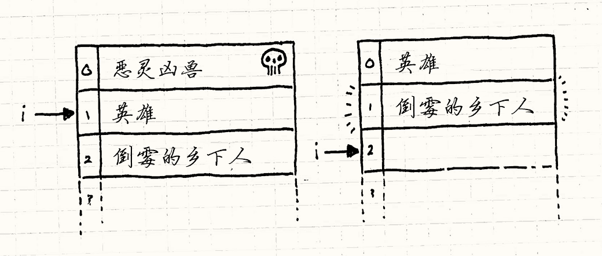
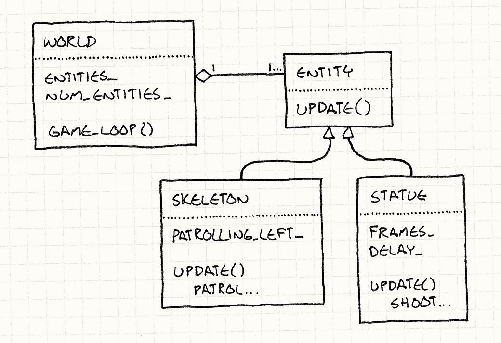

# 更新方法（Update Method）

> **章节**：序列模式（Sequencing Patterns）  
> **原著**：Robert Nystrom (Bob Nystrom) · 《Game Programming Patterns》  
> **导航**：[目录](README.md) ｜ [上一章：游戏循环](game-loop.md) ｜ [下一章：行为模式](behavioral-patterns.md)

---

## 意图

*让每个对象一次处理一帧的行为，从而模拟一群独立对象。*

## 动机

玩家强大的女武神正在执行一项任务：从早已死去的巫王的尸骨上偷走华丽的珠宝。
她小心翼翼地靠近那座华丽地宫的入口，攻击她的是……*什么也没有*。
没有诅咒雕像向她发射闪电，没有不死战士巡逻入口。
她直捣黄龙，拿走了珠宝。游戏结束。你赢了。

好吧，这可不行。


地宫需要守卫——一些英雄可以杀死的敌人。
首先，我们需要一个复活的骷髅战士在门口来回巡逻。
如果无视任何关于游戏编程的知识，
让骷髅蹒跚着来回移动的最简单的代码大概是这样的：

> [!NOTE] 旁注
> 如果巫王想要更聪明的行为，他应该复活一些还有脑组织的东西。

```cpp
while (true)
{
  // 向右巡逻
  for (double x = 0; x < 100; x++)
  {
    skeleton.setX(x);
  }

  // 向左巡逻
  for (double x = 100; x > 0; x--)
  {
    skeleton.setX(x);
  }
}
```

这里的问题当然是，骷髅来回移动，可玩家永远看不到。
程序被困在一个无限循环里，那实在算不上有趣的游戏体验。
我们真正想要的是让骷髅*每帧*移动一步。


我们得移除这些循环，依赖外层游戏循环来迭代。
这保证了在守卫来回巡逻时，游戏能响应玩家的输入并进行渲染。如下：

> [!NOTE] 旁注
> 当然，[游戏循环](game-loop.md)是本书中的另一个模式。

```cpp
Entity skeleton;
bool patrollingLeft = false;
double x = 0;

// 游戏主循环
while (true)
{
  if (patrollingLeft)
  {
    x--;
    if (x == 0) patrollingLeft = false;
  }
  else
  {
    x++;
    if (x == 100) patrollingLeft = true;
  }

  skeleton.setX(x);

  // 处理用户输入并渲染游戏……
}
```

我在这里给出前后两个版本，是为了展示代码是如何变复杂的。
左右巡逻原本是两个简单的`for`循环。
它通过正在执行哪个循环来隐式地记录骷髅移动的方向。
现在我们必须每帧让出控制权给外层游戏循环，再从中断处继续，于是我们得用`patrollingLeft`变量显式地记录方向。

但这段代码或多或少能用，所以我们继续往下走。
一副没脑子的骨头架子不会给那位北欧少女带来太大挑战，
于是我们接下来添加几个被施了魔法的雕像。它们会时不时向她发射闪电，好让她不敢松懈。

继续我们的“用最简单的方式编码”的风格，我们得到了：

```cpp
// 骷髅的变量……
Entity leftStatue;
Entity rightStatue;
int leftStatueFrames = 0;
int rightStatueFrames = 0;

// 游戏主循环：
while (true)
{
  // 骷髅的代码……

  if (++leftStatueFrames == 90)
  {
    leftStatueFrames = 0;
    leftStatue.shootLightning();
  }

  if (++rightStatueFrames == 80)
  {
    rightStatueFrames = 0;
    rightStatue.shootLightning();
  }

  // 处理用户输入，渲染游戏
}
```


你能看出，这并没有朝着我们乐于维护的代码方向发展。
变量和命令式代码越堆越多，全都塞在游戏循环里，每段代码处理游戏中的一个特定实体。
为了让它们同时运转起来，我们把它们的代码搅在了一起。

> [!NOTE] 旁注
> 一旦能用“混杂”一词描述你的架构，你就有麻烦了。

我们要用来修复这个问题的模式非常简单，你可能已经想到了：
*游戏中的每个实体都应该封装自己的行为。*
这会让游戏循环保持整洁，也便于添加和移除实体。

要做到这一点，我们需要一个*抽象层*，通过定义抽象的`update()`方法来实现。
游戏循环维护一个对象集合，但不知道它们的具体类型。
它只知道这些对象可以被更新。
这样，每个对象的行为既与游戏循环分离，也与其他对象分离。


每一帧，游戏循环遍历集合，在每个对象上调用`update()`。
这让每个对象有机会执行一帧的行为。
每帧在所有对象上调用它，它们就表现得像是在同时行动。

> [!NOTE] 旁注
> 既然会有较真的人抓住这点不放：是的，它们并非*真正并发*地运行。
> 当一个对象在更新时，其他对象都没有在更新。
> 我们稍后再深入讨论这一点。

游戏循环维护一个动态的对象集合，所以在关卡中添加和移除对象很容易——只需从集合中添加和移除它们。
不再需要任何硬编码，我们甚至可以用某种数据文件来填充关卡，这正是关卡设计者想要的。

## 模式

**游戏世界**管理**对象集合**。
每个对象实现一个**更新方法**模拟对象在**一帧**内的行为。每一帧，游戏循环更新集合中的每一个对象。

## 何时使用

如果说[游戏循环](game-loop.md)模式是自切片面包以来最棒的东西，
那么更新方法模式就是它的黄油。
大量包含玩家会与之互动的活跃实体的游戏，都以某种形式使用这个模式。
如果游戏里有星际战士、龙、火星人、鬼魂或运动员，那它很可能就使用了这个模式。


但是，如果游戏更抽象，移动的部件不太像活生生的角色，而更像棋盘上的棋子，
这个模式通常就不太合适。
在象棋这类游戏中，你不需要并发地模拟所有棋子，
你大概也不需要告诉兵每帧更新自己。

> [!NOTE] 旁注
> 你也许不需要每帧更新它们的*行为*，但即使是棋盘游戏，
> 你可能仍然想每帧更新它们的*动画*。
> 这个模式对此也能帮上忙。

更新方法在以下情况下很适用：

* 你的游戏中有许多对象或系统需要同时运行。

* 每个对象的行为大多独立于其他对象。

* 对象需要随时间推移被模拟。

## 记住

这个模式相当简单，所以它的阴暗角落里没有多少隐藏的意外。不过，每行代码都有其后果。

### 将代码划分到一帧帧中会让它更复杂

当你比较前面两段代码时，第二段明显复杂得多。
两者都只是让骷髅守卫来回移动，但第二段是在每帧把控制权让给游戏循环的同时做到这一点。

几乎
为了处理用户输入、渲染以及游戏循环负责的其他事情，这种改动几乎总是必要的，
所以第一个例子不太实用。
但值得记住的是，像这样把行为代码切成细丝会带来很高的前期复杂度成本。

> [!NOTE] 旁注
> 我在这里说“几乎”，是因为有时候鱼和熊掌可以兼得。
> 你可以为对象行为编写从不返回的直线式代码，
> 同时让许多对象并发运行并与游戏循环协调。
>
> 你需要的是一个允许你同时拥有多个执行“线程”的系统。
> 如果对象的代码可以在执行中途暂停和恢复，而不必完全*返回*，
> 你就可以用更命令式的形式来编写它。
>
> 真正的线程通常太重，难以胜任这种工作，
> 但如果你的语言支持生成器（generator）、协程（coroutine）或纤程（fiber）这类轻量级并发构造，你也许可以使用它们。
>
> [字节码](bytecode.md)模式是另一个在应用层创建执行线程的选项。

### 你必须存储状态，以便每帧从中断处继续

在第一个代码示例中，我们没有任何变量表明守卫是在向左还是向右移动。
那是由当时正在执行哪段代码隐式决定的。

当我们把它改成一次一帧的形式时，就不得不创建一个`patrollingLeft`变量来记录方向。
当我们从代码中返回时，执行位置就丢失了，所以我们需要显式地存储足够的信息，以便在下一帧恢复它。

[状态模式](state.md)在这里通常能帮上忙。
状态机在游戏中很常见的部分原因是（正如其名所暗示的），它们存储了你需要的那种用于从中断处继续的状态。

### 对象逐帧模拟，但并非真正并发

在这个模式中，游戏遍历对象集合并更新每一个对象。
在`update()`调用内部，大多数对象都能触达游戏世界的其余部分，
包括其他正在被更新的对象。这意味着对象被更新的*顺序*很重要。


如果对象列表中A在B之前，那么当A更新时，它看到的是B上一帧的状态。
但是当B更新时，由于A已经在这一帧更新过了，它会看到A的*新*状态。
哪怕从玩家的视角看，所有对象都在同时移动，游戏的核心仍是回合制的。
只不过一个完整的“回合”只有一帧那么长。

> [!NOTE] 旁注
> 如果出于某种原因，你决定*不*让游戏像这样按顺序执行，你就需要使用[双缓冲](double-buffer.md)模式之类的东西。
> 那样A和B的更新顺序就无所谓了，因为*两者*看到的都是上一帧的状态。

就游戏逻辑而言，这通常是件好事。
并行更新对象会把你带进一些令人不快的语义困境。
想象一下国际象棋中，黑方和白方同时移动会怎样。
双方都试图把棋子放到同一个当前还是空的格子里。这该怎么解决？


顺序更新解决了这个问题——每次更新都让游戏世界从一个有效状态增量地过渡到下一个，
不存在任何事物处于歧义状态、需要协调的时间段。

> [!NOTE] 旁注
> 它对在线游戏也有帮助，因为你拥有一串可以在网络上发送的序列化走子。

### 在更新时修改对象列表需小心

使用这个模式时，很多游戏行为最终都落在这些更新方法里。
其中往往包括从游戏中添加或移除可更新对象的代码。

举个例子，假设骷髅守卫被杀死时掉落了一件物品。
对于新对象，你通常可以把它加到列表末尾，不会有太大问题。
你会继续遍历这个列表，最终到达末尾那个新对象，并把它也更新掉。

但这确实意味着，新对象在它产生的那一帧就有机会行动，甚至在玩家有机会看到它之前就行动了。
如果你不想发生这种情况，一个简单的修复方法是，在更新循环开始时缓存列表中的对象数量，只更新这么多对象就停止：

```cpp
int numObjectsThisTurn = numObjects_;
for (int i = 0; i < numObjectsThisTurn; i++)
{
  objects_[i]->update();
}
```

这里，`objects_`是游戏中可更新对象的数组，`numObjects_`是它的长度。
当添加新对象时，这个长度会递增。
我们在循环开始时把长度缓存到`numObjectsThisTurn`中，
这样迭代就会在当前帧新添加的对象之前停下。

更棘手的问题是在遍历时*移除*对象。
你击败了某只邪恶的野兽，现在需要把它从对象列表中拽出去。
如果它恰好位于你当前正在更新的对象之前，你就可能不小心跳过一个对象：

```cpp
for (int i = 0; i < numObjects_; i++)
{
  objects_[i]->update();
}
```

这个简单的循环每轮迭代都会递增正在更新的对象的索引。
下图左侧展示了我们在更新英雄时数组的样子：




由于我们正在更新她，索引`i`是1。
她杀死了邪恶野兽，于是它被从数组中移除。
英雄上移到0，倒霉的农民上移到1。
更新完英雄后，`i`递增到2。
正如你在右图看到的，倒霉的农民被跳过了，永远不会被更新。

> [!NOTE] 旁注
> 一种廉价的解决方案是在更新时*从后往前*遍历列表。
> 这样移除对象只会移动那些已经更新过的对象。


一种修复方法是，在移除对象时多加小心，更新任何迭代变量以反映移除的影响。
另一种是把移除推迟到遍历完列表之后。
把对象标记为“死亡”，但让它留在原地。
更新时跳过任何已死亡的对象。然后，等遍历完成后，再遍历一次列表，清除尸体。

> [!NOTE] 旁注
> 如果有多个线程在处理更新循环中的对象，
> 那么你甚至更可能推迟对它的任何修改，以避免在更新期间进行代价高昂的线程同步。

## 示例代码

这个模式太过直截了当，示例代码几乎是在反复唠叨要点。
这并不意味着这个模式*没用*。它有用，部分原因*正是*因为它简单：它是一个没有太多花哨装饰的干净解决方案。

但是为了让事情更具体些，让我们看看一个基础的实现。
我们会从代表骷髅和雕像的`Entity`类开始：

```cpp
class Entity
{
public:
  Entity()
  : x_(0), y_(0)
  {}

  virtual ~Entity() {}
  virtual void update() = 0;

  double x() const { return x_; }
  double y() const { return y_; }

  void setX(double x) { x_ = x; }
  void setY(double y) { y_ = y; }

private:
  double x_;
  double y_;
};
```

我在里面放了一些东西，但只是我们后面所需的最低限度。
可以想见，在真实代码里还会有图形、物理等大量其他内容。
就这个模式而言，重要的部分是它有一个抽象的`update()`方法。

游戏管理实体的集合。在我们的示例中，我会把它放在一个代表游戏世界的类中。


```cpp
class World
{
public:
  World()
  : numEntities_(0)
  {}

  void gameLoop();

private:
  Entity* entities_[MAX_ENTITIES];
  int numEntities_;
};
```

> [!NOTE] 旁注
> 在真实项目里，你大概会使用真正的集合类，我这里用普通数组只是为了保持简单。

现在，万事俱备，游戏通过每帧更新每个实体来实现模式：


```cpp
void World::gameLoop()
{
  while (true)
  {
    // 处理用户输入……

    // 更新每个实体
    for (int i = 0; i < numEntities_; i++)
    {
      entities_[i]->update();
    }

    // 物理和渲染……
  }
}
```

> [!NOTE] 旁注
> 正如其名，这是[游戏循环](game-loop.md)模式的一个例子。

### 子类化实体？！

此刻有些读者正起鸡皮疙瘩，因为我在主`Entity`类上用继承来定义不同的行为。
如果你恰好没看出问题所在，我来提供一些背景。

当游戏业界从6502汇编代码和VBLANK的原始海洋登上面向对象语言的海岸时，
开发者陷入了一场软件架构的狂热风潮。
其中最大的风潮之一就是使用继承。他们建起了高耸的、拜占庭式的类层级，大到足以遮天蔽日。


最终证明这是个糟糕的主意，没人能维护一个庞大的类层级而不让它在自己周围崩塌。
甚至四人组（GoF）在1994年就明白这一点，他们写道：

> 多用“对象组合”，而非“类继承”。

> [!NOTE] 旁注
> 咱们私下里说，我认为钟摆已经摆得离子类化有点太*远*了。
> 我通常避免使用它，但教条地*不*使用继承，和教条地使用它一样糟糕。
> 你可以适度使用，不必完全禁绝。

当这一认识在游戏业界传播开来后，随之出现的解决方案就是[组件](component.md)模式。
使用它，`update()`会放在实体的*组件*上，而不是放在`Entity`本身上。
这样你就不必为了定义和重用行为而创建复杂的实体类层级。相反，你只需混搭组合组件。


如果我在做一款真正的游戏，我大概也会那么做。
但本章不是关于组件的。
它是关于`update()`方法的，而我要展示它们最简单的方式、尽可能少的活动部件，
就是把该方法直接放在`Entity`上，再创建几个子类。

> [!NOTE] 旁注
> [这一章](component.md)是。

### 定义实体

好了，回到手头的任务。
我们最初的动机是能定义巡逻的骷髅守卫和释放闪电的魔法雕像。
让我们从这位只剩骨头的朋友开始吧。
为了定义它的巡逻行为，我们创建一个恰当实现`update()`的新实体：

```cpp
class Skeleton : public Entity
{
public:
  Skeleton()
  : patrollingLeft_(false)
  {}

  virtual void update()
  {
    if (patrollingLeft_)
    {
      setX(x() - 1);
      if (x() == 0) patrollingLeft_ = false;
    }
    else
    {
      setX(x() + 1);
      if (x() == 100) patrollingLeft_ = true;
    }
  }

private:
  bool patrollingLeft_;
};
```

如你所见，我们几乎只是把本章前面游戏循环里的那段代码剪切出来，粘贴到`Skeleton`的`update()`方法中。
唯一的细微差别是，`patrollingLeft_`被改成了字段，而不是局部变量。
这样，它的值在两次`update()`调用之间得以保留。

让我们对雕像如法炮制：

```cpp
class Statue : public Entity
{
public:
  Statue(int delay)
  : frames_(0),
    delay_(delay)
  {}

  virtual void update()
  {
    if (++frames_ == delay_)
    {
      shootLightning();

      // 重置计时器
      frames_ = 0;
    }
  }

private:
  int frames_;
  int delay_;

  void shootLightning()
  {
    // 火光效果……
  }
};
```

又一次，大部分改动在于把代码从游戏循环移入类中，并重命名一些东西。
不过在这个例子里，我们确实让代码库变简单了。
在原来糟糕的命令式代码中，每个雕像的帧计数器和射击速率都有各自独立的局部变量。

现在这些都移进了`Statue`类本身，你想创建多少个实例都行，
每个实例都有自己的小计时器。
这才是这个模式背后的真正动机——现在向游戏世界添加新实体容易多了，
因为每个实体都自带照顾自己所需的全部东西。

这个模式让我们把*填充*游戏世界与*实现*游戏世界分离开来。
这反过来又让我们能够灵活地用独立的数据文件或关卡编辑器来填充世界。




> [!NOTE] 旁注
> 还有人关心UML吗？如果有，这就是我们刚刚创建的东西。

### 传递时间

这就是核心模式，但我想再简要提一种常见的改进。
到目前为止，我们一直假设每次调用`update()`都会让游戏世界的状态以相同的固定时间单位推进。


我恰好更喜欢那样，但很多游戏使用*可变时间步长*。
在这些游戏中，游戏循环的每一轮所模拟的时间片可能更长或更短，
具体取决于处理和渲染上一帧花了多长时间。

> [!NOTE] 旁注
> [游戏循环](game-loop.md)一章讨论了更多关于固定和可变时间步长的优劣。

这意味着每次`update()`调用都需要知道虚拟时钟的指针走了多远，
所以你经常会看到把经过的时间作为参数传入。
例如，我们可以让巡逻的骷髅像这样处理可变时间步长：

```cpp
void Skeleton::update(double elapsed)
{
  if (patrollingLeft_)
  {
    x -= elapsed;
    if (x <= 0)
    {
      patrollingLeft_ = false;
      x = -x;
    }
  }
  else
  {
    x += elapsed;
    if (x >= 100)
    {
      patrollingLeft_ = true;
      x = 100 - (x - 100);
    }
  }
}
```

现在，骷髅移动的距离会随经过时间的增加而增加。
你也能看到处理可变时间步长带来的额外复杂度。
如果时间片很大，骷髅可能会越过它巡逻范围的边界，我们必须小心处理。

## 设计决策

对于这样简单的模式，没有太多变化，不过仍有两个可以调整的旋钮：

### 更新方法在哪个类中？

最明显和最重要的决策就是决定将`update()`放在哪个类中。

* **实体类中：**

    如果你已经有实体类，这是最简单的选项，
    因为它不会引入任何额外的类。如果你没有太多类型的实体，这也许可行，但业界普遍正在远离这种做法。

    当实体种类很多时，每次想要新行为都得子类化`Entity`，既脆弱又痛苦。
    你最终会发现自己想以一种无法优雅地映射到单一继承层级的方式重用代码，那时你就卡住了。

* **组件类：**

    如果你已经在使用[组件](component.md)模式，这就是个不用想的选择。
    它让每个组件独立更新自己。
    正如更新方法模式总体上让你解耦游戏世界中的各个游戏实体，这让你解耦*单个实体的各个部分*。
    渲染、物理和 AI 都能各自照顾好自己。

* **委托类：**

    还有其他一些模式涉及把类的部分行为委托给另一个对象。
    [状态](state.md)模式就是这样，让你可以通过改变委托对象来改变对象的行为。
    [类型对象](type-object.md)模式也是这样，让你可以在同“种”的一批实体间共享行为。

    如果你使用了这些模式，将`update()`放在被委托的类中是很自然的。
    在那种情况下，你可能仍会在主类上保留`update()`方法，但它会是非虚方法，只是简单地转发给被委托的对象。就像这样：

    ```cpp
    void Entity::update()
    {
      // 转发给状态对象
      state_->update();
    }
    ```

    这样做允许你通过更换被委托的对象来定义新行为。就像使用组件，这给了你无须定义全新子类就能改变行为的灵活性。

### 如何处理休眠对象？

游戏世界中往往有许多对象，出于种种原因暂时不需要更新。
它们可能是被禁用了，或者在屏幕外，或者还没解锁。
如果处于这种状态的对象很多，每帧遍历它们却什么都不做就是在浪费CPU周期。

一种替代方案是单独维护一个只包含确实需要更新的“活跃”对象的集合。
当对象被禁用时，就把它从集合中移除；当它被重新启用时，再把它加回来。
这样，你只需迭代那些真正有实际工作要做的对象：

* **如果你使用一个包含非活跃对象的单一集合：**

    

    * *你浪费了时间*。对于非活跃对象，你最终要么检查某个“我是否启用”的标志，要么调用一个什么都不做的方法。

    > [!NOTE] 旁注
    > 除了检查对象是否启用并跳过它所浪费的CPU周期之外，毫无意义地遍历对象还会弄糟你的数据缓存。
    >     CPU通过把内存从RAM加载到快得多的片上缓存来优化读取。
    >     它们是推测性地这样做的，假设你很可能在刚读过的位置之后紧接着读取内存。
    >
    >     当你跳过一个对象时，你可能会越过缓存的末尾，迫使它去缓慢地再拉取一大块主存。

* **如果你使用一个只包含活跃对象的单独集合：**

    * *你使用额外的内存来维护第二个集合。*
      通常还会有一个包含所有实体的主集合，以备你需要全部实体的场合。在这种情况下，这个集合在技术上是冗余的。
      当速度比内存更紧张时（通常如此），这仍然是一笔值得的取舍。

    缓解这一点的另一个选择是保留两个集合，但让另一个集合只包含*非活跃*实体，而不是包含全部实体。

     * *你必须让这些集合保持同步。*
        当对象被创建或完全销毁（而不只是暂时变成非活跃）时，你得记得同时修改主集合和活跃对象集合。

指导你选择哪种方法的衡量标准，是你通常会有多少非活跃对象。
数量越多，拥有一个单独的集合、在核心游戏循环中避开它们就越有用。

## 参见

* 这个模式，与[游戏循环](game-loop.md)模式和[组件](component.md)模式一起，是常常构成游戏引擎核心的三位一体。

* 当你开始关心每帧在循环中更新一批实体或组件时的缓存性能时，[数据局部性](data-locality.md)模式可以让它变得更快。

* [Unity](http://unity3d.com)框架在多个类中使用了这个模式，包括
  [`MonoBehaviour`](http://docs.unity3d.com/Documentation/ScriptReference/MonoBehaviour.Update.html)。

* 微软的[XNA](http://creators.xna.com/en-US/)平台在
  [`Game`](http://msdn.microsoft.com/en-us/library/microsoft.xna.framework.game.update.aspx)
  和
  [`GameComponent`](http://msdn.microsoft.com/en-us/library/microsoft.xna.framework.gamecomponent.update.aspx)
  类中使用了这个模式。

* [Quintus](http://html5quintus.com/)，一个JavaScript游戏引擎，在它的主[`Sprite`](http://html5quintus.com/guide/sprites.md)类中使用了这个模式。

---

> **导航**：[目录](README.md) ｜ [上一章：游戏循环](game-loop.md) ｜ [下一章：行为模式](behavioral-patterns.md)
